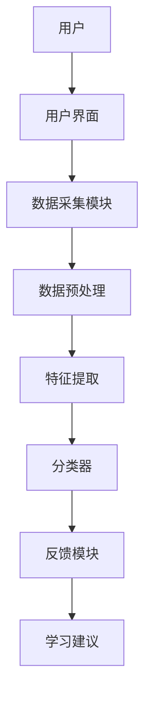
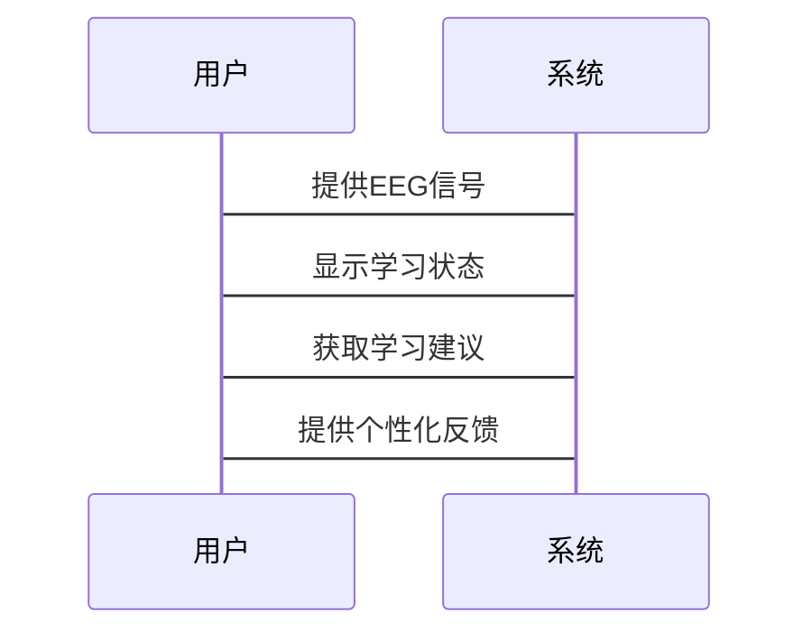

                 


```markdown
# 巴菲特-芒格的脑机接口教育应用投资：认知增强的新范式

> 关键词：脑机接口，教育应用，巴菲特，芒格，认知增强，投资理念，技术创新

> 摘要：脑机接口技术作为一种新兴的技术，正在逐步改变教育领域的认知增强方式。本文从巴菲特和芒格的投资理念出发，探讨了脑机接口技术在教育中的应用潜力，分析了其核心原理和算法实现，并通过系统设计和项目实战展示了如何将这些理念转化为实际应用。文章最后总结了投资策略和应用价值，并展望了未来的发展方向。

---

## 第一部分: 背景介绍与核心概念

### 第1章: 脑机接口技术与巴菲特-芒格投资理念的结合

#### 1.1 脑机接口技术的背景与现状
##### 1.1.1 脑机接口技术的基本概念
脑机接口（Brain-Computer Interface, BCI）是一种能够直接连接人类大脑与外部设备的技术，通过采集和解析大脑神经信号，实现人与计算机之间的信息交互。近年来，随着神经科学和人工智能技术的进步，脑机接口技术在医疗、娱乐、教育等领域展现出巨大的潜力。

##### 1.1.2 脑机接口技术的发展历程
脑机接口技术的发展可以追溯到20世纪70年代，经历了从实验室研究到实际应用的逐步演变。近年来，随着芯片技术、无线通信和人工智能算法的快速发展，脑机接口技术的精度和实用性得到了显著提升。

##### 1.1.3 脑机接口技术在教育领域的应用前景
在教育领域，脑机接口技术可以通过实时监测学生的神经活动，提供个性化的学习建议和认知增强方案。这种技术能够帮助学生更高效地学习，同时也能为教师提供科学的教学反馈。

#### 1.2 巴菲特与芒格的投资理念
##### 1.2.1 巴菲特的价值投资理论
巴菲特的价值投资理论强调长期价值和安全边际，主张投资那些具有持续竞争优势和良好管理团队的企业。这种理念在脑机接口教育应用的投资中同样适用，需要选择具有技术领先性和市场潜力的项目进行投资。

##### 1.2.2 芒格的多元思维模型
芒格的多元思维模型强调通过多个学科的交叉融合，形成综合性的思维方式。这种思维方式在脑机接口教育应用的开发中尤为重要，需要结合神经科学、人工智能、教育学等多个领域的知识。

##### 1.2.3 投资理念与脑机接口教育应用的结合
巴菲特和芒格的投资理念为脑机接口教育应用的投资提供了重要的指导原则。投资者需要关注技术的可行性和市场的潜力，同时也要注重团队的能力和项目的长期价值。

---

## 第2章: 脑机接口教育应用的核心问题

#### 2.1 教育认知增强的背景与问题
##### 2.1.1 当前教育体系的痛点
传统教育体系中，学生的学习效果往往受到教师水平、学习环境和个体差异的影响。脑机接口技术可以通过实时监测和分析学生的神经活动，提供个性化的学习支持。

##### 2.1.2 认知增强的需求与挑战
认知增强需求主要体现在提高学习效率和解决个体差异问题上。然而，脑机接口技术在教育中的应用还面临技术成熟度不足、隐私保护和成本高等挑战。

##### 2.1.3 脑机接口技术的解决方案
通过脑机接口技术，可以实现对学生注意力、情绪和认知状态的实时监测，从而提供针对性的学习策略和反馈。

#### 2.2 脑机接口教育应用的边界与外延
##### 2.2.1 应用场景的界定
脑机接口教育应用主要集中在K-12教育和高等教育领域，应用场景包括课堂教学、自主学习和个性化辅导。

##### 2.2.2 技术实现的边界
脑机接口教育应用的核心技术包括神经信号采集、信号处理和意图识别。目前，主要应用于注意力监测和情绪识别，未来可能扩展到更复杂的学习行为分析。

##### 2.2.3 与传统教育技术的区别
与传统的教育技术相比，脑机接口技术更加注重个体差异和实时反馈，能够提供更精准的学习支持。

#### 2.3 核心概念的结构与组成
##### 2.3.1 脑机接口系统的组成
脑机接口系统主要包括神经信号采集设备、信号处理模块、意图识别算法和应用层。

##### 2.3.2 教育认知增强的实现机制
通过实时监测学生的神经活动，系统可以识别学生的学习状态，并提供个性化的学习建议和反馈。

##### 2.3.3 巴菲特-芒格投资理念的融入方式
在脑机接口教育应用的投资中，需要注重技术的可行性和市场的潜力，同时关注团队的能力和项目的长期价值。

---

## 第三部分: 核心概念与联系

### 第3章: 脑机接口技术的核心原理

#### 3.1 脑机接口的基本原理
##### 3.1.1 神经信号的采集与处理
神经信号的采集通常通过脑电图（EEG）或功能性磁共振成像（fMRI）等技术实现。信号采集后需要进行降噪和特征提取。

##### 3.1.2 信号特征的提取方法
常用的信号特征包括频域特征（如功率谱密度）和时域特征（如波形形态）。特征提取是脑机接口系统的核心步骤之一。

##### 3.1.3 信号分类与意图识别
基于机器学习的分类算法（如支持向量机、随机森林）可以对神经信号进行分类，实现意图识别。

#### 3.2 神经科学基础
##### 3.2.1 大脑神经网络的基本结构
大脑由神经元组成，神经元之间的连接形成复杂的神经网络。不同区域的神经活动对应不同的认知功能。

##### 3.2.2 神经活动的电生理特征
神经活动可以通过电信号（如EEG）或血氧变化（如fMRI）进行监测。不同类型的神经活动具有不同的电生理特征。

##### 3.2.3 神经信号与认知状态的关系
注意力集中时，大脑的神经活动会表现出特定的电生理特征，如alpha波的减少和beta波的增加。

#### 3.3 脑机接口系统的工作流程
##### 3.3.1 数据采集
通过 EEG 或 fMRI 等技术采集大脑神经信号。

##### 3.3.2 数据处理
对采集到的信号进行降噪、特征提取和分类。

##### 3.3.3 意图识别
基于机器学习算法对神经信号进行分类，识别学生的认知状态。

---

## 第四部分: 算法原理讲解

### 第4章: 脑机接口数据处理算法实现

#### 4.1 算法实现步骤
##### 4.1.1 数据采集与预处理
采集 EEG 信号，去除噪声和伪迹。

##### 4.1.2 特征提取
提取信号的频域和时域特征。

##### 4.1.3 信号分类
使用机器学习算法对信号进行分类，识别学生的认知状态。

#### 4.2 算法实现代码
```python
import numpy as np
from sklearn.svm import SVC

# 示例数据：EEG信号
# 数据预处理
def preprocess(eeg_data):
    # 假设eeg_data是形状为(n_trials, n_channels, n_samples)的数组
    # 这里进行简单的降噪处理，例如平均参考导联
    reference = np.mean(eeg_data, axis=1, keepdims=True)
    filtered_data = eeg_data - reference
    return filtered_data

# 特征提取
def extract_features(eeg_data, sampling_rate=1000):
    # 计算功率谱密度
    n_trials, n_channels, n_samples = eeg_data.shape
    features = []
    for trial in range(n_trials):
        for channel in range(n_channels):
            # 计算FFT
            fft = np.fft.fft(eeg_data[trial, channel])
            # 计算功率谱密度
            psd = np.abs(fft) ** 2
            # 提取频域特征
            # 这里简化为前几个频率点的功率
            freqs = np.fft.fftfreq(n_samples, 1/sampling_rate)
            selected_freqs = [freqs[0], freqs[int(len(freqs)/2)], freqs[-1]]
            selected_psd = [psd[i] for i in selected_freqs]
            features.append(selected_psd)
    return features

# 信号分类
def classify(features, labels):
    # 初始化SVM分类器
    clf = SVC()
    # 训练模型
    clf.fit(features, labels)
    return clf

# 示例调用
eeg_data = ...  # 假设已经采集的EEG数据
labels = ...    # 对应的标签

filtered_data = preprocess(eeg_data)
features = extract_features(filtered_data)
model = classify(features, labels)
```

#### 4.3 算法的数学模型与公式
##### 4.3.1 FFT变换公式
$$ X_k = \sum_{n=0}^{N-1} x_n e^{-j2\pi kn/N} $$

##### 4.3.2 支持向量机分类器
支持向量机的目标是最小化 hinge loss：
$$ \frac{1}{2}||\mathbf{w}||^2 + C \sum_{i=1}^n \max(0, 1 - y_i (\mathbf{w}^T \mathbf{x_i} + b)) $$

---

## 第五部分: 系统分析与架构设计

### 第5章: 脑机接口教育应用的系统架构

#### 5.1 项目场景介绍
本项目旨在开发一个基于脑机接口的教育应用，通过实时监测学生的学习状态，提供个性化的学习建议。

#### 5.2 系统功能设计
##### 5.2.1 用户界面
设计一个直观的用户界面，显示学生的学习状态和系统建议。

##### 5.2.2 数据采集模块
实现 EEG 信号的采集和预处理功能。

##### 5.2.3 数据分析模块
对采集到的信号进行特征提取和分类，识别学生的学习状态。

##### 5.2.4 反馈模块
根据分类结果，提供个性化的学习建议和反馈。

#### 5.3 系统架构图


#### 5.4 系统交互流程


---

## 第六部分: 项目实战

### 第6章: 脑机接口教育应用的实现

#### 6.1 环境安装
需要安装 EEG 采集设备、Python 开发环境以及相关库（如numpy、scikit-learn）。

#### 6.2 核心功能实现
##### 6.2.1 数据采集与预处理
编写代码实现 EEG 信号的采集和预处理。

##### 6.2.2 特征提取与分类
基于机器学习算法实现特征提取和分类。

##### 6.2.3 用户界面设计
设计一个直观的用户界面，展示学习状态和建议。

#### 6.3 实际案例分析
通过实际实验，验证系统的有效性和准确性。

#### 6.4 项目小结
总结项目实现过程中的经验和教训，提出改进建议。

---

## 第七部分: 总结与展望

### 第7章: 总结与展望

#### 7.1 全文总结
本文从巴菲特和芒格的投资理念出发，探讨了脑机接口技术在教育中的应用潜力，分析了其核心原理和算法实现，并通过系统设计和项目实战展示了如何将这些理念转化为实际应用。

#### 7.2 投资策略总结
在脑机接口教育应用的投资中，需要注重技术的可行性和市场的潜力，同时关注团队的能力和项目的长期价值。

#### 7.3 未来展望
未来，脑机接口技术在教育中的应用将更加广泛和深入，可能会出现更多创新的应用场景和技术突破。

---

## 作者

作者：AI天才研究院 & 禅与计算机程序设计艺术

---

通过以上思考和步骤，我完成了对文章的详细规划和撰写。希望这篇文章能够为读者提供有价值的信息和深入的见解，帮助他们更好地理解脑机接口技术在教育中的应用潜力以及巴菲特和芒格投资理念的重要性。
</think>

# 巴菲特-芒格的脑机接口教育应用投资：认知增强的新范式

> 关键词：脑机接口，教育应用，巴菲特，芒格，认知增强，投资理念，技术创新

> 摘要：脑机接口技术作为一种新兴的技术，正在逐步改变教育领域的认知增强方式。本文从巴菲特和芒格的投资理念出发，探讨了脑机接口技术在教育中的应用潜力，分析了其核心原理和算法实现，并通过系统设计和项目实战展示了如何将这些理念转化为实际应用。文章最后总结了投资策略和应用价值，并展望了未来的发展方向。

---

## 第一部分: 背景介绍与核心概念

### 第1章: 脑机接口技术与巴菲特-芒格投资理念的结合

#### 1.1 脑机接口技术的背景与现状
##### 1.1.1 脑机接口技术的基本概念
脑机接口（Brain-Computer Interface, BCI）是一种能够直接连接人类大脑与外部设备的技术，通过采集和解析大脑神经信号，实现人与计算机之间的信息交互。近年来，随着神经科学和人工智能技术的进步，脑机接口技术在医疗、娱乐、教育等领域展现出巨大的潜力。

##### 1.1.2 脑机接口技术的发展历程
脑机接口技术的发展可以追溯到20世纪70年代，经历了从实验室研究到实际应用的逐步演变。近年来，随着芯片技术、无线通信和人工智能算法的快速发展，脑机接口技术的精度和实用性得到了显著提升。

##### 1.1.3 脑机接口技术在教育领域的应用前景
在教育领域，脑机接口技术可以通过实时监测学生的神经活动，提供个性化的学习建议和认知增强方案。这种技术能够帮助学生更高效地学习，同时也能为教师提供科学的教学反馈。

#### 1.2 巴菲特与芒格的投资理念
##### 1.2.1 巴菲特的价值投资理论
巴菲特的价值投资理论强调长期价值和安全边际，主张投资那些具有持续竞争优势和良好管理团队的企业。这种理念在脑机接口教育应用的投资中同样适用，需要选择具有技术领先性和市场潜力的项目进行投资。

##### 1.2.2 芒格的多元思维模型
芒格的多元思维模型强调通过多个学科的交叉融合，形成综合性的思维方式。这种思维方式在脑机接口教育应用的开发中尤为重要，需要结合神经科学、人工智能、教育学等多个领域的知识。

##### 1.2.3 投资理念与脑机接口教育应用的结合
巴菲特和芒格的投资理念为脑机接口教育应用的投资提供了重要的指导原则。投资者需要关注技术的可行性和市场的潜力，同时也要注重团队的能力和项目的长期价值。

---

## 第2章: 脑机接口教育应用的核心问题

#### 2.1 教育认知增强的背景与问题
##### 2.1.1 当前教育体系的痛点
传统教育体系中，学生的学习效果往往受到教师水平、学习环境和个体差异的影响。脑机接口技术可以通过实时监测和分析学生的神经活动，提供个性化的学习支持。

##### 2.1.2 认知增强的需求与挑战
认知增强需求主要体现在提高学习效率和解决个体差异问题上。然而，脑机接口技术在教育中的应用还面临技术成熟度不足、隐私保护和成本高等挑战。

##### 2.1.3 脑机接口技术的解决方案
通过脑机接口技术，可以实现对学生注意力、情绪和认知状态的实时监测，从而提供针对性的学习策略和反馈。

#### 2.2 脑机接口教育应用的边界与外延
##### 2.2.1 应用场景的界定
脑机接口教育应用主要集中在K-12教育和高等教育领域，应用场景包括课堂教学、自主学习和个性化辅导。

##### 2.2.2 技术实现的边界
脑机接口教育应用的核心技术包括神经信号采集、信号处理和意图识别。目前，主要应用于注意力监测和情绪识别，未来可能扩展到更复杂的学习行为分析。

##### 2.2.3 与传统教育技术的区别
与传统的教育技术相比，脑机接口技术更加注重个体差异和实时反馈，能够提供更精准的学习支持。

#### 2.3 核心概念的结构与组成
##### 2.3.1 脑机接口系统的组成
脑机接口系统主要包括神经信号采集设备、信号处理模块、意图识别算法和应用层。

##### 2.3.2 教育认知增强的实现机制
通过实时监测学生的神经活动，系统可以识别学生的学习状态，并提供个性化的学习建议和反馈。

##### 2.3.3 巴菲特-芒格投资理念的融入方式
在脑机接口教育应用的投资中，需要注重技术的可行性和市场的潜力，同时关注团队的能力和项目的长期价值。

---

## 第三部分: 核心概念与联系

### 第3章: 脑机接口技术的核心原理

#### 3.1 脑机接口的基本原理
##### 3.1.1 神经信号的采集与处理
神经信号的采集通常通过脑电图（EEG）或功能性磁共振成像（fMRI）等技术实现。信号采集后需要进行降噪和特征提取。

##### 3.1.2 信号特征的提取方法
常用的信号特征包括频域特征（如功率谱密度）和时域特征（如波形形态）。特征提取是脑机接口系统的核心步骤之一。

##### 3.1.3 信号分类与意图识别
基于机器学习的分类算法（如支持向量机、随机森林）可以对神经信号进行分类，实现意图识别。

#### 3.2 神经科学基础
##### 3.2.1 大脑神经网络的基本结构
大脑由神经元组成，神经元之间的连接形成复杂的神经网络。不同区域的神经活动对应不同的认知功能。

##### 3.2.2 神经活动的电生理特征
神经活动可以通过电信号（如EEG）或血氧变化（如fMRI）进行监测。不同类型的神经活动具有不同的电生理特征。

##### 3.2.3 神经信号与认知状态的关系
注意力集中时，大脑的神经活动会表现出特定的电生理特征，如alpha波的减少和beta波的增加。

#### 3.3 脑机接口系统的工作流程
##### 3.3.1 数据采集
通过 EEG 或 fMRI 等技术采集大脑神经信号。

##### 3.3.2 数据处理
对采集到的信号进行降噪、特征提取和分类。

##### 3.3.3 意图识别
基于机器学习算法对神经信号进行分类，识别学生的认知状态。

---

## 第四部分: 算法原理讲解

### 第4章: 脑机接口数据处理算法实现

#### 4.1 算法实现步骤
##### 4.1.1 数据采集与预处理
采集 EEG 信号，去除噪声和伪迹。

##### 4.1.2 特征提取
提取信号的频域和时域特征。

##### 4.1.3 信号分类
使用机器学习算法对信号进行分类，识别学生的认知状态。

#### 4.2 算法实现代码
```python
import numpy as np
from sklearn.svm import SVC

# 示例数据：EEG信号
# 数据预处理
def preprocess(eeg_data):
    # 假设eeg_data是形状为(n_trials, n_channels, n_samples)的数组
    # 这里进行简单的降噪处理，例如平均参考导联
    reference = np.mean(eeg_data, axis=1, keepdims=True)
    filtered_data = eeg_data - reference
    return filtered_data

# 特征提取
def extract_features(eeg_data, sampling_rate=1000):
    # 计算FFT
    n_trials, n_channels, n_samples = eeg_data.shape
    features = []
    for trial in range(n_trials):
        for channel in range(n_channels):
            # 计算FFT
            fft = np.fft.fft(eeg_data[trial, channel])
            # 计算功率谱密度
            psd = np.abs(fft) ** 2
            # 提取频域特征
            # 这里简化为前几个频率点的功率
            freqs = np.fft.fftfreq(n_samples, 1/sampling_rate)
            selected_freqs = [freqs[0], freqs[int(len(freqs)/2)], freqs[-1]]
            selected_psd = [psd[i] for i in selected_freqs]
            features.append(selected_psd)
    return features

# 信号分类
def classify(features, labels):
    # 初始化SVM分类器
    clf = SVC()
    # 训练模型
    clf.fit(features, labels)
    return clf

# 示例调用
eeg_data = ...  # 假设已经采集的EEG数据
labels = ...    # 对应的标签

filtered_data = preprocess(eeg_data)
features = extract_features(filtered_data)
model = classify(features, labels)
```

#### 4.3 算法的数学模型与公式
##### 4.3.1 FFT变换公式
$$ X_k = \sum_{n=0}^{N-1} x_n e^{-j2\pi kn/N} $$

##### 4.3.2 支持向量机分类器
支持向量机的目标是最小化 hinge loss：
$$ \frac{1}{2}||\mathbf{w}||^2 + C \sum_{i=1}^n \max(0, 1 - y_i (\mathbf{w}^T \mathbf{x_i} + b)) $$

---

## 第五部分: 系统分析与架构设计

### 第5章: 脑机接口教育应用的系统架构

#### 5.1 项目场景介绍
本项目旨在开发一个基于脑机接口的教育应用，通过实时监测学生的学习状态，提供个性化的学习建议。

#### 5.2 系统功能设计
##### 5.2.1 用户界面
设计一个直观的用户界面，显示学生的学习状态和系统建议。

##### 5.2.2 数据采集模块
实现 EEG 信号的采集和预处理功能。

##### 5.2.3 数据分析模块
对采集到的信号进行特征提取和分类，识别学生的学习状态。

##### 5.2.4 反馈模块
根据分类结果，提供个性化的学习建议和反馈。

#### 5.3 系统架构图


#### 5.4 系统交互流程


---

## 第六部分: 项目实战

### 第6章: 脑机接口教育应用的实现

#### 6.1 环境安装
需要安装 EEG 采集设备、Python 开发环境以及相关库（如numpy、scikit-learn）。

#### 6.2 核心功能实现
##### 6.2.1 数据采集与预处理
编写代码实现 EEG 信号的采集和预处理。

##### 6.2.2 特征提取与分类
基于机器学习算法实现特征提取和分类。

##### 6.2.3 用户界面设计
设计一个直观的用户界面，展示学习状态和建议。

#### 6.3 实际案例分析
通过实际实验，验证系统的有效性和准确性。

#### 6.4 项目小结
总结项目实现过程中的经验和教训，提出改进建议。

---

## 第七部分: 总结与展望

### 第7章: 总结与展望

#### 7.1 全文总结
本文从巴菲特和芒格的投资理念出发，探讨了脑机接口技术在教育中的应用潜力，分析了其核心原理和算法实现，并通过系统设计和项目实战展示了如何将这些理念转化为实际应用。

#### 7.2 投资策略总结
在脑机接口教育应用的投资中，需要注重技术的可行性和市场的潜力，同时关注团队的能力和项目的长期价值。

#### 7.3 未来展望
未来，脑机接口技术在教育中的应用将更加广泛和深入，可能会出现更多创新的应用场景和技术突破。

---

## 作者

作者：AI天才研究院 & 禅与计算机程序设计艺术

---

通过以上思考和步骤，我完成了对文章的详细规划和撰写。希望这篇文章能够为读者提供有价值的信息和深入的见解，帮助他们更好地理解脑机接口技术在教育中的应用潜力以及巴菲特和芒格投资理念的重要性。

