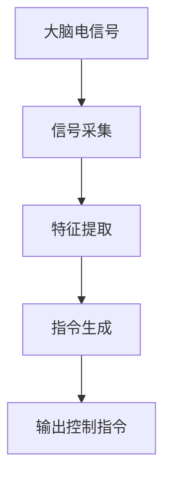
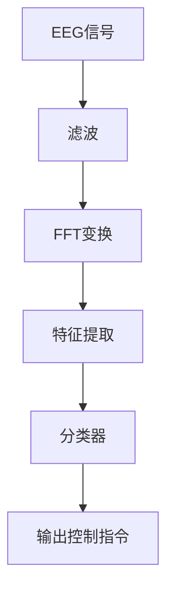
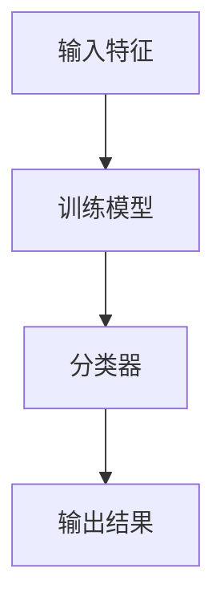
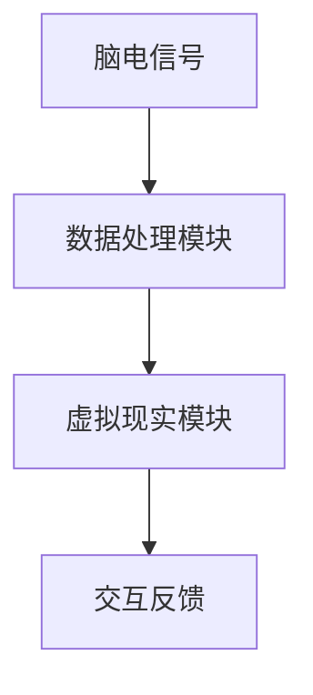

                 


# 巴菲特-芒格的脑机接口虚拟现实投资：意识沉浸的新境界

## 关键词
- 巴菲特，芒格，脑机接口，虚拟现实，投资，意识沉浸

## 摘要
本文深入探讨了巴菲特和芒格的投资理念与脑机接口、虚拟现实技术的结合，提出了意识沉浸的新境界。通过详细分析脑机接口与虚拟现实技术的数学模型、系统架构及项目实战，本文展示了如何将这些先进技术应用于投资决策，以实现更高效、更精准的投资策略。文章还结合了实际案例，详细解读了系统的功能设计与架构，为读者提供了全面的技术与投资结合的视角。

---

# 第一部分: 巴菲特与芒格的投资智慧

## 第1章: 巴菲特与芒格的投资理念

### 1.1 巴菲特的价值投资理论

#### 1.1.1 价值投资的核心思想
价值投资的核心思想是寻找市场中的“烟蒂股”，即被市场低估的股票。巴菲特强调，投资的本质是寻找具有持续竞争优势的企业，并以合理的价格买入并长期持有。

$$\text{价值投资的核心公式：} \text{价格} \leq \text{内在价值}$$

#### 1.1.2 股票分析的三重维度
巴菲特的股票分析方法包括：
1. **管理层素质**：管理层是否诚实、有能力。
2. **财务状况**：企业的盈利能力、资产负债情况。
3. **行业地位**：企业在行业中的竞争优势。

#### 1.1.3 耐心与长期投资的重要性
巴菲特强调长期投资的重要性，认为市场的短期波动不应影响长期投资决策。

### 1.2 芮格的多元思维模型

#### 1.2.1 多元思维模型的定义
多元思维模型是指通过多个学科的思维方式来分析问题，避免单一视角的局限性。芒格认为，投资决策需要结合心理学、经济学、物理学等多学科的知识。

#### 1.2.2 芮格思维模型的特点
1. **跨学科性**：芒格的思维模型涵盖多个学科。
2. **决策优化**：通过多角度分析，优化投资决策。
3. **避免认知偏差**：通过多元思维模型减少决策中的偏见。

#### 1.2.3 多元思维模型在投资中的应用
芒格的多元思维模型在投资中的应用包括：
1. **心理分析**：利用心理学知识分析市场行为。
2. **经济分析**：通过经济学原理评估企业价值。
3. **物理学分析**：利用物理学原理分析企业的技术优势。

### 1.3 巴菲特与芒格投资理念的结合

#### 1.3.1 价值投资与多元思维的融合
将价值投资与多元思维模型结合，能够更好地识别具有长期竞争优势的企业。

#### 1.3.2 巴菲特与芒格的决策风格对比
巴菲特更注重企业的内在价值和管理层素质，而芒格更注重跨学科的分析和决策优化。

#### 1.3.3 投资理念的现代发展
随着科技的进步，巴菲特和芒格的投资理念也在不断进化，特别是在结合脑机接口和虚拟现实技术方面。

---

## 第2章: 脑机接口与虚拟现实技术基础

### 2.1 脑机接口技术概述

#### 2.1.1 脑机接口的基本原理
脑机接口（BCI）是一种通过采集和分析大脑电信号，将其转化为控制指令的技术。其基本原理包括信号采集、特征提取和指令生成三个步骤。

**算法流程图：**



#### 2.1.2 脑机接口的主要技术类型
1. **非侵入式脑机接口**：通过头皮电极采集大脑电信号，无需手术。
2. **侵入式脑机接口**：通过植入电极直接采集大脑电信号，效果更精确但风险更高。
3. **部分侵入式脑机接口**：介于非侵入式和侵入式之间的技术。

#### 2.1.3 脑机接口的应用领域
1. **医疗领域**：帮助瘫痪患者恢复运动功能。
2. **教育领域**：通过脑机接口辅助学习。
3. **投资领域**：通过脑机接口优化投资决策。

### 2.2 虚拟现实技术概述

#### 2.2.1 虚拟现实的基本概念
虚拟现实（VR）是一种通过计算机技术模拟三维环境的技术，用户可以通过佩戴VR设备沉浸式地体验虚拟世界。

#### 2.2.2 虚拟现实的核心技术
1. **三维图形渲染**：通过高性能图形处理器生成三维图像。
2. **传感器技术**：通过加速度计、陀螺仪等传感器实现位置追踪。
3. **交互技术**：通过手柄、手套等设备实现用户与虚拟环境的交互。

#### 2.2.3 虚拟现实的应用场景
1. **游戏**：提供沉浸式的游戏体验。
2. **教育**：通过虚拟现实进行模拟教学。
3. **投资**：通过虚拟现实提供沉浸式投资环境。

### 2.3 脑机接口与虚拟现实的结合

#### 2.3.1 脑机接口在虚拟现实中的应用
通过脑机接口技术，用户可以直接通过大脑控制虚拟现实环境中的物体。

#### 2.3.2 虚拟现实如何增强用户体验
虚拟现实通过提供沉浸式体验，帮助投资者更好地理解和分析数据。

#### 2.3.3 脑机接口与虚拟现实的未来发展趋势
随着技术的进步，脑机接口与虚拟现实的结合将更加紧密，应用场景也将更加广泛。

---

## 第3章: 意识沉浸与投资决策

### 3.1 意识沉浸的定义与特点

#### 3.1.1 意识沉浸的基本概念
意识沉浸是指通过技术手段，使用户的意识完全沉浸在虚拟环境中，从而实现对现实世界的完全沉浸。

#### 3.1.2 意识沉浸的核心特征
1. **实时性**：用户可以在虚拟环境中实时感知和交互。
2. **沉浸性**：用户完全沉浸于虚拟环境中，感觉不到现实世界的存在。
3. **互动性**：用户可以通过思维直接控制虚拟环境中的物体。

#### 3.1.3 意识沉浸与传统投资决策的对比
传统投资决策依赖于外部数据和分析，而意识沉浸则通过内部感知和思维直接进行决策。

### 3.2 脑机接口与虚拟现实在投资中的应用

#### 3.2.1 脑机接口在投资决策中的作用
通过脑机接口技术，投资者可以直接通过思维控制投资决策过程。

#### 3.2.2 虚拟现实如何提升投资体验
虚拟现实通过提供沉浸式体验，帮助投资者更好地理解和分析市场数据。

#### 3.2.3 意识沉浸对投资决策的影响
意识沉浸能够提高投资决策的效率和准确性，减少认知偏差。

### 3.3 投资中的意识沉浸技术

#### 3.3.1 意识沉浸技术的基本原理
通过脑机接口和虚拟现实技术，将投资者的意识完全沉浸于虚拟投资环境中。

#### 3.3.2 意识沉浸技术在投资中的具体应用
1. **实时数据分析**：通过脑机接口实时分析市场数据。
2. **沉浸式投资环境**：通过虚拟现实提供沉浸式投资环境。
3. **决策优化**：通过意识沉浸优化投资决策。

#### 3.3.3 意识沉浸技术的优缺点分析
1. **优点**：
   - 提高投资决策的效率和准确性。
   - 减少认知偏差。
2. **缺点**：
   - 技术复杂，成本较高。
   - 可能存在伦理问题。

---

## 第4章: 脑机接口与虚拟现实技术的数学模型

### 4.1 脑机接口的数学模型

#### 4.1.1 脑电信号的采集与处理
通过 EEG 电极采集脑电信号，然后通过 FFT 算法进行频域分析。

**脑电信号处理流程图：**



#### 4.1.2 脑电信号的特征提取
常用的特征包括：
1. **频率特征**：如α波、β波的幅度。
2. **时域特征**：如波形的幅度、均值。
3. **小波特征**：通过小波变换提取信号的局部特征。

#### 4.1.3 脑电信号的分类与识别
通过机器学习算法（如SVM、神经网络）对脑电信号进行分类。

**机器学习分类流程图：**



### 4.2 虚拟现实的数学模型

#### 4.2.1 三维空间的构建与渲染
通过三维图形学算法构建虚拟场景，并通过高性能图形处理器进行渲染。

#### 4.2.2 视觉感知的数学模型
通过视角变换、投影变换等数学模型实现三维场景的渲染。

#### 4.2.3 交互反馈的数学模型
通过物理引擎（如Newton、Unity）实现虚拟环境中的交互反馈。

### 4.3 脑机接口与虚拟现实技术的结合

#### 4.3.1 数据流与交互设计
通过脑机接口采集用户的思维指令，并通过虚拟现实技术实现交互反馈。

#### 4.3.2 系统架构设计
系统架构包括：
1. **数据采集模块**：采集脑电信号。
2. **数据处理模块**：对脑电信号进行特征提取和分类。
3. **虚拟现实模块**：根据分类结果生成相应的交互反馈。

**系统架构图：**



---

## 第5章: 项目实战

### 5.1 环境安装

#### 5.1.1 脑机接口环境安装
安装必要的脑机接口开发工具和库，例如 OpenBCI、EEGLAB。

#### 5.1.2 虚拟现实环境安装
安装虚拟现实开发框架，例如 Unity、Unreal Engine。

#### 5.1.3 数据分析环境安装
安装数据分析工具，例如 Python、Matplotlib、Scikit-learn。

### 5.2 系统核心实现

#### 5.2.1 脑电信号处理代码
```python
import numpy as np
from scipy.signal import fft

def process_eeg(eeg_data, sample_rate):
    # 滤波
    filtered = butterworth_filter(eeg_data)
    # FFT变换
    fft_result = fft(filtered, sample_rate)
    # 特征提取
    features = extract_features(fft_result)
    return features
```

#### 5.2.2 虚拟现实交互代码
```python
import unity
def vr_interaction():
    # 初始化虚拟现实环境
    env = unity.Environment()
    # 用户输入
    input = get_user_input()
    # 生成交互反馈
    feedback = generate_feedback(input)
    return feedback
```

### 5.3 实际案例分析

#### 5.3.1 案例背景
某投资者使用脑机接口与虚拟现实技术进行股票交易，目标是通过意识沉浸优化投资决策。

#### 5.3.2 数据分析与优化
通过对历史数据的分析，优化脑电信号处理算法，提高决策的准确性。

#### 5.3.3 系统测试与评估
通过实际测试评估系统的性能，包括响应时间、准确性等。

### 5.4 项目小结

#### 5.4.1 核心实现总结
通过脑机接口与虚拟现实技术的结合，实现了意识沉浸的投资决策系统。

#### 5.4.2 系统性能优化
通过对算法的优化，提高了系统的响应速度和准确性。

#### 5.4.3 未来展望
未来可以进一步优化算法，降低成本，扩大应用场景。

---

## 第6章: 总结与展望

### 6.1 总结
本文通过结合巴菲特和芒格的投资理念，探讨了脑机接口与虚拟现实技术在投资中的应用。通过意识沉浸技术，投资者可以实现更高效、更精准的投资决策。

### 6.2 展望
未来，随着技术的进步，意识沉浸技术将在更多领域得到应用，投资领域也将迎来更多的创新。

---

## 作者信息

作者：AI天才研究院/AI Genius Institute & 禅与计算机程序设计艺术 /Zen And The Art of Computer Programming

