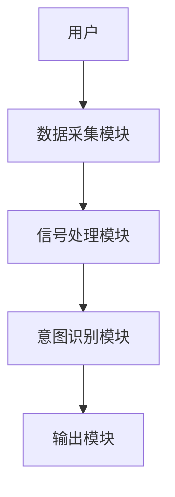
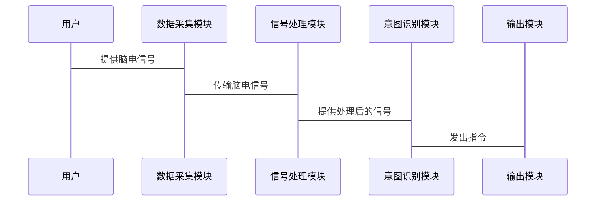

                 


# 巴菲特-芒格的脑机接口远程办公平台投资：工作模式的革命

> 关键词：脑机接口、远程办公平台、巴菲特投资理念、芒格思维模型、未来工作模式

> 摘要：脑机接口技术与远程办公平台的结合，标志着工作模式的重大变革。本文将深入探讨巴菲特和芒格的投资理念如何影响这一技术的发展，分析其在远程办公中的应用潜力，以及这一革命性技术对工作方式的深远影响。

---

## 第一章: 背景介绍

### 1.1 脑机接口技术的定义与原理

脑机接口（Brain-Computer Interface, BCI）是一种能够将人类大脑活动直接转化为计算机可读信号的技术。通过采集和分析大脑电信号，BCI能够实现人与计算机之间的直接交互。近年来，随着神经科学和人工智能技术的进步，脑机接口技术在医疗、娱乐、教育和办公等领域展现出巨大潜力。

#### 1.1.1 脑机接口技术的定义

脑机接口是一种将人类大脑活动转化为计算机指令的技术，它通过采集大脑电信号，将其转换为可被计算机理解的形式，从而实现人机交互。

#### 1.1.2 脑机接口的核心原理

1. **数据采集**：通过 EEG（脑电图）帽或植入式电极采集大脑电信号。
2. **信号处理**：对采集到的电信号进行滤波、降噪和特征提取。
3. **意图识别**：利用机器学习算法识别用户的意图。
4. **输出指令**：将识别到的意图转化为计算机可执行的指令。

#### 1.1.3 脑机接口的主要技术特征

- **非侵入性**：大多数脑机接口设备是非侵入式的，用户无需手术即可使用。
- **实时性**：能够实时捕捉和处理大脑电信号。
- **适应性**：可以根据用户习惯自适应调整。

### 1.2 远程办公平台的现状与挑战

#### 1.2.1 远程办公模式的现状

随着互联网技术的发展，远程办公已成为现代工作方式的重要组成部分。全球范围内，越来越多的企业采用远程办公模式，以降低运营成本、提高员工灵活性。

#### 1.2.2 远程办公的主要挑战

1. **沟通效率低下**：远程沟通缺乏面对面交流的自然性，容易导致信息传递不准确。
2. **团队协作困难**：远程团队难以形成高效的协作模式。
3. **员工注意力分散**：远程工作环境中，员工容易受到外部干扰，影响工作效率。

#### 1.2.3 脑机接口技术如何解决远程办公问题

脑机接口技术可以通过实时监测员工大脑活动，帮助识别注意力状态，优化工作流程，提升沟通效率，从而解决远程办公中的主要挑战。

### 1.3 巴菲特与芒格的投资理念

#### 1.3.1 巴菲特的价值投资理论

巴菲特的价值投资理论强调长期投资、安全边际和企业内在价值。他认为，投资的本质是寻找具有持续竞争优势的企业，并以合理价格买入。

#### 1.3.2 芒格的多元思维模型

芒格的多元思维模型强调跨学科思考，将多个领域的知识结合起来，以形成全面的决策框架。他认为，投资者应该通过多角度分析问题，避免单一思维的局限性。

#### 1.3.3 巴菲特与芒格的投资理念如何应用于脑机接口技术

通过巴菲特的价值投资理论和芒格的多元思维模型，投资者可以更好地评估脑机接口技术的商业潜力，识别具有竞争优势的企业，并制定长期投资策略。

---

## 第二章: 脑机接口技术与远程办公的结合

### 2.1 脑机接口技术在远程办公中的应用

#### 2.1.1 提高工作效率

通过实时监测员工注意力状态，脑机接口技术可以优化工作流程，减少分心，提高工作效率。

#### 2.1.2 改善团队协作

脑机接口技术可以帮助团队成员更好地理解彼此的意图，促进更高效的协作。

#### 2.1.3 增强沟通效率

通过识别用户的情感状态和意图，脑机接口技术可以优化远程沟通，减少误解。

### 2.2 投资评估模型

#### 2.2.1 脑机接口技术的市场潜力

脑机接口技术在医疗、教育和娱乐领域的应用前景广阔，特别是在远程办公领域的潜力巨大。

#### 2.2.2 企业竞争优势分析

投资者需要关注企业的技术实力、市场定位和团队能力，以评估其在脑机接口技术领域的竞争优势。

#### 2.2.3 长期投资策略

通过长期持有具有竞争优势的企业，投资者可以分享脑机接口技术发展的红利。

---

## 第三章: 系统分析与架构设计

### 3.1 远程办公平台的系统架构

#### 3.1.1 系统功能模块

1. **数据采集模块**：采集用户的脑电信号。
2. **信号处理模块**：对脑电信号进行滤波和特征提取。
3. **意图识别模块**：利用机器学习算法识别用户的意图。
4. **输出模块**：将识别到的意图转化为计算机指令。

#### 3.1.2 系统架构设计



### 3.2 系统交互流程



---

## 第四章: 项目实战

### 4.1 环境安装

#### 4.1.1 安装Python环境

```bash
python --version
pip install numpy
pip install scikit-learn
pip install matplotlib
```

#### 4.1.2 安装脑机接口开发库

```bash
pip install mne
pip install pytorch
```

### 4.2 核心代码实现

#### 4.2.1 数据采集与处理

```python
import numpy as np
import mne

# 采集脑电信号
raw = mne.io.read_raw_brainvision('data.vhdr')
```

#### 4.2.2 意图识别算法

```python
import torch
import torch.nn as nn

# 定义神经网络模型
class EEGClassifier(nn.Module):
    def __init__(self):
        super(EEGClassifier, self).__init__()
        self.conv = nn.Conv1d(1, 32, kernel_size=8)
        self.pool = nn.MaxPool1d(2)
        self.fc = nn.Linear(32, 10)

    def forward(self, x):
        x = self.conv(x)
        x = self.pool(x)
        x = x.view(-1, 32)
        x = self.fc(x)
        return x

model = EEGClassifier()
```

---

## 第五章: 最佳实践与小结

### 5.1 最佳实践

1. **持续学习**：保持对脑机接口技术的持续关注和学习。
2. **注重实践**：通过实际项目加深对技术的理解。
3. **结合投资理念**：将巴菲特和芒格的投资理念应用于实际投资决策。

### 5.2 小结

脑机接口技术正在 revolutionize远程办公模式，投资者需要结合技术发展和市场趋势，制定合理的投资策略。

---

## 作者

作者：AI天才研究院 & 禅与计算机程序设计艺术

---

通过以上结构和内容，文章详细探讨了脑机接口技术与远程办公的结合，以及巴菲特和芒格投资理念的应用。希望这篇文章能够为读者提供有价值的见解和指导。

