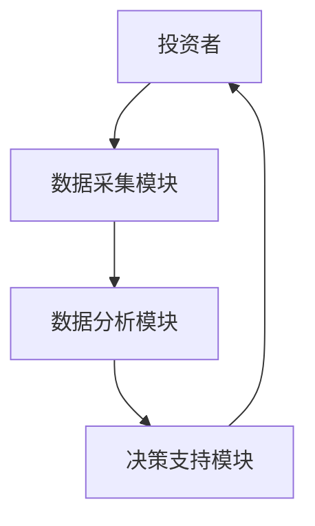

                 


# 巴菲特-芒格的脑科学技术投资：认知增强的新前沿

> 关键词：巴菲特，芒格，脑科学技术，认知增强，神经决策科学，投资策略

> 摘要：本文探讨了巴菲特和芒格的投资理念与脑科学技术的结合，分析了认知增强技术在投资决策中的潜力，通过神经科学和认知科学的视角，提出了优化投资决策的新方法。

---

# 第1章：巴菲特与芒格的投资哲学

## 1.1 巴菲特与芒格的投资理念概述

### 1.1.1 巴菲特的价值投资理念

沃伦·巴菲特的价值投资理念是基于对企业基本面的深入分析，寻找具有持续竞争优势和良好治理结构的企业进行长期投资。他强调安全边际和内在价值的概念，认为市场的短期波动不应影响长期投资决策。

### 1.1.2 芒格的多元思维模型

查理·芒格的多元思维模型强调通过多个学科的知识交叉应用，形成对世界的整体认知。他认为，投资者需要构建一个由物理学、心理学、经济学等多学科组成的决策框架，以避免认知偏差和错误决策。

### 1.1.3 巴菲特与芒格投资理念的共同点与差异

尽管两人在具体操作上有所不同，但他们都强调长期价值、安全边际和理性决策。巴菲特更偏向于具体的财务分析，而芒格则更注重跨学科的思维模型。

## 1.2 巴菲特与芒格的成功投资案例

### 1.2.1 巴菲特的经典投资案例

- **可口可乐投资**：巴菲特选择可口可乐的原因在于其强大的品牌、稳定的现金流和持续的市场需求，体现了他对企业基本面的深刻理解。

### 1.2.2 芒格的关键投资决策

- **富国银行投资**：芒格通过多元思维模型，识别出富国银行在金融行业的领先地位和竞争优势，从而做出长期投资的决定。

### 1.2.3 两人合作的成功经验

巴菲特和芒格的合作基于对长期价值的共同追求和对风险的严格控制，他们通过分散投资和价值发现策略，实现了长期稳定的收益。

## 1.3 巴菲特与芒格投资理念的现代启示

### 1.3.1 理性投资的重要性

在市场波动加剧的今天，理性决策和长期价值的追求显得尤为重要。投资者需要避免情绪化决策，坚持基本面分析。

### 1.3.2 长期价值的追求

巴菲特和芒格的成功证明了长期投资的重要性。通过持续关注企业的内在价值，投资者可以在市场波动中获得超额收益。

### 1.3.3 风险控制的智慧

芒格的多元思维模型帮助投资者识别潜在风险，并通过分散投资和严格的风控体系降低投资组合的波动性。

---

# 第2章：脑科学技术与认知增强的背景

## 2.1 脑科学技术的基本概念

### 2.1.1 脑科学的定义与研究领域

脑科学是研究大脑结构和功能的学科，涵盖神经科学、心理学和认知科学等多个领域。其研究目标是理解人类思维、情感和行为的神经机制。

### 2.1.2 认知科学的核心概念

认知科学关注人类认知过程，包括记忆、学习、推理和决策。它试图通过多学科方法揭示人类思维的本质。

### 2.1.3 神经科学与心理学的交叉研究

神经科学研究大脑的生理机制，而心理学关注心理过程。两者的交叉研究为理解人类行为提供了新的视角。

## 2.2 脑科学技术在投资中的应用潜力

### 2.2.1 神经决策科学的兴起

神经决策科学通过研究大脑活动，揭示人类决策过程中的神经机制。这为投资决策提供了科学依据。

### 2.2.2 情绪与投资决策的关系

情绪在投资决策中起着重要作用。负面情绪可能导致冲动决策，而积极情绪可能影响风险偏好。

### 2.2.3 认知增强技术的未来展望

通过脑科学技术，未来可能开发出增强认知能力的工具，帮助投资者做出更明智的决策。

## 2.3 巴菲特与芒格投资理念与脑科学技术的结合

### 2.3.1 认知增强对投资决策的影响

认知增强技术可以帮助投资者更好地处理信息，避免认知偏差，提高决策质量。

### 2.3.2 脑科学技术如何优化投资策略

通过神经决策科学，投资者可以更好地理解自己的决策模式，从而优化投资策略。

### 2.3.3 未来投资中的脑科学技术应用

未来，脑科学技术可能被广泛应用于投资领域，帮助投资者做出更科学、更理性的决策。

---

# 第3章：认知科学的核心原理

## 3.1 神经科学基础

### 3.1.1 大脑的结构与功能分区

大脑分为不同区域，负责不同的功能，如额叶负责决策，枕叶负责视觉处理。

### 3.1.2 神经元的工作原理

神经元通过电化学信号传递信息，形成神经网络。

### 3.1.3 神经网络的信息处理机制

神经网络通过层层处理信息，实现对复杂数据的分析和判断。

## 3.2 认知心理学基础

### 3.2.1 注意力的分配与管理

注意力是认知过程的核心，投资者需要合理分配注意力，避免分散精力。

### 3.2.2 记忆的形成与遗忘

记忆的形成和遗忘机制影响投资者对信息的处理和决策。

### 3.2.3 判断与决策的偏差

认知偏差如确认偏差和从众心理会影响投资决策。

## 3.3 神经决策科学的核心理论

### 3.3.1 理性决策模型

理性决策模型假设决策者基于完全信息做出最优选择。

### 3.3.2 情感决策模型

情感决策模型强调情绪在决策中的作用。

### 3.3.3 神经经济学的研究进展

神经经济学通过研究大脑活动，揭示决策的神经机制。

---

# 第4章：脑科学技术在投资中的应用

## 4.1 神经决策科学的算法原理

### 4.1.1 神经网络模型的算法原理

神经网络模型通过多层神经元模拟人脑的处理方式，用于分类和预测任务。

### 4.1.2 神经网络模型的数学公式

神经网络的输出 $y$ 可以表示为输入 $x$ 通过权重矩阵 $W$ 和激活函数 $f$ 的非线性变换：$$ y = f(Wx + b) $$

### 4.1.3 神经网络模型的训练过程

神经网络通过反向传播算法优化权重，最小化预测误差。

## 4.2 投资决策中的认知增强策略

### 4.2.1 注意力管理

通过训练和策略优化，投资者可以更好地集中注意力，避免干扰。

### 4.2.2 记忆优化

记忆的优化可以通过制定有效的学习和复习策略实现，帮助投资者更好地处理信息。

### 4.2.3 决策疲劳的缓解

通过合理安排工作和休息时间，投资者可以减少决策疲劳，提高决策质量。

## 4.3 投资决策中的神经网络实现

### 4.3.1 神经网络的训练数据

训练数据包括历史股价、财务数据和市场情绪等。

### 4.3.2 神经网络的预测结果

神经网络可以预测股票价格走势，辅助投资者做出投资决策。

### 4.3.3 神经网络的优缺点

神经网络具有强大的非线性建模能力，但可能存在过拟合和解释性差的问题。

---

# 第5章：基于脑科学的投资决策系统

## 5.1 系统设计概述

### 5.1.1 系统目标

开发一个基于脑科学的决策支持系统，辅助投资者做出更明智的投资决策。

### 5.1.2 系统功能

- 数据采集：收集历史股价、财务数据和市场情绪。
- 数据分析：利用神经网络模型分析数据。
- 决策支持：提供投资建议和风险预警。

## 5.2 系统架构设计

### 5.2.1 系统架构图



### 5.2.2 系统功能模块

- 数据采集模块：负责收集和整理投资相关数据。
- 数据分析模块：利用神经网络模型进行数据分析和预测。
- 决策支持模块：提供投资建议和风险预警。

## 5.3 系统实现

### 5.3.1 数据采集模块的实现

使用Python的pandas库进行数据清洗和处理。

### 5.3.2 数据分析模块的实现

利用TensorFlow框架训练神经网络模型，进行股票价格预测。

### 5.3.3 决策支持模块的实现

通过可视化工具展示分析结果，辅助投资者做出决策。

---

# 第6章：项目实战与案例分析

## 6.1 环境安装

### 6.1.1 安装Python和必要的库

```bash
pip install numpy pandas tensorflow matplotlib
```

### 6.1.2 数据集获取

从Kaggle下载股票历史数据和财务报表。

## 6.2 神经网络模型的实现

### 6.2.1 模型定义

```python
import tensorflow as tf
import numpy as np

model = tf.keras.Sequential([
    tf.keras.layers.Dense(64, activation='relu'),
    tf.keras.layers.Dense(1, activation='sigmoid')
])
```

### 6.2.2 模型训练

```python
model.compile(optimizer='adam', loss='binary_crossentropy', metrics=['accuracy'])
model.fit(X_train, y_train, epochs=10, batch_size=32)
```

## 6.3 模型预测与分析

### 6.3.1 预测结果

```python
predictions = model.predict(X_test)
```

### 6.3.2 结果解读

通过混淆矩阵和ROC曲线分析模型的预测效果。

---

# 第7章：总结与展望

## 7.1 本文总结

本文探讨了巴菲特和芒格的投资理念与脑科学技术的结合，分析了认知增强技术在投资决策中的潜力。

## 7.2 未来展望

未来，随着脑科学技术的发展，认知增强技术将在投资领域发挥更大作用，帮助投资者做出更科学、更理性的决策。

---

作者：AI天才研究院/AI Genius Institute & 禅与计算机程序设计艺术 /Zen And The Art of Computer Programming

