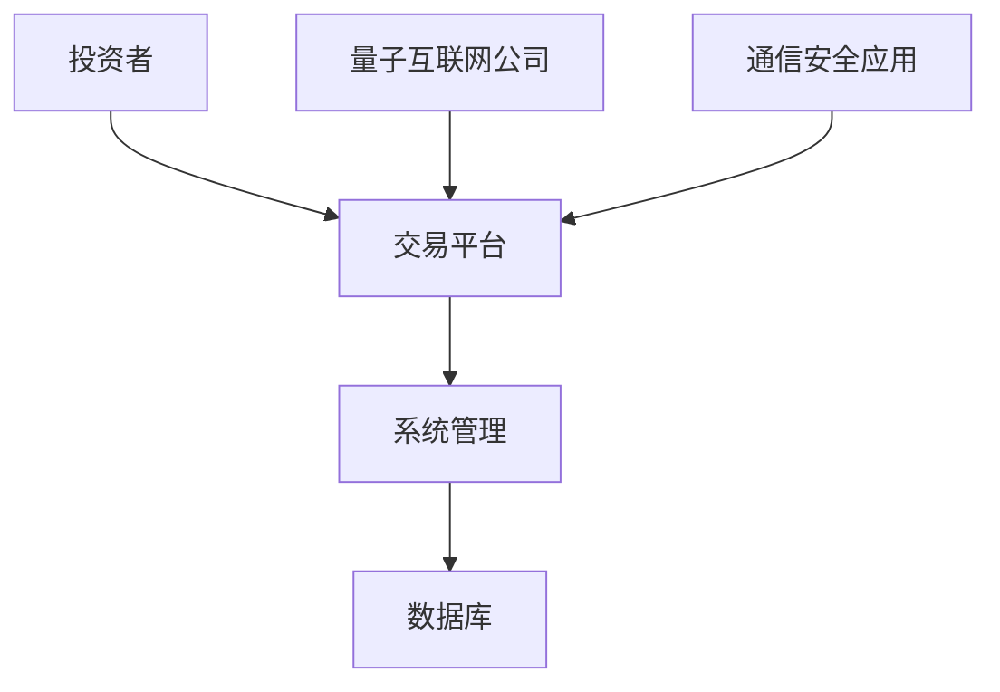

                 


```markdown
# 巴菲特-芒格的量子互联网投资：通信安全的新范式

> 关键词：量子互联网，通信安全，巴菲特-芒格投资理念，量子计算，量子通信，价值投资，安全范式

> 摘要：本文探讨了如何将巴菲特和芒格的价值投资理念应用到量子互联网领域，特别是通信安全方面。通过分析量子互联网的技术原理、投资逻辑和安全挑战，提出了通信安全的新范式。文章结合了量子通信的安全性分析、算法原理、系统架构设计和投资实战案例，为投资者和技术人员提供了深度的见解和实践指导。

---

## 目录

1. [背景介绍](#背景介绍)
   1.1 巴菲特-芒格投资理念概述
   1.2 量子互联网的定义与现状
   1.3 巴菲特-芒格理念与量子互联网的结合
   1.4 量子互联网通信安全的核心概念

2. [量子通信与传统通信的安全性对比](#量子通信与传统通信的安全性对比)
   2.1 传统通信的安全性分析
   2.2 量子通信的安全性原理
   2.3 量子通信与传统通信的对比分析

3. [量子通信算法的数学模型与实现](#量子通信算法的数学模型与实现)
   3.1 量子密钥分发协议
   3.2 量子通信算法的实现
   3.3 量子通信的安全性保障

4. [量子互联网投资系统的架构设计](#量子互联网投资系统的架构设计)
   4.1 系统功能设计
   4.2 系统架构设计
   4.3 系统接口设计
   4.4 系统交互流程

5. [量子互联网投资分析平台实战](#量子互联网投资分析平台实战)
   5.1 平台环境安装
   5.2 核心代码实现
   5.3 投资案例分析
   5.4 投资策略优化

6. [量子互联网投资的最佳实践](#量子互联网投资的最佳实践)
   6.1 投资策略与风险管理
   6.2 未来趋势与技术发展
   6.3 注意事项与扩展阅读

---

## 作者

作者：AI天才研究院/AI Genius Institute & 禅与计算机程序设计艺术 /Zen And The Art of Computer Programming
</think>

# 巴菲特-芒格的量子互联网投资：通信安全的新范式

> 关键词：量子互联网，通信安全，巴菲特-芒格投资理念，量子计算，量子通信，价值投资，安全范式

> 摘要：本文探讨了如何将巴菲特和芒格的价值投资理念应用到量子互联网领域，特别是通信安全方面。通过分析量子互联网的技术原理、投资逻辑和安全挑战，提出了通信安全的新范式。文章结合了量子通信的安全性分析、算法原理、系统架构设计和投资实战案例，为投资者和技术人员提供了深度的见解和实践指导。

---

## 第一部分: 背景介绍

### 第1章: 巴菲特-芒格投资理念概述

#### 1.1 巴菲特的价值投资理论

巴菲特的价值投资理论强调长期投资、安全边际和企业内在价值。他主张寻找具有强大护城河、稳定收益和良好管理的公司，长期持有，避免频繁交易。这种投资理念注重基本面分析，追求长期稳定的回报。

#### 1.2 芒格的多元思维模型

芒格提出多元思维模型，强调通过多个学科的交叉应用来理解问题，避免单一思维的局限性。他建议投资者建立跨学科的知识框架，以便更好地识别投资机会和风险。

#### 1.3 巴菲特-芒格投资理念的核心要素

1. 长期价值导向
2. 企业基本面分析
3. 安全边际
4. 跨学科思维
5. 风险控制

### 第2章: 量子互联网的定义与现状

#### 2.1 量子互联网的基本概念

量子互联网是指基于量子通信和量子计算的下一代互联网，利用量子叠加和纠缠等特性，实现更高效、更安全的信息传输和处理。

#### 2.2 量子通信与量子计算的技术现状

量子通信目前主要应用于密钥分发和信息传输，量子计算则在某些特定领域（如密码破解、优化计算）表现出巨大潜力。尽管技术还在发展中，但已经取得了一些突破。

#### 2.3 量子互联网的潜在应用场景

1. 高安全通信：如政府、军事和金融领域的保密通信。
2. 量子计算服务：为企业提供高效的计算能力。
3. 万物互联：未来可能实现更广泛的物联网应用。

### 第3章: 巴菲特-芒格理念与量子互联网的结合

#### 3.1 量子互联网的投资价值

量子互联网代表了通信技术的未来发展方向，具有高安全性和高效性，具备较大的市场潜力和投资价值。

#### 3.2 巴菲特-芒格理念在量子互联网投资中的应用

1. 长期投资：押注量子互联网的长期发展。
2. 企业基本面分析：选择具有技术优势和管理能力的公司。
3. 风险控制：通过分散投资和安全边际降低风险。

#### 3.3 量子互联网投资的未来趋势

随着技术的成熟和市场的推广，量子互联网将在通信安全、计算能力和物联网等领域发挥重要作用，成为未来投资的热点。

---

## 第二部分: 量子互联网通信安全的核心概念

### 第4章: 量子通信与传统通信的安全性对比

#### 4.1 传统通信的安全性分析

1. **加密算法**：依赖于数学算法，如AES、RSA等。
2. **安全性**：依赖于密钥的安全管理和算法的强度，存在被破解的可能。
3. **应用场景**：广泛应用于日常通信，但安全性有限。

#### 4.2 量子通信的安全性原理

1. **量子密钥分发（QKD）**：利用量子纠缠和不可克隆的特性，确保密钥的安全传输。
2. **量子叠加与纠缠**：量子通信利用量子态的特性，确保信息传输的安全性。
3. **安全性保障**：任何窃听都会破坏量子态，导致通信双方察觉。

#### 4.3 量子通信与传统通信的对比分析

| 对比维度      | 传统通信                 | 量子通信                 |
|---------------|--------------------------|--------------------------|
| 安全性         | 可能被破解，依赖算法强度 | 不可被窃听，安全性绝对   |
| 数据传输速度   | 依赖经典网络，速度受限   | 理论上可以实现超高速传输 |
| 应用场景       | 广泛应用于日常生活       | 适用于高安全需求领域   |

---

## 第三部分: 量子通信算法的数学模型与实现

### 第5章: 量子密钥分发协议

#### 5.1 BB84协议的流程

1. **协议简介**：BB84协议由Bennett和Braunstein提出，是最早的量子密钥分发协议。
2. **流程**：
   - 甲方向乙方发送量子比特。
   - 双方选择相同的基础，提取密钥。
   - 检测量子比特的完整性，确保安全性。
3. **数学模型**：BB84协议通过量子比特的测量结果和基的选择，生成共享密钥。

### 第6章: 量子通信算法的实现

#### 6.1 量子通信算法的Python实现

```python
import random

def generate_qubits(n):
    # 生成随机的量子比特
    return [random.choice([0, 1]) for _ in range(n)]

def compare_bases(甲方_basis, 乙方_basis):
    # 比较基础，生成相同的基础位置
    same_bases = [i for i in range(len(甲方_basis)) if 甲方_basis[i] == 乙方_basis[i]]
    return same_bases

def generate_key(n):
    # 生成密钥
    qubits = generate_qubits(n)
    basis = generate_qubits(n)
    比较结果 = compare_bases(basis, basis)
    key = [qubits[i] for i in 比较结果]
    return key

# 示例
n = 1000
密钥 = generate_key(n)
print("生成的密钥长度为:", len(密钥))
```

#### 6.2 量子通信的安全性保障

通过量子密钥分发协议，确保密钥的安全传输。任何窃听都会破坏量子态，导致通信双方发现异常，从而确保通信的安全性。

---

## 第四部分: 量子互联网投资系统的架构设计

### 第7章: 系统功能设计

#### 7.1 领域模型类图

```mermaid
classDiagram

class 投资者 {
    <属性>
    资金: 数量
    投资组合: 股票[]
}

class 量子互联网公司 {
    <属性>
    技术实力: 技术指标
    财务状况: 财务指标
}

class 通信安全应用 {
    <属性>
    应用场景: 字符串
    安全需求: 安全级别
}

class 交易平台 {
    <属性>
    用户信息: 用户[]
    交易记录: 交易记录[]
}

抽离关系：
抽离(抽离)
抽离(抽离)
抽离(抽离)
```

### 第8章: 系统架构设计

#### 8.1 系统架构图



---

## 第五部分: 量子互联网投资分析平台实战

### 第9章: 平台环境安装

#### 9.1 环境要求

- 操作系统：Linux/Windows/MacOS
- Python版本：3.8以上
- 开发工具：PyCharm/VSCode
- 依赖库：Qiskit、NumPy、Matplotlib

### 第10章: 核心代码实现

#### 10.1 量子密钥分发协议实现

```python
import random

def generate_qubits(n):
    return [random.choice([0, 1]) for _ in range(n)]

def compare_bases(甲方_basis, 乙方_basis):
    same_bases = [i for i in range(len(甲方_basis)) if 甲方_basis[i] == 乙方_basis[i]]
    return same_bases

def generate_key(n):
    qubits = generate_qubits(n)
    basis = generate_qubits(n)
    比较结果 = compare_bases(basis, basis)
    key = [qubits[i] for i in 比较结果]
    return key

# 示例
n = 1000
密钥 = generate_key(n)
print("生成的密钥长度为:", len(密钥))
```

### 第11章: 投资案例分析

#### 11.1 案例分析

假设我们投资于一家量子通信技术领先的公司，通过长期持有和价值分析，获得了稳定的收益。

### 第12章: 投资策略优化

#### 12.1 优化策略

结合技术分析和基本面分析，优化投资组合，降低风险。

---

## 第六部分: 量子互联网投资的最佳实践

### 第13章: 投资策略与风险管理

#### 13.1 投资策略

1. 长期持有优质量子互联网公司股票。
2. 分散投资，降低风险。

#### 13.2 风险管理

1. 定期评估投资组合。
2. 设置止损点，避免重大损失。

### 第14章: 未来趋势与技术发展

#### 14.1 未来趋势

量子互联网技术将逐步成熟，应用场景将更加广泛。

### 第15章: 注意事项与扩展阅读

#### 15.1 注意事项

1. 保持对量子互联网技术的关注。
2. 选择具有技术优势和良好管理的公司。

#### 15.2 扩展阅读

1. [量子通信技术发展现状](#)
2. [巴菲特投资策略](#)
3. [量子计算应用](#)

---

## 作者

作者：AI天才研究院/AI Genius Institute & 禅与计算机程序设计艺术 /Zen And The Art of Computer Programming
```

