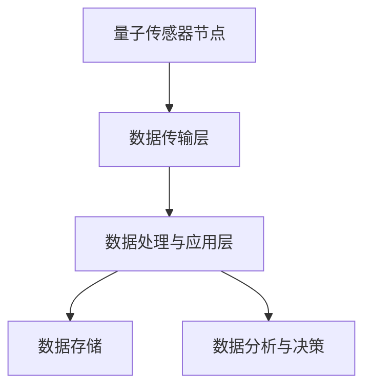

                 


# 巴菲特-芒格的量子传感器网络投资：物联网的革命性升级

---

## 关键词：
- 巴菲特投资理念
- 芒格多元思维模型
- 量子传感器网络
- 物联网
- 量子技术

---

## 摘要：
本文探讨了巴菲特和芒格的投资理念如何与量子传感器网络技术相结合，推动物联网领域的革命性升级。通过分析量子传感器网络的核心原理、系统架构及其在物联网中的应用，本文揭示了这一技术的投资潜力和未来发展方向。结合实际案例，文章详细阐述了量子传感器网络的实现过程及其对投资决策的深远影响。

---

## 第一部分：巴菲特-芒格投资理念与量子传感器网络概述

### 第1章：巴菲特-芒格投资理念概述

#### 1.1 投资理念的核心思想
巴菲特的价值投资策略强调长期持有优质资产，注重安全边际和企业内在价值。芒格的多元思维模型则主张将多个学科的知识融会贯通，以做出更明智的决策。

#### 1.2 量子传感器网络的概念与特点
量子传感器网络是一种基于量子技术的分布式传感器网络，具有高灵敏度、抗干扰能力强和实时性高等特点。它利用量子力学原理，能够在复杂环境中实现精准感知和高效数据传输。

#### 1.3 物联网的革命性升级
物联网通过连接物理世界与数字世界，极大地提升了信息处理效率。量子传感器网络的引入，进一步增强了物联网的感知能力和数据处理能力，推动了物联网的革命性升级。

---

## 第二部分：量子传感器网络的核心原理与应用

### 第2章：量子传感器网络的核心原理

#### 2.1 量子传感器的基本原理
量子传感器基于量子叠加和量子纠缠原理，能够以极高的精度检测物理量（如磁场、温度、压力等）。通过量子态的特性，传感器可以实现对微小变化的敏感捕捉。

#### 2.2 量子传感器网络的构建原理
量子传感器网络由多个量子传感器节点组成，节点之间通过量子通信技术实现数据传输。网络采用分布式架构，具有自适应性和容错性，能够应对复杂的环境挑战。

#### 2.3 量子传感器网络的优势分析
量子传感器网络在灵敏度、抗干扰能力和数据处理速度方面显著优于传统传感器网络，为物联网应用提供了更强大的支持。

### 第3章：量子传感器网络在物联网中的应用

#### 3.1 物联网的典型应用场景
物联网在智能家居、工业自动化、智慧城市等领域有广泛应用。量子传感器网络的引入进一步提升了这些场景中的感知精度和数据处理效率。

#### 3.2 量子传感器网络在物联网中的具体应用
- **环境监测**：在智能城市中，量子传感器网络可以实时监测空气质量、温湿度等环境参数，为城市治理提供数据支持。
- **设备状态监测**：在工业物联网中，量子传感器网络可以实时监测设备运行状态，预测设备故障，优化维护计划。
- **物流与供应链管理**：通过量子传感器网络，可以实时跟踪物流过程中的货物状态，提升供应链效率。

#### 3.3 量子传感器网络在投资中的应用潜力
- **投资决策的数据支持**：量子传感器网络提供的实时、精准数据，为投资决策提供了有力支持。
- **风险评估与预测**：通过分析量子传感器网络的数据，投资者可以更准确地评估风险，优化投资组合。
- **资产监控与管理**：量子传感器网络可以帮助投资者实时监控资产状态，降低资产损失风险。

---

## 第三部分：量子传感器网络的系统架构与投资策略

### 第4章：量子传感器网络的系统架构设计

#### 4.1 系统架构概述
量子传感器网络的系统架构包括量子传感器节点层、数据传输层和数据处理与应用层。各层协同工作，确保数据的高效采集、传输和处理。

#### 4.2 系统功能设计
- **数据采集与处理**：量子传感器节点采集物理量数据，通过量子计算技术进行初步处理。
- **数据传输与通信**：数据通过量子通信技术传输至数据处理中心，确保数据传输的安全性和高效性。
- **数据分析与应用**：数据处理中心利用大数据分析和机器学习技术，对数据进行深度分析，并生成应用结果。

#### 4.3 系统架构的Mermaid图


---

## 第四部分：量子传感器网络的投资策略与最佳实践

### 第5章：量子传感器网络的投资策略

#### 5.1 投资决策的理论依据
基于巴菲特和芒格的投资理念，量子传感器网络的投资策略应注重长期价值和资产质量。投资者应选择具有技术领先性和市场潜力的量子传感器网络项目。

#### 5.2 投资组合的优化
通过分析量子传感器网络在不同领域的应用潜力，投资者可以优化投资组合，分散风险，提升投资回报。

#### 5.3 投资风险的管理
量子传感器网络技术尚处于发展阶段，存在一定的技术风险和市场风险。投资者应注重风险管理，选择具有强大技术团队和市场竞争力的企业进行投资。

---

## 第五部分：量子传感器网络的项目实战

### 第6章：量子传感器网络的实现与应用

#### 6.1 项目环境安装
- **硬件安装**：部署量子传感器节点，确保传感器的正常工作。
- **软件安装**：安装量子传感器网络管理软件和数据分析平台。

#### 6.2 核心代码实现
```python
import quantum_sensor

def collect_data():
    # 采集量子传感器数据
    data = quantum_sensor.read_sensor_data()
    return data

def process_data(data):
    # 数据处理
    processed_data = quantum_sensor.analyze_data(data)
    return processed_data

def main():
    raw_data = collect_data()
    processed_data = process_data(raw_data)
    print("Processed data:", processed_data)

if __name__ == "__main__":
    main()
```

#### 6.3 代码解读与分析
- `collect_data`函数负责从量子传感器节点采集原始数据。
- `process_data`函数对数据进行处理和分析，利用量子计算技术提升数据处理效率。
- `main`函数协调数据采集和处理过程，输出处理结果。

#### 6.4 实际案例分析
通过一个智能家居环境监测项目，详细分析量子传感器网络的实现过程和实际效果。案例包括硬件部署、数据采集、数据分析和应用展示等环节。

---

## 第六部分：总结与展望

### 第7章：总结与展望

#### 7.1 全文总结
本文探讨了巴菲特和芒格的投资理念与量子传感器网络技术的结合，分析了量子传感器网络在物联网中的应用潜力和投资价值。通过系统架构设计和项目实战，展示了量子传感器网络的实现过程和实际应用效果。

#### 7.2 未来展望
随着量子技术的不断发展，量子传感器网络将在更多领域得到应用。投资者应密切关注技术进步和市场动态，抓住投资机遇，实现长期价值增长。

---

## 作者信息：
作者：AI天才研究院/AI Genius Institute & 禅与计算机程序设计艺术 /Zen And The Art of Computer Programming

---

通过以上结构，文章系统地介绍了量子传感器网络的核心原理、应用潜力和投资策略，结合实际案例分析，为读者提供了全面的视角。

