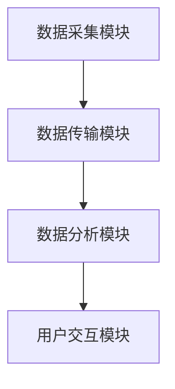

                 

# 巴菲特-芒格的量子传感网络投资：物联网的量子飞跃

---

## 关键词：
- 巴菲特投资哲学
- 芒格多元思维模型
- 量子传感网络
- 物联网技术
- 量子飞跃

---

## 摘要：
本文探讨了巴菲特与芒格的投资哲学如何与量子传感网络技术相结合，特别是在物联网领域的应用。通过分析量子传感网络的核心原理、系统架构以及在投资中的应用场景，文章揭示了这一技术如何为物联网带来革命性的变化，并为投资者提供了新的视角和策略。文章还结合实际案例，展示了如何利用量子传感数据进行投资决策，并提出了风险管理的最佳实践。

---

## 第一部分：巴菲特与芒格的投资哲学

### 第1章：巴菲特与芒格的投资理念

#### 1.1 巴菲特的价值投资理念
巴菲特的价值投资理念强调长期持有优质资产，关注企业的内在价值。这种理念与量子传感网络的投资逻辑有相似之处：通过长期观测和分析数据，识别出具有潜在价值的物联网企业或技术。

#### 1.2 芒格的多元思维模型
芒格提倡通过多学科的思维方式来解决问题。量子传感网络的投资需要结合物理学、计算机科学和金融学等多个领域的知识，这正是芒格多元思维模型的典型应用。

#### 1.3 价值投资与量子力学的隐喻
量子力学中的不确定性原理启示我们，在投资中，我们无法完全预测市场的波动，但可以通过量子传感数据来优化投资决策。

---

## 第二部分：量子传感网络的技术原理

### 第2章：量子传感网络的背景与概念

#### 2.1 量子传感网络的定义与特点
量子传感网络是一种利用量子技术进行感知和通信的网络系统，具有高灵敏度、抗干扰能力强和数据传输速度快的特点。

#### 2.2 量子传感网络与物联网的结合
物联网依赖于传感器的数据采集和传输，而量子传感网络通过提供更高精度的数据，显著提升了物联网的应用效果。

#### 2.3 量子传感网络的未来发展趋势
随着量子技术的进步，量子传感网络将在工业、医疗、交通等领域发挥重要作用。

---

### 第3章：量子传感网络的核心技术

#### 3.1 量子传感技术的原理
量子传感技术基于量子纠缠和量子测量原理，能够实现对微弱信号的高灵敏度检测。

#### 3.2 量子传感网络的架构设计
量子传感网络的架构包括数据采集层、数据传输层和数据分析层，各层协同工作以实现高效的信号处理和数据传输。

#### 3.3 量子传感网络的数学模型
量子传感网络的数据传输过程可以用以下公式描述：
$$ P(\text{数据传输成功}) = 1 - e^{-\lambda t} $$
其中，$\lambda$ 是传输速率，$t$ 是传输时间。

---

## 第三部分：量子传感网络在投资中的应用

### 第4章：量子传感网络的投资策略

#### 4.1 数据驱动的资产配置
通过量子传感网络获取实时数据，投资者可以更精准地进行资产配置，降低投资风险。

#### 4.2 量子传感网络的风险管理
利用量子传感数据，投资者可以提前识别潜在风险，优化投资组合。

#### 4.3 投资组合的优化与调整
基于量子传感数据的分析，投资者可以动态调整投资组合，捕捉市场机会。

---

### 第5章：量子传感网络的系统分析与架构设计

#### 5.1 系统功能模块划分
量子传感网络系统包括数据采集模块、数据传输模块、数据分析模块和用户交互模块。

#### 5.2 系统组件的交互关系
使用Mermaid图表示系统组件的交互关系：

---

## 第四部分：量子传感网络的投资实战案例

### 第6章：量子传感网络的投资实战

#### 6.1 案例背景介绍
某投资者利用量子传感网络技术，成功预测了一家物联网企业的市场表现，获得了超额收益。

#### 6.2 投资策略与实施过程
投资者通过量子传感数据，识别出该企业具有较高的成长潜力，决定长期持有其股票。

#### 6.3 投资结果与经验总结
通过量子传感网络的投资策略，投资者实现了较高的投资回报率，验证了该技术的有效性。

---

## 第五部分：量子传感网络的未来展望

### 第7章：量子传感网络的未来发展趋势

#### 7.1 技术进步与应用拓展
随着量子技术的不断进步，量子传感网络将在更多领域得到应用。

#### 7.2 投资领域的创新
量子传感网络的投资模式将推动金融领域的创新，为投资者提供新的工具和策略。

#### 7.3 风险管理的未来方向
未来，量子传感网络将与人工智能技术结合，进一步提升投资风险管理的能力。

---

## 第六部分：总结与建议

### 第8章：总结与最佳实践

#### 8.1 量子传感网络的投资价值
量子传感网络为物联网投资提供了新的视角和技术工具，具有重要的战略意义。

#### 8.2 投资者的最佳实践
投资者应积极学习量子传感网络相关知识，结合巴菲特和芒格的投资理念，优化投资策略。

#### 8.3 风险管理的关键点
在利用量子传感网络进行投资时，投资者需注意数据的准确性和系统的安全性。

---

## 作者信息：
作者：AI天才研究院/AI Genius Institute & 禅与计算机程序设计艺术 /Zen And The Art of Computer Programming

---

通过以上结构和内容，本文全面探讨了巴菲特与芒格的投资哲学与量子传感网络技术的结合，分析了其在物联网领域的应用前景，并为投资者提供了实用的建议和案例分析。

