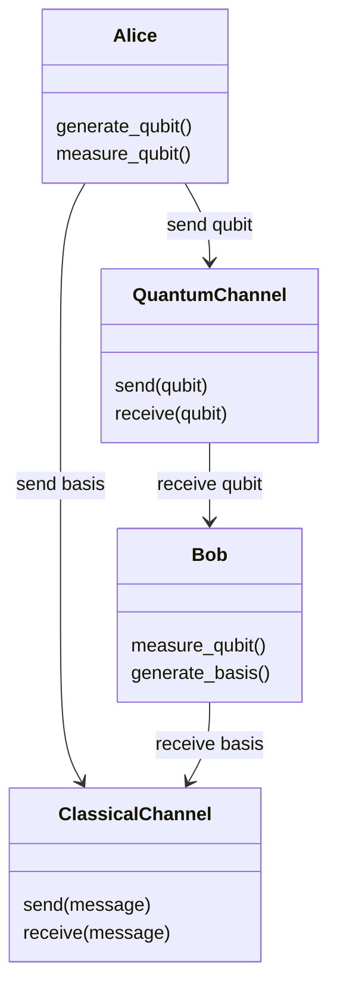
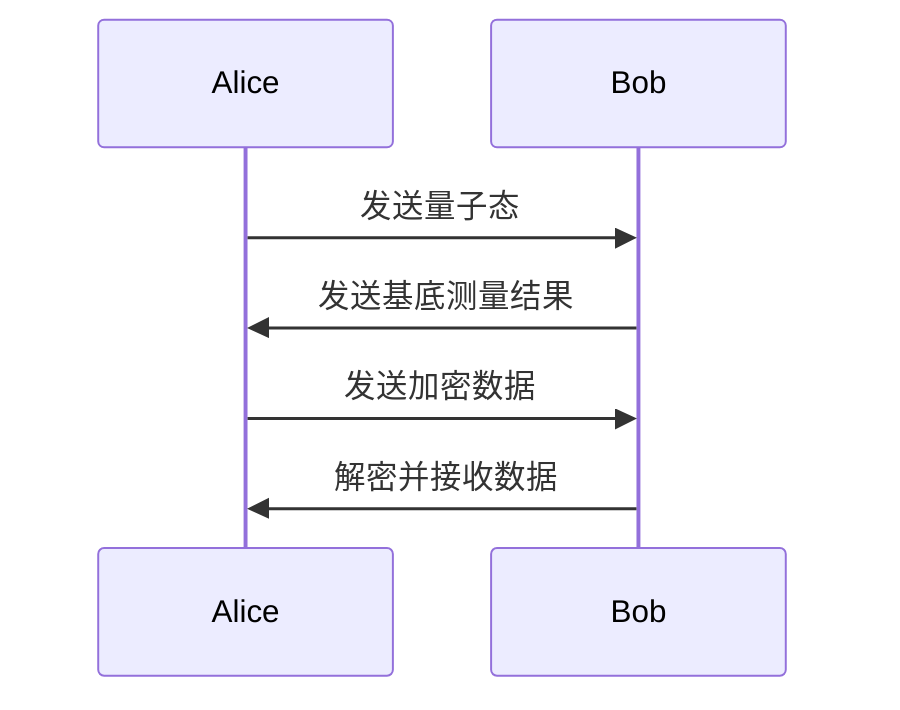

                 


# 巴菲特-芒格的量子加密通信投资：后量子时代的数据安全

> 关键词：量子加密通信、巴菲特、芒格、后量子时代、数据安全

> 摘要：本文探讨了巴菲特和芒格的投资哲学在量子加密通信领域的应用，分析了后量子时代的数据安全挑战，并详细讲解了量子加密通信的核心原理、算法模型、系统架构以及实际投资案例。

---

## 第一部分: 巴菲特-芒格投资哲学与量子加密通信的结合

### 第1章: 巴菲特-芒格投资哲学概述

#### 1.1 巴菲特的价值投资理念

- **长期价值投资**：巴菲特强调投资具有强大护城河的企业，关注企业的长期价值而非短期波动。
- **安全边际**：通过低估买入价和高估卖出价来降低投资风险。
- **企业基本面分析**：重视企业的财务状况、盈利能力和发展前景。

#### 1.2 芒格的多元思维模型

- **跨学科思维**：芒格提倡从多个学科中汲取智慧，构建多元思维模型。
- **逆向思维**：通过分析问题的反面来寻找解决方案。
- **决策框架**：强调逻辑推理和事实分析，避免情绪化决策。

#### 1.3 投资哲学与技术趋势的结合

- **技术驱动投资**：关注技术进步对企业价值的影响。
- **行业趋势分析**：识别未来具有增长潜力的行业。
- **竞争优势评估**：分析企业在行业中的竞争优势和技术壁垒。

---

### 第2章: 后量子时代的数据安全挑战

#### 2.1 量子计算的崛起

- **量子计算的原理**：利用量子叠加和量子纠缠进行并行计算，速度远超经典计算机。
- **量子计算的应用**：在密码破解、材料科学和优化问题等领域具有巨大潜力。
- **量子计算的威胁**：传统加密算法在量子计算机前不堪一击，数据安全面临严重威胁。

#### 2.2 传统加密算法的脆弱性

- **对称加密的弱点**：如AES，虽然强度高，但密钥管理复杂，且无法抵御量子攻击。
- **非对称加密的局限**：如RSA和椭圆曲线加密，基于大数分解和离散对数问题，量子计算机可以轻松破解。
- **哈希函数的脆弱性**：如SHA-256，同样面临量子攻击的风险。

#### 2.3 数据安全的未来趋势

- **后量子加密标准**：NIST（美国国家标准与技术研究院）正在遴选抗量子加密算法，成为未来数据保护的关键。
- **量子安全通信**：通过量子密钥分发（QKD）实现的安全通信，被认为是后量子时代的解决方案。
- **零信任架构**：在数据安全中，逐步向零信任模式转变，强化身份验证和最小权限原则。

---

### 第3章: 巴菲特-芒格投资策略在量子加密通信中的应用

#### 3.1 量子加密通信的核心价值

- **技术领先性**：掌握量子密钥分发（QKD）和量子隐形传态等核心技术的企业具备竞争优势。
- **市场需求**：随着量子计算的发展，市场对量子安全通信的需求将大幅增加。
- **行业地位**：在量子通信领域的龙头企业，如ID Quantique和思科，值得关注。

#### 3.2 投资策略与技术发展的匹配

- **技术评估**：分析企业的技术实力，包括研发团队、专利数量和实验成果。
- **市场定位**：评估企业是否占据市场领先地位，是否有稳定的客户群和合作伙伴。
- **财务状况**：考察企业的财务健康状况，包括收入增长、利润率和现金流。

#### 3.3 长期投资视角下的技术演进

- **技术迭代**：关注企业在量子加密算法和通信协议上的研发投入和创新能力。
- **生态系统建设**：投资构建完整的量子安全生态系统的公司，如设备制造商、网络运营商和应用开发商。
- **政策支持**：关注政府在量子安全领域的政策支持和资金投入，如欧盟的量子旗舰计划和美国的NIST标准推动。

---

### 第4章: 量子加密通信的数学模型与算法原理

#### 4.1 量子密钥分发（QKD）的数学模型

- **基本原理**：通过量子态传输和基底测量，实现密钥的安全分发。
- **协议流程**：包括量子态传输、基底协商和密钥生成三个阶段。
- **数学表达**：使用克劳泽-施密特定理（Clauser-Horne inequality）描述量子态的不可克隆性。

#### 4.2 量子加密算法的安全性证明

- **安全性分析**：通过信息论和计算复杂度证明量子密钥分发的不可破解性。
- **协议实现**：BB84协议、EPR协议和B92协议的比较和优缺点分析。

#### 4.3 算法实现的Python代码示例

```python
import random

def generate_key():
    # 随机生成量子态基底
    basis = random.choice(['+','x'])
    # 生成量子态
    if basis == '+':
        return [1, 0]
    else:
        return [0, 1]

# 量子态传输和基底协商
alice_basis = generate_key()
bob_basis = generate_key()

# 密钥生成
if alice_basis == bob_basis:
    key = alice_basis
else:
    key = [0,0]

print(f"Alie的基底：{alice_basis}, Bob的基底：{bob_basis}, 密钥：{key}")
```

---

### 第5章: 量子加密通信的系统架构与实现

#### 5.1 系统功能设计

- **领域模型**：通过Mermaid类图展示量子通信系统的组成部分，包括量子信道、经典信道、量子态生成器和基底测量器。



#### 5.2 系统架构设计

- **分层架构**：包括量子层、协议层和应用层，通过Mermaid架构图展示各层之间的关系。


#### 5.3 系统接口设计

- **接口定义**：明确系统接口的输入输出，如量子密钥分发接口、密钥协商接口和加密/解密接口。

#### 5.4 系统交互流程

- **通信流程**：通过Mermaid序列图展示Alice和Bob之间的量子密钥分发和通信过程。



---

### 第6章: 项目实战与投资案例分析

#### 6.1 环境安装

- **依赖安装**：安装量子通信实验所需的Python库，如qiskit和numpy。

```bash
pip install qiskit numpy
```

#### 6.2 核心代码实现

- **量子态生成**：实现量子态的生成和传输。

```python
from qiskit import QuantumCircuit, Aer, execute
from qiskit.circuit import Gate

qc = QuantumCircuit(2, 2)
qc.h(0)
qc.cx(0, 1)
qc.measure_all()

result = execute(qc, Aer.get_backend('qasm_simulator')).result()
print(result.get_counts())
```

#### 6.3 投资案例分析

- **案例选择**：分析某家量子通信企业的投资价值，包括技术实力、市场需求和财务状况。
- **风险评估**：评估行业风险、技术风险和市场风险，制定风险管理策略。

---

### 第7章: 总结与展望

#### 7.1 投资经验总结

- **核心要点**：长期投资、技术驱动和风险管理是量子加密通信投资的关键。
- **成功因素**：选择技术领先、市场需求大、财务健康的企业。

#### 7.2 投资注意事项

- **技术风险**：量子加密技术尚未完全成熟，存在被替代的风险。
- **政策风险**：政府政策的变化可能影响行业发展。
- **市场波动**：科技股通常波动较大，需要做好风险管理。

#### 7.3 未来展望

- **技术进步**：随着量子计算的进一步发展，量子加密通信的需求将大幅增加。
- **行业整合**：预计会有更多的企业加入量子安全领域，行业整合可能加速。
- **投资机会**：在后量子时代，具备领先技术的企业将具备强大的竞争优势。

---

## 作者：AI天才研究院 & 禅与计算机程序设计艺术

---

**说明**：以上是完整的技术博客文章大纲和部分内容展示，完整文章需要根据上述结构和内容进一步扩展，确保每个部分都有详细的技术分析和实例说明。

