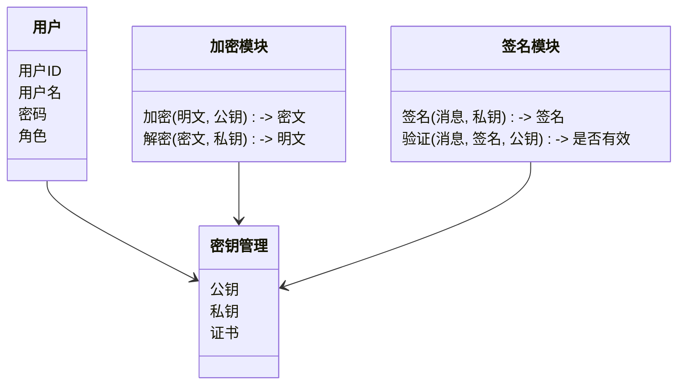
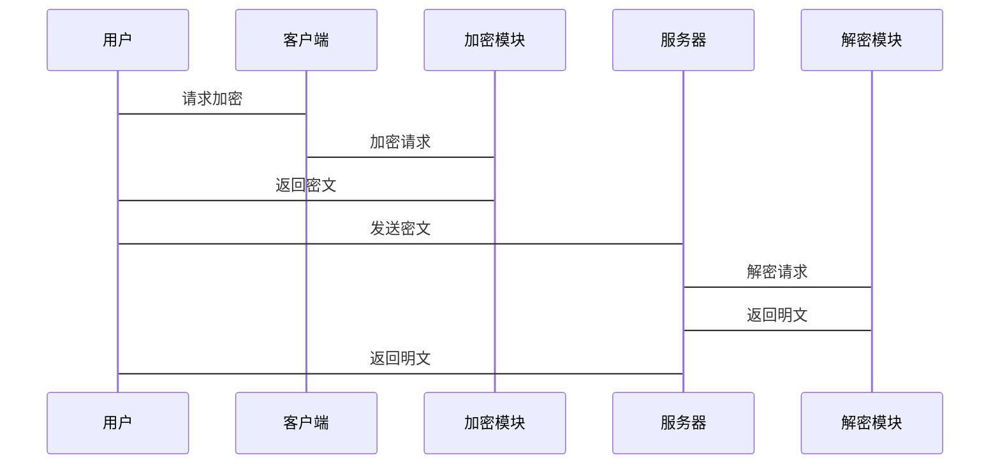

                 


# 巴菲特-芒格的量子密码学投资：后量子时代的网络安全

## 关键词：
- 巴菲特投资理念
- 芒格思维模型
- 量子密码学
- 后量子时代
- 网络安全
- 量子计算
- 加密算法

## 摘要：
本文探讨巴菲特和芒格的投资理念在后量子时代的网络安全中的应用，分析量子计算对传统加密技术的威胁，介绍后量子加密算法的原理和实现，通过案例分析投资机会与风险，并提出在后量子时代如何构建安全的投资策略。

---

## 第一章：巴菲特与芒格投资理念概述

### 1.1 投资理念的核心要素

#### 1.1.1 巴菲特的价值投资原则
- **长期价值投资**：寻找具有持续竞争优势和良好管理的公司。
- **安全边际**：以低于内在价值的价格买入。
- **避免非理性决策**：基于基本面分析而非市场情绪。

#### 1.1.2 芒格的多元思维模型
- **跨学科思维**：将多个领域的知识融会贯通。
- **逆向思维**：从反方向思考问题。
- **复利效应**：时间与知识的积累带来的指数级增长。

#### 1.1.3 投资与风险管理的结合
- **风险管理优先**：识别并控制主要风险。
- **分散投资**：降低单一投资的风险。
- **长期视角**：耐心持有优质资产。

### 1.2 量子密码学的基本概念

#### 1.2.1 量子计算的原理
- **量子叠加**：量子位可以同时表示0和1。
- **量子纠缠**：两个量子位之间的关联性。
- **量子并行**：一次操作可以处理大量可能性。

#### 1.2.2 量子密码学的定义与特点
- **基于量子力学原理**：利用量子叠加和纠缠进行加密。
- **抗量子攻击**：抵抗量子计算机的破解能力。
- **数学安全性**：依赖于数学上的困难问题。

#### 1.2.3 后量子时代的网络安全威胁
- **传统加密技术的脆弱性**：RSA和椭圆曲线加密可能被量子计算机破解。
- **数据 breaches的风险**：关键数据的泄露对企业价值的影响。
- **网络攻击的升级**：量子计算能力提升后，网络攻击手段更加先进。

### 1.3 投资与网络安全的关联性

#### 1.3.1 网络安全对现代投资的影响
- **企业风险管理**：网络安全漏洞可能导致财务损失和声誉损害。
- **数据保护的重要性**：保护敏感数据是企业持续竞争优势的关键。
- **投资者的关注点**：投资者越来越关注企业网络安全能力。

#### 1.3.2 量子计算对传统加密技术的威胁
- **威胁分析**：量子计算机对RSA和椭圆曲线加密的破解能力。
- **替代方案需求**：寻找抗量子加密算法以保护数据。
- **投资机会**：后量子加密技术的研发和应用可能带来投资机会。

#### 1.3.3 投资者如何应对后量子时代的网络安全挑战
- **技术投资**：投资于研发抗量子加密技术的公司。
- **风险管理**：评估投资组合中的网络安全风险。
- **长期规划**：制定适应后量子时代的网络安全策略。

---

## 第二章：后量子时代的网络安全威胁

### 2.1 传统加密技术的局限性

#### 2.1.1 RSA与椭圆曲线加密的原理
- **RSA**：基于大整数分解的困难性。
- **椭圆曲线加密**：基于椭圆曲线上的点操作的困难性。
- **数学基础**：数论和椭圆曲线理论。

#### 2.1.2 量子计算机对传统加密算法的威胁
- **Shor算法**：用于分解大整数和解椭圆曲线问题。
- **量子计算的优势**：在特定问题上远超经典计算机。
- **威胁分析**：哪些加密协议最易受到攻击。

#### 2.1.3 网络安全漏洞的潜在风险
- **数据 breaches的影响**：客户信任度下降，财务损失。
- **关键基础设施的安全性**：电力、金融等领域的潜在威胁。
- **国家安全风险**：网络战对国家主权的威胁。

### 2.2 后量子加密算法的原理

#### 2.2.1 基于格的加密算法
- **格的基本概念**：格是由一组基向量张成的空间。
- **格加密算法**：如NTRU和Lattice-Based Cryptography。
- **抗量子攻击能力**：基于格的加密算法被认为抗量子攻击。

#### 2.2.2 哈希签名与代码签名
- **哈希函数的作用**：生成唯一摘要，用于签名生成。
- **签名过程**：通过哈希函数生成签名，用于验证数据完整性。
- **代码签名的应用**：确保软件来源可靠，防止恶意代码。

#### 2.2.3 后量子加密算法的标准化进程
- **NIST的标准化工作**：美国国家标准与技术研究院在寻找抗量子加密算法。
- **国际标准的发展**：如ISO和ITU在后量子加密领域的贡献。
- **商业应用的前景**：企业如何逐步采用这些新算法。

### 2.3 网络安全对投资的影响

#### 2.3.1 网络攻击对企业价值的破坏
- **直接经济损失**：数据泄露导致的罚款和修复成本。
- **间接成本**：修复漏洞的时间和资源消耗。
- **声誉损失**：客户信任度下降影响长期收益。

#### 2.3.2 量子计算时代的投资机会与风险
- **投资机会**：研发和推广抗量子加密技术的公司可能成为投资热点。
- **风险分析**：传统加密技术依赖企业面临的风险。
- **技术锁定风险**：早期采用新算法可能面临兼容性问题。

---

## 第三章：后量子加密算法的数学模型与实现

### 3.1 基于格的加密算法

#### 3.1.1 格的数学定义与性质
- **格的定义**：由基向量张成的格子结构。
- **格的距离度量**：如切比雪夫距离和欧几里得距离。
- **格的基变换**：如何通过基变换简化问题。

#### 3.1.2 基于格的加密算法的数学模型
- **加密过程**：明文通过格加密生成密文。
- **解密过程**：利用私钥从密文中恢复明文。
- **安全性分析**：基于格的困难问题保证安全性。

#### 3.1.3 格加密算法的实现步骤
1. **选择基向量**：定义格的基。
2. **生成公钥和私钥**：基于格的结构生成。
3. **加密**：将明文映射到格点上。
4. **解密**：从密文格点中恢复明文。

### 3.2 哈希签名与代码签名

#### 3.2.1 哈希函数的数学特性
- **哈希函数的输入输出特性**：固定长度输出，输入敏感。
- **抗碰撞性**：难以找到两个不同的输入产生相同的输出。
- **抗原像性**：难以从哈希值推导出原始输入。

#### 3.2.2 签名生成与验证的数学过程
- **签名生成**：使用私钥对消息哈希进行签名。
- **签名验证**：使用公钥验证签名的有效性。
- **哈希签名的数学模型**：结合哈希函数和公钥加密。

#### 3.2.3 哈希签名的抗量子能力
- **抗量子攻击的特性**：哈希签名不依赖于因数分解或离散对数问题。
- **实现优势**：适用于资源受限的环境，如物联网设备。

### 3.3 后量子加密算法的数学安全性

#### 3.3.1 数学证明与安全性分析
- **安全性证明**：基于数学上的困难问题。
- **攻击模型**：假设攻击者的能力和资源。
- **算法的复杂度分析**：加密和解密的计算复杂度。

#### 3.3.2 算法实现的优化策略
- **优化数学运算**：减少计算量，提高效率。
- **并行计算的应用**：利用多核处理器加速运算。
- **内存优化**：减少算法对内存的需求。

---

## 第四章：量子密码学算法的实现与优化

### 4.1 基于格的加密算法实现

#### 4.1.1 实现步骤与流程
1. **选择合适的格结构**：根据安全性需求选择格的参数。
2. **生成公钥和私钥**：基于格的基向量生成。
3. **加密过程**：将明文映射到格上，产生密文。
4. **解密过程**：利用私钥从密文恢复明文。

#### 4.1.2 优化策略与性能提升
- **算法优化**：减少不必要的计算步骤。
- **并行化处理**：利用多线程优化性能。
- **硬件加速**：使用专用硬件加速加密过程。

#### 4.1.3 实现中的关键问题与解决方案
- **选择正确的参数**：影响算法的安全性和效率。
- **处理大数运算**：优化大数运算以提高性能。
- **防止侧信道攻击**：确保实现的安全性，防止信息泄露。

### 4.2 哈希签名与代码签名的实现

#### 4.2.1 实现细节与注意事项
- **哈希函数的选择**：选择合适的哈希函数，如SHA-256或 SHA-3。
- **签名生成过程**：确保私钥的安全存储和使用。
- **签名验证过程**：确保公钥的正确性和签名的有效性。

#### 4.2.2 实现中的数学优化
- **哈希函数的优化**：减少计算时间，提高效率。
- **签名生成的优化**：优化私钥操作，提高速度。
- **代码签名的实现**：确保签名过程的可靠性和一致性。

#### 4.2.3 实现过程中的注意事项
- **安全性**：防止私钥泄露和中间人攻击。
- **兼容性**：确保签名格式与目标系统兼容。
- **性能**：优化实现以适应不同应用场景。

---

## 第五章：系统分析与架构设计方案

### 5.1 系统功能设计

#### 5.1.1 项目介绍
- **项目目标**：开发一个基于后量子加密算法的安全通信系统。
- **项目范围**：涵盖加密算法的选择、实现和测试。
- **项目利益相关者**：开发团队、用户和投资者。

#### 5.1.2 系统功能模块
1. **加密模块**：实现基于格的加密算法。
2. **签名模块**：实现哈希签名功能。
3. **通信模块**：实现安全通信协议。
4. **管理模块**：管理密钥和证书。

#### 5.1.3 系统功能设计的领域模型


### 5.2 系统架构设计

#### 5.2.1 项目介绍
- **项目目标**：构建一个抗量子加密的安全通信系统。
- **项目范围**：涵盖加密算法的选择、实现和测试。
- **项目利益相关者**：开发团队、用户和投资者。

#### 5.2.2 系统架构设计


#### 5.2.3 系统接口设计
- **加密接口**：提供加密和解密功能。
- **签名接口**：提供签名生成和验证功能。
- **通信接口**：提供安全通信协议的支持。

### 5.3 系统交互设计

#### 5.3.1 项目介绍
- **项目目标**：构建一个抗量子加密的安全通信系统。
- **项目范围**：涵盖加密算法的选择、实现和测试。
- **项目利益相关者**：开发团队、用户和投资者。

#### 5.3.2 系统交互设计


---

## 第六章：项目实战

### 6.1 环境安装

#### 6.1.1 开发环境的选择
- **操作系统**：推荐使用Linux或macOS。
- **编程语言**：选择Python或C++。
- **开发工具**：安装必要的开发工具和库。

#### 6.1.2 必要库的安装
- **Python库**：如qiskit、cirq和numpy。
- **C++库**：如GMP和MPFR。
- **依赖管理工具**：如pip和conda。

#### 6.1.3 环境配置
- **虚拟环境**：使用venv或conda创建独立环境。
- **路径设置**：确保所有库和工具在环境变量中正确配置。

### 6.2 系统核心实现

#### 6.2.1 加密模块的实现
- **Python实现**：基于Numpy和Scipy实现格加密算法。
- **代码示例**：
  ```python
  import numpy as np

  def encrypt(plaintext, public_key):
      # 加密算法实现
      return ciphertext

  def decrypt(ciphertext, private_key):
      # 解密算法实现
      return plaintext
  ```

#### 6.2.2 签名模块的实现
- **Python实现**：使用 hashlib 和 ecdsa 库实现哈希签名。
- **代码示例**：
  ```python
  import hashlib
  from ecdsa import SigningKey, VerifyingKey

  def generate_signature(message, private_key):
      hash_input = hashlib.sha256(message.encode()).hexdigest()
      return private_key.sign(hash_input)

  def verify_signature(message, signature, public_key):
      hash_input = hashlib.sha256(message.encode()).hexdigest()
      return public_key.verify(signature, hash_input)
  ```

#### 6.2.3 系统整体实现
- **系统架构**：将加密模块和签名模块整合到一个完整的系统中。
- **代码结构**：定义模块接口，实现系统功能。
- **测试用例**：编写测试用例验证功能。

### 6.3 代码应用解读与分析

#### 6.3.1 加密模块的应用
- **应用场景**：保护敏感数据的传输。
- **实现优势**：抗量子攻击，安全性高。

#### 6.3.2 签名模块的应用
- **应用场景**：确保软件和数据的完整性。
- **实现优势**：防止恶意代码注入，保障用户安全。

#### 6.3.3 系统整体应用
- **应用场景**：企业内部通信、金融交易等。
- **实现优势**：结合加密和签名技术，提供全面的安全保障。

### 6.4 实际案例分析

#### 6.4.1 案例背景介绍
- **案例目标**：保护企业的通信安全。
- **案例范围**：涵盖加密和签名功能的实现。

#### 6.4.2 案例分析与详细讲解
- **问题分析**：传统加密技术的脆弱性。
- **解决方案**：采用后量子加密算法。
- **实施过程**：系统设计、开发、测试和部署。

#### 6.4.3 项目小结
- **成功经验**：实现了一个抗量子加密的安全通信系统。
- **关键挑战**：算法实现的难度和性能优化。
- **未来改进方向**：进一步优化算法，提高性能。

---

## 第七章：最佳实践与小结

### 7.1 最佳实践

#### 7.1.1 投资策略 tips
- **长期视角**：关注企业的长期价值。
- **风险管理**：优先考虑风险控制。
- **分散投资**：避免过度集中风险。

#### 7.1.2 技术实现 tips
- **安全性优先**：确保算法的安全性。
- **性能优化**：提高算法的计算效率。
- **兼容性考虑**：确保与现有系统的兼容性。

### 7.2 小结

#### 7.2.1 核心内容回顾
- 巴菲特和芒格的投资理念。
- 量子密码学的基本概念。
- 后量子加密算法的实现与应用。

#### 7.2.2 重要结论
- 后量子时代网络安全的重要性。
- 投资者如何应对网络安全挑战。
- 技术实现中的关键问题与解决方案。

### 7.3 注意事项

#### 7.3.1 投资者注意事项
- **持续学习**：关注新技术的发展。
- **谨慎决策**：避免盲目跟风。
- **长期规划**：制定适应变化的策略。

#### 7.3.2 技术实现注意事项
- **安全性测试**：确保算法的安全性。
- **性能测试**：优化算法的计算效率。
- **兼容性测试**：确保与现有系统的兼容性。

### 7.4 拓展阅读

#### 7.4.1 推荐书籍
- 《The Theory of Everything》
- 《Quantum Computing for Dummies》
- 《Investing the巴菲特 Way》

#### 7.4.2 推荐博客和网站
- NIST的后量子加密标准页面。
- IBM的量子计算博客。
-巴菲特投资经典书籍。

---

## 作者：AI天才研究院/AI Genius Institute & 禅与计算机程序设计艺术 /Zen And The Art of Computer Programming

