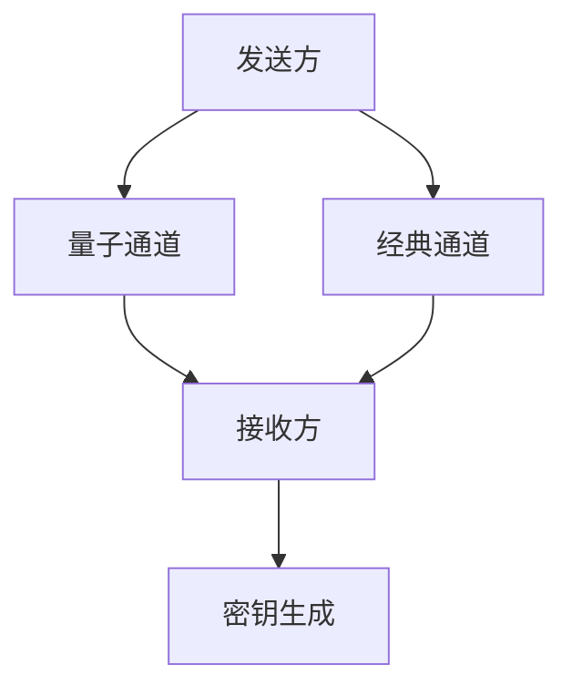
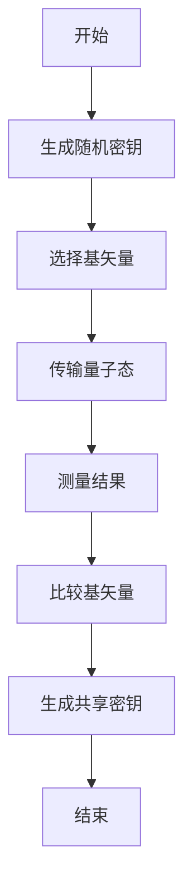

                 

# 巴菲特-芒格的量子密钥分发网络投资：网络安全的终极解决方案

> 关键词：巴菲特, 芒格, 量子密钥分发, 网络安全, 投资策略, 量子通信, 解决方案

> 摘要：本文探讨了巴菲特和芒格的投资理念与量子密钥分发技术的结合，提出了网络安全的终极解决方案。通过分析量子密钥分发的核心原理、系统架构和实际应用，展示了如何将稳健的投资策略应用于量子通信网络的建设中。

---

## 第一部分：巴菲特-芒格投资理念与量子密钥分发技术概述

### 第1章：巴菲特-芒格投资理念与量子密钥分发技术的核心概念

#### 1.1 巴菲特-芒格投资理念
- 1.1.1 巴菲特的投资哲学：长期价值投资与风险管理
- 1.1.2 芒格的多元思维模型：跨学科学习与决策
- 1.1.3 投资中的安全性原则：避免永久性资本损失

#### 1.2 量子密钥分发技术的基本原理
- 1.2.1 量子密钥分发的概念与定义
- 1.2.2 量子密钥分发的核心机制：基于量子态的不可克隆性
- 1.2.3 量子密钥分发的应用场景：网络安全与通信

#### 1.3 巴菲特-芒格投资理念与量子密钥分发技术的结合
- 1.3.1 投资的安全性与量子密钥分发的无条件安全性
- 1.3.2 网络安全的终极解决方案：量子密钥分发网络投资
- 1.3.3 量子密钥分发技术的长期投资价值

---

## 第二部分：量子密钥分发技术的核心原理与算法

### 第2章：量子密钥分发的数学模型与算法原理

#### 2.1 量子密钥分发的数学模型
- 2.1.1 量子态的数学表示：基矢量与叠加态
- 2.1.2 量子通信的协议流程：BB84协议的详细分析
- 2.1.3 量子密钥分发的安全性证明：无条件安全性的数学基础

#### 2.2 量子密钥分发的算法实现
- 2.2.1 基于BB84协议的量子密钥分发算法
- 2.2.2 量子密钥分发的实现步骤：生成、传输、校验与纠错
- 2.2.3 量子密钥分发的抗量子计算攻击特性

#### 2.3 量子密钥分发的系统架构
- 2.3.1 量子密钥分发系统的组成：发送方、接收方、量子通道与经典通道
- 2.3.2 量子通信网络的构建：节点连接与密钥分发
- 2.3.3 量子密钥分发的安全性评估：攻击模型与漏洞分析

---

## 第三部分：量子密钥分发网络的投资策略与实践

### 第3章：量子密钥分发网络的投资策略

#### 3.1 巴菲特-芒格投资理念的应用
- 3.1.1 长期价值投资：量子通信技术的长期潜力
- 3.1.2 风险控制：量子密钥分发技术的稳健性
- 3.1.3 多元思维模型：跨领域的知识整合

#### 3.2 量子密钥分发网络的投资可行性分析
- 3.2.1 量子通信市场的现状与未来趋势
- 3.2.2 量子密钥分发技术的商业化潜力
- 3.2.3 投资量子密钥分发网络的风险与回报

#### 3.3 量子密钥分发网络的投资策略
- 3.3.1 选择优质量子通信企业：技术实力与市场地位
- 3.3.2 长期持有策略：等待技术成熟与市场扩张
- 3.3.3 风险管理：分散投资与定期评估

---

## 第四部分：量子密钥分发网络的投资价值与未来展望

### 第4章：量子密钥分发网络的投资价值

#### 4.1 量子密钥分发技术的核心优势
- 4.1.1 无条件安全性：对抗量子计算攻击的保障
- 4.1.2 高效性：网络通信的低延迟与高带宽
- 4.1.3 可扩展性：支持大规模网络部署

#### 4.2 量子密钥分发网络的市场前景
- 4.2.1 全球量子通信市场的增长潜力
- 4.2.2 量子密钥分发技术在金融、军事与医疗等领域的应用
- 4.2.3 量子密钥分发网络的商业化进程

### 第5章：未来展望与投资建议

#### 5.1 量子密钥分发技术的未来发展方向
- 5.1.1 新型量子密钥分发协议的研发
- 5.1.2 量子通信与经典通信的融合
- 5.1.3 量子密钥分发网络的全球化布局

#### 5.2 巴菲特-芒格投资理念的延续
- 5.2.1 长期投资：持续关注量子通信技术的发展
- 5.2.2 价值投资：寻找具有核心竞争优势的企业
- 5.2.3 风险控制：动态调整投资组合以应对市场变化

---

## 第五部分：结论与致谢

### 第6章：结论与总结

#### 6.1 本文的主要结论
- 巴菲特-芒格投资理念与量子密钥分发技术的结合为网络安全提供了终极解决方案
- 量子密钥分发网络的投资具有巨大的潜力，但也需要谨慎的风险管理
- 未来，量子通信技术将在多个领域发挥重要作用

#### 6.2 对读者的建议
- 关注量子通信技术的发展动态
- 学习量子密钥分发技术的核心原理
- 将巴菲特-芒格的投资理念应用于实际投资决策中

---

## 附录

### 附录A：量子密钥分发技术的数学公式

#### A.1 BB84协议的数学模型
$$
|0\rangle = \begin{pmatrix} 1 \\ 0 \end{pmatrix}, \quad |1\rangle = \begin{pmatrix} 0 \\ 1 \end{pmatrix}
$$

#### A.2 量子态的叠加与测量
$$
|\psi\rangle = \alpha|0\rangle + \beta|1\rangle
$$

### 附录B：量子密钥分发系统的架构图

### 附录C：量子密钥分发协议的流程图

---

## 参考文献

1. 巴菲特, W. (2023). 《巴菲特致股东的信：投资原则解析》
2. 芒格, C. (2023). 《芒格的多元思维模型》
3. 罗伯特, B. (2023). 《量子密钥分发技术与应用》
4. 量子通信国际会议论文集（2023）

---

## 作者：AI天才研究院/AI Genius Institute & 禅与计算机程序设计艺术 /Zen And The Art of Computer Programming

---

**摘要**：本文通过结合巴菲特和芒格的投资理念与量子密钥分发技术，提出了网络安全的终极解决方案。文章详细分析了量子密钥分发的核心原理、系统架构和实际应用，并探讨了其投资价值与未来发展方向，为读者提供了全面的理论与实践指导。

