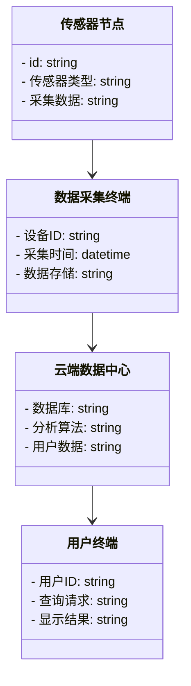

                 


# 巴菲特-芒格的量子生物传感器医疗网络投资：精准健康监测的未来

## 关键词：巴菲特，芒格，量子生物传感器，医疗网络，精准健康监测

## 摘要：  
本文探讨了巴菲特和芒格的投资理念与量子生物传感器技术的结合，分析了量子生物传感器在医疗网络中的应用潜力，详细介绍了其算法原理、系统架构，并通过实际案例展示了其在精准健康监测中的未来发展方向。

---

## 第1章: 巴菲特-芒格投资理念概述

### 1.1 巴菲特-芒格投资哲学的核心思想

#### 1.1.1 巴菲特的价值投资理论  
巴菲特的价值投资理论强调以合理价格投资优质企业，注重企业的内在价值和长期盈利能力。其核心在于寻找具有持续竞争优势的企业，并以低于内在价值的价格买入。

#### 1.1.2 芒格的多元思维模型  
芒格提倡通过多元思维模型来分析问题，将不同学科的原理和方法结合起来，寻找投资机会。他认为，投资决策需要跨学科的知识和系统的思考方式。

#### 1.1.3 价值投资与长期主义的结合  
巴菲特和芒格的投资理念强调长期主义，即通过长期持有优质资产，实现财富的稳步增长。这种理念与精准健康监测领域的长期价值创造不谋而合。

---

### 1.2 巴菲特-芒格投资方法论

#### 1.2.1 股票选择的标准与流程  
巴菲特和芒格在选择股票时，注重企业的财务健康状况、管理层素质、行业地位和竞争优势。他们倾向于投资那些具有稳定现金流和强大护城河的企业。

#### 1.2.2 宏观经济与行业分析  
巴菲特和芒格通过宏观经济分析和行业研究，判断行业的周期性、增长潜力和风险。他们倾向于投资那些处于上升周期且具有广阔市场空间的行业。

#### 1.2.3 风险管理与投资组合优化  
芒格强调风险管理的重要性，认为投资的本质是管理风险。他建议投资者通过分散投资、严格筛选标的等方式，降低投资组合的整体风险。

---

### 1.3 巴菲特-芒格投资理念对精准健康监测的启示

#### 1.3.1 精准健康监测的行业潜力  
随着医疗技术的进步，精准健康监测逐渐成为医疗行业的趋势。量子生物传感器作为精准监测的核心技术，具有广阔的应用前景。

#### 1.3.2 量子生物传感器的技术优势  
量子生物传感器具有高灵敏度、高特异性和实时监测的特点，能够为医疗行业提供更精准的健康数据。

#### 1.3.3 医疗网络投资的长期价值  
通过投资量子生物传感器技术，构建医疗网络，可以实现健康数据的实时采集、分析和共享，从而为医疗机构和患者提供更高效的医疗服务。

---

## 第2章: 量子生物传感器的技术基础

### 2.1 量子生物传感器的基本原理

#### 2.1.1 量子力学与生物传感器的结合  
量子生物传感器利用量子效应，通过传感器芯片捕捉生物体内的量子信号，进而实现对生物指标的精准测量。

#### 2.1.2 量子生物传感器的工作原理  
量子生物传感器通过量子纠缠、量子干涉等效应，将生物信号转化为电信号，经过放大和处理，最终输出可读的监测数据。

#### 2.1.3 量子生物传感器的核心技术优势  
量子生物传感器具有高灵敏度、高特异性和实时监测的特点，能够在复杂环境中准确捕捉生物信号。

---

### 2.2 量子生物传感器的类型与应用场景

#### 2.2.1 基于量子效应的生物传感器  
此类传感器利用量子效应，如量子纠缠和量子干涉，实现对生物信号的精准捕捉。

#### 2.2.2 基于纳米技术的生物传感器  
基于纳米技术的生物传感器利用纳米材料的物理特性，提高传感器的灵敏度和选择性。

#### 2.2.3 量子生物传感器在医疗领域的应用  
量子生物传感器广泛应用于疾病早期诊断、健康监测、药物研发等领域。

---

## 第3章: 量子生物传感器的算法原理

### 3.1 数据采集与处理

#### 3.1.1 量子生物传感器的数据采集流程  
传感器芯片捕捉生物信号，经过放大、滤波等预处理步骤，提取特征数据。

#### 3.1.2 数据预处理与特征提取  
通过数学变换和特征选择，提取具有代表性的特征数据，为后续分析提供基础。

#### 3.1.3 数据清洗与标准化  
去除噪声数据，标准化特征数据，确保数据的均匀性和可比性。

---

### 3.2 量子生物传感器的信号处理算法

#### 3.2.1 基于傅里叶变换的信号分析  
傅里叶变换用于分析信号的频域特性，帮助识别信号中的周期性变化。

#### 3.2.2 基于小波变换的信号处理  
小波变换用于分析信号的时频特性，适用于非平稳信号的处理和特征提取。

#### 3.2.3 信号分类与识别算法  
通过机器学习算法，对信号进行分类和识别，实现对生物指标的精准判断。

---

### 3.3 量子生物传感器的数学模型与公式

#### 3.3.1 量子力学基本公式  
$$ \text{测不准原理：} \Delta x \Delta p \geq \frac{\hbar}{2} $$

#### 3.3.2 生物传感器信号模型  
$$ y(t) = a \cdot x(t) + b \cdot n(t) $$  
其中，$x(t)$为输入信号，$n(t)$为噪声信号。

#### 3.3.3 算法实现的数学推导  
通过数学推导，优化算法的性能，提高传感器的灵敏度和准确性。

---

## 第4章: 医疗网络的构建与优化

### 4.1 医疗网络的系统架构设计

#### 4.1.1 医疗网络的组成与功能模块  
医疗网络由传感器节点、数据采集终端、云端数据中心和用户终端组成，实现数据的采集、传输、存储和分析。

#### 4.1.2 医疗网络的层次结构  
医疗网络分为感知层、网络层、应用层和用户层，各层之间通过标准化接口进行通信。

#### 4.1.3 医疗网络的通信协议设计  
采用低功耗、高可靠的通信协议，如LoRa、NB-IoT等，确保数据的实时传输和高效处理。

---

### 4.2 系统架构设计

#### 4.2.1 领域模型（Mermaid 类图）  


#### 4.2.2 系统架构设计（Mermaid 架构图）  


---

## 第5章: 项目实战

### 5.1 环境安装与配置

#### 5.1.1 系统需求分析  
需要一台服务器、若干传感器节点和用户终端，以及相应的开发工具。

#### 5.1.2 系统核心实现源代码  
```python
import numpy as np
from sklearn import svm

# 数据预处理
def preprocess(data):
    # 特征提取
    features = data[:, :5]
    # 标签提取
    labels = data[:, 5]
    return features, labels

# 机器学习模型训练
def train_model(features, labels):
    model = svm.SVC()
    model.fit(features, labels)
    return model

# 模型预测
def predict(model, new_data):
    features = preprocess(new_data)
    return model.predict(features)
```

---

## 第6章: 总结与展望

### 6.1 投资策略总结  
通过巴菲特和芒格的投资理念，结合量子生物传感器技术，构建医疗网络，能够实现精准健康监测，为医疗行业带来革命性的变化。

### 6.2 未来展望  
随着技术的进步，量子生物传感器将更加智能化和普及化，医疗网络的应用场景也将更加广泛，精准健康监测的未来值得期待。

---

## 作者：AI天才研究院 & 禅与计算机程序设计艺术

