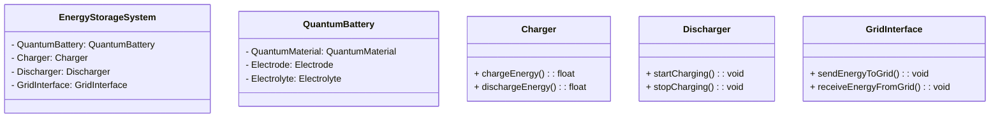

                 


# 巴菲特-芒格的量子电池技术投资：能源存储的革命

> **关键词**：巴菲特，芒格，量子电池技术，能源存储，投资策略，技术革命

> **摘要**：本文深入探讨了巴菲特和芒格在量子电池技术投资领域的策略，分析了量子电池技术的核心原理、优势及其对能源存储革命的推动作用。文章结合了两位投资大师的投资哲学，详细解析了量子电池技术的投资机会与风险，并通过实际案例分析，展示了如何将这一技术应用于现实场景中。文章最后总结了量子电池技术的未来发展方向，为投资者和科技爱好者提供了深刻的见解。

---

## 第1章：量子电池技术投资的背景与重要性

### 1.1 能源存储的重要性与现状

#### 1.1.1 全球能源需求的增长

能源需求的持续增长是全球面临的重大挑战。随着经济的发展和人口的增长，全球对能源的需求逐年增加。传统能源如煤炭、石油的使用虽短期内难以替代，但其不可再生性和对环境的破坏使得寻找新的能源解决方案变得尤为重要。

#### 1.1.2 可再生能源的发展与能源存储的必要性

可再生能源（如风能、太阳能）的快速发展为能源结构的优化提供了可能。然而，这些能源具有间歇性特点，无法稳定持续地提供能量。这就要求必须有高效的储能技术来平衡能源供应，确保电网的稳定性。

#### 1.1.3 能源存储技术对能源转型的推动作用

能源存储技术是实现能源转型的关键。它不仅能够解决可再生能源的不稳定问题，还能提高能源利用效率，减少浪费。通过有效的能源存储，可以实现能源的智能化调配，推动从化石能源向清洁能源的转变。

---

### 1.2 传统电池技术的局限性

#### 1.2.1 传统电池的技术瓶颈

传统电池技术，如铅酸电池和锂离子电池，在能量密度、充放电速度、循环寿命等方面存在明显局限。这些限制使得传统电池难以满足现代能源存储系统的需求。

#### 1.2.2 传统电池在能源存储中的不足

传统电池技术在大规模储能应用中表现不佳。例如，锂离子电池的高成本和对稀有金属的依赖限制了其广泛应用。此外，传统电池的循环寿命较短，难以应对可再生能源发电波动带来的频繁充放电需求。

#### 1.2.3 新能源存储技术的需求

随着可再生能源的广泛应用，对高效、稳定、低成本的新能源存储技术的需求日益迫切。传统电池技术的不足凸显了开发新型储能技术的必要性。

---

### 1.3 量子电池技术的出现

#### 1.3.1 量子电池技术的定义

量子电池技术是一种基于量子效应的新型电池技术，利用量子力学原理来提升电池的能量存储和释放效率。与传统电池相比，量子电池具有更高的能量密度和更快的充放电速度。

#### 1.3.2 量子电池技术的核心优势

量子电池技术的核心优势在于其高效的能量转换效率和快速的充放电能力。此外，量子电池还具有较长的循环寿命和更高的稳定性，能够在各种环境下稳定工作。

#### 1.3.3 量子电池技术对能源存储的革命性影响

量子电池技术的出现，标志着能源存储技术的重大突破。它不仅能够显著提高储能效率，还能降低储能成本，为可再生能源的大规模应用提供了可能。

---

## 第2章：巴菲特与芒格的投资哲学

### 2.1 巴菲特的投资理念

#### 2.1.1 巴菲特的价值投资理论

巴菲特的价值投资理论强调长期投资和基本面分析。他认为，投资者应选择那些具有强大基本面和良好管理的公司进行投资，并耐心持有，等待其内在价值的实现。

#### 2.1.2 长期投资与企业基本面分析

巴菲特的长期投资策略基于对企业基本面的深入分析。他认为，只有那些具有强大竞争优势和持续盈利能力的企业，才能为投资者带来长期的超额收益。

#### 2.1.3 巴菲特对科技创新企业的投资策略

尽管巴菲特以投资传统行业著称，但他也意识到科技创新对企业未来发展的巨大影响。他倾向于投资那些在技术创新方面具有领先地位的企业，并关注其市场地位和盈利能力。

---

### 2.2 芒格的多元思维模型

#### 2.2.1 芒格的多元思维模型概述

芒格的多元思维模型强调从多个学科的角度分析问题，通过跨学科的综合思考，找到解决问题的最佳方案。他认为，只有将不同领域的知识结合起来，才能做出更明智的决策。

#### 2.2.2 芒格的决策框架与投资哲学

芒格的决策框架注重长期价值和风险管理。他主张通过分散投资和严格的风险控制来降低投资组合的波动性，同时寻找那些具有持续竞争优势的企业进行投资。

#### 2.2.3 芒格对科技创新企业的独特见解

芒格认为，科技创新是推动社会进步的重要动力。他倾向于投资那些能够通过技术创新实现持续增长的企业，并关注其技术的可行性和市场潜力。

---

### 2.3 巴菲特与芒格合作的投资案例

#### 2.3.1 巴菲特与芒格的经典投资案例分析

巴菲特和芒格的经典投资案例包括可口可乐、富国银行等。这些案例的成功在于他们对企业发展前景的准确判断和长期投资策略的坚持。

#### 2.3.2 量子电池技术领域的投资策略

在量子电池技术领域，巴菲特和芒格的投资策略注重企业的技术创新能力和市场潜力。他们倾向于投资那些具有领先技术优势和强大研发能力的企业。

#### 2.3.3 巴菲特与芒格在新能源领域的布局

巴菲特和芒格在新能源领域的布局主要集中在太阳能、风能等可再生能源以及储能技术的研发和应用。他们通过投资相关企业和技术，推动新能源产业的快速发展。

---

## 第3章：量子电池技术的核心原理

### 3.1 量子电池的基本结构

#### 3.1.1 量子电池的组成与工作原理

量子电池的基本结构包括量子材料、电极、电解质等部分。其工作原理基于量子效应，通过量子态的变化实现能量的存储和释放。

#### 3.1.2 量子效应在电池性能提升中的应用

量子效应在电池性能提升中的应用主要体现在能量密度和充放电速度的提升。量子材料的特殊性质使得电池能够在更短时间内存储和释放更多能量。

#### 3.1.3 量子电池的能量存储机制

量子电池的能量存储机制基于量子材料的特殊性质。通过量子态的变化，能量可以以更高效的方式存储和释放，从而提高电池的整体性能。

---

### 3.2 量子电池的技术优势

#### 3.2.1 高能量密度与快速充放电能力

量子电池具有高能量密度和快速充放电能力。这意味着它可以在更短的时间内存储和释放更多的能量，适用于各种高功率需求的场景。

#### 3.2.2 长循环寿命与稳定性

量子电池的长循环寿命和高稳定性使其在实际应用中具有显著优势。无论是在频繁充放电的情况下，还是在极端环境下，量子电池都能保持高效的性能。

#### 3.2.3 量子电池在不同环境条件下的表现

量子电池在不同环境条件下的表现优异。它可以在高温、低温、高湿度等恶劣环境下稳定工作，适用于各种复杂的应用场景。

---

### 3.3 量子电池的技术挑战与解决方案

#### 3.3.1 当前技术瓶颈与研究难点

尽管量子电池技术具有诸多优势，但其在实际应用中仍面临一些技术瓶颈。例如，量子材料的稳定性、制造成本高等问题。

#### 3.3.2 科研界与产业界的协同创新

为了克服技术挑战，科研界和产业界需要加强合作，共同推动量子电池技术的进一步发展。通过协同创新，可以加快技术突破并降低研发成本。

#### 3.3.3 未来技术突破的方向与可能性

未来，量子电池技术的发展方向可能包括新材料的开发、制造工艺的优化以及能量转换效率的提升。这些技术突破将推动量子电池技术的广泛应用。

---

## 第4章：量子电池技术的投资机会与风险

### 4.1 新能源市场的投资机遇

#### 4.1.1 全球新能源市场的增长趋势

随着全球能源需求的增长和环保意识的增强，新能源市场正呈现快速增长趋势。特别是在可再生能源和储能技术领域，投资机遇巨大。

#### 4.1.2 量子电池技术的市场前景

量子电池技术的市场前景广阔。随着技术的成熟和成本的降低，其在能源存储领域的应用将越来越广泛。

#### 4.1.3 量子电池技术的商业化潜力

量子电池技术的商业化潜力巨大。它不仅可以应用于可再生能源储能，还可以在电动汽车、智能电网等领域发挥重要作用。

---

### 4.2 投资量子电池技术的风险分析

#### 4.2.1 技术风险

量子电池技术仍处于发展阶段，存在技术不成熟和不稳定的风险。投资者需要充分评估技术的可行性和成熟度。

#### 4.2.2 市场风险

新能源市场的竞争激烈，量子电池技术的商业化应用可能面临市场风险。投资者需要关注市场动态和竞争格局，制定合理的投资策略。

#### 4.2.3 经济风险

经济波动和政策变化也可能对量子电池技术的投资产生影响。投资者需要关注宏观经济环境和政策变化，做好风险管理工作。

---

### 4.3 投资策略与风险管理

#### 4.3.1 长期投资与价值投资

巴菲特和芒格的投资策略强调长期投资和价值投资。在量子电池技术领域，投资者应选择那些具有强大技术优势和良好市场前景的企业进行投资。

#### 4.3.2 分散投资与风险控制

通过分散投资和严格的风险控制，投资者可以降低投资组合的整体风险。在量子电池技术领域，投资者应关注企业的技术研发能力和市场竞争力。

#### 4.3.3 技术创新与市场拓展

投资者应关注企业的技术创新能力和市场拓展能力。选择那些在技术研发和市场拓展方面具有领先地位的企业进行投资。

---

## 第5章：量子电池技术的系统分析与架构设计

### 5.1 问题场景介绍

#### 5.1.1 当前能源存储系统的挑战

当前能源存储系统面临能量密度低、充放电速度慢、循环寿命短等挑战。这些问题限制了可再生能源的广泛应用。

#### 5.1.2 量子电池技术的应用场景

量子电池技术可以在多种场景中应用，如可再生能源储能、电动汽车电池、智能电网等。其高效能和高稳定性使其在这些领域具有显著优势。

#### 5.1.3 系统功能需求

能源存储系统需要具备高效能、高稳定性、快速响应等功能需求。量子电池技术的应用可以显著提升系统的整体性能。

---

### 5.2 系统功能设计

#### 5.2.1 领域模型mermaid类图



#### 5.2.2 系统架构设计


---

### 5.3 项目实战

#### 5.3.1 环境安装

为了实现量子电池技术的系统架构，需要以下环境：

- 量子电池组件（包括量子材料、电极、电解质）
- 充放电管理系统
- 电网接口设备

#### 5.3.2 系统核心实现源代码

```python
class QuantumBattery:
    def __init__(self):
        self.quantum_material = "QuantumMaterial"
        self.electrode = "Electrode"
        self.electrolyte = "Electrolyte"

    def charge(self):
        return "Charging energy using quantum effects."

    def discharge(self):
        return "Discharging energy with high efficiency."

class Charger:
    def __init__(self):
        self.battery = QuantumBattery()

    def charge_energy(self):
        return self.battery.charge()

class Discharger:
    def __init__(self):
        self.battery = QuantumBattery()

    def discharge_energy(self):
        return self.battery.discharge()
```

#### 5.3.3 代码应用解读与分析

上述代码展示了量子电池技术的核心实现。`QuantumBattery`类定义了电池的基本结构和充放电方法。`Charger`和`Discharger`类分别实现了充放电管理功能。通过这些类的协同工作，可以实现能量的高效存储和释放。

---

### 5.4 实际案例分析

#### 5.4.1 案例背景

假设某公司开发了一种新型量子电池技术，旨在提高可再生能源的储能效率。该技术采用了先进的量子材料和优化的电池结构，具有高能量密度和快速充放电能力。

#### 5.4.2 系统实施过程

1. **技术研发阶段**：公司投入大量资源进行量子材料和电池结构的研究，成功开发出具有高能量密度的量子电池。
2. **系统集成阶段**：将量子电池集成到可再生能源储能系统中，进行系统优化和性能测试。
3. **市场推广阶段**：通过市场推广和客户反馈，进一步优化产品，扩大市场份额。

#### 5.4.3 问题与解决方案

- **技术问题**：量子材料的稳定性问题。解决方案：通过优化材料配方和改进制造工艺，提高量子材料的稳定性。
- **成本问题**：量子电池的制造成本较高。解决方案：通过规模生产和技术改进，降低制造成本。

---

## 第6章：总结与展望

### 6.1 本章总结

量子电池技术作为能源存储领域的一项革命性技术，具有广阔的应用前景。巴菲特和芒格的投资策略为量子电池技术的商业化提供了重要的资金支持和技术指导。通过技术创新和市场推广，量子电池技术有望在未来能源存储领域发挥重要作用。

---

### 6.2 未来展望

随着技术的进一步发展，量子电池技术将在更多领域得到应用。未来，随着新材料和新技术的不断涌现，量子电池技术的性能将不断提升，成本将逐步降低，为可再生能源的广泛应用奠定坚实基础。

---

## 作者：AI天才研究院/AI Genius Institute & 禅与计算机程序设计艺术/Zen And The Art of Computer Programming

---

感谢您的阅读！如需进一步了解量子电池技术及其投资机会，请关注AI天才研究院的后续报道。

