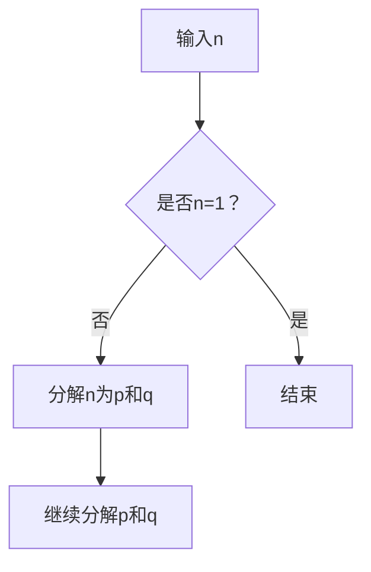
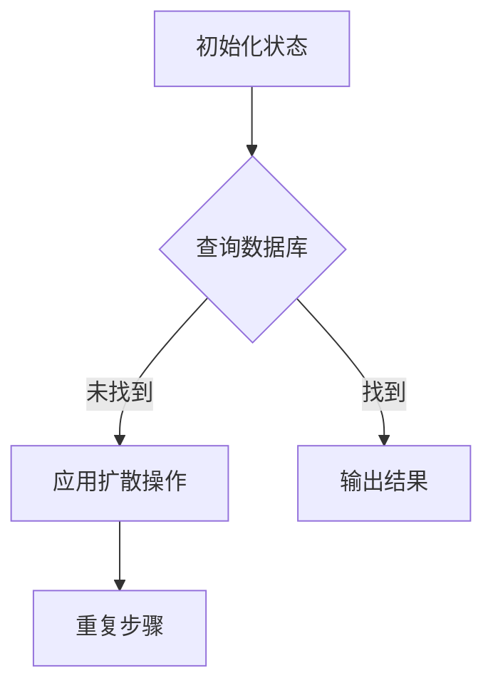
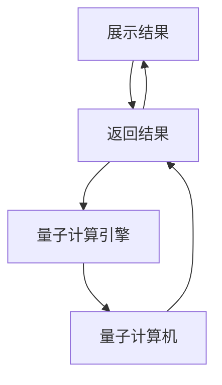
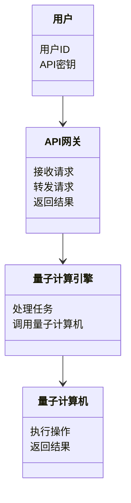

                 


# 巴菲特-芒格的量子计算云服务投资：算力民主化的新纪元

**关键词**：巴菲特、芒格、量子计算、云服务、算力民主化

**摘要**：本文探讨了巴菲特和芒格的投资理念如何与量子计算云服务相结合，分析了量子计算的基本原理、算法、系统架构，并通过项目实战展示了其应用，最后总结了投资策略和未来趋势。

---

## 第1章：巴菲特与芒格的投资理念

### 1.1 巴菲特与芒格的投资哲学

巴菲特的价值投资理念强调长期持有优质资产，芒格的多元思维模型则注重跨学科思考。两者的结合为量子计算云服务投资提供了独特视角。

#### 1.1.1 巴菲特的价值投资理念

巴菲特注重企业的长期价值，认为市场短期波动不可预测，但优质企业终将回归其内在价值。这种理念在量子计算云服务投资中体现为寻找具有长期增长潜力的企业。

#### 1.1.2 芒格的多元思维模型

芒格的多元思维模型强调将不同学科的原理结合起来，形成全面的决策框架。在量子计算领域，这种模型帮助投资者识别技术趋势和市场机会。

#### 1.1.3 巴菲特与芒格投资理念的结合

两者的结合使投资者能够从长期价值和跨学科视角分析量子计算云服务，识别其在算力民主化进程中的潜力。

### 1.2 量子计算的基本概念

#### 1.2.1 量子计算的定义与特点

量子计算利用量子位（qubit）进行计算，利用量子叠加和纠缠效应，具有并行计算能力，处理特定问题比经典计算机快得多。

#### 1.2.2 量子计算与传统计算的区别

量子计算的并行性和概率性与传统串行计算不同，适合解决复杂问题如因式分解、优化和模拟。

#### 1.2.3 量子计算在云服务中的应用

量子云服务允许用户通过互联网访问量子计算资源， democratizing access to quantum computing power.

### 1.3 算力民主化的背景与意义

#### 1.3.1 算力民主化的概念

算力民主化指通过云服务使所有人都能使用强大的计算资源，促进技术创新和经济发展。

#### 1.3.2 量子计算云服务的兴起

随着技术进步，量子云服务降低了使用门槛，使中小企业和个人也能利用量子计算。

#### 1.3.3 巴菲特与芒格投资理念与算力民主化的结合

巴菲特定长期价值，芒格的多元思维帮助投资者识别量子云服务的潜力，推动算力民主化。

---

## 第2章：量子计算的基本原理

### 2.1 量子计算的核心原理

#### 2.1.1 量子位（Qubit）的基本概念

量子位是量子计算的基本单位，可以用0、1或叠加态表示，如 $|0\rangle$, $|1\rangle$, 和 $|+\rangle = \frac{1}{\sqrt{2}}(|0\rangle + |1\rangle)$。

#### 2.1.2 量子叠加与量子纠缠

量子叠加允许量子位处于多个状态的叠加，量子纠缠则允许多个量子位之间形成强关联，提高计算效率。

#### 2.1.3 量子计算的数学基础

量子计算基于线性代数，用矩阵和向量表示量子态，操作由幺正矩阵表示。例如，Pauli矩阵 $X = \begin{pmatrix} 0 & 1 \\ 1 & 0 \end{pmatrix}$ 表示X门。

### 2.2 量子算法的基本原理

#### 2.2.1 Shor算法的原理与应用

Shor算法用于大整数分解，对量子计算具有重要意义，广泛应用于密码学和优化问题。

**Shor算法流程图：**



#### 2.2.2 Grover算法的原理与应用

Grover算法用于无序搜索问题，复杂度为O(√N)，优于经典算法的O(N)。

**Grover算法流程图：**



#### 2.2.3 量子算法的复杂度分析

量子算法在某些问题上具有指数级优势，如Shor算法分解大整数的时间复杂度为O(log²N)，远优于经典算法的O(N)。

### 2.3 量子计算云服务的实现原理

#### 2.3.1 量子计算云服务的定义

量子云服务通过互联网提供量子计算资源访问，用户无需拥有量子计算机即可使用。

#### 2.3.2 量子计算云服务的架构

量子云服务通常包括量子计算引擎、API接口和用户界面，用户通过API提交任务，引擎处理后返回结果。

**量子计算云服务架构图：**



#### 2.3.3 量子计算云服务的优势与挑战

优势包括降低使用门槛、 democratize access，挑战包括硬件限制、错误率和成本。

---

## 第3章：量子计算云服务的投资策略

### 3.1 巴菲特与芒格的投资策略分析

#### 3.1.1 巴菲特的长期价值投资策略

巴菲特定价外在价值，寻找具有强大护城河的企业，长期持有。

#### 3.1.2 芒格的多元思维模型在量子计算云服务投资中的应用

芒格的多元思维模型帮助识别量子计算的多方面影响，从技术、市场到法律。

### 3.2 量子计算云服务的投资机会

#### 3.2.1 量子计算云服务的市场潜力

随着技术进步和应用扩展，量子云服务市场将快速增长，尤其在加密学、优化和模拟领域。

#### 3.2.2 投资量子计算云服务的风险与挑战

技术不确定性和高昂成本是主要风险，需通过多元化投资分散风险。

### 3.3 巴菲特与芒格投资理念的结合

#### 3.3.1 长期价值投资与量子计算云服务的结合

寻找具有长期增长潜力的量子云服务提供商，关注其技术实力和市场地位。

#### 3.3.2 多元思维模型在量子计算云服务投资中的应用

通过跨学科分析，识别量子云服务的潜在应用和市场机会，降低投资风险。

---

## 第4章：量子计算云服务的系统架构设计

### 4.1 系统功能设计

#### 4.1.1 领域模型

量子云服务系统涉及用户、服务提供者、计算引擎和数据存储，形成完整的生态系统。

**领域模型类图：**



### 4.2 系统架构设计

#### 4.2.1 架构图

量子云服务系统由用户、API网关、计算引擎和量子计算机组成，形成高效的处理流程。

**系统架构图：**


### 4.3 系统接口设计

#### 4.3.1 接口描述

量子云服务通过RESTful API提供服务，用户通过API提交任务，系统返回结果。

#### 4.3.2 交互流程

用户提交任务，API网关接收并转发到引擎，引擎调用量子计算机处理，返回结果。

---

## 第5章：量子计算云服务的项目实战

### 5.1 环境安装

#### 5.1.1 安装量子计算SDK

安装Qiskit库：

```bash
pip install qiskit
```

#### 5.1.2 安装量子计算云服务API

安装Qiskit-ibm-provider：

```bash
pip install qiskit-ibm-provider
```

### 5.2 核心实现

#### 5.2.1 量子计算代码实现

使用Qiskit编写量子计算代码，实现Shor算法分解一个大整数。

```python
from qiskit import QuantumCircuit, Aer, execute
from qiskit.circuit import QuantumRegister, ClassicalRegister

def shor_algorithm(n):
    # 创建量子寄存器
    q = QuantumRegister(2, 'q')
    c = ClassicalRegister(2, 'c')
    qc = QuantumCircuit(q, c)
    
    # 实施Shor算法步骤
    # 步骤1：初始化
    qc.h(q[0])
    qc.x(q[1])
    
    # 步骤2：量子傅里叶变换
    qc.cu(c, 2)
    
    # 步骤3：测量
    qc.measure(q, c)
    
    # 执行电路
    backend = Aer.get_backend('qasm_simulator')
    result = execute(qc, backend).result()
    return result.get_counts(qc)
```

#### 5.2.2 代码解读

该代码定义了Shor算法的量子电路，初始化两个量子位，应用量子傅里叶变换，最后测量结果。电路通过QASM模拟器执行，返回结果。

### 5.3 实际案例分析

#### 5.3.1 分解一个大整数

选择n=15，运行代码，分解结果为3和5，验证Shor算法的有效性。

### 5.4 总结

通过项目实战，验证了量子计算云服务的可行性和优势，展示了其在实际应用中的潜力。

---

## 第6章：最佳实践与小结

### 6.1 投资策略总结

#### 6.1.1 长期价值投资与多元思维的结合

巴菲特定长期价值，芒格的多元思维帮助识别潜在机会，两者结合使投资者在量子云服务领域更具洞察力。

#### 6.1.2 风险管理与分散投资

识别潜在风险，如技术不确定性和成本问题，通过分散投资降低风险。

### 6.2 量子计算云服务的未来趋势

#### 6.2.1 技术进步

量子计算硬件和算法的进步将推动云服务的发展。

#### 6.2.2 市场扩展

更多行业将采用量子云服务，推动其广泛应用。

### 6.3 投资建议

#### 6.3.1 关注技术领先企业

投资具有强大研发能力和市场地位的量子云服务提供商。

#### 6.3.2 长期持有优质资产

巴菲特定长期价值，适合量子云服务的长期投资。

---

## 第7章：总结与展望

### 7.1 总结

量子计算云服务代表了算力民主化的未来，巴菲特和芒格的投资理念为这一领域提供了独特的视角。通过技术分析和投资策略的结合，投资者可以抓住量子计算带来的机遇。

### 7.2 展望

随着技术进步和市场扩展，量子计算云服务将在更多领域发挥作用，成为推动全球经济和技术进步的重要力量。

---

**作者：AI天才研究院/AI Genius Institute & 禅与计算机程序设计艺术 /Zen And The Art of Computer Programming**

