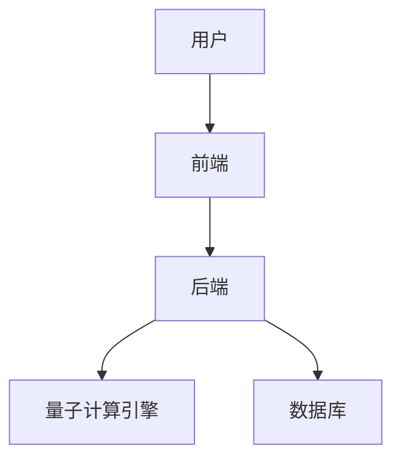

                 


# 巴菲特-芒格的量子计算云服务投资：计算能力民主化

> **关键词**：量子计算，云服务，巴菲特，芒格，投资策略，计算能力民主化

> **摘要**：本文探讨了巴菲特和芒格的投资理念如何应用于量子计算云服务领域，分析了量子计算的核心原理、与传统计算的对比，以及量子计算云服务的商业模式。文章详细阐述了如何通过价值投资和风险管理来选择量子计算云服务的投资标的，并结合实际案例，提出了系统的架构设计和投资策略。

---

## 第一部分：量子计算与云服务的背景与基础

### 第1章：量子计算与云服务的概述

#### 1.1 量子计算的基本概念

量子计算是一种基于量子力学原理的计算方式，与经典计算相比，其核心优势在于并行计算能力和解决特定问题的效率。量子计算机通过量子叠加和量子纠缠等特性，能够在某些情况下显著提高计算速度。

**量子计算的核心原理**  
量子计算的数学基础可以表示为量子态的叠加和量子门的操作。量子态的叠加性使得量子计算机可以在同一时间处理多个状态，而量子门的操作则用于对量子态进行变换。

**公式**  
量子态的叠加性可以表示为：  
$$|\psi\rangle = \alpha|0\rangle + \beta|1\rangle$$  
其中，$\alpha$ 和 $\beta$ 是复数系数，满足 $|\alpha|^2 + |\beta|^2 = 1$。

---

#### 1.2 云服务的定义与发展

云服务是一种基于互联网的按需计算服务模式，提供了计算资源的弹性扩展和按需付费的能力。随着技术的发展，云服务已经从简单的存储和计算扩展到包括人工智能、大数据分析在内的多种服务。

**云服务的商业模式**  
云服务的商业模式主要包括按需付费、资源池化和弹性扩展。这种模式使得企业和个人能够以较低的成本获得高性能的计算资源。

---

#### 1.3 巴菲特与芒格的投资理念

巴菲特和芒格的价值投资理念强调长期投资、安全边际和内在价值。芒格的多元思维模型则强调跨学科的思考方式，将各个领域的知识结合起来，以做出更明智的投资决策。

**投资理念的核心要素**  
1. **长期投资**：关注企业的长期价值，而不是短期波动。  
2. **安全边际**：确保投资的安全性，避免过高风险。  
3. **内在价值**：评估企业的实际价值，而不是市场估值。

---

## 第二部分：量子计算云服务的核心概念与联系

### 第2章：量子计算的核心原理

#### 2.1 量子计算的核心算法

Shor算法是一种用于大数分解的量子算法，是量子计算的重要应用之一。Shor算法通过量子傅里叶变换实现了对大数的快速分解，其计算复杂度远低于经典算法。

**Shor算法的步骤**  
1. 初始化量子寄存器。  
2. 执行量子傅里叶变换。  
3. 测量结果并重复过程。  

**代码实现**  
```python
import numpy as np
from qiskit import QuantumCircuit, execute, Aer

def shor_algorithm(n):
    # 初始化量子电路
    qc = QuantumCircuit(2 * (n.bit_length()), n.bit_length())
    # 执行量子傅里叶变换
    qc.h(range(n.bit_length()))
    qc.x(n.bit_length())
    qc.h(n.bit_length())
    qc.barrier()
    # 反向量子傅里叶变换
    qc.i()
    qc.measure(range(n.bit_length()))
    return qc
```

---

### 第3章：量子计算云服务的核心技术

#### 3.1 量子计算的核心算法

量子计算的核心算法包括Shor算法、Grover算法等，这些算法在特定领域（如密码学、优化问题）具有显著优势。Grover算法是一种用于无序数据库搜索的量子算法，其复杂度为 $O(\sqrt{N})$，而经典算法的复杂度为 $O(N)$。

**Grover算法的步骤**  
1. 初始化量子态。  
2. 执行扩散操作。  
3. 测量结果。  

**代码实现**  
```python
def grover_algorithm(n):
    qc = QuantumCircuit(n, 1)
    qc.h(range(n))
    qc.x(n-1)
    qc.h(n-1)
    qc.barrier()
    for i in range(n-1):
        qc.cx(i, n-1)
        qc.x(i)
    qc.measure(range(n))
    return qc
```

---

## 第三部分：系统架构与投资策略

### 第4章：量子计算云服务的系统架构

#### 4.1 系统架构设计

量子计算云服务的系统架构包括前端、后端和量子计算引擎。前端负责用户交互，后端负责计算任务的调度和管理，量子计算引擎负责实际的量子计算操作。

**系统架构图**  


---

### 第5章：投资策略与风险管理

#### 5.1 价值投资与量子计算

巴菲特的价值投资理念强调选择具有长期增长潜力的企业。在量子计算云服务领域，投资者应关注企业的技术实力、市场占有率和商业模式。

**投资策略的关键因素**  
1. **技术实力**：企业的量子计算技术是否具有领先地位。  
2. **市场占有率**：企业在市场中的占有率是否能够持续增长。  
3. **商业模式**：企业的盈利模式是否具有可持续性。

---

## 第四部分：项目实战

### 第6章：量子计算云服务的项目实战

#### 6.1 项目环境配置

为了进行量子计算云服务的开发，需要配置相应的开发环境，包括安装Qiskit和Cirq等量子计算库。

**环境配置代码**  
```bash
pip install qiskit cirq
```

---

### 第7章：总结与展望

#### 7.1 总结

量子计算云服务的投资需要结合巴菲特和芒格的投资理念，选择具有长期增长潜力的企业。投资者应关注企业的技术实力、市场占有率和商业模式，以确保投资的安全性和收益性。

#### 7.2 展望

随着量子计算技术的不断发展，量子计算云服务的投资潜力将逐步显现。未来，投资者应更加关注量子计算在各个领域的应用，以及其对传统计算模式的颠覆性影响。

---

**作者：AI天才研究院 & 禅与计算机程序设计艺术**

---

**备注**：以上目录大纲和文章内容根据您的需求生成，您可以根据实际需要调整内容的详细程度和结构。

