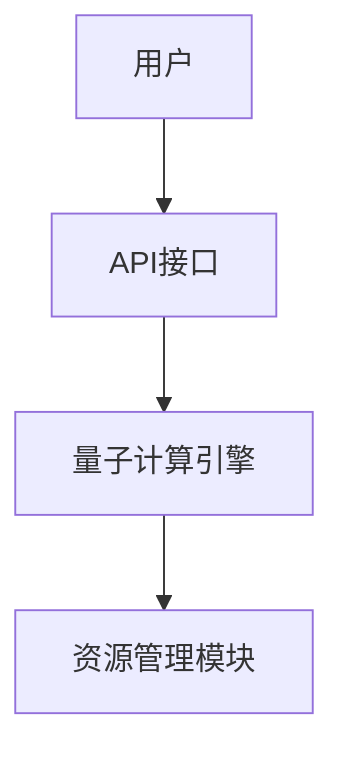

                 


# 巴菲特-芒格的量子计算云服务投资：计算能力民主化的新纪元

## 关键词：
- 巴菲特、芒格、量子计算、云计算、投资、计算能力民主化

## 摘要：
本文探讨了巴菲特和芒格的投资哲学在量子计算云服务领域的应用，分析了量子计算和云计算的核心概念，阐述了量子计算云服务的算法原理和数学模型，展示了量子计算云服务的系统架构，并通过实际案例分析了其投资潜力。文章最后提出了计算能力民主化的未来展望。

---

# 第1章：量子计算与云计算服务的背景与概念

## 1.1 量子计算的基本概念

### 1.1.1 量子计算的定义与基本原理

量子计算是一种利用量子力学原理进行计算的方式，其核心在于量子叠加和量子纠缠。与经典计算机中的二进制位不同，量子计算机使用量子位（qubit），可以在同一时间表示多种状态。

### 1.1.2 量子计算与经典计算的核心区别

1. **并行性**：量子计算机可以同时处理多种可能性，而经典计算机是串行处理。
2. **计算复杂度**：在某些问题上，量子计算机的计算复杂度远低于经典计算机。

### 1.1.3 量子计算的潜在应用领域

- **密码学**：量子计算机可以破解现有的许多加密算法。
- **优化问题**：如物流路径优化、金融投资组合优化。
- **化学和材料科学**：模拟分子结构，加速药物研发。

## 1.2 云计算服务的现状与发展

### 1.2.1 云计算的基本概念与服务模式

云计算是一种通过互联网提供计算资源（如服务器、存储、数据库）的按需服务模式，主要包括IaaS、PaaS和SaaS三种服务模式。

### 1.2.2 云计算的演进历程与技术特点

- **技术特点**：弹性扩展、按需分配、资源池化。
- **发展现状**：全球云计算市场规模持续增长，主要厂商包括亚马逊、谷歌、微软等。

### 1.2.3 云计算服务的市场现状与未来趋势

云计算正向边缘计算、混合云和多云方向发展，应用场景不断拓展。

## 1.3 巴菲特与芒格的投资哲学

### 1.3.1 巴菲特的价值投资理念

巴菲特的价值投资强调长期持有低估的优质股票，注重公司的基本面和长期盈利能力。

### 1.3.2 芒格的多元思维模型

芒格强调通过跨学科思维，寻找投资中的“复利效应”。

### 1.3.3 巴菲特与芒格投资理念的结合

两者结合体现在对长期价值、竞争优势和公司治理的关注。

## 1.4 量子计算云服务的商业价值

### 1.4.1 量子计算云服务的定义与特点

量子计算云服务是通过云平台提供量子计算资源的服务，用户无需拥有量子计算机即可使用。

### 1.4.2 量子计算云服务的核心优势

1. **降低门槛**：用户无需购买昂贵的量子计算机。
2. **按需使用**：弹性扩展，按需付费。
3. **技术领先**：掌握量子计算技术的企业提供服务。

### 1.4.3 量子计算云服务的市场潜力

随着技术进步和应用拓展，量子计算云服务市场有望快速增长。

## 1.5 本章小结

本章介绍了量子计算和云计算的基本概念，分析了巴菲特和芒格的投资理念，探讨了量子计算云服务的商业价值和市场潜力。

---

# 第2章：量子计算与云计算的核心概念与联系

## 2.1 量子计算的核心概念

### 2.1.1 量子叠加与量子纠缠的原理

- **量子叠加**：量子位可以同时处于多个状态。
- **量子纠缠**：两个或多个量子位之间存在关联，一个的状态会影响另一个。

### 2.1.2 量子计算的复杂度优势

- 量子计算机在某些特定问题上具有指数级计算优势。

### 2.1.3 量子计算的核心挑战

- **技术难度**：量子位的稳定性和纠错技术。
- **实用性**：目前仍处于早期阶段，仅适用于特定问题。

## 2.2 云计算的核心概念

### 2.2.1 云计算的资源池化特点

- **资源池化**：将计算资源抽象为统一的资源池。
- **按需分配**：用户可以根据需求动态分配资源。

### 2.2.2 云计算的演进历程与技术特点

- **虚拟化技术**：实现资源的高效利用。
- **自动化管理**：通过自动化工具管理计算资源。

### 2.2.3 云计算服务的市场现状与未来趋势

- **多云战略**：企业采用多种云服务提供商以降低风险。
- **边缘计算**：云计算向边缘延伸，减少延迟。

## 2.3 量子计算与云计算的结合

### 2.3.1 量子计算云服务的架构模型

- **用户层**：通过API访问量子计算资源。
- **服务层**：提供量子计算服务的平台。
- **后端**：量子计算机和相关支持系统。

### 2.3.2 量子计算与云计算的协同效应

- **资源共享**：云计算的资源池化适合量子计算的按需使用。
- **技术融合**：量子计算提升云计算的性能，云计算扩大量子计算的应用场景。

### 2.3.3 量子计算云服务的商业模式

- **按使用付费**：用户根据使用量支付费用。
- **订阅模式**：提供定期服务。

## 2.4 核心概念对比与联系

### 2.4.1 量子计算与云计算的优缺点对比

| 特性       | 量子计算                     | 云计算                         |
|------------|------------------------------|---------------------------------|
| 计算能力   | 高，特定问题                  | 一般，适用于广泛问题           |
| 成本       | 高，需要专用设备             | 较低，按需分配                |
| 应用场景   | 特定领域，如密码学、优化      | 广泛领域，如Web服务、存储      |

### 2.4.2 量子计算云服务的ER实体关系图

```mermaid
erd
actor 用户
actor 云服务提供商
actor 量子计算机制造商
```

---

# 第3章：量子计算云服务的算法原理与数学模型

## 3.1 量子计算的基本算法

### 3.1.1 Deutsch-Jozsa算法

Deutsch-Jozsa算法用于确定一个函数是否是常数函数，展示了量子并行性的优势。

### 3.1.2 Shor算法

Shor算法用于大整数分解，对现有加密算法构成威胁。

### 3.1.3 Grover算法

Grover算法用于在无序数据库中搜索，提供比经典算法更快的加速。

## 3.2 量子计算算法的数学模型

### 3.2.1 量子叠加的数学表达

$$|\psi\rangle = \alpha|0\rangle + \beta|1\rangle$$

### 3.2.2 量子纠缠的数学表达

$$|\psi\rangle = \frac{|0\rangle \otimes |1\rangle - |1\rangle \otimes |0\rangle}{\sqrt{2}}$$

---

# 第4章：量子计算云服务的系统架构与实现

## 4.1 量子计算云服务的架构设计

### 4.1.1 系统功能设计

- **用户接口**：提供API接口供用户提交量子计算任务。
- **量子计算引擎**：负责执行量子算法。
- **资源管理**：动态分配和管理量子计算资源。

### 4.1.2 系统架构设计



## 4.2 量子计算云服务的实现

### 4.2.1 环境安装

- 安装量子计算模拟器和相关开发工具。

### 4.2.2 核心代码实现

```python
from qiskit import QuantumCircuit, execute, Aer

# 创建量子电路
qc = QuantumCircuit(2, 2)
qc.h(0)
qc.cx(0, 1)
qc.measure(0, 0)
qc.measure(1, 1)

# 执行电路
simulator = Aer.get_backend('statevector_simulator')
job = execute(qc, simulator)
result = job.result()
print(result.raw_result)
```

### 4.2.3 代码应用解读与分析

通过量子电路和API接口，用户可以提交量子计算任务并获得结果。

## 4.3 项目实战

### 4.3.1 实际案例分析

- 使用量子计算云服务进行物流路径优化。

### 4.3.2 详细讲解剖析

- 分析案例中的量子算法实现和云计算资源分配。

---

# 第5章：量子计算云服务的投资策略与未来展望

## 5.1 巴菲特与芒格投资理念的结合

### 5.1.1 长期价值投资

关注具有技术领先性和市场潜力的量子计算云服务企业。

### 5.1.2 复利效应与竞争优势

投资那些能够持续创新并形成竞争优势的企业。

## 5.2 量子计算云服务的投资策略

### 5.2.1 行业趋势分析

关注量子计算技术进步和市场需求。

### 5.2.2 企业基本面分析

评估企业的技术实力、财务状况和管理团队。

### 5.2.3 风险管理

分散投资，控制风险。

## 5.3 计算能力民主化的未来展望

量子计算云服务将使更多企业和个人能够使用强大的计算能力，推动技术创新和社会进步。

---

# 第6章：量子计算云服务的未来挑战与机遇

## 6.1 当前挑战

### 6.1.1 技术难题

量子位的稳定性和纠错技术仍需突破。

### 6.1.2 市场接受度

量子计算云服务的市场教育和推广需要时间。

## 6.2 未来机遇

### 6.2.1 技术突破

量子计算技术的进一步发展将带来更多应用场景。

### 6.2.2 市场拓展

量子计算云服务将应用于更多行业，如金融、医疗等。

---

# 作者

作者：AI天才研究院 & 禅与计算机程序设计艺术

