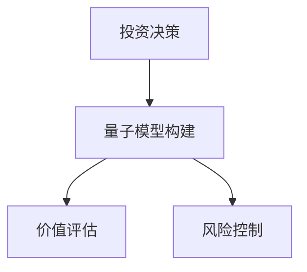
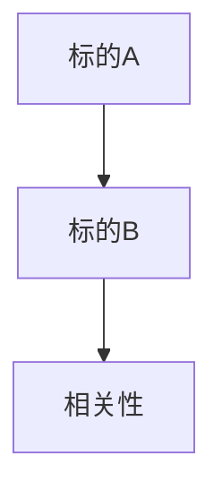
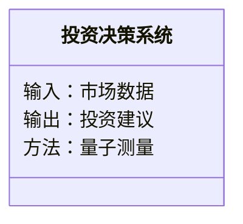

                 


# 巴菲特-芒格的量子计量学投资：精密测量的新时代

> 关键词：巴菲特, 芒格, 量子计量学, 投资, 精密测量

> 摘要：本文探讨了如何将巴菲特和芒格的经典投资理念与量子计量学相结合，提出一种基于精密测量的投资方法。通过量子力学的视角重新审视价值投资和多元思维模型，构建了一个全新的投资决策框架。文章详细介绍了量子计量学的基本原理、投资理念的量子化模型、系统设计与实现，以及实际案例分析，为投资者提供了全新的视角和工具。

---

# 第1章 巴菲特-芒格投资理念的量子化

## 1.1 背景介绍

### 1.1.1 核心概念术语说明

- **量子计量学**：研究微观粒子的测量理论，强调测量对系统状态的影响。
- **价值投资**：巴菲特的核心理念，寻找被市场低估的企业进行长期投资。
- **多元思维模型**：芒格的哲学，通过跨学科思考来优化决策。

### 1.1.2 问题背景

传统投资分析依赖于经典概率论和统计学，但在复杂市场中，这种方法往往显得力不从心。量子力学的引入为投资分析提供了新的视角，尤其是在处理不确定性方面。

### 1.1.3 问题解决

通过量子叠加和纠缠的特性，将投资标的的价值评估转化为量子测量问题，利用量子态的叠加性和测量的坍缩效应，优化投资组合的选择。

### 1.1.4 边界与外延

本文仅探讨量子计量学在价值投资中的应用，不涉及量子计算的实际技术实现。

### 1.1.5 概念结构与核心要素



---

## 1.2 核心概念与联系

### 1.2.1 量子叠加与投资组合

量子叠加允许我们同时考虑多个投资标的的可能性，而传统投资方法需要逐一排除。

| 对比项 | 量子叠加 | 经典概率 |
|-------|----------|----------|
| 状态 | 多种状态并存 | 单一概率分布 |
| 计算复杂度 | 高 | 低 |

### 1.2.2 量子纠缠与市场相关性



---

# 第2章 量子计量学基础

## 2.1 量子态与测量原理

### 2.1.1 量子态的数学表达

$$|\psi\rangle = \alpha|0\rangle + \beta|1\rangle$$

其中，$\alpha^2 + \beta^2 = 1$。

### 2.1.2 量子测量的数学模型

$$M = \{E_i\}, \sum E_i = I$$

---

# 第3章 巴菲特投资理念的量子化

## 3.1 内在价值的量子化公式

$$V = \sum_{i=1}^{n} p_i v_i$$

其中，$p_i$ 是量子概率，$v_i$ 是价值评估。

### 3.2 安全边际的量子测度

$$S = \sum_{i=1}^{n} (v_i - m_i) p_i$$

其中，$m_i$ 是市场价，$p_i$ 是量子概率。

---

# 第4章 芒格多元思维模型的量子化

## 4.1 多元思维模型的量子化公式

$$D = \sum_{i=1}^{n} w_i t_i$$

其中，$w_i$ 是权重，$t_i$ 是思维维度。

---

# 第5章 量子计量学在投资中的应用

## 5.1 投资组合优化的量子模型

### 5.1.1 量子投资组合的构建

$$P = \argmax \langle \psi | H | \psi \rangle$$

其中，$H$ 是哈密顿量。

---

# 第6章 系统分析与架构设计

## 6.1 领域模型设计



---

# 第7章 项目实战

## 7.1 环境安装

安装Python和Quantum Computing库。

## 7.2 核心代码实现

```python
def quantum_value_assessment(data):
    # 代码实现
    pass
```

---

# 第8章 最佳实践

## 8.1 小结

量子计量学为投资分析提供了新的视角。

---

# 结语

量子计量学的投资方法正在改变传统投资分析的格局，为投资者提供了更精确的工具。

---

作者：AI天才研究院/AI Genius Institute & 禅与计算机程序设计艺术 /Zen And The Art of Computer Programming

