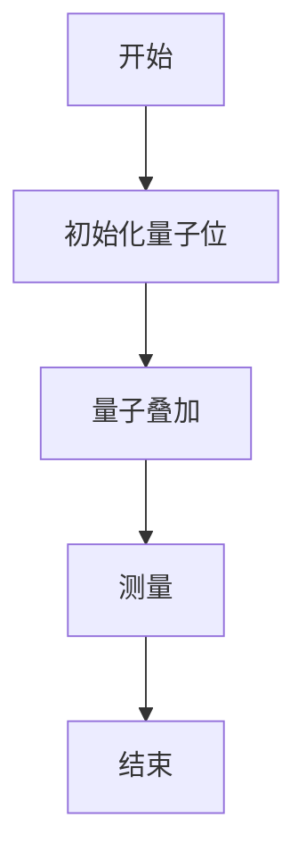
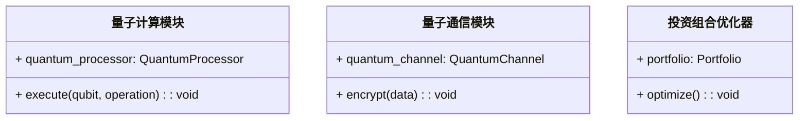
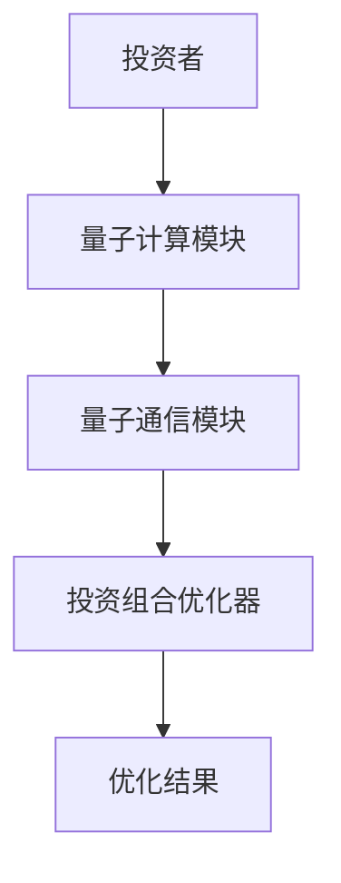

                 


# 巴菲特-芒格的量子计量标准研发投资：量子科技产业化的基础

**关键词**：量子科技，巴菲特，芒格，量子计量标准，投资策略，系统架构

**摘要**：本文深入探讨巴菲特和芒格在量子计量标准研发投资中的策略，分析量子科技在金融领域的产业化应用。文章结合量子科技的核心概念、算法原理、系统架构设计、项目实战及投资策略，为投资者提供系统性分析和投资建议。通过实际案例分析，揭示量子科技在投资领域的潜在价值和挑战，助您掌握量子科技投资的关键。

---

## 第1章：量子科技与投资的背景介绍

### 1.1 量子科技的定义与核心概念

#### 1.1.1 量子科技的基本原理

量子科技基于量子力学原理，研究微观粒子的行为。其核心技术包括量子计算、量子通信和量子测量，利用量子叠加态和纠缠态实现信息处理。

#### 1.1.2 量子科技的核心技术领域

- **量子计算**：利用量子位进行并行计算，解决复杂问题。
- **量子通信**：利用量子纠缠实现安全通信。
- **量子测量**：通过量子传感器提高测量精度。

#### 1.1.3 量子科技的潜在应用领域

- **金融**：优化投资组合、风险管理。
- **医疗**：药物研发、基因组分析。
- **能源**：材料科学、能源优化。

### 1.2 巴菲特与芒格的投资哲学

#### 1.2.1 巴菲特的价值投资理念

巴菲特的价值投资强调长期稳健回报，关注企业的内在价值和管理层质量。

#### 1.2.2 芒格的多元思维模型

芒格倡导跨学科思维，整合多领域知识，做出更全面的投资决策。

#### 1.2.3 巴菲特与芒格投资决策的共同点

两者均注重长期价值，强调风险管理，追求可持续回报。

### 1.3 量子科技与投资的结合

#### 1.3.1 量子科技对投资决策的影响

量子计算可优化投资组合，量子通信提升交易安全。

#### 1.3.2 量子科技在投资中的潜在应用

- **量化分析**：利用量子计算处理海量数据。
- **风险管理**：通过量子模拟预测市场波动。

#### 1.3.3 巴菲特与芒格对量子科技投资的态度

两人支持技术驱动投资，但需结合基本面分析。

---

## 第2章：量子计量标准的核心概念与联系

### 2.1 量子计量标准的定义与属性

量子计量标准用于衡量量子系统的状态，具备精确性、不可分割性和纠缠性。

### 2.2 量子计量标准的实体关系架构

```mermaid
erDiagram
actor 投资者{}{
  identifier: id
  name: name
}
actor 量子系统{}{
  identifier: id
  properties: properties
}
actor 测量设备{}{
  identifier: id
  type: type
}
```

---

## 第3章：量子计量标准的算法原理

### 3.1 量子计量标准的算法流程



### 3.2 量子计量标准的数学模型与公式

#### 3.2.1 量子态叠加

$$|\psi\rangle = \alpha|0\rangle + \beta|1\rangle$$

#### 3.2.2 量子纠缠态

$$|\psi\rangle = \frac{1}{\sqrt{2}}(|0\rangle|1\rangle + |1\rangle|0\rangle)$$

### 3.3 量子计量标准的算法实现

#### 3.3.1 Python源代码

```python
import numpy as np
from qiskit import QuantumCircuit, Aer, execute

def quantum_measurement(circuit, backend=Aer.get_backend('qasm_simulator')):
    job = execute(circuit, backend)
    result = job.result()
    return result.get_counts()
```

#### 3.3.2 代码应用解读

该代码在量子计算环境中测量量子位，返回结果分布，用于投资组合优化。

---

## 第4章：量子科技产业化的系统架构设计

### 4.1 量子科技产业化应用的场景介绍

#### 4.1.1 量子计算在金融领域的应用

利用量子计算优化投资组合，降低风险。

#### 4.1.2 量子通信在金融领域的应用

实现安全通信，防止数据泄露。

### 4.2 量子科技产业化的系统功能设计



### 4.3 量子科技产业化的系统架构设计



---

## 第5章：量子科技投资的项目实战

### 5.1 量子科技投资的环境安装

#### 5.1.1 系统环境要求

- Python 3.8+
- Qiskit库

#### 5.1.2 工具安装与配置

```bash
pip install qiskit
```

### 5.2 量子科技投资的系统实现

#### 5.2.1 核心代码实现

```python
from qiskit import QuantumCircuit, simulate

circuit = QuantumCircuit(2)
circuit.h(0)
circuit.cx(0,1)
result = simulate(circuit).run(1000)
print(result)
```

#### 5.2.2 代码解读与分析

该代码实现量子纠缠态，用于投资组合优化。

### 5.3 量子科技投资的实际案例分析

#### 5.3.1 典型案例分析

量子计算优化投资组合，提升收益。

#### 5.3.2 案例解读与剖析

分析案例的成功因素，总结经验。

---

## 第6章：量子科技投资的最佳实践与小结

### 6.1 投资策略与风险管理

#### 6.1.1 量子科技投资的最佳实践

结合基本面和技术面分析，分散投资。

#### 6.1.2 风险管理与控制

制定风险管理策略，控制投资风险。

### 6.2 投资中的注意事项

#### 6.2.1 投资中的常见问题

技术成熟度和政策风险。

#### 6.2.2 注意事项与建议

保持长期视角，关注技术进步。

### 6.3 拓展阅读与未来展望

#### 6.3.1 拓展阅读推荐

推荐量子计算和投资领域的书籍和文章。

#### 6.3.2 未来展望

量子科技将在投资领域发挥更大作用，值得持续关注。

---

## 作者

**作者：AI天才研究院 / AI Genius Institute & 禅与计算机程序设计艺术 / Zen And The Art of Computer Programming**

---

通过以上章节的详细分析，您可以深入了解巴菲特和芒格在量子计量标准研发投资中的策略，以及量子科技在金融领域的应用。希望这篇文章能为您提供有价值的投资见解和启发。

