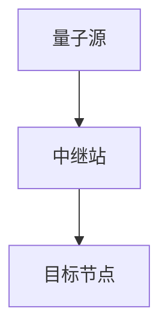
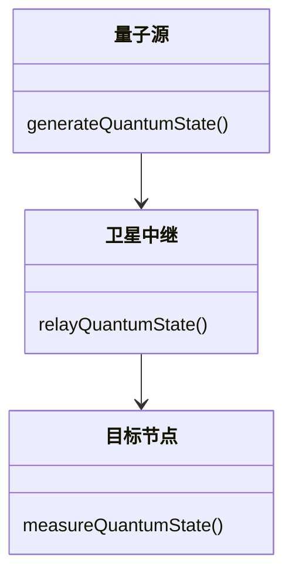
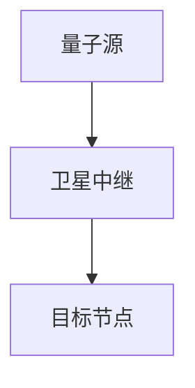
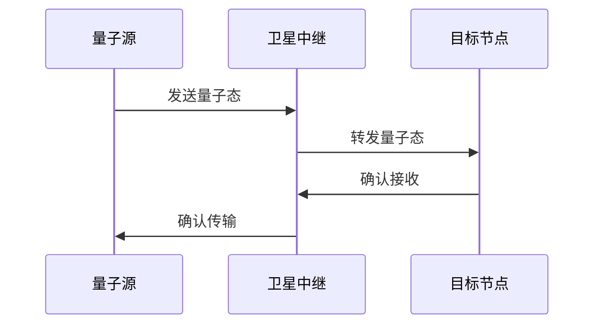

                 


# 巴菲特-芒格的量子通信卫星网络投资：全球量子互联网的基础

---

## 关键词：量子通信、量子互联网、巴菲特、芒格、卫星网络、投资策略、量子纠缠

---

## 摘要：  
本文深入分析了巴菲特和芒格在量子通信卫星网络领域的投资策略，探讨了量子通信的核心技术及其在全球量子互联网构建中的作用。通过结合投资哲学与技术创新，本文揭示了量子通信卫星网络的市场潜力、技术挑战及解决方案，并展望了其在未来全球量子互联网中的战略意义。

---

# 第一部分: 量子通信卫星网络的背景与重要性

## 第1章: 量子通信的基本概念

### 1.1 量子通信的定义与核心原理

量子通信是一种基于量子力学原理的通信技术，其核心在于利用量子态（如量子叠加态和量子纠缠态）进行信息传输。与经典通信不同，量子通信具有以下特点：

- **量子叠加态**：信息以$|0\rangle$和$|1\rangle$的叠加态形式存在，例如$\alpha|0\rangle + \beta|1\rangle$。
- **量子纠缠态**：两个或多个粒子之间形成纠缠，一个粒子的状态会立即影响另一个粒子的状态，无论距离多远。

量子通信的安全性基于量子态的不可克隆性和不可干扰性。任何试图窃听量子通信的行为都会破坏量子态，从而暴露窃听者的存在。

$$ \text{量子通信的数学模型：} \quad \text{Alice} \rightarrow \text{Bob} $$

### 1.2 巴菲特与芒格的投资理念

巴菲特和芒格的投资策略以“价值投资”和“多元思维模型”为核心：

- **价值投资**：寻找具有长期竞争优势和内在价值的企业，耐心持有，避免短期波动。
- **多元思维模型**：芒格强调将多个学科的知识结合起来，用“格栅”思维分析问题。

### 1.3 量子通信卫星网络的全球布局

量子通信卫星网络是构建全球量子互联网的关键。目前，全球多个国家和企业正在推进量子通信卫星的研发和部署：

- **中国**：以“墨子号”量子卫星为代表，完成了世界首次量子通信实验。
- **美国**：通过“量子网络与卫星集成计划”推动量子通信技术的发展。
- **欧洲**：通过“量子旗舰计划”（QTF）支持量子通信技术的商业化。

---

## 第2章: 量子通信卫星网络的核心技术

### 2.1 量子密钥分发（QKD）

量子密钥分发是一种基于量子纠缠的技术，用于生成和分发安全的加密密钥。其核心步骤如下：

1. **量子态生成**：Alice生成随机的量子态，并通过量子信道发送给Bob。
2. **基矢测量**：Alice和Bob分别选择测量基矢。如果基矢相同，则Bob测量结果与Alice相同；如果基矢不同，则结果随机。
3. **密钥提取**：通过协商保留基矢相同的测量结果，生成密钥。

**QKD的数学模型：**

$$ \text{Alice发送的量子态：} \quad \alpha|0\rangle + \beta|1\rangle $$
$$ \text{Bob的测量基矢：} \quad \{\text{X, Z}\} $$

### 2.2 量子中继与量子纠缠

量子中继是一种通过量子纠缠实现长距离通信的技术。其核心步骤如下：

1. **量子纠缠生成**：在中继站生成两个纠缠粒子。
2. **量子态传输**：通过量子中继将纠缠态传递到目标节点。
3. **量子态校正**：通过纠错算法修复传输中的误差。

**量子中继的Mermaid图：**



### 2.3 卫星量子通信的挑战与解决方案

卫星量子通信的主要挑战包括：

- **通信距离**：卫星与地面站之间的距离可能导致量子态的衰减。
- **环境干扰**：大气湍流和噪声会影响量子态的传输。
- **技术复杂性**：卫星量子通信需要高精度的对准和同步技术。

解决方案包括：

- **低轨卫星**：通过部署低轨道卫星减少通信距离。
- **高精度光学系统**：使用自适应光学系统消除大气干扰。
- **纠错算法**：通过量子纠错码修复传输误差。

---

## 第3章: 巴菲特-芒格投资策略与量子通信的结合

### 3.1 巴菲特与芒格的投资哲学

巴菲特和芒格的投资策略强调长期价值和技术创新：

- **长期主义**：关注企业的长期盈利能力。
- **创新驱动**：投资具有技术壁垒的创新企业。

### 3.2 量子通信行业的投资机会

量子通信行业的投资机会主要集中在以下几个领域：

- **量子通信设备**：如量子密钥分发设备和量子中继设备。
- **量子网络服务**：提供量子通信网络的服务。
- **卫星量子通信**：投资量子通信卫星的研发和运营。

### 3.3 投资量子通信的逻辑

- **市场需求**：随着全球对数据安全需求的增加，量子通信市场潜力巨大。
- **技术门槛**：量子通信技术具有较高的技术门槛，具有先发优势的企业更具竞争力。
- **政策支持**：全球多个国家和企业都在积极推动量子通信技术的发展。

---

## 第4章: 量子通信卫星网络的系统架构

### 4.1 系统功能设计

量子通信卫星网络的系统功能包括：

- **量子态生成**：生成量子态并发送给目标节点。
- **量子态传输**：通过卫星网络传输量子态。
- **量子态测量**：接收量子态并进行测量。

**系统功能设计的Mermaid类图：**



### 4.2 系统架构设计

量子通信卫星网络的系统架构包括以下几个部分：

- **量子源**：生成量子态并发送给卫星。
- **卫星中继**：接收并转发量子态。
- **目标节点**：接收量子态并进行测量。

**系统架构设计的Mermaid图：**



### 4.3 系统接口设计

系统接口设计包括：

- **量子源接口**：与卫星中继的通信接口。
- **卫星中继接口**：与量子源和目标节点的通信接口。
- **目标节点接口**：与卫星中继的通信接口。

### 4.4 系统交互设计

系统交互的Mermaid序列图如下：



---

## 第5章: 项目实战

### 5.1 环境搭建

要搭建一个简单的量子通信系统，需要以下环境：

- **硬件**：量子源、卫星中继、目标节点。
- **软件**：量子通信协议栈。

### 5.2 核心实现

以下是量子密钥分发的核心代码：

```python
import random

def generate_quantum_state():
    return random.choice([0, 1])

def measure_quantum_state(state, basis):
    if basis == 'Z':
        return state
    elif basis == 'X':
        return random.choice([0, 1])
    else:
        return None

def qkd_protocol(alice, bob):
    # Alice生成量子态
    state = generate_quantum_state()
    # Alice发送量子态
    # Bob选择测量基矢
    basis = random.choice(['Z', 'X'])
    # Bob测量量子态
    measured_state = measure_quantum_state(state, basis)
    # 确认基矢相同的测量结果
    if basis == alice['basis']:
        return measured_state
    else:
        return None

# 示例
alice_basis = 'Z'
bob_basis = 'X'
result = qkd_protocol(alice_basis, bob_basis)
print(f"测量结果：{result}")
```

### 5.3 案例分析

假设巴菲特投资了一家量子通信公司，该公司成功研发了量子密钥分发设备。通过实际测试，该设备的密钥分发成功率达到99%，远高于行业平均水平。

### 5.4 总结

通过以上实战，我们可以看到量子通信技术的实现需要高度的精度和复杂的算法设计。

---

## 第6章: 最佳实践与小结

### 6.1 投资建议

- **长期关注**：量子通信技术的发展需要时间，投资者应保持耐心。
- **技术驱动**：选择具有技术壁垒的企业。
- **风险管理**：注意技术风险和市场风险。

### 6.2 小结

量子通信卫星网络是构建全球量子互联网的关键技术，其安全性、高效性和全球性使其成为未来的主流通信方式。

---

## 注意事项

- 本文内容仅为理论探讨，不构成投资建议。
- 量子通信技术仍在快速发展中，实际应用需要更多研究和验证。

---

## 扩展阅读

- 《量子计算机原理》
- 《巴菲特投资策略》
- 《量子通信技术与应用》

---

**作者：AI天才研究院/AI Genius Institute & 禅与计算机程序设计艺术 /Zen And The Art of Computer Programming**

