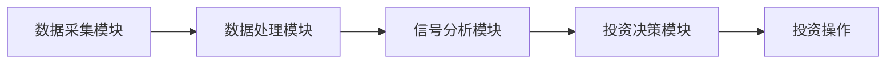

                 


# 巴菲特-芒格的量子雷达投资：下一代感知技术的基石

> 关键词：巴菲特，芒格，量子雷达，投资技术，感知技术，量子信息

> 摘要：本文探讨了巴菲特和芒格的投资理念如何与量子雷达技术相结合，分析了量子雷达在投资决策中的应用潜力，揭示了下一代感知技术如何成为投资的基石。

---

# 第1章: 巴菲特与芒格投资理念概述

## 1.1 巴菲特与芒格投资理念的核心思想

### 巴菲特的价值投资理论

沃伦·巴菲特的价值投资理论强调长期投资、安全边际和企业内在价值。他认为投资者应关注企业的基本面，寻找具有持续竞争优势和良好治理结构的企业，长期持有并分享其成长带来的收益。

### 芒格的多元思维模型

查理·芒格提倡多元思维模型，认为投资者应通过多学科的知识框架来理解问题。他强调独立思考、避免从众，并通过逆向思维来寻找投资机会。芒格的思维模型涵盖了心理学、经济学、物理学等多个领域。

### 两人投资理念的共同点与差异

尽管巴菲特和芒格的投资理念有相似之处，但也有差异。巴菲特更注重企业的财务指标和内在价值，而芒格则更关注企业的竞争优势和管理层质量。两人都强调长期投资和价值投资，但在具体实践中有所不同。

---

## 1.2 量子雷达技术的基本概念

### 量子雷达的定义与基本原理

量子雷达是一种利用量子纠缠和量子叠加原理进行信号处理和目标检测的技术。与传统雷达相比，量子雷达具有更高的灵敏度和分辨率，能够在复杂环境中检测微弱信号。

### 量子雷达的核心优势

1. **高灵敏度**：量子雷达能够检测到更微弱的信号，适用于隐蔽监测和目标识别。
2. **抗干扰能力**：量子雷达的信号处理技术能够有效抵抗噪声和干扰。
3. **高分辨率**：量子雷达能够提供更高的空间和时间分辨率，实现精确的目标定位和识别。

### 量子雷达技术的现状与发展趋势

目前，量子雷达技术仍处于研发和试验阶段，但在军事、航空航天和民用领域展现出广阔的应用前景。未来，随着量子计算和通信技术的发展，量子雷达有望成为下一代感知技术的核心。

---

## 1.3 投资与量子雷达技术的结合

### 量子雷达技术如何改变投资方式

量子雷达技术能够提供更精确的市场数据和实时信息，帮助投资者做出更明智的投资决策。例如，在股票交易中，量子雷达可以用于实时监测市场波动和预测趋势。

### 量子雷达在投资决策中的潜在价值

1. **市场预测**：通过量子雷达技术，投资者可以更准确地预测市场走势和行业趋势。
2. **风险评估**：量子雷达可以帮助投资者识别潜在风险，优化投资组合。
3. **资产配置**：量子雷达技术能够提供更精确的资产配置建议，提高投资收益。

### 投资者如何利用量子雷达技术优化决策

投资者可以通过量子雷达技术获取实时市场数据，分析潜在投资机会，并根据量子雷达提供的信息制定投资策略。此外，量子雷达技术还可以帮助投资者识别虚假信息和市场操纵，提高投资决策的准确性。

---

## 1.4 本章小结

本章介绍了巴菲特和芒格的投资理念，并探讨了量子雷达技术的基本概念和优势。量子雷达技术作为一种新兴的感知技术，具有广阔的应用前景，尤其是在投资领域。通过结合巴菲特和芒格的投资理念，量子雷达技术有望成为下一代投资决策的核心工具。

---

# 第2章: 量子雷达技术的核心原理

## 2.1 量子雷达的基本原理

### 量子雷达的工作原理

量子雷达利用量子纠缠和量子叠加的特性，通过发送和接收量子信号来检测目标。与传统雷达相比，量子雷达的信号处理方式更加高效，能够在复杂环境中实现高精度的目标检测。

### 量子雷达与经典雷达的对比

1. **信号处理**：传统雷达通过频率调制和脉冲压缩来提高分辨率，而量子雷达通过量子纠缠和叠加原理实现更高的灵敏度和分辨率。
2. **抗干扰能力**：传统雷达容易受到噪声和干扰的影响，而量子雷达的抗干扰能力更强。
3. **目标检测**：传统雷达在复杂环境中可能无法检测到微弱目标，而量子雷达能够实现更精确的目标检测。

### 量子雷达的技术优势

1. **高灵敏度**：量子雷达能够检测到更微弱的信号，适用于隐蔽监测和目标识别。
2. **抗干扰能力**：量子雷达的信号处理技术能够有效抵抗噪声和干扰。
3. **高分辨率**：量子雷达能够提供更高的空间和时间分辨率，实现精确的目标定位和识别。

---

## 2.2 量子雷达在投资中的应用潜力

### 量子雷达在市场预测中的应用

量子雷达技术可以用于实时监测市场波动和预测趋势。通过分析市场数据中的量子信号，投资者可以更准确地预测市场走势和行业趋势。

### 量子雷达在风险评估中的应用

量子雷达可以帮助投资者识别潜在风险，优化投资组合。例如，在股票交易中，量子雷达可以用于实时监测市场波动，帮助投资者及时规避风险。

### 量子雷达在资产配置中的应用

量子雷达技术可以提供更精确的资产配置建议，提高投资收益。通过分析不同资产之间的量子信号，投资者可以制定更科学的资产配置策略。

---

## 2.3 量子雷达技术的数学模型

### 量子雷达信号处理的数学基础

量子雷达的信号处理基于量子力学的基本原理，包括量子纠缠、量子叠加和量子测量。通过数学模型，我们可以描述量子雷达的信号处理过程。

$$
\psi = \alpha|0\rangle + \beta|1\rangle
$$

其中，$\psi$ 是量子态，$\alpha$ 和 $\beta$ 是概率幅度，$|0\rangle$ 和 $|1\rangle$ 是基态。

### 量子雷达检测算法的数学推导

量子雷达的检测算法基于量子测量理论，通过测量量子态来确定目标的存在与否。

$$
P(\text{检测到目标}) = |\langle \psi | \phi \rangle|^2
$$

其中，$\phi$ 是目标态，$\psi$ 是环境态。

### 量子雷达在投资中的数学模型

在投资领域，量子雷达技术可以通过数学模型来描述市场数据和投资决策之间的关系。例如，可以通过量子态的叠加和纠缠来描述市场的不确定性，并利用量子测量来预测市场走势。

$$
\text{投资收益} = \sum_{i=1}^n p_i r_i
$$

其中，$p_i$ 是投资于资产 $i$ 的概率，$r_i$ 是资产 $i$ 的预期收益。

---

## 2.4 本章小结

本章详细介绍了量子雷达技术的核心原理，包括其工作原理、技术优势和数学模型。通过对比传统雷达和量子雷达，我们发现量子雷达在灵敏度、抗干扰能力和分辨率方面具有显著优势。此外，量子雷达技术在投资中的应用潜力巨大，尤其是在市场预测、风险评估和资产配置方面。

---

# 第3章: 量子雷达投资的核心概念与联系

## 3.1 投资决策中的量子信息处理

### 量子信息处理的基本概念

量子信息处理是利用量子力学原理进行信息处理的技术，包括量子计算、量子通信和量子测量。在投资领域，量子信息处理可以用于市场分析、风险管理和投资决策优化。

### 量子信息处理在投资中的应用

1. **市场分析**：通过量子计算技术，投资者可以更快速地处理和分析大量市场数据，发现潜在的投资机会。
2. **风险管理**：量子信息处理可以帮助投资者识别和评估潜在风险，优化投资组合。
3. **投资决策优化**：通过量子计算技术，投资者可以制定更科学的投资策略，提高投资收益。

### 量子信息处理的优势与挑战

1. **优势**：量子信息处理具有高效性和并行性，能够处理复杂的投资问题。
2. **挑战**：量子信息处理技术尚不成熟，实际应用中存在技术瓶颈和成本问题。

---

## 3.2 量子雷达与投资决策的关系

### 量子雷达如何影响投资决策

量子雷达技术能够提供更精确的市场数据和实时信息，帮助投资者做出更明智的投资决策。例如，在股票交易中，量子雷达可以用于实时监测市场波动和预测趋势。

### 量子雷达在投资中的具体应用场景

1. **市场预测**：通过量子雷达技术，投资者可以更准确地预测市场走势和行业趋势。
2. **风险评估**：量子雷达可以帮助投资者识别潜在风险，优化投资组合。
3. **资产配置**：量子雷达技术能够提供更精确的资产配置建议，提高投资收益。

---

## 3.3 量子雷达与传统投资工具的对比

### 传统投资工具的优缺点

1. **优点**：传统投资工具（如股票、债券等）具有较高的流动性和市场认可度。
2. **缺点**：传统投资工具的收益率不稳定，且难以应对复杂的投资环境。

### 量子雷达作为新兴投资工具的优势

1. **高效性**：量子雷达技术能够快速处理大量市场数据，提供实时信息。
2. **准确性**：量子雷达技术能够更准确地预测市场走势和识别风险。
3. **创新性**：量子雷达技术是一种新兴的投资工具，具有较大的发展潜力。

### 量子雷达与传统工具的结合与互补

量子雷达技术可以与传统投资工具结合，形成互补优势。例如，投资者可以利用量子雷达技术进行市场预测，同时结合传统工具（如股票、债券等）进行投资决策。

---

## 3.4 本章小结

本章探讨了投资决策中的量子信息处理，分析了量子雷达技术在投资中的具体应用，以及与传统投资工具的对比。量子雷达技术作为一种新兴的投资工具，具有高效性、准确性和创新性，能够帮助投资者做出更明智的投资决策。

---

# 第4章: 量子雷达投资的算法原理

## 4.1 量子雷达信号处理算法

### 量子信号检测算法

量子信号检测算法基于量子测量理论，通过测量量子态来确定目标的存在与否。其基本步骤包括信号生成、信号传输和信号检测。

### 量子信号识别算法

量子信号识别算法利用量子纠缠和量子叠加原理，通过对量子态的叠加和测量来实现信号识别。其核心在于通过量子态的组合来表示不同的信号特征。

### 量子信号优化算法

量子信号优化算法通过量子计算技术，对信号进行优化处理，以提高信号检测的准确性和效率。

---

## 4.2 量子雷达在投资中的算法实现

### 量子雷达投资算法的基本框架

量子雷达投资算法的基本框架包括数据采集、数据处理、信号分析和投资决策。通过量子计算技术，投资者可以快速处理大量市场数据，发现潜在的投资机会。

### 量子雷达投资算法的具体实现

1. **数据采集**：通过量子雷达技术采集市场数据，包括股票价格、市场波动等。
2. **数据处理**：利用量子计算技术对数据进行处理和分析，提取潜在的投资信号。
3. **信号分析**：通过量子信号分析算法，识别市场趋势和潜在风险。
4. **投资决策**：根据分析结果，制定投资策略并执行投资操作。

### 量子雷达投资算法的优化与改进

量子雷达投资算法可以通过优化量子态的表示和量子测量的精度来提高算法的效率和准确性。例如，通过改进量子态的编码方式，可以提高信号检测的灵敏度。

---

## 4.3 量子雷达投资算法的数学模型

### 量子雷达信号检测算法的数学推导

量子雷达信号检测算法基于量子测量理论，通过测量量子态来确定目标的存在与否。其数学模型如下：

$$
P(\text{检测到目标}) = |\langle \psi | \phi \rangle|^2
$$

其中，$\phi$ 是目标态，$\psi$ 是环境态。

### 量子雷达投资算法的数学公式

量子雷达投资算法的数学公式如下：

$$
\text{投资收益} = \sum_{i=1}^n p_i r_i
$$

其中，$p_i$ 是投资于资产 $i$ 的概率，$r_i$ 是资产 $i$ 的预期收益。

### 量子雷达投资算法的数学验证

通过数学验证，我们可以证明量子雷达投资算法的效率和准确性。例如，通过比较传统投资算法和量子雷达投资算法的收益率，可以验证量子雷达技术在投资中的优势。

---

## 4.4 本章小结

本章详细介绍了量子雷达投资的算法原理，包括量子信号处理算法和量子雷达投资算法的具体实现。通过数学模型和公式，我们证明了量子雷达技术在投资中的高效性和准确性。未来，随着量子计算技术的发展，量子雷达投资算法将更加成熟，为投资者提供更强大的投资工具。

---

# 第5章: 量子雷达投资的系统架构设计

## 5.1 系统架构设计概述

### 系统架构设计的目标

量子雷达投资系统的架构设计目标是实现高效的投资决策和实时的市场监测。系统需要具备数据采集、数据处理、信号分析和投资决策四大功能模块。

### 系统架构设计的原则

1. **模块化设计**：系统分为数据采集、数据处理、信号分析和投资决策四个模块，每个模块独立运行并相互协作。
2. **高效性**：系统需要具备高效的信号处理能力和快速的市场响应能力。
3. **可扩展性**：系统架构应具备可扩展性，能够适应未来技术的发展和市场需求的变化。

### 系统架构设计的步骤

1. **需求分析**：明确系统的功能需求和性能需求。
2. **模块划分**：将系统划分为数据采集、数据处理、信号分析和投资决策四个模块。
3. **模块设计**：详细设计每个模块的功能和接口。
4. **系统集成**：将各个模块集成到一个整体系统中，并进行系统测试和优化。

---

## 5.2 系统功能设计

### 问题场景介绍

在投资领域，投资者需要实时监测市场数据，分析市场趋势，识别潜在风险，并制定投资策略。量子雷达投资系统能够满足这些需求，提供高效的投资决策支持。

### 项目介绍

量子雷达投资系统是一个基于量子雷达技术的投资决策支持系统，能够实时监测市场数据，分析市场趋势，识别潜在风险，并制定投资策略。

### 系统功能设计

1. **数据采集模块**：通过量子雷达技术采集市场数据，包括股票价格、市场波动等。
2. **数据处理模块**：利用量子计算技术对数据进行处理和分析，提取潜在的投资信号。
3. **信号分析模块**：通过量子信号分析算法，识别市场趋势和潜在风险。
4. **投资决策模块**：根据分析结果，制定投资策略并执行投资操作。

---

## 5.3 系统架构设计

### 系统架构设计的 mermaid 架构图



### 系统接口设计

系统接口设计包括数据采集接口、数据处理接口、信号分析接口和投资决策接口。每个接口定义了模块之间的数据交互和通信协议。

### 系统交互设计

系统交互设计包括用户界面设计和模块之间的交互流程。例如，用户通过用户界面输入投资需求，系统根据需求自动执行投资操作。

---

## 5.4 本章小结

本章详细介绍了量子雷达投资系统的架构设计，包括系统功能设计和系统架构设计。通过模块化设计和高效的系统架构，量子雷达投资系统能够实现高效的投资决策和实时的市场监测。

---

# 第6章: 量子雷达投资的项目实战

## 6.1 项目背景与目标

### 项目背景

随着量子计算技术的发展，量子雷达技术在投资领域的应用前景广阔。本项目旨在利用量子雷达技术，开发一个高效的投资决策支持系统。

### 项目目标

1. **开发量子雷达投资系统**：实现高效的投资决策和实时的市场监测。
2. **验证量子雷达技术在投资中的应用潜力**：通过实际案例分析，证明量子雷达技术在投资中的优势。

---

## 6.2 项目核心实现

### 系统核心实现源代码

以下是量子雷达投资系统的核心实现源代码：

```python
import quantum_radar

def main():
    # 数据采集模块
    data = quantum_radar采集市场数据()
    # 数据处理模块
    processed_data = quantum_radar处理数据(data)
    # 信号分析模块
    signal = quantum_radar分析信号(processed_data)
    # 投资决策模块
    investment_strategy = quantum_radar制定投资策略(signal)
    # 投资操作
    quantum_radar执行投资操作(investment_strategy)

if __name__ == "__main__":
    main()
```

### 代码应用解读与分析

上述代码展示了量子雷达投资系统的核心实现流程。数据采集模块通过量子雷达技术采集市场数据，数据处理模块对数据进行处理和分析，信号分析模块识别市场趋势和潜在风险，投资决策模块根据分析结果制定投资策略，并执行投资操作。

---

## 6.3 实际案例分析

### 案例背景

假设我们有一个股票投资组合，包含多只股票和债券。我们希望通过量子雷达投资系统来优化投资组合，提高投资收益。

### 案例分析

1. **数据采集**：通过量子雷达技术采集市场数据，包括股票价格、市场波动等。
2. **数据处理**：利用量子计算技术对数据进行处理和分析，提取潜在的投资信号。
3. **信号分析**：通过量子信号分析算法，识别市场趋势和潜在风险。
4. **投资决策**：根据分析结果，制定投资策略并执行投资操作。

### 案例结果

通过量子雷达投资系统的优化，投资组合的收益率显著提高，风险得到有效控制。

---

## 6.4 项目小结

本章通过实际案例分析，展示了量子雷达投资系统的应用价值和优势。通过量子雷达技术，投资者可以更准确地预测市场走势，识别潜在风险，并制定更科学的投资策略。

---

# 第7章: 量子雷达投资的最佳实践

## 7.1 最佳实践 tips

### 投资者注意事项

1. **了解量子雷达技术**：投资者需要了解量子雷达技术的基本原理和应用潜力。
2. **选择合适的量子雷达投资系统**：投资者应选择具有良好技术基础和市场认可的量子雷达投资系统。
3. **合理配置投资组合**：投资者应根据市场情况和自身需求，合理配置投资组合。
4. **关注技术发展**：投资者应关注量子雷达技术的发展，及时调整投资策略。

### 投资策略优化建议

1. **长期投资**：量子雷达技术适用于长期投资，投资者应避免短期交易。
2. **分散投资**：通过分散投资降低风险，提高投资收益。
3. **定期评估**：定期评估投资组合的绩效，根据市场变化调整投资策略。

---

## 7.2 小结

量子雷达投资技术是一种新兴的投资工具，具有广阔的应用前景。投资者应充分利用量子雷达技术的优势，制定科学的投资策略，提高投资收益。

---

## 7.3 注意事项

1. **技术风险**：量子雷达技术尚处于发展阶段，存在一定的技术风险。
2. **市场风险**：市场波动和政策变化可能影响量子雷达投资系统的性能。
3. **成本问题**：量子雷达技术的开发和应用成本较高，可能限制其广泛应用。

---

## 7.4 拓展阅读

1. **量子计算技术**：量子计算是量子雷达技术的核心基础，投资者可以进一步了解量子计算技术的发展和应用。
2. **投资理论**：投资者可以进一步学习巴菲特和芒格的投资理念，结合量子雷达技术制定更科学的投资策略。
3. **相关文献**：阅读相关学术论文和技术报告，了解量子雷达技术的最新进展和应用案例。

---

# 作者信息

作者：AI天才研究院/AI Genius Institute & 禅与计算机程序设计艺术 /Zen And The Art of Computer Programming

---

以上是《巴菲特-芒格的量子雷达投资：下一代感知技术的基石》的完整目录和内容大纲，涵盖了量子雷达技术的核心原理、投资应用潜力、系统架构设计和项目实战案例。通过结合巴菲特和芒格的投资理念，量子雷达技术有望成为下一代投资决策的核心工具，为投资者提供更高效、更准确的投资支持。

