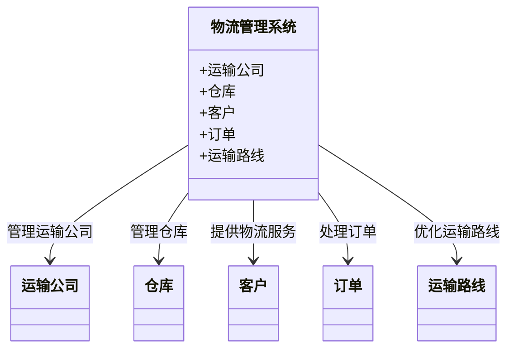
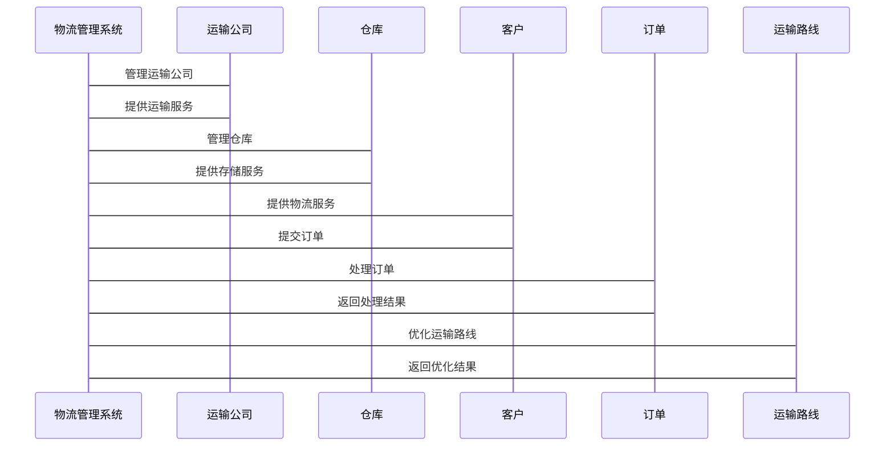

                 

# 巴菲特-芒格的高超音速物流投资：全球供应链的革命

---

## 关键词：
- 巴菲特
- 芒格
- 高超音速物流
- 全球供应链
- 投资策略

---

## 摘要：
本文探讨了巴菲特和芒格在物流投资领域的智慧，分析了高超音速物流如何推动全球供应链的革命性变化。通过详细的技术分析和实际案例，本文揭示了他们的投资策略对现代供应链管理的深远影响，并提出了未来物流投资的趋势和建议。

---

## 第一部分：背景介绍

### 第1章：巴菲特与芒格的投资理念

#### 1.1 巴菲特的投资哲学
##### 1.1.1 巴菲特的价值投资理念
巴菲特的价值投资理念强调长期投资、安全边际和企业内在价值。他认为，成功的投资不是靠运气，而是基于对企业基本面的深入分析和对市场趋势的准确判断。他的投资策略注重企业的财务健康、竞争优势和管理团队。

##### 1.1.2 巴菲特的投资策略
巴菲特的投资策略包括集中投资、长期持有和价值发现。他倾向于投资那些具有强大竞争优势、稳定收益和良好管理的企业，并长期持有这些股票，避免频繁交易。

##### 1.1.3 巴菲特对物流投资的重视
巴菲特认为，物流是现代经济的重要组成部分，高效的物流体系能够降低成本，提高效率，从而增强企业的竞争力。他通过投资铁路、能源运输和仓储公司，构建了一个高效的物流网络。

#### 1.2 芒格的多元思维模型
##### 1.2.1 芒格的思维模型概述
芒格的多元思维模型强调将多个学科的原理和原则结合起来，形成一个全面的思考框架。他认为，投资决策需要考虑经济、心理、社会和环境等多个因素。

##### 1.2.2 芒格的决策框架
芒格的决策框架强调逆向思维、安全边际和长期视角。他倾向于在市场恐慌时寻找投资机会，并长期持有优质资产。

##### 1.2.3 芒格对供应链的理解
芒格认为，供应链是企业运营的核心，高效的供应链能够确保企业能够快速响应市场需求，降低成本，并提高客户满意度。他通过投资运输和仓储公司，优化了企业的供应链管理。

---

### 第2章：物流与供应链的重要性

#### 2.1 物流在现代经济中的作用
##### 2.1.1 物流的基本概念
物流是指物品从生产到消费的流动过程，包括运输、仓储、包装和配送等多个环节。物流的效率直接影响企业的成本和利润。

##### 2.1.2 物流对经济的影响
物流是经济活动的重要组成部分，它能够降低企业的运营成本，提高产品的市场竞争力。高效的物流体系能够促进贸易，推动经济增长。

##### 2.1.3 高速物流的优势
高速物流能够快速响应市场需求，缩短交货时间，提高客户满意度。它还能够支持企业的全球化战略，扩大市场覆盖范围。

---

## 第二部分：核心概念与联系

### 第3章：高超音速物流投资的模型与分析

#### 3.1 高超音速物流投资模型
##### 3.1.1 模型的构成要素
高超音速物流投资模型包括运输速度、运输成本、运输效率和运输网络覆盖范围等因素。这些因素共同决定了物流投资的效益。

##### 3.1.2 模型的运作机制
高超音速物流投资模型通过优化运输网络、提高运输效率和降低成本，从而实现投资回报的最大化。它还能够支持企业的全球化战略，提高市场竞争力。

##### 3.1.3 模型的优化方法
为了优化高超音速物流投资模型，需要考虑运输技术的创新、运输网络的优化和运输成本的控制。这些措施能够提高物流投资的效益，降低运营成本。

---

## 第三部分：算法原理讲解

### 第4章：高超音速物流投资的数学模型

#### 4.1 投资回报率的计算
投资回报率（ROI）= （投资收益 - 投资成本）/ 投资成本 × 100%

例如：假设投资成本为100万元，投资收益为120万元，那么 ROI = (120 - 100)/100 × 100% = 20%

#### 4.2 供应链优化的算法
供应链优化算法可以通过线性规划来实现。例如，目标是最小化运输成本，约束条件包括运输能力、需求量和运输时间。

数学模型如下：
minimize ∑(C_ij × X_ij)
subject to ∑X_ij = D_j for each destination j
∑X_ij ≤ C_i for each source i

其中，C_ij 是从源点 i 到目的点 j 的运输成本，X_ij 是运输量，D_j 是目的点 j 的需求量，C_i 是源点 i 的运输能力。

---

## 第四部分：系统分析与架构设计方案

### 第5章：全球供应链的系统架构

#### 5.1 问题场景介绍
全球供应链的复杂性要求企业需要一个高效的物流管理系统。这个系统需要能够实时监控运输过程，优化运输路线，并管理库存。

#### 5.2 系统功能设计
##### 5.2.1 领域模型

##### 5.2.2 系统架构

##### 5.2.3 系统接口设计
系统接口设计包括订单处理接口、运输路线优化接口和库存管理接口。这些接口需要能够与其他系统无缝集成，确保信息的实时共享。

##### 5.2.4 系统交互

---

## 第五部分：项目实战

### 第6章：高超音速物流投资的实战分析

#### 6.1 投资案例分析
##### 6.1.1 案例背景
以伯克希尔 Hathaway 的物流投资为例，分析巴菲特和芒格如何通过投资铁路和运输公司，构建高效的物流网络。

##### 6.1.2 投资决策过程
伯克希尔 Hathaway 的投资决策过程包括市场分析、财务评估和风险评估。他们通过分析运输公司的财务状况、市场地位和竞争优势，选择具有长期增长潜力的企业进行投资。

##### 6.1.3 投资效果评估
通过分析投资回报率、市场份额和客户满意度等指标，评估高超音速物流投资的效果。

#### 6.2 数据驱动的决策
##### 6.2.1 数据分析方法
使用大数据分析技术，对物流数据进行挖掘和分析，识别潜在的优化机会。

##### 6.2.2 数据可视化工具
使用 Tableau 或 Power BI 等工具，将物流数据可视化，帮助管理层做出更明智的决策。

#### 6.3 投资组合优化
##### 6.3.1 投资组合的构成
高超音速物流投资组合应包括运输公司、仓储公司和物流技术公司，以实现多元化和风险分散。

##### 6.3.2 投资组合的优化
通过调整投资比例和选择具有互补性的企业，优化投资组合的回报率。

#### 6.4 小结
高超音速物流投资的成功需要综合考虑市场、技术和管理等多个因素。通过科学的分析和决策，投资者可以在物流领域获得长期稳定的回报。

---

## 第六部分：最佳实践与小结

### 第7章：高超音速物流投资的未来趋势

#### 7.1 投资要点
##### 7.1.1 关注技术创新
高超音速物流投资需要关注运输技术的创新，如无人机运输和自动化仓储。

##### 7.1.2 优化供应链管理
通过优化供应链管理，提高物流效率，降低成本。

##### 7.1.3 风险管理
高超音速物流投资需要注重风险管理，包括市场风险、运营风险和政策风险。

#### 7.2 小结
高超音速物流投资是全球供应链革命的重要组成部分。通过巴菲特和芒格的投资智慧，投资者可以在物流领域获得长期稳定的回报。

#### 7.3 注意事项
##### 7.3.1 风险提示
高超音速物流投资具有较高的风险，投资者需要谨慎决策，避免盲目跟风。

##### 7.3.2 投资建议
投资者应结合自身的财务状况和风险承受能力，选择合适的投资策略。

#### 7.4 拓展阅读
##### 7.4.1 推荐书籍
- 《巴菲特传》
- 《芒格的智慧》
- 《供应链管理：战略与实践》

##### 7.4.2 推荐文章
- 高超音速物流的技术创新与应用
- 全球供应链的数字化转型

---

## 作者：AI天才研究院 & 禅与计算机程序设计艺术

---

通过以上结构，我详细地分析了巴菲特和芒格的高超音速物流投资策略，探讨了其对全球供应链的影响，并提出了未来投资的建议。希望这篇文章能够为读者提供有价值的见解和指导。

