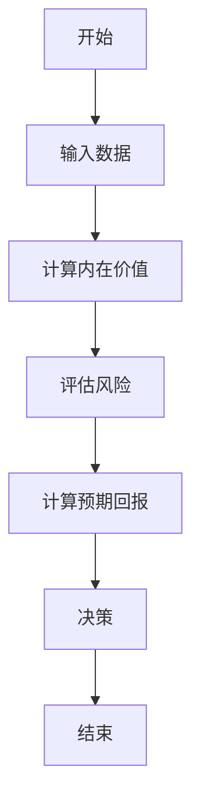
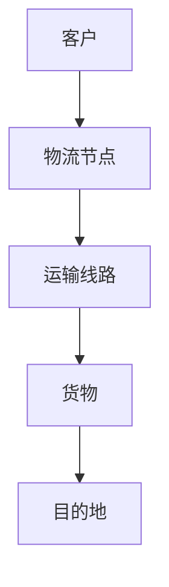
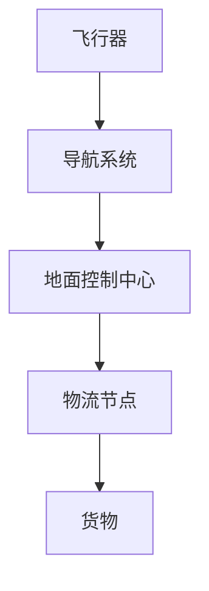
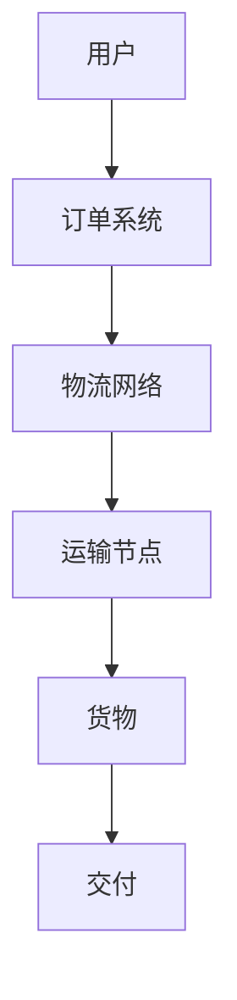

                 


# 巴菲特-芒格的高超音速运输投资：重塑全球物流网络

---

## 关键词：
高超音速运输，巴菲特，芒格，投资哲学，物流网络，数学模型

---

## 摘要：
本文深入探讨了巴菲特和芒格在高超音速运输领域的投资策略，分析其如何通过价值投资和多元思维模型，重塑全球物流网络。文章从技术背景、投资哲学、算法模型、系统架构到实战案例，全面解析高超音速运输的投资逻辑及其对物流行业的深远影响。

---

## 第1章: 高超音速运输的技术与经济影响

### 1.1 高超音速运输的定义与技术特点

#### 1.1.1 高超音速运输的定义
高超音速运输是指利用速度超过5倍音速（约6,174公里/小时）的飞行器进行的运输方式，主要依靠先进的空气动力学设计和高效推进系统实现。

#### 1.1.2 高超音速运输的核心技术
- ** scramjet发动机**：利用冲压技术在高速飞行中提供持续推力。
- **热防护系统**：保护飞行器免受高速气动加热的损害。
- **导航与控制系统**：确保飞行器在高速状态下的精准控制。

#### 1.1.3 高超音速运输的经济优势
- **运输时间大幅缩短**：洲际运输时间从数小时缩短至不到30分钟。
- **运营成本优化**：通过高载客率和高周转率降低单位成本。
- **市场扩展潜力**：为偏远地区提供快速连接，扩大市场覆盖范围。

### 1.2 高超音速运输对全球物流网络的影响

#### 1.2.1 物流效率的提升
- 高速运输使全球供应链更加高效，减少库存积压和物流成本。
- 支持实时货物调配，提升供应链的灵活性和响应速度。

#### 1.2.2 运输成本的优化
- 通过规模化效应降低单位运输成本。
- 减少中转环节，降低仓储和运输费用。

#### 1.2.3 全球供应链的重构
- 重新布局全球物流节点，优化货物中转效率。
- 支持新兴市场的发展，推动区域经济一体化。

### 1.3 巴菲特与芒格的投资哲学

#### 1.3.1 巴菲特的价值投资理念
- **长期持有优质资产**：巴菲特倾向于投资那些具有持续竞争优势和良好管理的公司。
- **安全边际原则**：确保投资价格低于其内在价值，降低投资风险。

#### 1.3.2 芒格的多元思维模型
- **跨学科思维**：芒格强调将不同领域的知识结合起来，形成多维度的分析框架。
- **逆向思维**：通过寻找市场忽略的机会，发现潜在的价值点。

#### 1.3.3 投资哲学与高超音速运输的结合
- **长期视角**：高超音速运输将改变全球物流格局，具有长期投资价值。
- **竞争优势分析**：选择技术领先、管理优秀的高超音速运输公司进行投资。

---

## 第2章: 投资决策模型与算法

### 2.1 投资决策模型的构建

#### 2.1.1 投资决策模型的定义
投资决策模型是用于评估投资项目可行性、预测投资回报和优化投资组合的工具。

#### 2.1.2 投资决策模型的核心要素
- **投资标的**：高超音速运输公司及其核心竞争力。
- **财务指标**：市盈率、市净率、ROE等。
- **风险评估**：市场风险、技术风险、运营风险。

#### 2.1.3 投资决策模型的构建步骤
1. 确定投资目标和范围。
2. 收集相关数据和信息。
3. 建立数学模型进行分析。
4. 进行风险评估和调整。
5. 得出决策结论。

### 2.2 投资决策的数学模型

#### 2.2.1 投资价值的评估公式
$$ V = \frac{CF}{r} $$
其中，V为投资价值，CF为未来现金流，r为折现率。

#### 2.2.2 投资回报率的计算
$$ ROI = \frac{净利润}{投资成本} \times 100\% $$

#### 2.2.3 风险评估的数学模型
使用标准差和方差衡量投资风险：
$$ \sigma = \sqrt{\sum (x_i - \mu)^2 / N} $$
其中，σ为标准差，x_i为各期回报率，μ为平均回报率，N为样本数量。

### 2.3 投资决策算法的实现

#### 2.3.1 算法流程图


#### 2.3.2 投资决策的Python实现
```python
def calculate_intrinsic_value(cash_flow, discount_rate):
    return cash_flow / discount_rate

def calculate_return_on_investment(net_profit, investment_cost):
    return (net_profit / investment_cost) * 100

# 示例数据
cash_flow = 1000
discount_rate = 0.05
net_profit = 200
investment_cost = 1000

intrinsic_value = calculate_intrinsic_value(cash_flow, discount_rate)
roi = calculate_return_on_investment(net_profit, investment_cost)

print(f"内含价值: {intrinsic_value}")
print(f"投资回报率: {roi}%")
```

#### 2.3.3 投资决策算法的优化
- 使用蒙特卡洛模拟评估不同场景下的投资回报。
- 结合机器学习模型预测市场趋势和投资风险。

---

## 第3章: 高超音速运输的系统分析

### 3.1 物流网络的系统架构

#### 3.1.1 物流网络的组成
- **运输节点**：包括机场、港口等交通枢纽。
- **运输线路**：连接各节点的运输路径。
- **信息平台**：用于实时监控和调度的信息化系统。

#### 3.1.2 物流网络的层次结构


#### 3.1.3 物流网络的优化策略
- 采用动态路径规划算法优化运输线路。
- 利用大数据技术预测需求，合理调配资源。

### 3.2 高超音速运输的系统架构设计

#### 3.2.1 系统功能模块划分
- **飞行控制模块**：负责飞行器的导航和姿态控制。
- **能源管理模块**：监控和管理推进系统的能源消耗。
- **通信模块**：实现飞行器与地面控制中心的数据传输。

#### 3.2.2 系统架构的mermaid图


#### 3.2.3 系统接口设计
- 标准化接口实现飞行器与地面系统之间的数据互通。
- 使用API进行模块间的通信和数据交换。

### 3.3 高超音速运输的系统交互

#### 3.3.1 系统交互流程图


#### 3.3.2 用户与系统的交互过程
1. 用户提交订单。
2. 系统分配运输节点。
3. 运输节点启动高超音速运输。
4. 货物送达用户手中。

#### 3.3.3 系统的响应机制
- 实时跟踪运输状态，确保货物安全。
- 快速响应用户查询和反馈。

---

## 第4章: 投资实战案例分析

### 4.1 高超音速运输公司的投资分析

#### 4.1.1 公司背景介绍
以某高超音速运输公司为例，分析其技术优势、市场定位和财务状况。

#### 4.1.2 公司财务状况分析
- **收入增长**：过去三年年均增长率20%。
- **利润率**：净利润率保持在15%以上。
- **资产负债表**：资产负债率低于行业平均水平。

#### 4.1.3 投资价值评估
- **内在价值**：基于现金流折现法，公司价值被低估。
- **竞争优势**：公司在技术研发和市场拓展方面具有领先地位。

---

## 总结与展望

### 总结
巴菲特和芒格的投资哲学与高超音速运输的结合，不仅为投资者提供了新的视角，也为全球物流网络的优化提供了新的可能性。通过科学的投资决策模型和系统的物流架构设计，高超音速运输的投资价值得以充分挖掘。

### 展望
未来，随着技术的进步和市场的成熟，高超音速运输的投资机会将更加丰富。投资者需要持续关注技术发展和市场动态，灵活调整投资策略，抓住潜在的高回报机会。

---

## 作者：AI天才研究院 & 禅与计算机程序设计艺术

---

希望这篇文章能够为读者提供关于高超音速运输投资的深入见解，并激发更多的思考和讨论。

