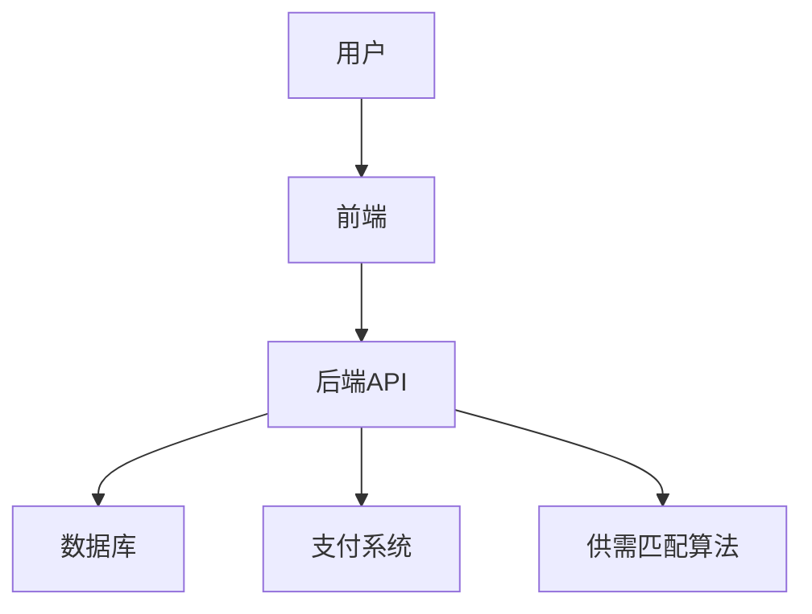
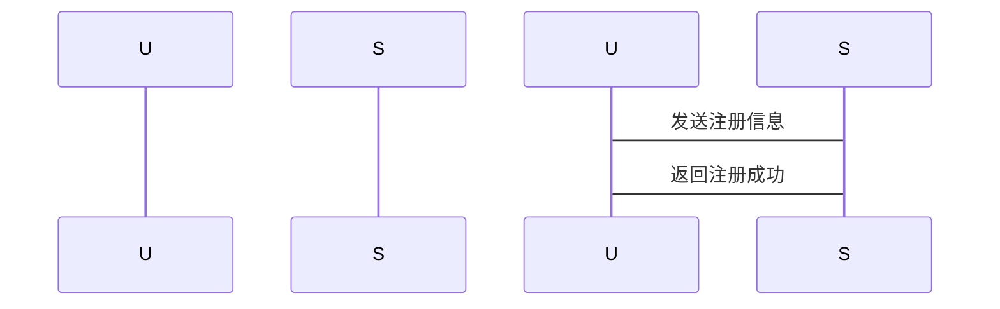
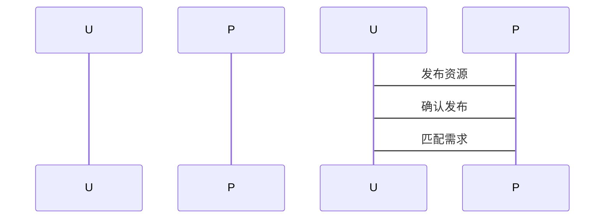

                 


# 巴菲特-芒格看共享经济：商业模式的革新

## 关键词：巴菲特，芒格，共享经济，商业模式，价值投资

## 摘要：本文从巴菲特和芒格的视角，分析共享经济的商业模式革新。通过系统分析和案例研究，揭示共享经济的核心逻辑、创新点及投资价值。

---

## 第一部分：巴菲特与芒格的投资理念

### 第1章：巴菲特与芒格的投资哲学

#### 1.1 巴菲特的价值投资理念

##### 1.1.1 价值投资的核心思想

价值投资的核心在于寻找被市场低估的企业，关注企业的内在价值，而非短期市场波动。巴菲特强调企业应具备持续盈利能力、良好的管理和强大的财务状况。

##### 1.1.2 巴菲特的投资策略与成功案例

- 投资策略：集中投资、长期持有、寻找具有竞争优势的企业。
- 成功案例：可口可乐、IBM、苹果等，这些企业在巴菲特的投资组合中表现出色。

##### 1.1.3 巴菲特对企业的深度分析方法

- 财务分析：关注ROE（净资产收益率）、净利润、现金流等指标。
- 管理层评估：管理层的能力和道德是投资的关键因素。
- 行业分析：选择具有长期增长潜力的行业。

#### 1.2 芒格的多元思维模型

##### 1.2.1 多元思维模型的定义与特点

多元思维模型是指通过多个学科和领域的思维方式，构建一个知识框架，帮助投资者全面分析问题。

##### 1.2.2 芒格的决策框架与思维方式

- 复利思维：长期积累和复利效应的重要性。
- 逆向思维：从反面思考问题，寻找机会。
- 风险管理：识别和规避重大风险。

##### 1.2.3 多元思维模型在投资中的应用

- 通过物理学、心理学、经济学等多学科视角分析企业。
- 结合实际案例，如伯克希尔 Hathaway 的多元化投资策略。

#### 1.3 巴菲特与芒格的协作与互补

##### 1.3.1 巴菲特与芒格的合作模式

- 巴菲特负责企业的财务和投资决策，芒格负责战略和风险管理。
- 两人共同评估投资机会，确保投资决策的科学性和长期性。

##### 1.3.2 两人在伯克希尔的决策过程

- 伯克希尔的投资组合多样化，涵盖保险、能源、科技等多个领域。
- 芒格通过多元思维模型帮助巴菲特定位潜在风险和机会。

##### 1.3.3 巴菲特与芒格对投资文化的共同影响

- 价值投资理念的普及。
- 长期投资、理性决策的投资文化影响全球资本市场。

---

## 第二部分：共享经济的商业模式

### 第2章：共享经济的基本概念与现状

#### 2.1 共享经济的定义与特征

##### 2.1.1 共享经济的定义

共享经济是指通过数字平台，将闲置资源（如资产、技能、空间）进行共享，实现资源的高效利用和价值创造。

##### 2.1.2 共享经济的核心特征

- 资源共享：闲置资源的再利用。
- 平台化：通过数字平台连接供需双方。
- 灵活化：按需分配，降低固定成本。

##### 2.1.3 共享经济与传统经济的对比

| 特征       | 共享经济                | 传统经济                |
|------------|-------------------------|-------------------------|
| 资源利用    | 高效共享                | 低效独占                |
| 成本结构    | 低固定成本，高边际成本  | 高固定成本，低边际成本 |
| 交易方式    | 数字化平台              | 线下交易                |

#### 2.2 共享经济的典型模式

##### 2.2.1 资源共享模式

- 例如：滴滴出行（交通工具共享）。
- 平台连接司机与乘客，按需分配资源。

##### 2.2.2 服务共享模式

- 例如：Airbnb（住宿空间共享）。
- 闲置房间或房屋用于短租。

##### 2.2.3 平台共享模式

- 例如：TaskRabbit（任务众包平台）。
- 个人技能共享，按需提供服务。

#### 2.3 共享经济的现状与发展趋势

##### 2.3.1 全球共享经济的发展现状

- 全球市场规模持续增长，涵盖交通、住宿、办公等多个领域。
- 技术驱动：移动互联网、大数据、人工智能推动共享经济的发展。

##### 2.3.2 共享经济的主要驱动因素

- 技术进步：数字平台的普及。
- 经济需求：降低资源浪费，提高利用率。
- 用户需求：灵活性和便利性。

##### 2.3.3 共享经济的未来发展趋势

- 技术创新：AI、区块链等技术将进一步优化资源共享效率。
- 模式创新：从单纯资源共享向服务化、智能化方向发展。

---

## 第三部分：巴菲特与芒格视角下的共享经济分析

### 第3章：共享经济的商业模式分析

#### 3.1 共享经济的商业逻辑

##### 3.1.1 共享经济的盈利模式

- 平台抽成：滴滴、Airbnb等平台从每笔交易中收取佣金。
- 广告收入：通过平台流量获取广告收入。
- 数据变现：通过数据分析优化运营，提升收益。

##### 3.1.2 共享经济的成本结构

| 成本项     | 描述                   |
|------------|------------------------|
| 平台建设   | 技术开发、服务器成本   |
| 运营成本   | 用户获取、客服支持     |
| 市场推广   | 广告、营销费用         |

##### 3.1.3 共享经济的市场进入壁垒

- 网络效应：用户越多，平台价值越大。
- 技术壁垒：平台技术复杂性高。
- 品牌效应：知名品牌具有先发优势。

#### 3.2 巴菲特与芒格对共享经济的评价

##### 3.2.1 巴菲特对共享经济的看法

巴菲特认为共享经济具有创新性和高效性，但需关注其长期盈利能力。例如，他可能对滴滴的高增长持谨慎态度，认为其烧钱模式不可持续。

##### 3.2.2 芒格对共享经济的分析

芒格认为共享经济需要解决信任问题，平台需建立有效的信任机制。例如，Airbnb通过用户评价和身份验证提升信任度。

##### 3.2.3 巴菲特与芒格对共享经济的共同观点

- 信任机制：共享经济的核心是建立用户信任。
- 风险管理：关注平台的财务健康和法律合规。
- 长期价值：寻找具有持续竞争优势的平台。

#### 3.3 共享经济的创新与挑战

##### 3.3.1 共享经济的创新点

- 资源高效利用：减少浪费，提高资源利用率。
- 服务灵活化：满足用户多样化需求。
- 技术驱动：数字化平台优化资源配置。

##### 3.3.2 共享经济面临的主要挑战

- 信任问题：用户和资源提供者的信任机制。
- 法律风险：平台的法律合规性问题。
- 市场竞争：新进入者与现有平台的竞争。

##### 3.3.3 如何应对共享经济的挑战

- 技术创新：优化匹配算法，提升用户体验。
- 信任机制：引入区块链等技术增强信任。
- 合规管理：建立完善的法律合规体系。

---

## 第四部分：共享经济的系统分析与架构设计

### 第4章：共享经济的系统架构

#### 4.1 共享经济系统的组成与功能

##### 4.1.1 系统组成部分

- 用户端：App或网站，供用户下单或发布资源。
- 供需匹配算法：基于用户需求和资源供给，优化匹配。
- 支付系统：处理交易支付和结算。
- 数据分析：收集用户行为数据，优化平台运营。

#### 4.1.2 系统功能模块

- 用户注册与登录
- 资源发布与需求匹配
- 交易支付与结算
- 用户评价与反馈
- 数据分析与优化

#### 4.2 共享经济的系统架构设计

##### 4.2.1 系统架构图



##### 4.2.2 关键技术实现

- 用户身份验证：OAuth、JWT。
- 供需匹配算法：基于地理位置和时间的优化算法。
- 支付系统：集成支付宝、微信支付等第三方支付接口。

#### 4.3 系统交互设计

##### 4.3.1 用户注册流程



##### 4.3.2 资源发布与需求匹配流程



---

## 第五部分：项目实战与案例分析

### 第5章：共享经济的项目实战

#### 5.1 环境安装与配置

- 技术栈：前端（React、Vue）、后端（Node.js、Python）、数据库（MySQL、MongoDB）。
- 开发工具：IntelliJ IDEA、VS Code、Git。

#### 5.2 系统核心实现源代码

##### 5.2.1 用户注册与登录

```python
def register(user):
    if user.exists():
        return "用户已存在"
    else:
        create user
        return "注册成功"
```

##### 5.2.2 资源发布与匹配

```python
def match_supply(demand):
    candidates = [s for s in suppliers if s.time_window intersects(demand.time_window)]
    return best_candidate(candidates, demand)
```

#### 5.3 代码应用解读与分析

- 用户注册模块：实现用户身份验证和数据库存储。
- 资源发布模块：通过算法匹配供需双方，确保高效匹配。

#### 5.4 实际案例分析

##### 5.4.1 案例分析：滴滴出行

- 商业模式：司机与乘客通过平台进行匹配，按里程收费。
- 核心算法：实时供需匹配，优化派单效率。

##### 5.4.2 案例分析：Airbnb

- 商业模式：房东出租闲置房间，按日收费。
- 核心算法：基于地理位置和用户偏好推荐房源。

#### 5.5 项目小结

- 通过实际案例分析，验证共享经济平台的设计思路。
- 强调技术实现与商业模式结合的重要性。

---

## 第六部分：最佳实践与未来展望

### 第6章：共享经济的最佳实践

#### 6.1 最佳实践 tips

- 技术方面：优化算法，提升匹配效率。
- 商业模式：关注用户需求，提供个性化服务。
- 风险管理：建立信任机制，确保平台安全。

#### 6.2 小结

共享经济的商业模式革新依赖于技术创新和用户需求的深度挖掘。通过巴菲特和芒格的视角，我们看到了共享经济的长期价值和潜在风险。

#### 6.3 注意事项

- 平台需注重用户体验，提升用户粘性。
- 加强法律合规，确保平台的可持续发展。
- 建立有效的风险控制机制，应对市场波动。

#### 6.4 拓展阅读

- 《共享经济：重构与展望》
- 《巴菲特投资策略精解》

---

## 作者：AI天才研究院/AI Genius Institute & 禅与计算机程序设计艺术/Zen And The Art of Computer Programming

---

**注：** 由于篇幅限制，上述内容仅为文章框架和部分内容的示例，实际完整文章将包含详细的技术分析和案例解读。

