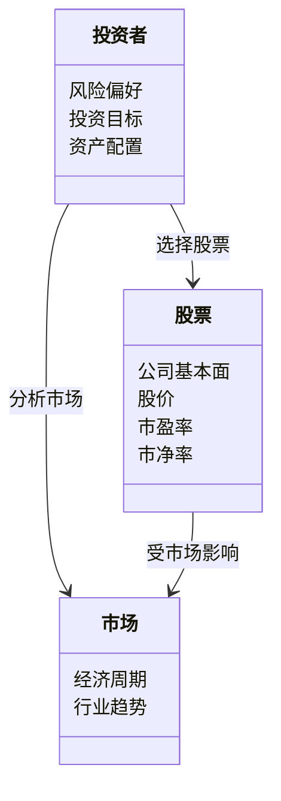
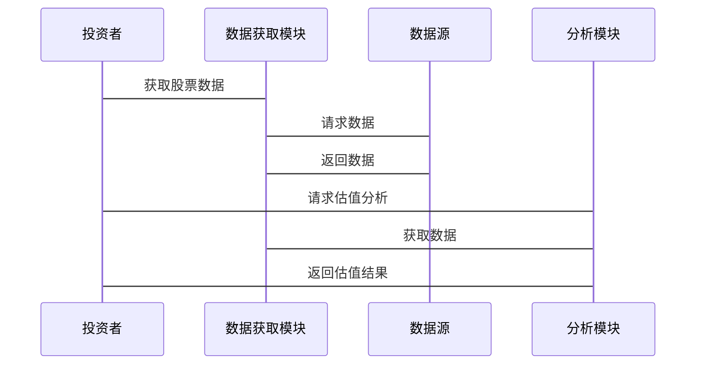

                 

# 巴菲特-芒格策略在个人投资中的应用

> 关键词：巴菲特，芒格，价值投资，股票估值，投资策略，DCF模型

> 摘要：本文深入探讨巴菲特和芒格的投资策略在个人投资中的应用，分析其核心理念、选股逻辑、投资组合管理方法，并结合数学模型和系统架构，为读者提供一套系统化、可操作的投资指导。

---

## 第一部分: 巴菲特-芒格策略的背景与核心理念

### 第1章: 价值投资的起源与发展

#### 1.1 价值投资的定义与起源
##### 1.1.1 价值投资的定义
价值投资是一种以基本面分析为基础的投资方法，旨在通过购买低于其内在价值的股票，实现长期收益。其核心在于寻找市场低估的优质资产。

##### 1.1.2 价值投资的历史发展
价值投资起源于20世纪初，本杰明·格雷厄姆和戴维·多德是这一理念的先驱。他们提出“安全边际”概念，强调以低于内在价值的价格买入股票。

##### 1.1.3 巴菲特与芒格对价值投资的贡献
巴菲特师承格雷厄姆，但将其发展为更注重公司基本面和长期竞争优势的投资策略。芒格则通过“多元思维模型”丰富了价值投资的理论框架。

#### 1.2 巴菲特与芒格的投资哲学
##### 1.2.1 巴菲特的“护城河”理论
巴菲特提出“经济护城河”概念，认为具有强大竞争优势的公司能够在长期获得超额收益。

##### 1.2.2 芒格的“多元思维模型”
芒格强调跨学科思考，将物理学、心理学、经济学等领域的知识整合，以更好地理解市场和公司。

##### 1.2.3 巴菲特与芒格投资理念的异同
巴菲特注重公司的财务状况和竞争优势，芒格则更强调思维框架和知识的多样性。两人理念互补，共同构建了完整的投资体系。

### 第2章: 巴菲特-芒格策略的核心原则

#### 2.1 价值投资的核心原则
##### 2.1.1 买入优秀公司而非股票
巴菲特强调投资优质公司，而非仅仅关注股票价格。他主张买入那些具有持续竞争优势和良好管理的公司。

##### 2.1.2 长期持有优质资产
巴菲特点明投资的本质是寻找那些能够持续创造价值的企业，长期持有才能获得复利效应。

##### 2.1.3 避免短期市场波动
巴菲特认为市场短期波动难以预测，投资者应关注企业的长期价值，避免被短期市场情绪左右。

#### 2.2 股票估值的核心方法
##### 2.2.1 市盈率与市净率分析
市盈率（P/E）=股价/每股收益，市净率（P/B）=股价/每股净资产。这些指标可以帮助投资者评估股票的相对估值。

##### 2.2.2 现金流折现模型（DCF）
DCF模型通过将未来现金流折现到现值，估算企业的内在价值。公式如下：
$$DCF = \frac{CF_1}{(1+r)^1} + \frac{CF_2}{(1+r)^2} + \cdots + \frac{CF_n}{(1+r)^n}$$

##### 2.2.3 股东权益收益率（ROE）
ROE=净利润/股东权益，反映企业运用股东资金的效率。

#### 2.3 财务报表分析与企业基本面评估
##### 2.3.1 资产负债表分析
分析公司的资产、负债和所有者权益，评估其财务健康状况。

##### 2.3.2 利润表分析
通过收入、成本和利润分析企业的盈利能力。

##### 2.3.3 现金流量表分析
评估企业的现金流状况，判断其经营稳健性。

### 第3章: 巴菲特-芒格策略的选股逻辑

#### 3.1 选股的核心要素
##### 3.1.1 行业地位与竞争优势
选择行业龙头，具有强大的竞争优势和市场地位。

##### 3.1.2 财务健康状况
关注企业的盈利能力、现金流状况和资产负债表健康。

##### 3.1.3 管理团队能力
优秀的管理团队是企业持续发展的关键。

#### 3.2 股票投资的长期逻辑
##### 3.2.1 经济周期与投资机会
根据经济周期调整投资策略，抓住结构性机会。

##### 3.2.2 行业趋势分析
关注行业发展趋势，选择具备长期增长潜力的行业。

##### 3.2.3 公司成长性评估
通过分析公司历史增长和未来前景，评估其成长性。

### 第4章: 巴菲特-芒格策略的投资组合管理

#### 4.1 投资组合的构建原则
##### 4.1.1 资产配置的基本原则
根据风险承受能力和投资目标，合理配置股票、债券等资产。

##### 4.1.2 风险控制的策略
设置止损点，分散投资，降低风险。

##### 4.1.3 长期投资与复利效应
通过长期持有优质资产，实现财富的稳步增长。

#### 4.2 投资组合的动态调整
##### 4.2.1 定期评估与调整
定期审视投资组合，根据市场变化和个人目标进行调整。

##### 4.2.2 市场变化的应对策略
根据市场环境变化，灵活调整投资策略。

##### 4.2.3 个人风险承受能力的调整
根据个人风险偏好和财务状况，动态调整投资组合。

### 第5章: 巴菲特-芒格策略的数学模型与分析

#### 5.1 股票估值的数学模型
##### 5.1.1 现金流折现模型（DCF）的公式推导
$$DCF = \frac{CF_1}{(1+r)^1} + \frac{CF_2}{(1+r)^2} + \cdots + \frac{CF_n}{(1+r)^n}$$

##### 5.1.2 市盈率与市净率的比较分析
$$P/E = \frac{Price}{Earnings}$$
$$P/B = \frac{Price}{Book\ Value}$$

#### 5.2 股票价值评估的案例分析
以苹果公司为例，计算其DCF价值，比较其市盈率和市净率，评估其内在价值。

---

## 第二部分: 巴菲特-芒格策略的系统分析与架构设计

### 第6章: 系统分析与架构设计方案

#### 6.1 问题场景介绍
投资者需要一个系统化的投资框架，结合基本面分析和市场趋势，制定个性化的投资策略。

#### 6.2 系统功能设计
##### 6.2.1 领域模型（Mermaid类图）

#### 6.3 系统架构设计
##### 6.3.1 系统架构（Mermaid架构图）

#### 6.4 系统接口设计
##### 6.4.1 数据接口
- 获取股票数据接口
- 获取市场数据接口

##### 6.4.2 分析接口
- 股票估值接口
- 投资组合优化接口

#### 6.5 系统交互设计
##### 6.5.1 交互流程（Mermaid序列图）

---

## 第三部分: 巴菲特-芒格策略的项目实战

### 第7章: 项目实战

#### 7.1 环境安装
安装Python、Pandas、NumPy等工具，配置数据源接口。

#### 7.2 核心实现
##### 7.2.1 数据获取与预处理
编写Python代码，从Yahoo Finance获取股票数据，进行清洗和整理。

##### 7.2.2 股票估值计算
实现DCF模型，计算股票的内在价值。

##### 7.2.3 投资组合优化
基于现代投资组合理论，优化资产配置。

#### 7.3 实际案例分析
以实际股票为例，展示如何应用巴菲特-芒格策略进行投资决策。

#### 7.4 项目小结
总结项目实施过程，提出改进建议。

---

## 第四部分: 巴菲特-芒格策略的最佳实践

### 第8章: 最佳实践

#### 8.1 小结
总结巴菲特-芒格策略的核心要点，强调长期投资和价值发现的重要性。

#### 8.2 注意事项
提醒投资者注意市场风险、数据偏差和模型局限性。

#### 8.3 拓展阅读
推荐相关书籍和资源，进一步深入学习巴菲特-芒格策略。

---

## 作者：AI天才研究院/AI Genius Institute & 禅与计算机程序设计艺术 /Zen And The Art of Computer Programming

