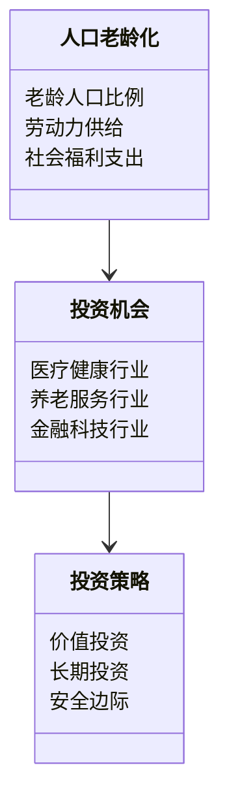
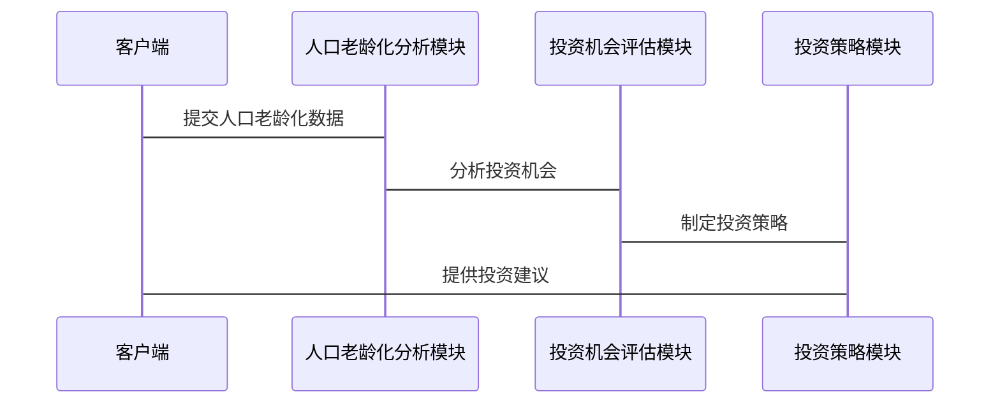

                 


# 巴菲特如何看待人口老龄化带来的投资机会

> 关键词：巴菲特，人口老龄化，投资机会，价值投资，长期投资，经济影响

> 摘要：本文从巴菲特的投资理念出发，分析人口老龄化对经济和社会的影响，探讨巴菲特如何看待这一趋势带来的投资机会。通过详细解读巴菲特的价值投资策略，结合实际案例，揭示人口老龄化背景下潜在的投资方向和策略。

---

## 第一章：人口老龄化与投资机会的背景介绍

### 1.1 人口老龄化的定义与特征

#### 1.1.1 人口老龄化的定义
人口老龄化是指人口中65岁及以上老年人口比例不断上升的过程。这一趋势在全球范围内加速，尤其是在发达国家和发展中国家。

#### 1.1.2 人口老龄化的特征
- 老龄人口比例增加
- 劳动力人口比例下降
- 养老负担加重
- 社会福利支出增加

#### 1.1.3 人口老龄化的社会影响
- 经济增长放缓
- 医疗需求增加
- 养老服务行业兴起

### 1.2 投资机会的基本概念

#### 1.2.1 投资机会的定义
投资机会是指在特定市场或行业中的潜在收益高于平均水平的领域。

#### 1.2.2 投资机会的分类
- 高增长行业
- 高利润行业
- 抗周期性行业

#### 1.2.3 投资机会的评估标准
- 行业增长潜力
- 财务健康状况
- 竞争优势

### 1.3 人口老龄化与投资机会的关系

#### 1.3.1 人口老龄化对经济的影响
- 减少劳动力供给
- 增加社会保障支出
- 推动医疗和养老服务需求

#### 1.3.2 人口老龄化对资本市场的影响
- 债市需求增加
- 股市结构性机会
- 创新行业潜力

#### 1.3.3 人口老龄化对行业选择的影响
- 医疗健康行业
- 养老服务行业
- 金融科技行业

---

## 第二章：巴菲特的投资理念

### 2.1 巴菲特的投资哲学

#### 2.1.1 价值投资的定义
价值投资是一种以低于内在价值的价格买入优质股票的投资策略。

#### 2.1.2 长期投资的重要性
长期持有优质资产，避免频繁交易，减少成本和风险。

#### 2.1.3 安全边际的概念
安全边际是指股票价格低于其内在价值的程度，确保投资的安全性。

### 2.2 巴菲特的投资策略

#### 2.2.1 股票选择的标准
- 高ROE（净资产收益率）
- 稳定的盈利能力
- 强大的竞争优势

#### 2.2.2 财务报表分析的重要性
- 重视现金流
- 分析负债结构
- 评估收益质量

#### 2.2.3 行业分析的技巧
- 选择具有长期增长潜力的行业
- 关注行业龙头
- 避免波动性大的行业

### 2.3 巴菲特对人口老龄化的看法

#### 2.3.1 人口老龄化是全球性问题
- 全球范围内，人口老龄化趋势不可逆转。
- 老龄人口增加，社会结构发生变化。

#### 2.3.2 人口老龄化对经济的长期影响
- 劳动力短缺可能导致生产效率下降。
- 政府和社会福利支出增加，可能影响经济增长。

#### 2.3.3 人口老龄化对投资机会的潜在影响
- 医疗健康行业需求增加。
- 养老服务行业迎来发展机遇。
- 金融科技行业可能面临新的挑战和机遇。

---

## 第三章：人口老龄化与投资机会的数学模型

### 3.1 人口老龄化对经济增长的数学模型

#### 3.1.1 经济增长的定义
经济增长是指一个国家或地区在一定时期内总产出的增加。

#### 3.1.2 人口老龄化对经济增长的影响
$$ \text{经济增长} = f(\text{劳动力数量}, \text{资本积累}, \text{技术创新}) $$

#### 3.1.3 数学模型的建立
$$ G = aL + bK + cT $$
其中，$G$ 表示经济增长，$L$ 表示劳动力数量，$K$ 表示资本积累，$T$ 表示技术创新，$a$、$b$、$c$为系数。

### 3.2 人口老龄化对投资机会的数学模型

#### 3.2.1 投资回报的计算
$$ \text{投资回报率} = \frac{\text{净利润}}{\text{总投资}} $$

#### 3.2.2 行业增长潜力的评估
$$ \text{行业增长潜力} = \text{人口老龄化程度} \times \text{行业需求弹性} $$

#### 3.2.3 投资组合优化模型
$$ \max \text{收益} $$
$$ \text{约束：风险可控，行业分布合理} $$

---

## 第四章：系统分析与架构设计

### 4.1 问题场景介绍

#### 4.1.1 人口老龄化带来的投资机会
- 医疗健康行业需求增加。
- 养老服务行业迎来发展机遇。
- 金融科技行业可能面临新的挑战和机遇。

### 4.2 项目介绍

#### 4.2.1 项目目标
分析人口老龄化对投资机会的影响，提出巴菲特视角下的投资策略。

### 4.3 系统功能设计

#### 4.3.1 领域模型（Mermaid 类图）


### 4.4 系统架构设计

#### 4.4.1 系统架构图（Mermaid 架构图）


### 4.5 系统接口设计

#### 4.5.1 输入接口
- 人口老龄化数据
- 行业分析报告

#### 4.5.2 输出接口
- 投资机会评估报告
- 投资策略建议

### 4.6 系统交互设计

#### 4.6.1 序列图（Mermaid 序列图）


---

## 第五章：项目实战

### 5.1 环境安装

#### 5.1.1 安装 Python 环境
使用 Anaconda 或者 virtualenv 创建独立的 Python 环境。

#### 5.1.2 安装必要的库
```bash
pip install pandas numpy matplotlib
```

### 5.2 核心实现源代码

#### 5.2.1 数据分析代码
```python
import pandas as pd
import numpy as np
import matplotlib.pyplot as plt

# 假设我们有一个老龄化数据集
data = {
    '国家': ['美国', '日本', '德国', '中国'],
    '老龄化比例': [22, 28, 24, 14],
    'GDP增长率': [2.2, 1.2, 1.5, 6.5]
}

df = pd.DataFrame(data)
print(df)
```

#### 5.2.2 投资策略代码
```python
def calculate_investment_return(profits, investment):
    return (profits / investment) * 100

# 示例数据
profits = [100, 200, 300]
investment = 1000

returns = [calculate_investment_return(p, investment) for p in profits]
print(returns)
```

### 5.3 实际案例分析

#### 5.3.1 案例背景
假设某国人口老龄化严重，医疗健康行业需求激增。

#### 5.3.2 数据分析与解读
- 医疗健康行业的利润增长高于行业平均水平。
- 医疗保险公司的市盈率低于行业平均水平。

#### 5.3.3 投资策略制定
- 增加对医疗健康行业的投资比例。
- 选择具有强大竞争优势的公司。

### 5.4 项目小结

#### 5.4.1 成功因素
- 数据分析准确
- 投资策略合理
- 风险控制得当

#### 5.4.2 经验教训
- 需要持续关注行业动态
- 风险评估需要更加全面

---

## 第六章：最佳实践与总结

### 6.1 投资策略的总结

#### 6.1.1 巴菲特的投资理念
- 长期投资，价值投资
- 选择优质资产，避免短期波动

#### 6.1.2 人口老龄化带来的投资机会
- 医疗健康行业
- 养老服务行业
- 金融科技行业

### 6.2 小结

#### 6.2.1 投资策略的核心
- 理解人口老龄化趋势
- 分析行业增长潜力
- 把握投资机会

### 6.3 注意事项

#### 6.3.1 风险提示
- 市场波动风险
- 政策变化风险
- 行业竞争风险

#### 6.3.2 投资纪律
- 遵循投资策略
- 避免情绪化决策
- 定期评估投资组合

### 6.4 拓展阅读

#### 6.4.1 推荐书籍
- 《巴菲特传》
- 《投资学原理》
- 《老龄化经济学》

#### 6.4.2 推荐网站
-巴菲特股东大会直播
- 金融数据分析平台

---

## 作者信息

作者：AI天才研究院/AI Genius Institute & 禅与计算机程序设计艺术 /Zen And The Art of Computer Programming

---

感谢您的阅读！如需进一步探讨，请随时联系。

