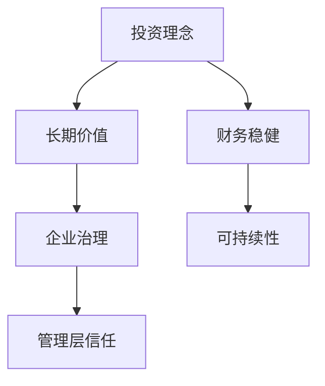
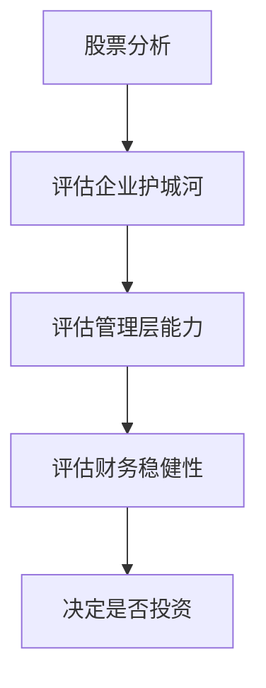
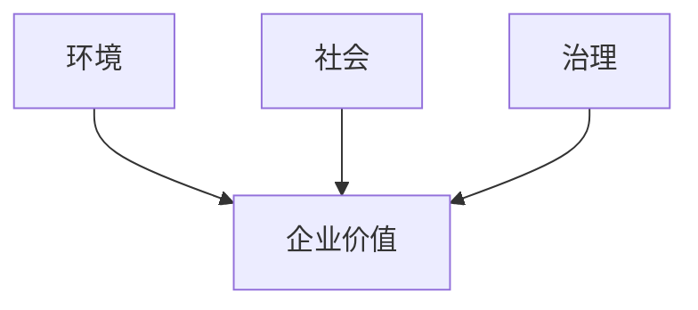
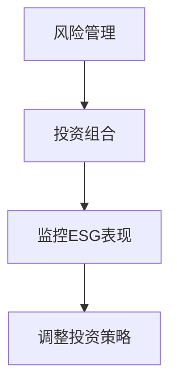

                 


# 巴菲特如何看待可持续发展投资

**关键词：** 巴菲特、可持续发展投资、价值投资、企业治理、社会责任

**摘要：** 巴菲特的长期价值投资理念与可持续发展投资有着深刻的联系。本文分析了巴菲特如何看待可持续发展投资，探讨了他如何将可持续发展的原则融入其投资决策中，以及这对投资策略的影响。通过详细分析巴菲特的投资哲学、企业治理观和风险管理策略，本文揭示了可持续发展投资在长期投资中的重要性，并结合实际案例，展示了如何在实际投资中应用这些理念。

---

## 目录大纲

1. **可持续发展投资的背景与重要性**
   1.1 可持续发展投资的定义与核心概念
   1.2 巴菲特与可持续发展投资的关系

2. **巴菲特的价值投资与可持续发展**
   2.1 巴菲特的价值投资方法
   2.2 可持续发展与企业价值的关系

3. **巴菲特投资决策中的可持续发展因素**
   3.1 巴菲特对管理层的信任
   3.2 巴菲特对财务指标的关注

4. **可持续发展投资的策略与实践**
   4.1 可持续发展投资的筛选标准
   4.2 长期投资策略与风险管理

5. **案例分析：巴菲特的可持续投资实践**
   5.1 投资案例分析
   5.2 案例中的可持续发展因素

6. **总结与展望**
   6.1 巴菲特观点的总结
   6.2 可持续投资的未来趋势

7. **附录**
   7.1 参考文献
   7.2 工具推荐

---

## 第一部分：可持续发展投资的背景与重要性

### 1.1 可持续发展投资的定义与核心概念

可持续发展投资（Sustainable Investment）是一种将环境、社会和治理（ESG）因素纳入投资决策的投资策略。其核心在于通过投资于那些在可持续性方面表现良好的企业，以实现长期的经济回报和社会价值。以下是可持续发展投资的几个关键概念：

- **环境因素（E）：** 包括企业在资源使用、排放、污染等方面的表现。
- **社会因素（S）：** 包括企业在员工权益、社区参与、产品安全等方面的表现。
- **治理因素（G）：** 包括企业在董事会结构、高管薪酬、透明度等方面的表现。

#### 对比表格：可持续投资与传统投资的差异

| **维度** | **可持续投资** | **传统投资** |
|----------|----------------|--------------|
| 目标     | 长期可持续回报 | 短期财务回报 |
| 方法     | 考虑ESG因素     | 仅关注财务指标 |
| 收益     | 社会与经济双重回报 | 经济回报为主 |

### 1.2 巴菲特与可持续发展投资的关系

巴菲特作为价值投资的代表人物，他的投资理念强调企业的长期价值和稳健的财务表现。虽然他并未公开大量谈论可持续发展，但他的投资决策中隐含了许多可持续发展的原则。

#### mermaid图：巴菲特投资理念的系统架构



---

## 第二部分：巴菲特的价值投资与可持续发展

### 2.1 巴菲特的价值投资方法

巴菲特的价值投资方法强调购买具有强大护城河、良好管理层和稳健财务表现的企业。这种方法与可持续发展投资有许多共通之处。

#### 算法流程图：巴菲特的价值投资分析



#### Python代码示例：计算市盈率

```python
def calculate_pe_ratio(price, earnings):
    return price / earnings

# 示例：某公司的股价为100美元，每股收益为25美元
pe_ratio = calculate_pe_ratio(100, 25)
print(f"市盈率为：{pe_ratio}")
```

#### 数学公式：市盈率计算

$$ \text{市盈率} = \frac{\text{股价}}{\text{每股收益}} $$

### 2.2 可持续发展与企业价值的关系

巴菲特认为，企业的长期价值不仅取决于其财务表现，还与其在可持续发展方面的表现有关。以下是可持续发展与企业价值关系的分析：

- **环境影响：** 环保表现良好的企业通常具有更低的运营成本和更高的品牌价值。
- **社会责任：** 具有社会责任感的企业更容易获得消费者的信任和市场的认可。
- **治理结构：** 良好的公司治理能够确保企业的长期稳定发展。

#### mermaid图：企业价值影响因素



---

## 第三部分：巴菲特投资决策中的可持续发展因素

### 3.1 巴菲特对管理层的信任

巴菲特认为，优秀的管理层是企业成功的关键。他特别关注管理层的道德品质和决策能力。

#### 投资案例：巴菲特投资可口可乐的原因

可口可乐的管理层在巴菲特看来，具有卓越的领导力和长期的愿景。此外，可口可乐在环境保护方面的努力也增强了其品牌形象。

### 3.2 巴菲特对财务指标的关注

巴菲特对财务指标的关注是他的投资决策的重要组成部分。他特别关注企业的盈利能力、现金流和负债水平。

#### 项目实战：分析企业的财务健康状况

使用Python分析企业的财务数据，评估其可持续发展潜力。

```python
import pandas as pd

# 假设我们有一个包含财务数据的DataFrame df
# 计算企业的净利率
net_profit_margin = df['净利润'] / df['收入'] * 100
print(f"净利率为：{net_profit_margin}")
```

---

## 第四部分：可持续发展投资的策略与实践

### 4.1 可持续发展投资的筛选标准

在选择投资标的时，投资者应关注企业的ESG表现。

#### 工具推荐：使用ESG评级机构的数据进行筛选

例如，使用MSCI的ESG评级来评估企业的可持续发展表现。

### 4.2 长期投资策略与风险管理

可持续发展投资应结合长期投资策略，并注重风险管理。

#### mermaid图：风险管理流程



---

## 第五部分：案例分析：巴菲特的可持续投资实践

### 5.1 投资案例分析

分析巴菲特投资的公司，如苹果、可口可乐和美国运通，探讨其可持续发展表现。

### 5.2 案例中的可持续发展因素

这些公司在环境保护、社会责任和公司治理方面都有良好的表现。

---

## 第六部分：总结与展望

### 6.1 巴菲特观点的总结

巴菲特的长期价值投资理念与可持续发展投资有着内在的联系。通过关注企业的长期价值和管理层能力，巴菲特的投资决策体现了可持续发展的原则。

### 6.2 可持续投资的未来趋势

随着全球对可持续发展的关注增加，可持续投资将成为未来的重要趋势。

---

## 附录

### 7.1 参考文献

- 巴菲特的股东大会演讲
- 环境、社会和治理（ESG）相关研究

### 7.2 工具推荐

- MSCI ESG评级
- 公司治理评分工具

---

## 作者

**作者：AI天才研究院 & 禅与计算机程序设计艺术**

---

通过以上结构和内容，本文详细探讨了巴菲特如何看待可持续发展投资，并结合实际案例和系统分析，为读者提供了全面的视角。

