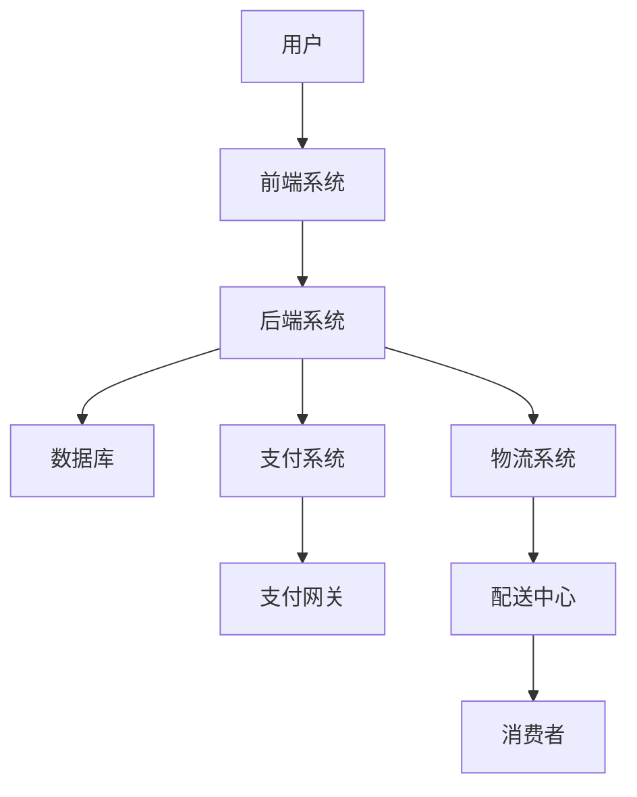
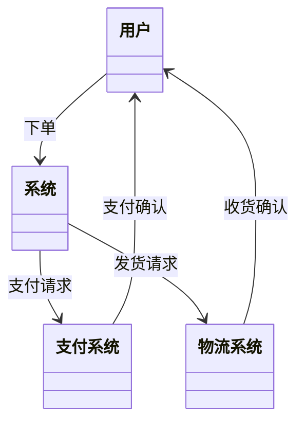
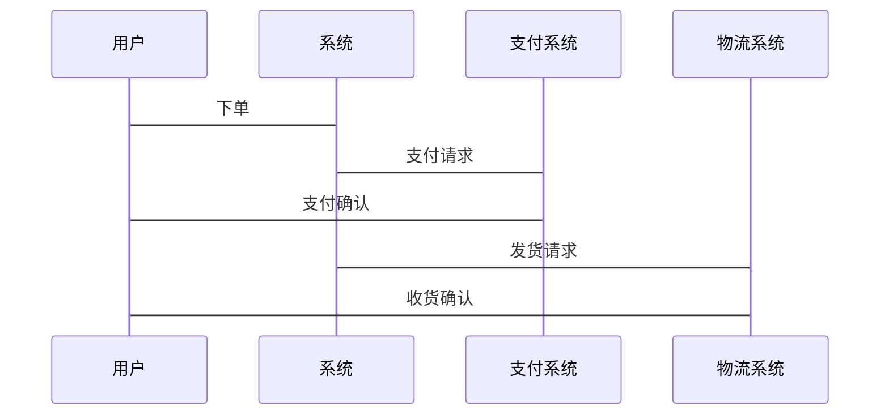

                 


```markdown
# 巴菲特如何看待新零售模式的投资机会

> 关键词：巴菲特，新零售模式，投资机会，价值投资，大数据分析，人工智能，供应链优化

> 摘要：本文探讨了巴菲特对新零售模式的投资机会的看法，结合新零售模式的核心概念、技术驱动因素和投资价值，分析巴菲特的投资理念和策略。文章从背景介绍、核心概念、算法原理、系统分析、项目实战和最佳实践等多个方面展开，深入剖析新零售模式的投资机会与挑战，为投资者提供有价值的见解和指导。

---

## 第一部分：新零售模式的背景与现状

### 第1章：新零售模式的定义与背景

#### 1.1 新零售的概念与特点

##### 1.1.1 新零售的定义
新零售（New Retail）是指以消费者体验为核心，通过大数据、人工智能、物联网等技术手段，将线上、线下和物流深度融合的一种新型零售模式。它打破了传统零售的时空限制，实现了全渠道、全场景的无缝连接。

##### 1.1.2 新零售的核心特点
- **数据驱动**：利用大数据分析消费者行为，实现精准营销和个性化服务。
- **技术驱动**：依赖人工智能、物联网、区块链等技术，提升运营效率和消费者体验。
- **全渠道融合**：线上线下一体化，实现无缝购物体验。
- **快速迭代**：通过实时数据反馈，快速调整供应链和营销策略。

##### 1.1.3 新零售与传统零售的对比
| 对比维度 | 传统零售 | 新零售 |
|----------|----------|--------|
| 渠道      | 单一（线上或线下） | 全渠道融合 |
| 技术应用  | 少或无     | 高度依赖技术 |
| 消费者体验 | 单一       | 个性化、沉浸式 |
| 供应链效率 | 低效       | 高效、实时反馈 |

#### 1.2 新零售的驱动因素

##### 1.2.1 技术驱动
- 大数据：分析消费者行为，优化库存管理和营销策略。
- 人工智能：实现智能推荐、自动化服务和预测性维护。
- 物联网：连接设备，实时监控库存和物流状态。

##### 1.2.2 消费者需求变化
- 消费者追求便捷、个性化和沉浸式的购物体验。
- 消费者对价格敏感，注重性价比和透明度。

##### 1.2.3 行业整合与竞争加剧
- 零售行业整合加速，传统企业纷纷转型。
- 新零售模式推动行业格局变化，新兴企业和传统企业竞争激烈。

---

### 第2章：新零售模式的投资机会

#### 2.1 新零售市场的现状分析

##### 2.1.1 全球新零售市场规模
- 全球新零售市场规模持续增长，预计到2025年将达到数万亿美元。
- 中国是全球最大的新零售市场，占全球市场的40%以上。

##### 2.1.2 中国市场发展现状
- 支付宝、微信支付等移动支付普及，推动线上线下融合。
- 无人零售店、智能货架等新兴业态快速发展。
- 供应链技术（如区块链）在新零售中的应用逐渐普及。

##### 2.1.3 技术推动下的市场增长
- 大数据和人工智能技术的应用提升了运营效率和消费者体验。
- 5G技术的应用加速了新零售的场景化和智能化。

#### 2.2 新零售模式的主要投资机会

##### 2.2.1 大数据与人工智能
- 投资于大数据分析公司，提升消费者行为分析能力。
- 投资于人工智能技术，实现智能推荐和自动化服务。

##### 2.2.2 无人零售与智能终端
- 投资于无人零售设备（如无人货架、无人便利店）。
- 投资于智能终端设备（如智能支付终端、智能试衣镜）。

##### 2.2.3 供应链优化与效率提升
- 投资于供应链管理技术，提升库存管理和物流效率。
- 投资于区块链技术，实现供应链透明化和可信化。

#### 2.3 新零售模式的投资风险与挑战

##### 2.3.1 市场竞争加剧
- 新零售市场参与者众多，竞争激烈，可能导致利润压缩。
- 技术门槛高，中小企业难以负担高昂的研发和运营成本。

##### 2.3.2 技术实施难度
- 需要投入大量资金和资源进行技术开发和系统集成。
- 技术更新换代快，需要持续投入进行技术升级和创新。

##### 2.3.3 消费者接受度
- 消费者对新零售模式的接受度存在差异，部分消费者仍偏好传统购物方式。
- 数据隐私和安全问题可能影响消费者信任。

---

## 第二部分：巴菲特的投资理念与新零售模式

### 第3章：巴菲特的投资策略与原则

#### 3.1 巴菲特的投资理念

##### 3.1.1 价值投资的核心思想
- 买入低于内在价值的股票，长期持有，等待价值回归。
- 重点关注企业的基本面，包括盈利能力、财务状况和管理团队。

##### 3.1.2 长期投资与企业基本面分析
- 长期投资，避免频繁交易。
- 重点分析企业的财务报表，评估企业的盈利能力和成长潜力。

##### 3.1.3 股东权益最大化
- 投资于能够为股东创造最大价值的企业。
- 重点关注企业的ROE（净资产收益率）和ROA（资产收益率）。

#### 3.2 巴菲特的投资原则

##### 3.2.1 质量优先于数量
- 集中投资于少数优质企业，避免过度分散。
- 选择行业龙头，具有强大的竞争优势和护城河。

##### 3.2.2 避免过度分散投资
- 避免投资于不熟悉的行业或企业。
- 重点投资于具有长期竞争优势的企业。

##### 3.2.3 长期持有与耐心投资
- 长期持有优质股票，避免短期波动的影响。
- 选择具有持续增长潜力的企业，等待其价值增长。

### 第4章：巴菲特如何看待新零售模式

#### 4.1 巴菲特对新零售模式的判断标准

##### 4.1.1 企业的核心竞争力
- 具备强大的技术优势，能够持续创新和优化。
- 具备高效的供应链管理和运营能力。

##### 4.1.2 行业的长期发展趋势
- 行业具有广阔的市场空间和增长潜力。
- 行业处于技术驱动的升级阶段，具备长期竞争优势。

##### 4.1.3 管理层的能力与决策
- 管理层具备优秀的领导能力和战略眼光。
- 管理层能够有效应对市场变化和挑战，推动企业持续发展。

#### 4.2 巴菲特对新零售模式的潜在投资机会

##### 4.2.1 技术驱动的创新企业
- 投资于大数据和人工智能技术领先的企业。
- 投资于无人零售和智能终端领域的创新企业。

##### 4.2.2 具备强大供应链能力的企业
- 投资于供应链管理技术领先的企业。
- 投资于能够实现供应链透明化和可信化的区块链技术企业。

##### 4.2.3 消费者体验优化的企业
- 投资于能够提供个性化和沉浸式购物体验的企业。
- 投资于能够有效提升消费者体验的技术和服务企业。

#### 4.3 巴菲特对新零售模式的潜在风险

##### 4.3.1 市场竞争加剧
- 新零售市场参与者众多，竞争激烈，可能导致利润压缩。
- 技术门槛高，中小企业难以负担高昂的研发和运营成本。

##### 4.3.2 技术实施难度
- 需要投入大量资金和资源进行技术开发和系统集成。
- 技术更新换代快，需要持续投入进行技术升级和创新。

##### 4.3.3 消费者接受度
- 消费者对新零售模式的接受度存在差异，部分消费者仍偏好传统购物方式。
- 数据隐私和安全问题可能影响消费者信任。

---

## 第三部分：新零售模式的核心概念与技术分析

### 第5章：新零售模式的核心概念与技术分析

#### 5.1 新零售模式的核心概念

##### 5.1.1 技术驱动因素
- 大数据：分析消费者行为，优化库存管理和营销策略。
- 人工智能：实现智能推荐、自动化服务和预测性维护。
- 物联网：连接设备，实时监控库存和物流状态。

##### 5.1.2 生态系统构建
- 通过线上线下融合，构建完整的零售生态系统。
- 通过供应链优化和数据共享，实现生态系统的协同发展。

#### 5.2 新零售模式的技术架构

##### 5.2.1 大数据分析
- 数据采集：通过传感器、摄像头、RFID等设备采集消费者行为数据。
- 数据处理：利用大数据平台（如Hadoop、Spark）进行数据清洗和处理。
- 数据分析：使用机器学习算法（如随机森林、神经网络）进行消费者行为分析和预测。

##### 5.2.2 人工智能应用
- 智能推荐：基于用户行为数据，推荐个性化商品。
- 自动化服务：实现无人零售和智能客服。
- 预测性维护：预测设备故障，提前进行维护。

##### 5.2.3 物联网应用
- 实时监控：通过物联网设备实时监控库存和物流状态。
- 智能连接：通过物联网技术实现设备间的互联互通。
- 智能决策：基于实时数据，优化供应链和营销策略。

#### 5.3 新零售模式的生态系统

##### 5.3.1 生态系统架构
- 用户：消费者通过多种渠道与企业互动。
- 系统：包括前端（如网站、APP）和后端（如数据库、服务器）。
- 支付：通过第三方支付平台（如支付宝、微信支付）完成交易。
- 物流：通过物流系统实现商品配送。

##### 5.3.2 生态系统案例
- 某新零售企业的生态系统架构图（使用Mermaid绘制）：



---

## 第四部分：算法原理与系统设计

### 第6章：算法原理

#### 6.1 大数据分析

##### 6.1.1 数据采集
- 使用传感器、摄像头、RFID等设备采集消费者行为数据。
- 通过API接口获取线上平台的交易数据。

##### 6.1.2 数据处理
- 使用Hadoop进行数据清洗和预处理。
- 使用Spark进行数据转换和分析。

##### 6.1.3 数据分析
- 使用Python的pandas库进行数据清洗和分析。
- 使用Matplotlib进行数据可视化。

##### 6.1.4 数据建模
- 使用机器学习算法（如随机森林、XGBoost）进行消费者行为预测。

##### 6.1.5 案例分析
- 使用Python代码实现消费者行为分析：

```python
import pandas as pd
from sklearn.ensemble import RandomForestClassifier
from sklearn.metrics import accuracy_score

# 加载数据
data = pd.read_csv('consumer_behavior.csv')

# 特征选择
features = data.drop('label', axis=1)
label = data['label']

# 模型训练
model = RandomForestClassifier(n_estimators=100)
model.fit(features, label)

# 模型预测
predictions = model.predict(features)

# 模型评估
print("Accuracy:", accuracy_score(label, predictions))
```

#### 6.2 人工智能应用

##### 6.2.1 智能推荐
- 使用协同过滤算法（Collaborative Filtering）进行商品推荐。
- 使用矩阵分解（Matrix Factorization）优化推荐效果。

##### 6.2.2 自动化服务
- 使用自然语言处理（NLP）技术实现智能客服。
- 使用计算机视觉（CV）技术实现商品识别和图像处理。

##### 6.2.3 预测性维护
- 使用时间序列分析（Time Series Analysis）预测设备故障。
- 使用回归分析（Regression Analysis）优化维护策略。

---

### 第7章：系统设计

#### 7.1 系统分析

##### 7.1.1 问题场景
- 某新零售企业需要优化供应链和营销策略。
- 企业希望通过数据分析实现精准营销和库存优化。

##### 7.1.2 项目介绍
- 项目目标：提升消费者体验和运营效率。
- 项目范围：覆盖线上线下渠道，实现数据共享和协同。

#### 7.2 系统功能设计

##### 7.2.1 领域模型
- 使用Mermaid类图展示系统功能：



##### 7.2.2 系统架构
- 使用Mermaid架构图展示系统架构：

```mermaid
archi
    客户端 --> API网关
    API网关 --> 服务层
    服务层 --> 数据库
    数据库 --> 第三方服务（支付、物流）
```

##### 7.2.3 接口设计
- API接口文档：
  - GET /users: 获取用户信息。
  - POST /orders: 提交订单。
  - GET /products: 获取商品信息。
  - POST /payments: 提交支付请求。

##### 7.2.4 交互流程
- 使用Mermaid序列图展示交互流程：



---

## 第五部分：项目实战

### 第8章：项目实战

#### 8.1 环境安装

##### 8.1.1 Python环境
- 安装Python 3.8及以上版本。
- 安装Jupyter Notebook用于数据分析和可视化。

##### 8.1.2 数据库安装
- 安装MySQL或PostgreSQL用于存储和处理数据。
- 安装JDBC驱动或连接器。

##### 8.1.3 开发工具
- 安装PyCharm或VS Code用于代码开发。
- 安装Git用于版本控制。

#### 8.2 系统核心实现

##### 8.2.1 数据采集
- 使用Python的requests库抓取网页数据。
- 使用BeautifulSoup库进行数据解析。

##### 8.2.2 数据处理
- 使用pandas库进行数据清洗和预处理。
- 使用numpy库进行数据计算和分析。

##### 8.2.3 数据建模
- 使用scikit-learn库训练机器学习模型。
- 使用GridSearchCV进行超参数优化。

##### 8.2.4 系统实现
- 使用Flask框架开发Web应用。
- 使用Django框架开发后端系统。

##### 8.2.5 代码实现
- 消费者行为分析代码：

```python
import pandas as pd
from sklearn.ensemble import RandomForestClassifier
from sklearn.metrics import accuracy_score

# 加载数据
data = pd.read_csv('consumer_behavior.csv')

# 特征选择
features = data.drop('label', axis=1)
label = data['label']

# 模型训练
model = RandomForestClassifier(n_estimators=100)
model.fit(features, label)

# 模型预测
predictions = model.predict(features)

# 模型评估
print("Accuracy:", accuracy_score(label, predictions))
```

#### 8.3 实际案例分析

##### 8.3.1 案例分析
- 分析某新零售企业的实际运营数据，优化其供应链和营销策略。
- 使用机器学习模型预测消费者的购买行为，提升精准营销效果。

##### 8.3.2 案例总结
- 总结案例中的经验教训，提出改进建议。
- 提供可行的优化方案，如引入区块链技术实现供应链透明化。

#### 8.4 项目小结

##### 8.4.1 项目成果
- 成功开发并部署新零售系统。
- 提升企业的运营效率和消费者体验。

##### 8.4.2 项目经验
- 学习了新零售模式的核心技术和实现方法。
- 提高了大数据分析和人工智能应用的能力。

---

## 第六部分：最佳实践与总结

### 第9章：最佳实践

#### 9.1 最佳实践

##### 9.1.1 小结
- 新零售模式的投资机会巨大，但同时也伴随着技术和市场的双重挑战。
- 投资者需要具备技术背景和行业洞察力，才能在新零售市场中获得长期收益。

##### 9.1.2 注意事项
- 选择具备强大技术优势和管理能力的企业进行投资。
- 保持对市场和技术的敏感性，及时调整投资策略。
- 控制投资风险，避免过度分散和盲目跟风。

##### 9.1.3 拓展阅读
- 推荐书籍：《巴菲特传》、《新零售实战手册》。
- 推荐网站：新浪财经、东方财富网、投资界。

---

## 作者：AI天才研究院/AI Genius Institute & 禅与计算机程序设计艺术/Zen And The Art of Computer Programming
```

