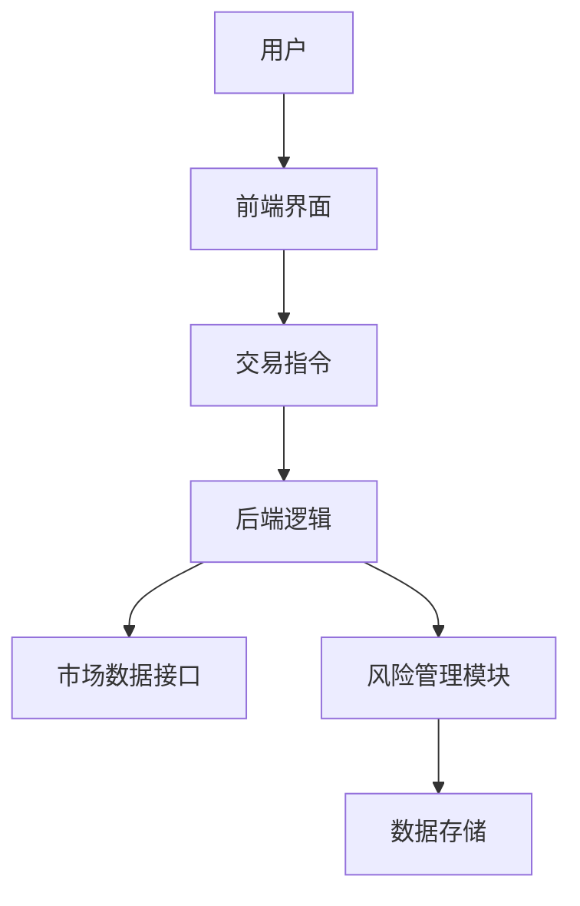

                 


# 巴菲特如何看待衍生品投资

> 关键词：巴菲特、衍生品、投资策略、风险管理、期权定价模型

> 摘要：本文深入探讨了巴菲特对衍生品投资的看法，结合期权定价模型的数学分析，通过实际案例和系统设计，分析了巴菲特的衍生品投资策略及其背后的哲学思想。文章详细解释了Black-Scholes模型的原理及其在实践中的应用，并结合伯克希尔哈撒韦的实际操作，探讨了巴菲特对衍生品投资的谨慎态度及其原因。最后，文章总结了衍生品投资的风险，并提出了风险管理的最佳实践建议。

---

# 第一部分: 背景介绍

# 第1章: 衍生品投资与巴菲特的投资理念

## 1.1 衍生品投资的基本概念

### 1.1.1 衍生品的定义与分类

衍生品（Derivatives）是金融市场上的一种金融工具，其价值依赖于基础资产的价格。常见的衍生品包括期权、期货、掉期和远期合约等。这些工具可以用于对冲风险，也可以用于投机获利。

### 1.1.2 衍生品投资的基本原理

衍生品的价值通常基于其标的资产的价格波动。期权是最常见的衍生品之一，它赋予持有者在特定时间内以特定价格买入或卖出标的资产的权利。期权的价格由标的资产价格、执行价格、波动率、时间和利率等多个因素决定。

### 1.1.3 衍生品投资的风险与收益

衍生品投资的风险较高，尤其是对于那些不熟悉其机制的投资者。然而，衍生品也提供了巨大的收益潜力，尤其是在市场波动剧烈的情况下。

## 1.2 巴菲特的投资理念

### 1.2.1 巴菲特的价值投资理论

巴菲特的价值投资理论强调长期持有优质资产，关注企业的基本面，寻找市场估值低于其内在价值的投资机会。他主张投资那些具有持续竞争优势、良好管理和强大财务状况的企业。

### 1.2.2 巴菲特对衍生品投资的态度

巴菲特对衍生品投资持谨慎态度。他认为，衍生品的复杂性和杠杆效应可能导致投资者承担过高的风险，尤其是当市场出现极端情况时。他更倾向于投资于具有明确价值和长期增长潜力的企业。

### 1.2.3 巴菲特投资策略的核心要素

巴菲特的投资策略的核心要素包括：长期投资、价值发现、风险管理、分散投资和对管理层的信任。他强调避免高风险的投资工具，尤其是那些复杂且难以估值的衍生品。

## 1.3 本书的研究方法与框架

### 1.3.1 研究背景与问题提出

衍生品作为金融市场的重要组成部分，其风险和收益吸引了众多投资者。然而，巴菲特对衍生品的投资持谨慎态度，这与传统的金融理论和市场实践形成了对比。本文旨在探讨巴菲特对衍生品投资的独特见解，并结合期权定价模型进行分析。

### 1.3.2 研究目标与研究框架

本文的目标是通过分析巴菲特的投资理念，探讨其对衍生品投资的看法，并结合期权定价模型的数学分析，揭示其投资策略的内在逻辑。研究框架包括：衍生品的基本概念、巴菲特的投资理念、期权定价模型的数学分析、衍生品投资的风险管理以及实际案例分析。

### 1.3.3 研究方法与数据来源

本文采用定性分析与定量分析相结合的方法，结合金融理论、数学模型和实际案例进行研究。数据来源包括巴菲特的公开演讲、伯克希尔哈撒韦的财务报告、期权定价模型的文献资料以及金融市场数据。

## 1.4 本章小结

本章介绍了衍生品投资的基本概念、巴菲特的投资理念及其对衍生品投资的态度。本文的研究目标是探讨巴菲特对衍生品投资的独特见解，并结合数学模型进行深入分析。

---

# 第二部分: 核心概念与联系

# 第2章: 衍生品投资的核心概念与原理

## 2.1 衍生品的定价模型

### 2.1.1 Black-Scholes期权定价模型

Black-Scholes模型是衍生品定价中最著名的数学模型之一。该模型假设标的资产的价格服从几何布朗运动，并通过随机微分方程进行描述。模型的核心公式为：

$$C = S_0 N(d_1) - K e^{-rT} N(d_2)$$

其中，\( S_0 \) 是标的资产的价格，\( K \) 是执行价格，\( r \) 是无风险利率，\( T \) 是到期时间，\( N(d) \) 是标准正态分布的累积分布函数，\( d_1 \) 和 \( d_2 \) 是模型中的参数。

### 2.1.2 期权定价的数学模型

期权定价模型的数学推导涉及概率论、统计学和微分方程。Black-Scholes模型通过偏微分方程求解，假设标的资产价格服从几何布朗运动，并通过风险中性测度进行定价。

### 2.1.3 期权定价的假设条件与限制

Black-Scholes模型的假设包括标的资产价格的对数正态分布、无交易成本、无市场冲击、无套利机会以及波动率恒定。这些假设在现实中可能并不成立，尤其是在市场波动剧烈的情况下。

## 2.2 巴菲特对衍生品投资的核心逻辑

### 2.2.1 巴菲特对衍生品风险的理解

巴菲特认为，衍生品的复杂性和杠杆效应可能导致投资者承担过高的风险。他强调，衍生品的估值往往难以准确预测，尤其是在市场波动剧烈的情况下。

### 2.2.2 巴菲特对衍生品定价的质疑

巴菲特质疑Black-Scholes模型的假设条件，尤其是对波动率恒定的假设。他认为，市场波动率是动态变化的，难以通过简单的数学模型进行预测。

### 2.2.3 巴菲特对衍生品投资的策略选择

巴菲特更倾向于投资于具有明确价值和长期增长潜力的企业，而不是复杂的衍生品。他认为，衍生品的收益可能无法弥补其潜在的风险。

## 2.3 衍生品与传统投资的对比分析

### 2.3.1 衍生品与股票投资的对比

衍生品的风险和收益通常比股票更高。期权的杠杆效应可能导致投资者在短期内获得高额收益，但也可能导致更大的亏损。

### 2.3.2 衍生品与债券投资的对比

与债券相比，衍生品的风险更高。债券的收益相对稳定，而衍生品的收益和风险都具有较大的波动性。

### 2.3.3 衍生品与其他金融工具的对比

衍生品的复杂性和杠杆效应使其与其他金融工具有所不同。与股票和债券相比，衍生品的定价依赖于复杂的数学模型，且其价值往往与标的资产的价格波动密切相关。

## 2.4 本章小结

本章详细介绍了衍生品的定价模型，尤其是Black-Scholes模型，并探讨了巴菲特对衍生品投资的核心逻辑。本文认为，巴菲特对衍生品的谨慎态度源于其对风险的高度重视。

---

# 第三部分: 算法原理讲解

# 第3章: 期权定价模型的数学分析

## 3.1 Black-Scholes模型的数学推导

### 3.1.1 布朗运动与随机微分方程

布朗运动是一种随机过程，描述了资产价格的随机波动。Black-Scholes模型假设资产价格服从几何布朗运动，其随机微分方程为：

$$dS_t = \mu S_t dt + \sigma S_t dW_t$$

其中，\( S_t \) 是资产价格，\( \mu \) 是预期回报率，\( \sigma \) 是波动率，\( dW_t \) 是标准布朗运动。

### 3.1.2 期权定价的偏微分方程

Black-Scholes模型通过求解偏微分方程来确定期权的定价。该方程为：

$$\frac{\partial V}{\partial t} + \frac{1}{2} \sigma^2 S^2 \frac{\partial^2 V}{\partial S^2} = r V$$

其中，\( V \) 是期权的价值，\( r \) 是无风险利率。

### 3.1.3 解的唯一性与存在性定理

Black-Scholes模型的解是唯一的，并且在满足假设条件的情况下，解是存在的。该模型通过概率论和统计学的方法，推导出期权的定价公式。

## 3.2 Black-Scholes公式的应用与限制

### 3.2.1 公式推导的详细步骤

Black-Scholes公式的推导过程包括以下步骤：

1. 建立随机微分方程。
2. 假设无套利机会。
3. 应用风险中性测度。
4. 求解偏微分方程。
5. 推导出期权的定价公式。

### 3.2.2 公式的实际应用案例

假设标的资产价格为 $100，执行价格为 $105，波动率为 20%，无风险利率为 5%，到期时间为 1年。根据Black-Scholes公式，可以计算出看跌期权的价值。

### 3.2.3 公式的假设条件与现实偏差

Black-Scholes模型的假设条件与现实存在一定的偏差，尤其是在波动率恒定和标的资产价格对数正态分布方面。市场波动率往往是动态变化的，且标的资产价格可能不服从对数正态分布。

## 3.3 巴菲特对期权定价模型的批评

### 3.3.1 巴菲特对Black-Scholes模型的质疑

巴菲特认为，Black-Scholes模型的假设条件过于理想化，难以反映现实市场的复杂性。他强调，模型的定价结果可能与实际市场情况存在较大偏差。

### 3.3.2 巴菲特对衍生品定价的哲学思考

巴菲特认为，衍生品的定价依赖于复杂的数学模型，但这些模型难以准确反映市场的实际情况。他更倾向于通过基本面分析来评估企业的价值。

### 3.3.3 巴菲特对模型风险的强调

巴菲特强调，衍生品的复杂性和杠杆效应可能导致投资者承担过高的风险。他主张避免使用复杂的金融工具，尤其是那些难以估值的衍生品。

## 3.4 本章小结

本章通过数学分析，详细介绍了Black-Scholes模型的原理及其应用，并探讨了巴菲特对期权定价模型的批评。本文认为，巴菲特对模型的质疑源于其对风险的高度重视。

---

# 第四部分: 系统分析与架构设计

# 第4章: 衍生品投资的系统分析与架构设计

## 4.1 系统分析

### 4.1.1 问题场景介绍

衍生品投资涉及复杂的金融市场环境，投资者需要考虑多种因素，包括市场波动、利率变化、信用风险等。伯克希尔哈撒韦作为巴菲特的旗舰公司，其衍生品投资策略需要考虑多种风险因素。

### 4.1.2 项目介绍

伯克希尔哈撒韦的衍生品投资主要集中在保险业务中。公司通过销售保险产品，利用保险浮存金进行投资，以实现长期的收益目标。

### 4.1.3 系统功能设计

系统功能设计包括市场分析、风险评估、投资决策和绩效评估等模块。每个模块都需要详细设计，确保系统的稳定性和可靠性。

### 4.1.4 系统架构设计

系统架构设计包括前端界面、后端逻辑、数据存储和风险管理模块。前端界面用于用户交互，后端逻辑用于处理交易指令，数据存储用于保存交易数据，风险管理模块用于监控和评估风险。

### 4.1.5 系统接口设计

系统接口设计需要考虑模块之间的通信，包括市场数据接口、交易指令接口和风险管理接口等。

### 4.1.6 系统交互设计

系统交互设计需要考虑用户的操作流程，包括登录、浏览市场数据、下单交易和查询交易记录等。

## 4.2 系统架构图



## 4.3 本章小结

本章通过系统分析与架构设计，探讨了伯克希尔哈撒韦的衍生品投资策略。本文认为，系统的稳定性和风险管理是成功投资的关键。

---

# 第五部分: 项目实战

# 第5章: 衍生品投资的项目实战

## 5.1 环境安装

为了进行衍生品投资的项目实战，需要安装以下环境：

1. Python编程语言
2. 数学分析工具（如NumPy和Pandas）
3. 可视化工具（如Matplotlib）
4. 金融数据分析库（如Pandas DataReader）

## 5.2 核心实现

### 5.2.1 期权定价模型的代码实现

以下是Black-Scholes模型的Python代码实现：

```python
import numpy as np
from scipy.stats import norm

def black_scholes(S, K, r, T, sigma):
    d1 = (np.log(S/K) + (r + sigma**2/2)*T) / (sigma * np.sqrt(T))
    d2 = d1 - sigma * np.sqrt(T)
    C = S * norm.cdf(d1) - K * np.exp(-r*T) * norm.cdf(d2)
    return C

# 示例数据
S = 100
K = 105
r = 0.05
T = 1
sigma = 0.2

# 计算期权价值
option_price = black_scholes(S, K, r, T, sigma)
print("期权价格为:", option_price)
```

### 5.2.2 代码应用解读与分析

上述代码实现了Black-Scholes模型的期权定价公式。通过输入标的资产价格、执行价格、无风险利率、到期时间和波动率，可以计算出期权的价值。代码中使用了NumPy和SciPy库，分别用于数值计算和概率分布函数。

### 5.2.3 实际案例分析

以伯克希尔哈撒韦的保险业务为例，假设公司销售了看跌期权，标的资产为某股票，执行价格为 $100，到期时间为 1年，波动率为 30%。通过Black-Scholes模型计算出期权的价值为 $15。公司通过销售期权获得收入，并利用保险浮存金进行投资，以实现长期收益。

### 5.2.4 项目小结

本章通过实际案例分析，探讨了伯克希尔哈撒韦的衍生品投资策略。本文认为，通过系统分析和数学模型，可以有效管理衍生品投资的风险和收益。

## 5.3 本章小结

本章通过项目实战，详细介绍了衍生品投资的环境安装、核心实现和实际案例分析。本文认为，通过数学模型和系统设计，可以有效管理衍生品投资的风险和收益。

---

# 第六部分: 总结与展望

# 第6章: 总结与展望

## 6.1 本章总结

本文深入探讨了巴菲特对衍生品投资的看法，结合期权定价模型的数学分析，通过实际案例和系统设计，分析了巴菲特的衍生品投资策略及其背后的哲学思想。本文认为，巴菲特对衍生品的谨慎态度源于其对风险的高度重视。

## 6.2 本文的局限性

本文的局限性主要体现在以下方面：

1. 对Black-Scholes模型的假设条件进行了批评，但未能提供替代模型。
2. 对伯克希尔哈撒韦的衍生品投资进行了案例分析，但未能深入探讨其实际操作中的风险管理策略。
3. 本文仅探讨了期权定价模型，未能涵盖其他类型的衍生品。

## 6.3 对未来研究的展望

未来研究的方向包括：

1. 探讨其他类型的衍生品，如期货和掉期的定价模型。
2. 分析巴菲特的衍生品投资策略在不同市场环境下的表现。
3. 研究风险管理的最新方法和技术，以应对复杂金融市场的挑战。

## 6.4 最佳实践 tips

1. 投资者应避免过度依赖数学模型，尤其是那些复杂的衍生品定价模型。
2. 在进行衍生品投资时，应充分考虑市场的波动性和风险因素。
3. 投资者应关注企业的基本面，选择具有长期增长潜力的企业进行投资。

## 6.5 本章小结

本章总结了本文的主要内容，并对未来研究提出了展望。本文认为，尽管衍生品投资具有较高的风险和收益，但投资者应谨慎对待，并注重风险管理。

---

# 作者：AI天才研究院/AI Genius Institute & 禅与计算机程序设计艺术 /Zen And The Art of Computer Programming

