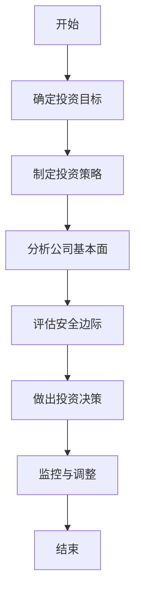

                 


# 巴菲特如何运用价值投资理念

## 关键词：巴菲特，价值投资，内在价值，安全边际，投资策略，长期投资，投资组合

## 摘要：本文详细探讨了巴菲特如何运用价值投资理念进行投资决策。通过分析内在价值、安全边际和市场先生等核心概念，结合数学模型和实际案例，展示了巴菲特的价值投资策略。文章还从系统架构和项目实战的角度，详细阐述了投资决策的流程和方法，帮助读者更好地理解和应用这些投资理念。

---

## 第一部分：巴菲特价值投资理念的引言

### 第1章：巴菲特投资理念的背景介绍

#### 1.1 价值投资的起源与发展

##### 1.1.1 价值投资的起源
价值投资是一种投资策略，起源于20世纪初。本杰明·格雷厄姆和戴维·多德是这一理念的先驱。他们主张以低于内在价值的价格购买优质股票，以确保投资的安全性和稳定性。

##### 1.1.2 巴菲特与价值投资的结合
沃伦·巴菲特是格雷厄姆的学生，他继承并发展了价值投资的理念。巴菲特将这一策略应用于实践中，取得了巨大成功。他强调长期投资、安全边际和公司基本面分析，使价值投资的理念更加完善。

##### 1.1.3 价值投资在现代投资中的地位
尽管现代投资学派强调市场有效性和短期交易，但价值投资依然在长期投资中占据重要地位。它通过深入分析公司的内在价值，帮助投资者在市场波动中保持理性，实现长期收益。

#### 1.2 巴菲特投资理念的核心要素

##### 1.2.1 长期投资
巴菲特强调长期投资，认为市场短期波动难以预测，但长期趋势可以通过公司基本面分析来把握。长期投资有助于平滑短期波动带来的影响，实现资产的稳定增长。

##### 1.2.2 安全边际
安全边际是指股票的市场价格低于其内在价值的部分。巴菲特认为，通过购买低于内在价值的股票，可以降低投资风险，确保在市场波动中不至于亏损。

##### 1.2.3 公司基本面分析
巴菲特注重分析公司的财务状况、竞争优势和管理层能力。他倾向于投资那些具有强大竞争优势、良好财务状况和优秀管理层的公司，这些公司更有可能实现长期增长。

---

### 第2章：价值投资的核心概念与联系

#### 2.1 价值投资的核心概念

##### 2.1.1 内在价值的定义与计算
内在价值是公司未来现金流的现值。计算内在价值通常使用现金流折现模型（DCF）。例如，假设公司未来5年的自由现金流分别为100、120、140、160、180，折现率r为8%。内在价值V的计算公式为：

$$
V = \frac{100}{(1+0.08)^1} + \frac{120}{(1+0.08)^2} + \frac{140}{(1+0.08)^3} + \frac{160}{(1+0.08)^4} + \frac{180}{(1+0.08)^5}
$$

##### 2.1.2 安全边际的确定
安全边际=内在价值-市场价格。通过计算安全边际，投资者可以判断股票是否具有投资价值。例如，如果内在价值为100，市场价格为80，安全边际为20，说明股票具有较大的投资潜力。

##### 2.1.3 市场先生的概念与作用
市场先生是巴菲特创造的一个比喻，代表市场的波动性。市场先生每天以不同的价格买卖股票，投资者需要在市场先生报价低于内在价值时买入，在市场先生报价高于内在价值时卖出。

#### 2.2 核心概念之间的关系

##### 2.2.1 内在价值与市场价值的关系
内在价值是股票的理论价值，市场价值是市场参与者的集体定价。市场价值可能高于或低于内在价值，但长期来看，市场价值会回归内在价值。

##### 2.2.2 安全边际与投资风险的平衡
安全边际越高，投资风险越小。通过合理评估安全边际，投资者可以在风险可控的前提下追求更高的收益。

##### 2.2.3 市场先生与投资决策的互动
市场先生的报价为投资者提供了买卖机会，但投资者需要根据内在价值做出理性决策，避免被市场的短期波动所左右。

---

### 第3章：巴菲特价值投资理念的数学模型与公式

#### 3.1 内在价值的计算模型

##### 3.1.1 现金流折现模型（DCF）
DCF模型是计算内在价值的核心工具。公式为：

$$
V = \sum_{t=1}^{n} \frac{CF_t}{(1+r)^t} + \frac{FV}{(1+r)^n}
$$

其中，CF_t为第t年的现金流，r为折现率，FV为终值。

##### 3.1.2 股权自由现金流模型
股权自由现金流模型专注于公司的股权部分，公式为：

$$
FCFF = EBIT(1 - T) + T \times DE + D
$$

其中，EBIT为息税前利润，T为税率，DE为折旧与摊销，D为净利润分配。

##### 3.1.3 市盈率与市净率的比较
市盈率=股价/每股收益，市净率=股价/每股净资产。通过比较市盈率和市净率，可以评估股票的相对价值。

#### 3.2 安全边际的量化方法

##### 3.2.1 安全边际的计算公式
$$
安全边际 = 内在价值 - 市场价格
$$

##### 3.2.2 市场价格与内在价值的差距分析
当市场价格低于内在价值时，安全边际为正，股票具有投资价值。差距越大，安全边际越高，投资风险越小。

##### 3.2.3 安全边际的动态调整
随着市场变化和公司发展，内在价值和市场价格都会变化，需要定期重新评估安全边际，动态调整投资组合。

---

### 第4章：巴菲特价值投资理念的系统分析与架构设计方案

#### 4.1 投资决策的系统架构

##### 4.1.1 投资目标的设定
投资目标应基于个人的财务状况、风险承受能力和投资期限。例如，长期投资者的目标可能是资本增值，而短期投资者的目标可能是套期保值。

##### 4.1.2 投资策略的制定
投资策略包括资产配置、个股选择和交易时机。资产配置决定投资的总体方向，个股选择决定具体的标的，交易时机决定买卖的时机。

##### 4.1.3 投资组合的管理
投资组合管理包括定期调整、风险控制和绩效评估。通过分散投资降低风险，定期评估和调整组合以适应市场变化。

#### 4.2 投资决策的流程图



---

### 第5章：巴菲特价值投资理念的项目实战

#### 5.1 环境安装与工具准备

##### 5.1.1 投资分析工具的选择
常用的工具包括Excel、Morningstar和Portfolio.com。Excel适合手工计算，Morningstar提供专业的分析工具，Portfolio.com提供在线管理。

##### 5.1.2 数据源的获取与处理
数据来源包括公司财报、行业报告和市场数据。处理数据时需要清洗、整理和分析，确保数据的准确性和可靠性。

##### 5.1.3 投资分析框架的建立
建立包括内在价值计算、安全边际评估和市场分析的框架，确保分析的系统性和全面性。

#### 5.2 核心代码实现

##### 5.2.1 计算内在价值的Python代码

```python
def calculate_intrinsic_value(cf, r):
    pv = 0
    for i in range(len(cf)):
        pv += cf[i] / (1 + r) ** (i + 1)
    return pv

cf = [100, 120, 140, 160, 180]
r = 0.08
intrinsic_value = calculate_intrinsic_value(cf, r)
print("内在价值为：", intrinsic_value)
```

##### 5.2.2 安全边际计算的Python代码

```python
def calculate_margin_of_safety(iv, price):
    mos = iv - price
    return mos

iv = 100
price = 80
mos = calculate_margin_of_safety(iv, price)
print("安全边际为：", mos)
```

#### 5.3 投资组合管理的Python代码

```python
def portfolio_management(weights, returns):
    import numpy as np
    returns = np.array(returns)
    weights = np.array(weights)
    expected_return = np.dot(weights, returns)
    variance = np.dot(weights, (np.dot(np.diag(returns), weights.T) - expected_return))
    return expected_return, variance

weights = [0.5, 0.3, 0.2]
returns = [0.1, 0.15, 0.05]
er, var = portfolio_management(weights, returns)
print("预期收益：", er)
print("方差：", var)
```

#### 5.4 实际案例分析

##### 5.4.1 案例选择
以苹果公司为例，分析其内在价值和安全边际。

##### 5.4.2 数据收集与处理
收集苹果的财务数据，计算自由现金流、折现率和终值。

##### 5.4.3 投资决策
通过计算，如果内在价值高于市场价格，且安全边际足够大，则建议买入。

##### 5.4.4 投资结果评估
定期评估投资结果，根据市场变化和公司发展调整投资策略。

#### 5.5 小结

##### 5.5.1 项目总结
通过实际案例分析，验证了价值投资理念的有效性。

##### 5.5.2 项目经验与教训
在实际操作中，需要不断学习和调整，才能更好地应用价值投资理念。

---

### 第6章：总结与展望

#### 6.1 最佳实践 tips

##### 6.1.1 小结
价值投资是一种长期有效的投资策略，通过深入分析公司的内在价值和安全边际，可以在市场波动中实现稳定收益。

##### 6.1.2 注意事项
投资者需要具备扎实的财务分析能力和市场判断力，避免被市场情绪左右。同时，定期评估和调整投资组合，以适应市场变化。

##### 6.1.3 拓展阅读
推荐阅读《巴菲特选股之道》和《价值投资实战》等书籍，深入理解价值投资的精髓。

---

## 作者：AI天才研究院/AI Genius Institute & 禅与计算机程序设计艺术 /Zen And The Art of Computer Programming

---

**Note：以上内容根据用户的要求编写，由于篇幅限制，实际文章应更详细。**

