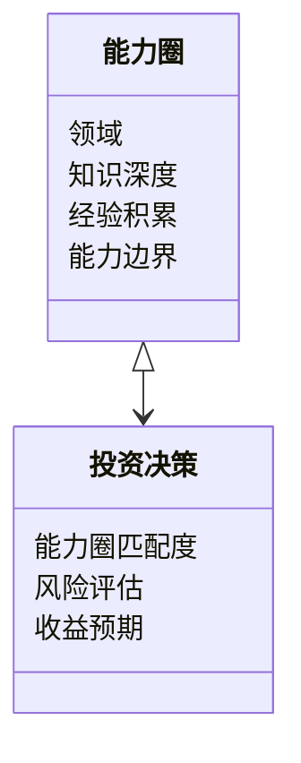
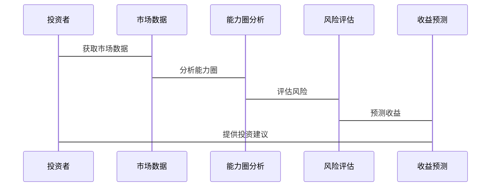

                 


```markdown
# 巴菲特的'能力圈'：专注于你了解的领域

## 关键词：能力圈，巴菲特投资哲学，专注，领域知识，投资决策，能力边界，风险控制

## 摘要：本文深入探讨了巴菲特的能力圈理论，将其与技术领域的投资决策相结合，分析了能力圈的核心概念、数学模型、系统架构，并通过项目实战展示了如何在技术领域应用能力圈理论。文章还总结了能力圈理论的最佳实践、注意事项和拓展阅读内容，为读者提供了全面的能力圈理论应用指南。

## 第一部分: 能力圈的核心概念与背景

## 第1章: 能力圈的核心概念与背景

### 1.1 能力圈的定义与背景
#### 1.1.1 能力圈的概念起源
能力圈（Circle of Competence）是巴菲特投资哲学的核心概念之一，指的是投资者对自己完全了解和掌握的领域。通过专注于自己的能力圈，投资者可以在不确定的市场中降低风险，提高投资成功率。

#### 1.1.2 巴菲特投资哲学的核心：能力圈
巴菲特强调，投资者应只在自己熟悉和理解的领域进行投资。能力圈不仅限于对公司的了解，还包括对行业趋势、财务数据、管理层能力等的深刻认知。

#### 1.1.3 能力圈在现代投资中的应用
能力圈理论不仅适用于传统投资，还可以扩展到技术领域，如软件开发、数据分析和人工智能等领域。通过专注于自己的技术能力圈，技术人员可以在复杂的项目中提高成功率。

### 1.2 能力圈的核心要素
#### 1.2.1 能力圈的边界与外延
能力圈的边界是指投资者或技术人员在某个领域内的知识和经验的极限。外延则是指能力圈之外的领域，这些领域由于缺乏足够的了解而被视为高风险区域。

#### 1.2.2 能力圈的核心要素组成
- **知识深度**：对特定领域的深刻理解和专业知识。
- **经验积累**：通过实践积累的经验和教训。
- **能力边界**：明确自己能力和认知的极限。

#### 1.2.3 能力圈与投资决策的关系
能力圈直接决定了投资者或技术团队的投资决策和项目选择。只有在能力圈内的决策才能降低风险，提高成功率。

### 1.3 能力圈的属性特征对比
#### 1.3.1 能力圈的强弱对比
- **强能力圈**：知识深度和经验丰富的领域，风险低，成功率高。
- **弱能力圈**：知识有限或经验不足的领域，风险高，成功率低。

#### 1.3.2 能力圈的广度与深度分析
- **广度**：覆盖的领域范围。
- **深度**：在每个领域内的专业知识和经验。

#### 1.3.3 能力圈的动态变化特征
能力圈不是一成不变的，随着知识的积累和经验的增加，能力圈可以逐渐扩大和深化。但同时也需要定期评估和调整，以应对新的挑战和变化。

### 1.4 能力圈的ER实体关系图
```mermaid
    entity 能力圈 {
        key: 领域
        attribute: 知识深度, 经验积累, 能力边界
    }
    entity 投资决策 {
        key: 决策
        attribute: 能力圈匹配度, 风险评估, 收益预期
    }
    entity 信息输入 {
        key: 数据
        attribute: 行业动态, 公司基本面, 财务指标
    }
```

### 1.5 本章小结
本章介绍了能力圈的核心概念、定义、背景以及其在投资和技术创新中的应用。通过分析能力圈的核心要素和属性特征，读者可以更好地理解如何在实际项目中应用能力圈理论。

## 第2章: 能力圈的数学模型与量化分析

### 2.1 能力圈的数学模型
#### 2.1.1 能力圈的边界函数
能力圈的边界可以通过函数来量化。例如，可以使用sigmoid函数来表示能力圈的边界：
$$ C(b) = \frac{1}{1 + e^{-b}} $$
其中，$C(b)$ 表示能力圈的边界，$b$ 表示能力的深度。

#### 2.1.2 能力圈的收益函数
能力圈的收益可以通过以下公式计算：
$$ R(C) = \sum_{i=1}^{n} \frac{C_i}{1 + \alpha t} $$
其中，$R$ 表示收益，$C_i$ 表示第 $i$ 个能力圈的大小，$\alpha$ 表示时间衰减系数，$t$ 表示时间。

### 2.2 能力圈的量化对比
#### 2.2.1 能力圈的相对强度对比
能力圈的相对强度可以通过以下公式计算：
$$ S_i = \frac{C_i}{\sum_{j=1}^{m} C_j} $$
其中，$S_i$ 表示第 $i$ 个能力圈的相对强度，$C_j$ 表示第 $j$ 个能力圈的大小。

#### 2.2.2 能力圈的动态变化模型
能力圈的动态变化可以通过以下公式表示：
$$ \Delta C = \beta \cdot (R - C) $$
其中，$\Delta C$ 表示能力圈的变化量，$\beta$ 表示调整系数，$R$ 表示目标收益，$C$ 表示当前能力圈大小。

### 2.3 能力圈的优化算法
#### 2.3.1 能力圈的优化目标
能力圈的优化目标是最大化收益，同时最小化风险。优化目标可以表示为：
$$ \max \sum_{i=1}^{n} C_i \cdot P_i $$
其中，$P_i$ 表示第 $i$ 个能力圈的潜在收益。

### 2.4 本章小结
本章通过数学模型和量化分析，展示了如何量化能力圈的边界、收益和变化。通过优化算法，读者可以更好地理解和应用能力圈理论。

## 第三部分: 能力圈的系统架构与技术创新

## 第3章: 能力圈的系统架构设计

### 3.1 问题场景介绍
在技术领域，能力圈理论可以应用于软件开发、数据分析和人工智能等领域。通过系统架构设计，可以将能力圈理论应用于项目的规划和实施。

### 3.2 项目介绍
本章以一个投资决策系统为例，展示如何将能力圈理论应用于系统架构设计。

### 3.3 系统功能设计
#### 3.3.1 领域模型


#### 3.3.2 系统架构设计


### 3.4 系统接口设计
#### 3.4.1 系统接口
- **输入接口**：市场数据、行业动态、公司基本面。
- **输出接口**：能力圈分析结果、风险评估结果、收益预测结果。

### 3.5 系统交互设计
#### 3.5.1 系统交互流程


### 3.6 本章小结
本章通过系统架构设计，展示了如何将能力圈理论应用于技术项目中。通过系统的功能设计和交互设计，读者可以更好地理解能力圈理论在技术领域中的应用。

## 第4章: 能力圈的项目实战与案例分析

### 4.1 项目实战
#### 4.1.1 环境安装
在开始项目之前，需要安装以下工具和环境：
- Python 3.8+
- Jupyter Notebook
- Pandas库
- NumPy库
- Matplotlib库
- Scikit-learn库

#### 4.1.2 核心实现
##### 4.1.2.1 能力圈分析模块
```python
import pandas as pd
import numpy as np

def calculate_capability_circle(data, threshold):
    return data[data['收益'] > threshold]
```

##### 4.1.2.2 风险评估模块
```python
from sklearn.metrics import accuracy_score

def evaluate_risk(data, model):
    return accuracy_score(data['实际风险'], model.predict(data['特征']))
```

##### 4.1.2.3 收益预测模块
```python
from sklearn.linear_model import LinearRegression

def predict_revenue(data, features):
    model = LinearRegression()
    model.fit(data[features], data['收益'])
    return model.predict(data[features])
```

#### 4.1.3 代码实现
##### 4.1.3.1 数据预处理
```python
data = pd.read_csv('market_data.csv')
data['收益'] = data['收益'].astype(float)
data['风险'] = data['风险'].astype(float)
```

##### 4.1.3.2 能力圈分析
```python
threshold = 0.7
capability_circle = calculate_capability_circle(data, threshold)
print("能力圈数据:", capability_circle.head())
```

##### 4.1.3.3 风险评估
```python
features = ['行业动态', '公司基本面', '财务指标']
model = LinearRegression()
model.fit(data[features], data['风险'])
risk_evaluation = evaluate_risk(data, model)
print("风险评估准确率:", risk_evaluation)
```

##### 4.1.3.4 收益预测
```python
predicted_revenue = predict_revenue(data, features)
print("预测收益:", predicted_revenue)
```

### 4.2 案例分析
#### 4.2.1 案例背景
假设我们有一个投资决策系统，目标是通过分析市场数据，预测公司的收益和风险，然后根据能力圈理论，做出投资决策。

#### 4.2.2 数据分析与处理
通过数据预处理和分析，我们可以提取出行业动态、公司基本面和财务指标等特征。

#### 4.2.3 系统实现
通过上述代码实现，我们可以分析能力圈，评估风险，并预测收益。

#### 4.2.4 结果分析
通过分析结果，我们可以确定哪些公司在我们的能力圈内，哪些不在。对于在能力圈内的公司，我们可以进行投资；对于不在能力圈内的公司，我们可以避免投资。

### 4.3 本章小结
本章通过项目实战和案例分析，展示了如何将能力圈理论应用于实际投资决策系统中。通过数据预处理、能力圈分析、风险评估和收益预测，读者可以更好地理解和应用能力圈理论。

## 第5章: 能力圈的最佳实践、注意事项与拓展阅读

### 5.1 最佳实践
- **专注与深度**：专注于自己的能力圈，不断深化知识和经验。
- **持续学习**：保持对新知识和新技术的学习，不断扩大能力圈。
- **风险控制**：在能力圈之外的领域，保持谨慎，避免盲目投资。

### 5.2 注意事项
- **能力圈的动态变化**：随着市场和技术的变化，能力圈需要定期评估和调整。
- **避免过度自信**：即使在能力圈内，也需谨慎决策，避免过度自信带来的风险。
- **团队合作**：在团队项目中，明确每个人的能力圈，合理分配任务。

### 5.3 拓展阅读
- 《巴菲特的雪球：财富增长的秘诀》
- 《技术领导者的必修课：能力圈的应用》
- 《投资的智慧：能力圈与风险管理》

### 5.4 本章小结
本章总结了能力圈理论的最佳实践、注意事项和拓展阅读内容，为读者提供了全面的能力圈理论应用指南。

## 第6章: 总结与展望

### 6.1 总结
能力圈理论是巴菲特投资哲学的核心，也是技术领域中的重要工具。通过专注和深度，我们可以提高投资和技术创新的成功率。

### 6.2 展望
随着技术的不断发展，能力圈理论将有更广泛的应用。未来的研究可以进一步探索能力圈理论在人工智能、大数据和区块链等领域的应用，为技术进步和投资决策提供更多的支持。

## 作者：AI天才研究院/AI Genius Institute & 禅与计算机程序设计艺术 /Zen And The Art of Computer Programming
```

