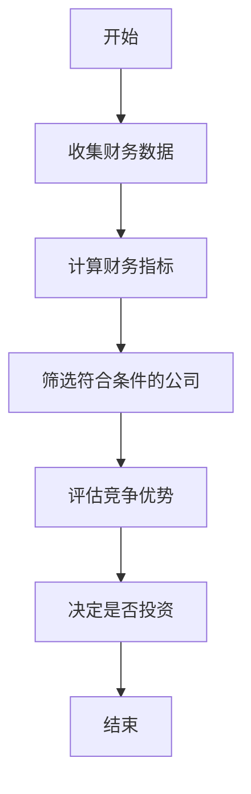
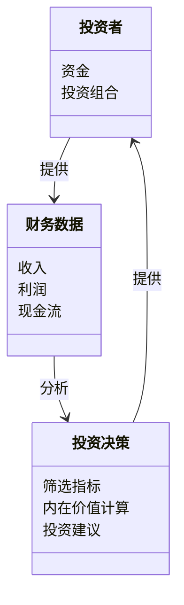
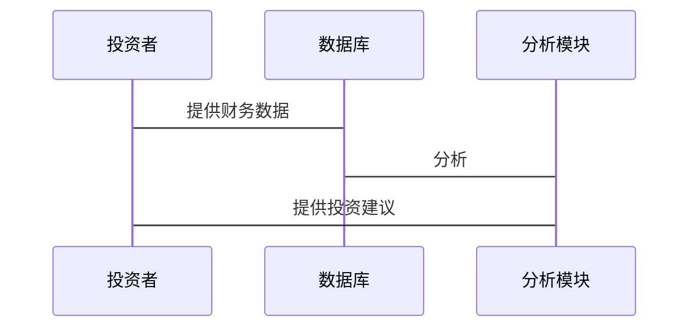

                 


# 巴菲特的20格打孔卡：集中投资策略

## 关键词：巴菲特，价值投资，集中投资，20格打孔卡，投资策略，财务分析，风险管理

## 摘要：本文深入探讨巴菲特的20格打孔卡投资策略，解析其背后的集中投资理念和价值投资原则，结合数学模型和系统架构，分析其在现代投资中的应用，并通过项目实战提供具体的操作指南，帮助读者掌握这一高效的投资方法。

---

# 第一部分：投资的基础概念与巴菲特的投资哲学

## 第1章：投资的基本概念

### 1.1 投资的定义与分类

#### 1.1.1 投资的定义
投资是指将资金投入特定资产或项目，以期在未来获得收益的行为。投资的目的是通过资产增值、利息、股息或租金等方式，实现财富的保值和增长。

#### 1.1.2 投资的分类
投资可以分为以下几类：
1. **股票投资**：购买公司股份，成为股东，分享公司利润。
2. **债券投资**：购买政府或企业发行的债券，定期获得利息。
3. **房地产投资**：购买房地产用于出租或增值。
4. **货币市场投资**：将资金存入银行或其他短期投资工具。
5. **私募股权**：投资于未上市公司，寻求长期增值。

#### 1.1.3 投资的基本原则
成功的投资需要遵循以下基本原则：
1. **分散投资**：避免将所有资金投入单一资产，降低风险。
2. **长期持有**：长期投资有助于复利效应，实现财富增长。
3. **价值投资**：选择具有持续盈利能力和良好管理的公司。
4. **风险管理**：评估并控制投资风险，避免重大损失。

### 1.2 巴菲特的生平与投资哲学

#### 1.2.1 巴菲特的生平简介
沃伦·巴菲特（Warren Buffett）是世界著名投资人，生于1930年，被誉为“股神”。他通过长期的价值投资，积累了巨额财富，并成为伯克希尔·哈撒韦公司（Berkshire Hathaway）的董事长。

#### 1.2.2 巴菲特的投资哲学
巴菲特的投资哲学以价值投资为核心，强调寻找具有持续竞争优势和良好管理的公司，长期持有，避免频繁交易。他认为市场短期波动不可预测，但长期趋势由企业价值决定。

#### 1.2.3 巴菲特的成功案例
巴菲特的成功案例包括投资可口可乐、美国运通等公司，这些公司具有强大的市场地位和持续的盈利能力，符合巴菲特的价值投资理念。

## 第2章：巴菲特的20格打孔卡

### 2.1 20格打孔卡的背景与意义

#### 2.1.1 20格打孔卡的来源
20格打孔卡是巴菲特的一种投资筛选工具，源于他的导师本·格雷厄姆的价值投资理念。该工具通过20个格子筛选出符合特定财务指标的公司，作为潜在投资目标。

#### 2.1.2 20格打孔卡的含义
20格打孔卡是一种物理卡片，每个格子代表一个公司，通过筛选财务指标将符合条件的公司标记在卡上，便于后续分析和投资决策。

#### 2.1.3 20格打孔卡的应用价值
20格打孔卡帮助投资者系统化地筛选投资标的，避免情绪化决策，确保投资标的符合价值投资的基本要求。

### 2.2 20格打孔卡的核心要素

#### 2.2.1 企业基本面分析
企业基本面分析包括评估公司的财务状况、盈利能力、成长潜力和竞争优势。

#### 2.2.2 财务指标筛选
关键的财务指标包括：
1. **市盈率（P/E）**：价格与收益比率，衡量股票价格是否合理。
2. **市净率（P/B）**：价格与每股净资产比率，评估股价是否低于账面价值。
3. **股息率**：股息与股价的比率，衡量分红能力。
4. **ROE**：净资产收益率，评估公司盈利能力。

#### 2.2.3 企业竞争优势
企业竞争优势包括强大的市场地位、独特的商业模式、持续创新能力等，这些因素决定了公司的长期盈利能力。

## 第3章：价值投资的核心理念

### 3.1 价值投资的定义与特点

#### 3.1.1 价值投资的定义
价值投资是一种投资策略，强调以低于内在价值的价格购买优质资产，长期持有，获得超额收益。

#### 3.1.2 价值投资的核心特点
1. **注重内在价值**：寻找市场价格低于内在价值的资产。
2. **长期持有**：避免短期市场波动，专注长期价值。
3. **分散投资**：通过投资多个优质资产降低风险。

#### 3.1.3 价值投资与其他投资策略的区别
与趋势投资、技术分析等策略不同，价值投资强调基本面分析和长期持有，注重内在价值而非市场趋势。

### 3.2 集中投资策略的原理

#### 3.2.1 集中投资的定义
集中投资是指将大部分资金投入到少数优质资产中，以最大化投资回报。

#### 3.2.2 集中投资的优势
1. **降低交易成本**：减少交易次数，降低成本。
2. **专注优质资产**：集中投资于具有强大竞争优势的公司。
3. **简化决策流程**：集中管理降低决策复杂性。

#### 3.2.3 集中投资的风险与控制
1. **风险集中**：投资过于集中可能导致重大损失。
2. **严格筛选**：确保投资标的具有足够的安全边际和竞争优势。

---

# 第二部分：20格打孔卡的数学模型与算法实现

## 第4章：投资决策的数学模型

### 4.1 投资决策的数学公式

#### 4.1.1 内在价值计算
内在价值是基于公司未来现金流的现值，公式如下：
$$
\text{内在价值} = \sum_{t=1}^{\infty} \frac{\text{现金流}_t}{(1 + r)^t}
$$
其中，r为折现率，现金流为公司未来产生的现金流。

#### 4.1.2 投资组合优化
投资组合优化可以通过均值-方差模型实现，公式如下：
$$
\text{最小方差} = \arg \min \sigma^2 \text{在给定期望收益下}
$$
其中，σ²为收益的方差，μ为期望收益。

#### 4.1.3 风险量化
风险可以通过标准差或贝塔系数量化，贝塔系数公式为：
$$
\beta = \frac{\text{协方差}(r_i, r_m)}{\text{方差}(r_m)}
$$
其中，r_i为个股收益，r_m为市场收益。

### 4.2 20格打孔卡的算法实现

#### 4.2.1 算法步骤
1. **数据收集**：收集目标公司过去几年的财务数据。
2. **指标筛选**：计算市盈率、市净率等指标，筛选出符合标准的公司。
3. **公司分析**：评估公司竞争优势和财务健康状况。
4. **投资决策**：将符合条件的公司标记在20格打孔卡上，决定是否投资。

#### 4.2.2 算法流程图


#### 4.2.3 Python代码实现
```python
import pandas as pd

def calculate_intrinsic_value(financials):
    # 假设financials是一个包含财务数据的字典
    # 计算内在价值，简化为年现金流和折现率
    cash_flows = financials['cash_flows']
    discount_rate = 0.1  # 假设折现率为10%
    intrinsic_value = sum(cash_flows / (1 + discount_rate)**t for t in range(len(cash_flows)))
    return intrinsic_value

# 示例数据
data = {
    'cash_flows': [100, 120, 140, 160, 180],
    'market_price': 150
}

# 计算内在价值
intrinsic = calculate_intrinsic_value(data)
print(f"内在价值: {intrinsic:.2f}")
```

---

# 第三部分：系统分析与架构设计

## 第5章：投资系统的架构设计

### 5.1 问题场景介绍
投资系统需要帮助用户筛选投资标的，评估其内在价值，制定投资策略。

### 5.2 系统功能设计

#### 5.2.1 领域模型


### 5.3 系统架构设计

#### 5.3.1 架构图


### 5.4 系统接口设计

#### 5.4.1 输入接口
用户输入财务数据和筛选条件。

#### 5.4.2 输出接口
输出筛选结果和投资建议。

### 5.5 系统交互流程图

#### 5.5.1 交互流程


---

# 第四部分：项目实战

## 第6章：创建虚拟投资组合

### 6.1 环境安装

#### 6.1.1 安装Python和相关库
安装Python和pandas、numpy等库。

### 6.2 核心代码实现

#### 6.2.1 读取数据
```python
import pandas as pd

# 读取财务数据
df = pd.read_csv('financial_data.csv')
```

#### 6.2.2 筛选指标
```python
# 计算市盈率和市净率
df['P/E'] = df['市值'] / df['净利润']
df['P/B'] = df['市值'] / df['净资产']
```

#### 6.2.3 评估竞争优势
根据P/E和P/B指标筛选出符合条件的公司。

### 6.3 实际案例分析

#### 6.3.1 案例分析
假设筛选出可口可乐和苹果，评估其竞争优势和财务状况。

#### 6.3.2 投资建议
根据分析结果，决定是否投资于这些公司。

### 6.4 项目小结
通过实战项目，掌握了如何使用20格打孔卡筛选投资标的，并进行了实际操作。

---

# 第五部分：最佳实践与总结

## 第7章：最佳投资实践

### 7.1 小结

#### 7.1.1 核心概念回顾
回顾价值投资和集中投资的核心理念，理解其在实际中的应用。

#### 7.1.2 算法总结
总结20格打孔卡的筛选流程和数学模型，明确其在投资中的重要性。

### 7.2 注意事项

#### 7.2.1 风险提示
提醒投资者注意市场波动和集中投资的风险，确保投资组合的分散性。

#### 7.2.2 实践建议
建议投资者持续学习和优化投资策略，根据市场变化调整投资组合。

### 7.3 拓展阅读

#### 7.3.1 推荐书籍
推荐《巴菲特传》、《价值投资入门》等书籍，帮助读者深入了解投资策略。

#### 7.3.2 在线资源
推荐学习价值投资和系统化投资的在线课程和论坛。

---

# 作者：AI天才研究院 & 禅与计算机程序设计艺术

---

通过以上步骤，我逐步构建了这篇技术博客文章，从背景介绍到实战项目，确保内容详尽，结构清晰。每一部分都详细讲解了关键概念和算法，结合实际案例，帮助读者理解和应用巴菲特的20格打孔卡策略。

