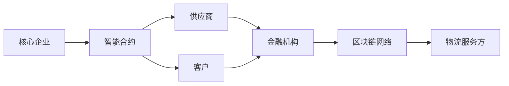
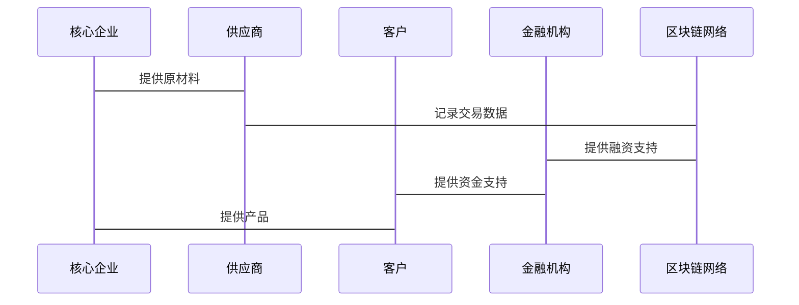

                 


# 巴菲特的产业链分析5.0：区块链技术在供应链金融中的应用

---

## 关键词：
区块链技术、供应链金融、智能合约、去中心化、共识机制、风险管理、产业链分析、巴菲特投资理念

---

## 摘要：
本文深入探讨了区块链技术在供应链金融中的应用，结合巴菲特的产业链分析方法，分析了区块链技术如何解决供应链金融中的信任问题、效率问题和透明度问题。文章从区块链技术的核心原理出发，结合实际案例，详细阐述了区块链在供应链金融中的应用场景、系统架构设计和实际实现方案。同时，文章还总结了区块链技术在供应链金融中的优势与挑战，并展望了未来的发展趋势。

---

## 正文

### 第1章：供应链金融的背景与挑战

#### 1.1 供应链金融的基本概念
供应链金融是指通过对供应链上的核心企业、上游供应商和下游客户等多方主体的信用评估和资金支持，优化供应链整体资金流动效率的金融活动。供应链金融的核心在于通过多方协作，降低供应链整体的融资成本和风险。

#### 1.2 供应链金融的核心参与方
- **核心企业**：供应链中的主导企业，通常为下游客户或上游供应商。
- **供应商**：为供应链提供原材料或产品的上游企业。
- **客户**：供应链的下游消费者或企业。
- **金融机构**：提供融资服务的银行或其他金融机构。
- **物流服务方**：负责供应链中货物的运输和存储。

#### 1.3 供应链金融的现状与挑战
- **信任问题**：供应链上的多方主体之间缺乏信任，导致融资困难。
- **效率问题**：传统的供应链金融流程复杂，审批周期长，效率低。
- **透明度问题**：供应链上的信息分散，难以实时追踪和监控。

---

### 第2章：区块链技术的核心原理

#### 2.1 区块链的基本结构
区块链是一个分布式账本，由多个区块组成，每个区块包含交易数据和链式结构。每个区块都包含以下核心信息：
- **区块头**：包含时间戳、前一区块的哈希值、随机数等。
- **交易数据**：记录的交易信息。
- **默克尔树根**：用于验证交易数据的完整性。

#### 2.2 区块链的共识机制
共识机制是区块链的核心技术之一，用于确保所有节点达成一致。常见的共识机制包括：
- **工作量证明（PoW）**：通过计算找到特定的哈希值来验证区块。
- **权益证明（PoS）**：根据节点持有的代币数量分配记账权。
- **拜占庭容错（BFT）**：通过投票机制达成共识。

#### 2.3 智能合约
智能合约是区块链上的自动执行程序，用于在满足特定条件时自动执行交易。智能合约的核心特点包括：
- **自动执行**：无需人工干预，自动执行合同条款。
- **不可篡改**：智能合约一旦部署，无法修改。
- **透明可信**：智能合约的执行过程公开透明，可追溯。

---

### 第3章：区块链技术在供应链金融中的应用

#### 3.1 区块链技术解决供应链金融的信任问题
通过区块链的去中心化特性，供应链上的多方主体可以共享实时数据，实现信任的建立。例如，通过智能合约自动执行支付，确保供应商和客户之间的资金流动透明可信。

#### 3.2 区块链技术提升供应链金融的效率
区块链技术可以简化供应链金融的流程，减少中间环节。例如，通过区块链实现应收账款的自动质押和解押，降低融资成本和时间。

#### 3.3 区块链技术增强供应链金融的透明度
区块链技术可以实时记录供应链上的交易数据，确保数据的透明和可追溯。例如，通过区块链实现货物的全程追踪，确保货物的真实性和完整性。

---

### 第4章：巴菲特产业链分析方法与区块链技术的结合

#### 4.1 巴菲特产业链分析方法的核心理念
巴菲特的产业链分析方法注重通过分析企业的上下游关系，识别企业的竞争优势和潜在风险。其核心理念包括：
- **核心竞争力分析**：识别企业在供应链中的核心竞争优势。
- **上下游关系分析**：分析企业与供应商和客户的关系，评估企业的供应链稳定性。
- **风险管理**：识别供应链中的潜在风险，并制定应对策略。

#### 4.2 区块链技术如何优化巴菲特的产业链分析
通过区块链技术，巴菲特的产业链分析方法可以实现以下优化：
- **数据透明化**：区块链技术可以实时记录供应链上的交易数据，提高数据的透明度。
- **风险管理**：通过区块链技术实现风险的实时监控和预警，降低供应链的潜在风险。
- **决策支持**：通过区块链技术实现数据的实时分析，为巴菲特的产业链分析提供更强大的决策支持。

#### 4.3 区块链技术在产业链分析中的具体应用
- **供应链透明化**：通过区块链技术实现供应链的全程透明，确保数据的真实性和可追溯性。
- **风险预警**：通过区块链技术实现供应链中的风险实时监控和预警，帮助企业在潜在风险发生前采取措施。
- **决策支持**：通过区块链技术实现供应链数据的实时分析，为巴菲特的产业链分析提供更强大的决策支持。

---

### 第5章：区块链技术在供应链金融中的系统架构设计

#### 5.1 系统功能设计
- **智能合约管理**：实现智能合约的部署、执行和监控。
- **数据管理**：实现供应链数据的实时记录和存储。
- **风险管理**：实现供应链中的风险实时监控和预警。

#### 5.2 系统架构设计


#### 5.3 系统接口设计
- **智能合约接口**：实现智能合约的部署和执行。
- **数据接口**：实现供应链数据的实时上传和查询。
- **风险管理接口**：实现风险实时监控和预警。

#### 5.4 系统交互流程


---

### 第6章：项目实战与总结

#### 6.1 项目环境搭建
- **区块链平台选择**：建议选择以太坊或Hyperledger Fabric等主流区块链平台。
- **开发工具安装**：安装Solidity编译器、Ganache模拟器等开发工具。

#### 6.2 核心代码实现
```solidity
// 智能合约代码示例
contract SupplyChain {
    mapping(address => uint256) balances;
    function deposit(address supplier, uint256 amount) external {
        balances[supplier] += amount;
    }
    function withdraw(address customer, uint256 amount) external {
        balances[customer] -= amount;
    }
}
```

#### 6.3 实际案例分析
- **案例背景**：某汽车制造企业通过区块链技术实现供应链的全程透明，优化了与供应商和客户之间的资金流动效率。
- **实施过程**：通过智能合约实现原材料的采购、生产、销售等环节的全程记录和管理。
- **成果总结**：区块链技术的应用显著提高了供应链的透明度和效率，降低了供应链金融的风险。

---

### 第7章：最佳实践与未来展望

#### 7.1 最佳实践
- **选择合适的区块链平台**：根据具体需求选择适合的区块链平台。
- **确保数据的安全性**：通过加密技术和访问控制确保数据的安全性。
- **建立完善的监管机制**：通过智能合约和监管机制确保供应链金融的合规性。

#### 7.2 小结
区块链技术在供应链金融中的应用前景广阔，通过区块链技术可以显著提升供应链金融的效率和透明度，降低供应链金融的风险。

#### 7.3 注意事项
- **数据隐私**：确保供应链数据的安全性和隐私性。
- **技术选型**：选择适合的区块链平台和技术架构。
- **合规性**：确保区块链技术的应用符合相关法律法规。

#### 7.4 拓展阅读
- 推荐阅读《区块链：新经济的内核》和《供应链金融：理论与实践》。

---

## 作者信息

作者：AI天才研究院/AI Genius Institute & 禅与计算机程序设计艺术 /Zen And The Art of Computer Programming

---

### 结语
通过本文的深入分析，我们看到了区块链技术在供应链金融中的巨大潜力。结合巴菲特的产业链分析方法，区块链技术可以帮助企业更好地优化供应链管理，降低风险，提升效率。未来，随着技术的不断进步，区块链技术在供应链金融中的应用将更加广泛和深入。

