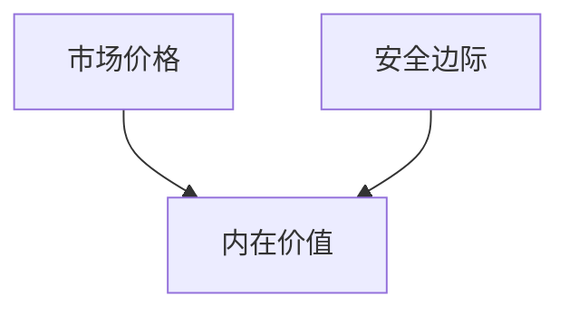

                 

# 巴菲特的价值投资再思考：数字时代的适应与创新

> 关键词：价值投资，数字时代，巴菲特，投资策略，数字化转型，科技创新

> 摘要：本文探讨了巴菲特的价值投资理念在数字时代的演变与创新。通过分析数字技术对企业价值的影响，提出了适应数字化转型的投资策略，并结合实际案例展示了如何在科技企业中应用这些策略。

---

## 第一部分: 巴菲特的价值投资再思考

### 第1章: 巴菲特价值投资的核心理念

#### 1.1 价值投资的基本原则

##### 1.1.1 价值投资的定义与核心要素

价值投资是一种长期投资策略，强调以低于内在价值的价格购买优质资产。其核心要素包括：

- **内在价值**：资产未来现金流的现值。
- **安全边际**：购买价格低于内在价值，以降低风险。
- **长期视角**：关注企业的长期盈利能力。

##### 1.1.2 巴菲特的投资哲学

巴菲特的投资哲学强调：
- **简单与专注**：专注于自己理解的领域。
- **安全边际**：确保买入价格低于内在价值。
- **企业质量**：选择具有强大竞争优势的企业。

##### 1.1.3 价值投资与短期投资的对比

| 对比维度 | 价值投资 | 短期投资 |
|----------|----------|----------|
| 时间跨度 | 长期     | 短期     |
| 风险管理 | 低       | 高       |
| 盈利来源 | 价值回归 | 价格波动 |

#### 1.2 安全边际与内在价值

##### 1.2.1 安全边际的定义与作用

安全边际 = 内在价值 - 市场价格。它提供了一种缓冲，以应对未来可能的不确定性。

##### 1.2.2 内在价值的计算方法

内在价值（V）的计算公式：
$$ V = \sum_{t=1}^{n} \frac{CF_t}{(1 + r)^t} $$

其中，CF_t为第t年的现金流，r为折现率。

##### 1.2.3 安全边际与内在价值的关系

安全边际 = V（内在价值） - P（市场价格）

图1展示了内在价值、市场价格和安全边际的关系：

#### 1.3 巴菲特的投资策略

##### 1.3.1 长期投资与价值发现

长期投资关注企业的长期盈利能力，而非短期市场波动。

##### 1.3.2 股票选择的标准与流程

股票选择标准包括：
- 强大的竞争优势
- 可持续的盈利能力
- 合理的估值

流程：
1. 确定企业是否符合投资标准。
2. 计算内在价值。
3. 确保买入价格低于内在价值。

##### 1.3.3 投资组合的构建与优化

投资组合应根据市场变化和个人风险承受能力进行调整。

---

### 第2章: 数字时代的投资环境变化

#### 2.1 数字化转型对投资的影响

##### 2.1.1 数字经济的崛起与投资机会

数字经济的崛起带来了新的投资机会，如人工智能、云计算等。

##### 2.1.2 科技创新对企业价值的影响

技术创新可以显著提升企业的竞争力和盈利能力。

##### 2.1.3 数字化转型中的风险与挑战

- 技术风险
- 市场风险
- 竞争风险

#### 2.2 科技企业的估值与传统企业的对比

##### 2.2.1 科技企业的核心竞争力分析

科技企业的核心竞争力在于技术创新和持续研发能力。

##### 2.2.2 科技企业的估值模型与传统企业的区别

科技企业常用的估值模型包括：
- 市盈率（P/E）模型
- 市净率（P/B）模型
- 现金流折现模型

##### 2.2.3 数字化对企业财务指标的影响

数字化转型可能影响企业的收入、成本和利润结构。

---

### 第3章: 数字时代的价值投资策略

#### 3.1 适应数字时代的投资理念

##### 3.1.1 价值投资在数字时代的演变

在数字时代，价值投资需要结合技术创新和市场趋势。

##### 3.1.2 数字化对企业长期价值的影响

数字化转型可以提升企业的长期价值，但需要谨慎评估。

##### 3.1.3 投资者如何应对数字时代的挑战

- 提升科技知识
- 关注技术创新
- 调整投资策略

#### 3.2 创新与投资机会的结合

##### 3.2.1 数字技术的创新与投资机会

人工智能、区块链等技术带来新的投资机会。

##### 3.2.2 创业企业的价值评估与投资决策

创业企业的估值需要考虑其技术壁垒和市场潜力。

##### 3.2.3 投资者如何识别创新机会

- 关注行业趋势
- 分析企业技术优势
- 评估市场前景

---

### 第4章: 数字化转型中的投资分析方法

#### 4.1 数字化企业的财务分析

##### 4.1.1 数字化企业财务指标的特殊性

数字化企业的财务指标可能包括研发投入、用户增长率等。

##### 4.1.2 数字化企业的现金流分析

现金流是评估企业健康状况的重要指标。

##### 4.1.3 数字化企业的成长性评估

成长性评估需要考虑企业的技术创新和市场扩展能力。

#### 4.2 科技创新的评估与投资决策

##### 4.2.1 技术创新的生命周期与投资策略

技术创新的生命周期分为引入期、成长期、成熟期和衰退期。

##### 4.2.2 技术创新对企业竞争力的影响

技术创新可以提升企业的市场地位和盈利能力。

##### 4.2.3 投资者如何评估技术创新的价值

- 分析技术创新的市场应用前景
- 评估企业的技术壁垒
- 考虑技术创新的成本和风险

---

### 第5章: 数字时代的价值投资实践

#### 5.1 投资组合的数字化转型

##### 5.1.1 数字化转型中的资产配置策略

资产配置应根据市场变化和企业情况动态调整。

##### 5.1.2 数字化企业与传统企业的组合优化

优化投资组合时，需平衡数字化企业和传统企业的比例。

##### 5.1.3 数字化转型中的风险管理

风险管理是投资过程中不可忽视的重要环节。

#### 5.2 投资者的认知与行为调整

##### 5.2.1 数字时代投资者的认知挑战

投资者需要不断学习和适应新的市场环境。

##### 5.2.2 投资者行为的调整与适应

投资者应根据市场变化调整投资策略和行为。

##### 5.2.3 投资者教育与能力提升

持续的教育和培训是提升投资能力的关键。

---

### 第6章: 数字时代的价值投资案例分析

#### 6.1 科技巨头的投资分析

##### 6.1.1 苹果公司的价值评估

苹果公司的价值体现在其强大的品牌和技术优势。

##### 6.1.2 谷歌的投资价值分析

谷歌的核心竞争力在于其搜索引擎和广告业务。

##### 6.1.3 微软的长期投资价值

微软的云服务和人工智能技术具有长期增长潜力。

#### 6.2 创新企业的投资机会

##### 6.2.1 人工智能企业的投资潜力

人工智能技术的应用前景广阔。

##### 6.2.2 云计算企业的价值评估

云计算是数字化转型中的重要基础设施。

##### 6.2.3 数字支付企业的投资机会

数字支付在数字经济中的作用日益重要。

---

### 第7章: 数字时代的价值投资未来展望

#### 7.1 数字化转型的长期趋势

##### 7.1.1 数字经济的未来发展方向

数字化转型将继续推动全球经济的增长。

##### 7.1.2 科技创新的未来趋势

人工智能、区块链等技术将继续快速发展。

##### 7.1.3 数字化转型对全球经济的影响

数字化转型将重塑全球经济结构。

#### 7.2 价值投资的未来演变

##### 7.2.1 数字时代价值投资的核心变化

价值投资将更加关注技术创新和市场趋势。

##### 7.2.2 未来投资策略的创新与调整

投资策略需要根据市场变化不断调整和优化。

##### 7.2.3 数字化转型对投资决策的影响

数字化转型将提供更多的数据支持投资决策。

---

## 结语

在数字时代，价值投资需要与时俱进，结合科技创新和市场趋势。通过适应和创新，投资者可以在数字化转型中抓住机遇，实现长期稳健的投资回报。

---

## 作者

作者：AI天才研究院/AI Genius Institute & 禅与计算机程序设计艺术 /Zen And The Art of Computer Programming

