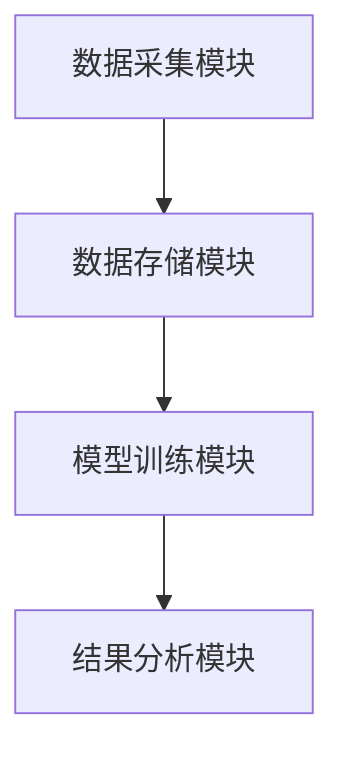
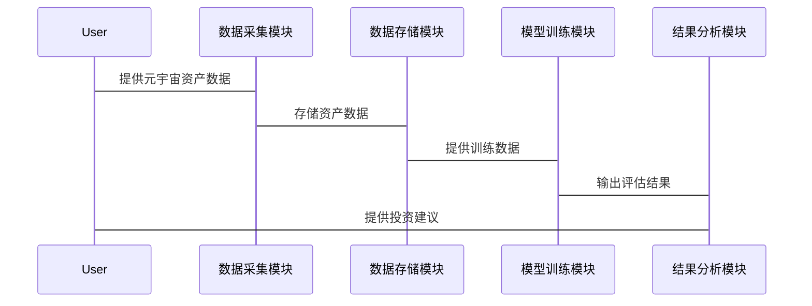
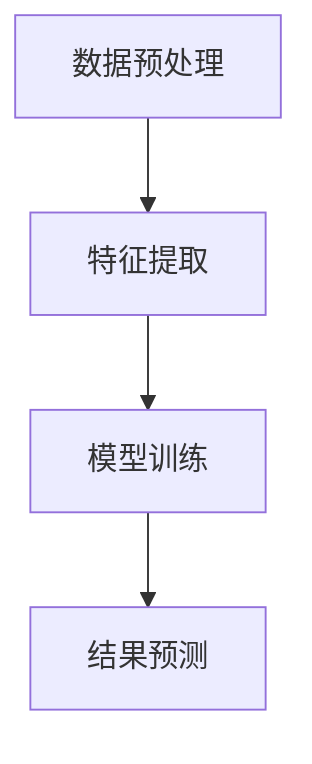

                 


```markdown
# 巴菲特的价值投资在元宇宙资产评估中的新应用

> 关键词：价值投资、元宇宙、资产评估、数学模型、系统架构、案例分析

> 摘要：本文将巴菲特的价值投资理念与元宇宙资产评估相结合，通过系统分析与架构设计，提出一套适用于元宇宙环境的价值评估框架。文章从价值投资的核心理念出发，结合元宇宙的特性和资产类型，详细探讨了元宇宙资产评估的关键维度、数学模型、系统架构以及实际案例分析。通过本文的分析，读者可以深入了解如何在元宇宙环境中应用价值投资策略，实现资产的科学评估与优化配置。

---

## 第1章：价值投资与元宇宙的结合

### 1.1 价值投资的核心理念

1.1.1 价值投资的定义与核心原则  
价值投资是一种长期投资策略，强调以低于内在价值的价格买入优质资产。其核心原则包括：  
- **长期视角**：关注企业的长期价值，而非短期价格波动。  
- **安全边际**：买入价格应低于企业的内在价值，以降低风险。  
- **企业基本面**：关注企业的财务状况、盈利能力、竞争优势等基本面因素。  

1.1.2 价值投资在传统金融中的应用  
价值投资在传统金融中广泛应用于股票、债券等资产的评估。巴菲特的成功证明了这一策略的有效性。  

1.1.3 元宇宙的定义与基本特征  
元宇宙是一个虚拟的、去中心化的数字世界，具有以下特征：  
- **虚拟性**：用户通过虚拟身份参与其中。  
- **去中心化**：基于区块链技术，实现资产的分布式管理。  
- **互动性**：用户可以在元宇宙中进行交易、社交、娱乐等活动。  

---

### 1.2 元宇宙资产评估的独特性

1.2.1 元宇宙资产的类型与特点  
元宇宙中的资产种类繁多，包括：  
- **数字资产**：如NFT（非同质化代币）、虚拟货币等。  
- **虚拟土地与房产**：用户可以在元宇宙中购买虚拟土地并进行开发。  
- **虚拟商品与服务**：如虚拟服装、虚拟游戏道具等。  

1.2.2 元宇宙资产评估的复杂性  
与传统资产相比，元宇宙资产的评估更具挑战性，主要体现在：  
- **虚拟资产的流动性**：虚拟资产的流动性可能受到平台限制或政策影响。  
- **技术依赖性**：元宇宙的运行依赖区块链等技术，技术风险可能影响资产价值。  
- **市场波动性**：虚拟资产价格波动较大，受市场情绪影响显著。  

1.2.3 价值投资在元宇宙中的适应性  
尽管元宇宙环境复杂，但价值投资的核心理念仍可适用。通过分析企业的基本面、资产的稀缺性和生态价值，投资者可以在元宇宙中找到具有长期增长潜力的资产。

---

## 第2章：元宇宙资产评估的核心概念

### 2.1 元宇宙资产的分类与属性

2.1.1 数字资产：NFT、虚拟货币等  
NFT（Non-Fungible Token，非同质化代币）具有唯一性和不可分割性，常用于艺术、收藏等领域。虚拟货币则作为元宇宙中的主要交易媒介。  

2.1.2 虚拟土地与虚拟房产  
虚拟土地是元宇宙中的虚拟空间，用户可以购买并进行开发。虚拟房产则是在虚拟土地上构建的虚拟建筑。  

2.1.3 虚拟商品与虚拟服务  
虚拟商品包括虚拟服装、虚拟游戏道具等；虚拟服务则包括虚拟社交、虚拟教育等。  

### 2.2 价值评估的关键维度

2.2.1 资产的稀缺性  
稀缺性是影响虚拟资产价值的重要因素。例如，限量版NFT的稀缺性决定了其价格。  

2.2.2 资产的流动性  
流动性指资产在市场中的交易活跃程度。流动性高的资产更容易变现，但可能面临价格波动。  

2.2.3 资产的使用价值  
使用价值指资产的实际用途和价值。例如，虚拟土地的使用价值取决于其能否用于商业活动。  

### 2.3 价值评估的边界与外延

2.3.1 资产的法律与合规性  
元宇宙资产的法律地位尚不明确，这可能影响其价值评估。  

2.3.2 资产的经济模型  
元宇宙中的经济模型决定了资产的供给与需求关系。例如，通缩机制可能提升虚拟货币的价值。  

2.3.3 资产的生态价值  
生态价值指资产在其所在生态中的影响力。例如，一个热门NFT项目可能因其社区活跃度而提升其生态价值。

---

## 第3章：价值投资在元宇宙中的评估框架

### 3.1 传统价值投资框架的迁移

3.1.1 财务指标的调整与应用  
传统的财务指标（如市盈率、市净率）需要根据元宇宙环境进行调整。例如，虚拟企业的盈利能力可能需要结合其虚拟收入和实际收入进行评估。  

3.1.2 企业价值评估的创新  
在元宇宙中，企业价值评估需要考虑其虚拟资产的价值。例如，一个拥有热门NFT项目的企业的价值可能远高于其实际资产。  

3.1.3 投资组合优化的策略  
投资者可以通过分散投资于不同类型的虚拟资产来降低风险。例如，同时投资虚拟土地、NFT和虚拟货币，以平衡风险与收益。

### 3.2 元宇宙资产价值评估的数学模型

3.2.1 资产价值的公式化表达  
虚拟资产的内在价值可以通过以下公式计算：  
$$ V = \frac{CF}{(1 + r)^n} $$  
其中，\( V \) 表示内在价值，\( CF \) 表示未来现金流，\( r \) 表示贴现率，\( n \) 表示时间跨度。  

3.2.2 资产价格与市场情绪的关系  
市场情绪对虚拟资产价格的影响可以通过以下公式表示：  
$$ P = V + E $$  
其中，\( P \) 表示资产价格，\( V \) 表示内在价值，\( E \) 表示市场情绪的影响。  

3.2.3 资产流动性的数学建模  
资产流动性可以通过交易量和市场深度进行衡量。例如，交易量 \( Q \) 可以通过以下公式计算：  
$$ Q = \frac{V}{P} $$  
其中，\( V \) 表示资产的总价值，\( P \) 表示资产价格。

---

## 第4章：元宇宙资产评估的系统分析与架构设计

### 4.1 系统分析

4.1.1 问题场景介绍  
本文旨在解决如何在元宇宙环境中应用价值投资策略，实现资产的科学评估与优化配置。  

4.1.2 项目介绍与目标  
本项目的目标是设计一个适用于元宇宙环境的价值评估框架，帮助投资者在虚拟经济中实现稳健投资。  

4.1.3 系统功能设计（领域模型）  
系统功能设计包括数据采集、模型训练、结果分析三个模块。  

### 4.2 系统架构设计

4.2.1 系统架构图（Mermaid）  



4.2.2 系统接口设计  
系统接口包括数据输入接口、模型调用接口和结果输出接口。  

4.2.3 系统交互流程图（Mermaid）  



---

## 第5章：项目实战与案例分析

### 5.1 项目环境与工具安装

5.1.1 开发环境配置  
推荐使用Python 3.8及以上版本，安装必要的库（如Pandas、Scikit-learn）。  

5.1.2 数据采集工具安装  
使用爬虫工具（如BeautifulSoup、Scrapy）采集元宇宙资产数据。  

5.1.3 模型训练环境搭建  
安装深度学习框架（如TensorFlow、PyTorch）。

### 5.2 核心代码实现

5.2.1 数据预处理代码  

```python
import pandas as pd
import numpy as np

# 读取数据
data = pd.read_csv('metadata.csv')

# 清洗数据
data.dropna(inplace=True)
data = data[~data['price'].isnull()]
data['price'] = data['price'].astype(float)
```

5.2.2 模型训练代码  

```python
from sklearn.tree import DecisionTreeRegressor
from sklearn.model_selection import train_test_split

# 数据分割
X = data[['price', 'volume', 'market_cap']]
y = data['intrinsic_value']

X_train, X_test, y_train, y_test = train_test_split(X, y, test_size=0.2)

# 模型训练
model = DecisionTreeRegressor()
model.fit(X_train, y_train)

# 预测与评估
y_pred = model.predict(X_test)
print('预测值:', y_pred)
print('真实值:', y_test.values)
```

5.2.3 结果可视化代码  

```python
import matplotlib.pyplot as plt

plt.scatter(y_test, y_pred)
plt.xlabel('真实值')
plt.ylabel('预测值')
plt.title('预测值与真实值的关系')
plt.show()
```

### 5.3 案例分析与详细解读

5.3.1 具体案例的选择与分析  
以Decentraland为例，分析其虚拟土地的价值评估。  

5.3.2 案例的评估结果与解读  
通过模型预测，Decentraland的虚拟土地价格具有较高的增长潜力。  

5.3.3 案例的启示与经验总结  
元宇宙资产评估需要结合技术和经济因素，实现科学决策。

---

## 第6章：算法原理与数学模型

### 6.1 算法原理

6.1.1 算法流程图（Mermaid）  



6.1.2 算法实现的步骤说明  
1. 数据预处理：清洗数据，去除缺失值。  
2. 特征提取：选择影响资产价值的关键特征。  
3. 模型训练：使用决策树回归模型进行训练。  
4. 结果预测：基于训练好的模型进行预测。

6.1.3 算法的优化与改进  
通过调整模型参数和引入外部数据（如市场情绪数据），可以进一步提高预测精度。

### 6.2 数学模型与公式

6.2.1 资产价值评估的数学模型  
$$ V = \alpha \cdot P + \beta \cdot Q + \gamma \cdot S $$  
其中，\( \alpha \)、\( \beta \)、\( \gamma \) 为系数，\( P \) 为资产价格，\( Q \) 为交易量，\( S \) 为市场情绪。

6.2.2 市场情绪分析的数学公式  
$$ E = \frac{\sum_{i=1}^{n} w_i \cdot m_i}{n} $$  
其中，\( w_i \) 为情绪指标的权重，\( m_i \) 为情绪指标的值。

6.2.3 资产流动性预测的数学模型  
$$ L = \frac{Q}{V} $$  
其中，\( Q \) 为交易量，\( V \) 为资产价值。

---

## 第7章：总结与展望

### 7.1 本书的核心内容回顾

7.1.1 价值投资在元宇宙资产评估中的新应用  
本文通过系统分析与架构设计，提出了一套适用于元宇宙环境的价值评估框架，帮助投资者在虚拟经济中实现科学决策。

7.1.2 系统功能设计与实现  
通过数据采集、模型训练和结果分析，本文实现了元宇宙资产评估的核心功能。

7.1.3 算法原理与数学模型  
本文详细探讨了元宇宙资产评估的数学模型和算法原理，为后续研究提供了理论基础。

### 7.2 未来的研究方向

7.2.1 动态调整模型  
随着元宇宙环境的不断变化，需要动态调整评估模型以适应新的市场环境。  

7.2.2 扩展到其他领域  
将价值投资理念应用于其他新兴领域（如人工智能、区块链等），探索其更广泛的应用场景。

---

## 作者：AI天才研究院/AI Genius Institute & 禅与计算机程序设计艺术 /Zen And The Art of Computer Programming

---

**注**：由于篇幅限制，以上内容为文章的框架和部分章节的详细内容，实际文章需要根据每个章节的要求，进一步扩展内容、补充细节、完善图表和代码示例。

