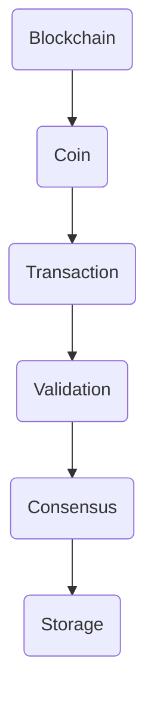

                 

# 巴菲特的价值投资在数字资产时代的应用：加密货币与NFT

---

## 关键词：巴菲特，价值投资，数字资产，加密货币，NFT，区块链，风险管理

---

## 摘要：本文探讨了巴菲特的价值投资理念在数字资产时代中的应用，重点分析了加密货币和NFT的投资策略。通过结合区块链技术、市场分析和实际案例，本文为投资者提供了基于价值投资的数字资产投资框架，强调了风险管理、长期持有和基本面分析的重要性。

---

## # 第1章: 巴菲特价值投资理念概述

### ## 1.1 巴菲特价值投资的核心理念

#### ### 1.1.1 价值投资的定义与核心原则
价值投资是一种以基本面分析为基础的投资策略，强调以低于资产内在价值的价格买入优质资产。巴菲特的价值投资理念包括以下核心原则：
1. **安全边际**：买入价格低于资产的内在价值。
2. **长期持有**：投资优质资产，耐心等待价值兑现。
3. **基本面分析**：关注企业的财务状况、竞争优势和管理团队。

#### ### 1.1.2 巴菲特的价值投资方法论
巴菲特的投资方法论强调：
1. **集中投资**：将资金集中在少数优质资产上。
2. **逆向思维**：在市场恐慌时买入，在市场狂热时卖出。
3. **长期视角**：关注企业的长期价值，而非短期波动。

#### ### 1.1.3 价值投资在不同市场环境中的应用
价值投资在传统金融市场的成功应用为数字资产时代的投资提供了借鉴。然而，数字资产的高波动性和技术特性要求投资者对传统方法进行调整，结合技术分析和市场趋势。

### ## 1.2 数字资产的基本概念与现状

#### ### 1.2.1 数字资产的定义与分类
数字资产是指基于区块链技术的虚拟资产，主要包括：
1. **加密货币**：如比特币、以太坊，用于价值交换和存储。
2. **NFT（非同质化代币）**：用于表示独特数字资产的所有权，如数字艺术品、虚拟土地等。
3. **数字证券**：代表传统金融资产的数字凭证。

#### ### 1.2.2 加密货币与NFT的特性对比
| 特性         | 加密货币                | NFT                 |
|--------------|-------------------------|----------------------|
| 唯一性       | 同质化                  | 非同质化            |
| 用途         | 作为货币或投资工具      | 作为资产所有权证明  |
| 技术基础     | 区块链                 | 区块链              |
| 价值驱动     | 技术进步、网络效应      | 独特性、市场需求    |

#### ### 1.2.3 数字资产与传统金融资产的区别
数字资产具有以下特点：
1. **去中心化**：基于区块链技术，无须依赖传统金融机构。
2. **高波动性**：市场波动剧烈，价格受技术和市场情绪影响较大。
3. **创新性**：技术不断迭代，新兴应用场景丰富。

### ## 1.3 巴菲特价值投资与数字资产的结合

#### ### 1.3.1 数字资产时代的价值投资机会
数字资产市场提供了新的投资机会，尤其是区块链技术和NFT的应用前景广阔。然而，投资者需要识别真正具有价值的项目，避免盲目跟风。

#### ### 1.3.2 巴菲特投资理念在数字资产中的适用性
尽管数字资产市场波动剧烈，但巴菲特的价值投资理念仍具有参考价值：
1. **长期持有**：选择具有长期增长潜力的数字资产。
2. **基本面分析**：评估项目的技术、团队和市场前景。
3. **安全边际**：避免过度杠杆和高风险投资。

#### ### 1.3.3 数字资产投资中的风险与挑战
1. **技术风险**：区块链技术的不确定性和监管政策的变化。
2. **市场风险**：价格波动剧烈，可能面临大幅回撤。
3. **流动性风险**：部分数字资产的流动性较低，难以快速变现。

---

## # 第2章: 加密货币的价值评估与投资策略

### ## 2.1 加密货币的基本特性与市场分析

#### ### 2.1.1 加密货币的技术基础：区块链
区块链是一种分布式账本技术，确保数据的安全性和不可篡改性。比特币和以太坊的区块链技术是加密货币的核心。

#### ### 2.1.2 加密货币的市场波动与周期性
加密货币市场具有明显的周期性，价格波动受市场情绪和技术进展影响。

#### ### 2.1.3 加密货币的供需关系与价值评估
加密货币的供需关系决定了其价格。市场对加密货币的需求受应用场景、技术进步和政策监管的影响。

#### ### 2.1.4 加密货币的宏观经济分析
宏观经济指标（如GDP、通货膨胀率）对加密货币的需求和价格有一定影响。

#### ### 2.1.5 加密货币的市场流动性分析
市场流动性决定了加密货币的买卖深度和交易成本。

### ## 2.2 加密货币的价值投资策略

#### ### 2.2.1 基于基本面分析的投资策略
1. **技术分析**：分析区块链的技术优势和可扩展性。
2. **团队背景**：评估开发团队的经验和声誉。
3. **市场需求**：关注加密货币的实际应用场景和用户需求。

#### ### 2.2.2 基于技术分析的投资策略
1. **价格走势**：通过K线图分析价格趋势。
2. **成交量**：关注成交量的变化对价格的影响。
3. **技术指标**：使用MACD、RSI等指标辅助决策。

#### ### 2.2.3 长期持有与价值发现
1. **选择优质资产**：投资具有长期增长潜力的加密货币。
2. **分散投资**：避免过度集中于单一资产。
3. **耐心等待**：长期持有，等待价值兑现。

---

## # 第3章: NFT的价值评估与投资策略

### ## 3.1 NFT的基本特性与市场分析

#### ### 3.1.1 NFT的定义与技术基础
NFT（Non-Fungible Token）是一种基于区块链的唯一数字资产，用于证明数字资产的所有权。

#### ### 3.1.2 NFT的市场现状与发展趋势
NFT市场近年来快速增长，应用场景包括数字艺术、虚拟土地、游戏道具等。

#### ### 3.1.3 NFT的稀缺性与独特性
NFT的独特性决定了其价值，稀缺性和市场需求是影响价格的主要因素。

#### ### 3.1.4 NFT的经济模型
NFT的经济模型包括发行机制、交易机制和激励机制。

### ## 3.2 NFT的价值投资策略

#### ### 3.2.1 基于项目背景与团队分析的投资策略
1. **项目背景**：评估项目的创新性和市场前景。
2. **团队背景**：关注开发团队的经验和声誉。

#### ### 3.2.2 基于市场需求与社区影响力的投资策略
1. **市场需求**：关注NFT的实际应用场景和用户需求。
2. **社区影响力**：评估项目的社区活跃度和用户参与度。

#### ### 3.2.3 NFT的长期持有与价值增长
1. **选择优质项目**：投资具有长期增长潜力的NFT。
2. **分散投资**：避免过度集中于单一项目。
3. **耐心等待**：长期持有，等待价值兑现。

---

## # 第4章: 巴菲特价值投资在数字资产中的应用案例

### ## 4.1 加密货币投资案例分析

#### ### 4.1.1 比特币与以太坊的投资分析
1. **比特币**：作为数字黄金，具有稀缺性和抗通胀性。
2. **以太坊**：具有智能合约功能，应用场景广泛。

#### ### 4.1.2 其他主流加密货币的投资策略
1. **选择具有技术优势的加密货币**。
2. **关注市场需求和团队背景**。

#### ### 4.1.3 加密货币投资中的风险管理
1. **分散投资**：避免过度集中于单一资产。
2. **设定止损**：控制亏损幅度。

### ## 4.2 NFT投资案例分析

#### ### 4.2.1 数字艺术NFT的投资分析
1. **市场需求**：数字艺术市场快速发展。
2. **项目选择**：选择具有独特性和稀缺性的NFT。

#### ### 4.2.2 游戏道具NFT的投资分析
1. **应用场景**：游戏道具具有实用价值。
2. **项目选择**：选择具有长期生命力的游戏项目。

#### ### 4.2.3 NFT投资中的风险管理
1. **分散投资**：避免过度集中于单一项目。
2. **关注市场趋势**：及时调整投资策略。

---

## # 第5章: 数字资产投资中的风险管理

### ## 5.1 风险管理的重要性
1. **降低投资风险**：避免因市场波动导致的重大损失。
2. **提高投资收益**：通过风险管理实现稳定收益。

### ## 5.2 风险管理策略

#### ### 5.2.1 分散投资
1. **资产配置**：将资金分散投资于不同类型的数字资产。
2. **风险分散**：避免过度集中于单一资产或市场。

#### ### 5.2.2 设定止损
1. **价格止损**：当资产价格跌至设定值时立即卖出。
2. **时间止损**：当持有时间超过一定期限时卖出。

#### ### 5.2.3 监控市场
1. **市场分析**：定期监控市场趋势和资产价格。
2. **风险预警**：建立风险预警机制，及时发现潜在风险。

### ## 5.3 风险管理的实施步骤

#### ### 5.3.1 确定投资目标
1. **投资目标**：明确投资目标和风险承受能力。
2. **资产配置**：根据目标和风险偏好进行资产配置。

#### ### 5.3.2 制定风险管理计划
1. **风险评估**：评估潜在风险并制定应对策略。
2. **风险监控**：定期监控市场和资产表现。

#### ### 5.3.3 调整投资组合
1. **定期评估**：根据市场变化和风险评估调整投资组合。
2. **持续优化**：不断优化风险管理策略，提高投资收益。

---

## # 第6章: 结论与展望

### ## 6.1 结论
巴菲特的价值投资理念在数字资产时代仍然具有重要的指导意义。通过基本面分析、长期持有和风险管理，投资者可以在数字资产市场中实现稳健的投资收益。

### ## 6.2 展望
1. **技术进步**：区块链技术的不断进步将推动数字资产市场的发展。
2. **市场成熟**：数字资产市场将逐步成熟，投资者将更加理性。
3. **政策监管**：监管政策的完善将为数字资产市场提供更稳定的发展环境。

---

## # 作者：AI天才研究院/AI Genius Institute & 禅与计算机程序设计艺术 /Zen And The Art of Computer Programming

---

## # 参考文献
1. 巴菲特股东大会演讲合集。
2. 加密货币和NFT相关学术论文。
3. 数字资产市场分析报告。

--- 

* 本文由[AI天才研究院](https://aiguru.org)撰写，转载请注明出处。

