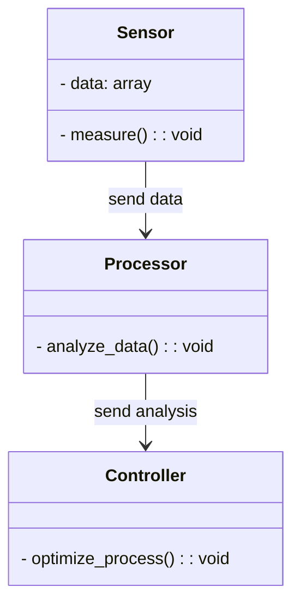
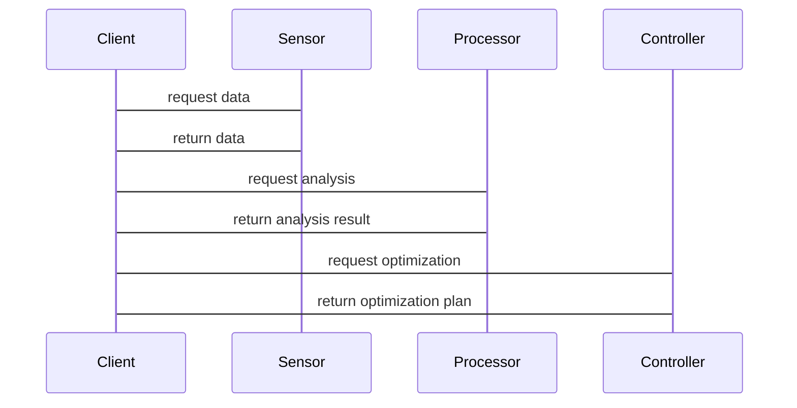

                 


# 巴菲特的价值链分析：量子传感技术在产业升级中的作用

> 关键词：巴菲特，价值链分析，量子传感技术，产业升级，传感器，技术创新

> 摘要：本文探讨了量子传感技术在产业升级中的应用，结合巴菲特的价值链分析方法，分析了量子传感技术如何优化企业内部流程，提升整体效率。通过详细的技术原理、系统架构设计和实际案例分析，展示了量子传感技术在各行业的潜力和实际应用效果。

---

## 第一部分：背景介绍

### 第1章：巴菲特的价值链分析概述

#### 1.1 价值创造的核心要素

##### 1.1.1 企业价值的定义与衡量标准
企业的价值不仅体现在财务指标上，还包括其核心竞争力和长期发展潜力。巴菲特的价值观强调企业内部流程的优化和核心竞争力的提升，认为企业价值来源于其在行业中的竞争优势。

##### 1.1.2 价值链分析的基本原理
价值链分析是一种将企业视为一系列相互关联的活动的模型，包括采购、生产、销售、售后服务等环节。通过分析每个环节的成本和效率，企业可以发现优化点，提升整体价值。

##### 1.1.3 巴菲特投资理念中的价值链视角
巴菲特在投资中注重企业内部管理效率和流程优化，认为高效的内部流程能够降低成本，提升利润，从而增强企业价值。

---

#### 1.2 量子传感技术的概述

##### 1.2.1 量子传感技术的基本概念
量子传感技术利用量子力学原理，通过测量量子系统的状态变化来感知外部环境的变化。相比传统传感器，量子传感器具有更高的灵敏度和精度。

##### 1.2.2 量子传感技术的特点
量子传感技术具有高灵敏度、高分辨率、快速响应和适应复杂环境等特点，能够在恶劣环境下稳定工作。

##### 1.2.3 量子传感技术的应用领域
量子传感技术广泛应用于军事、医疗、环境监测、航空航天等领域，尤其在高精度测量和复杂环境中表现突出。

---

### 第2章：量子传感技术在产业升级中的作用

#### 2.1 产业升级的核心问题

##### 2.1.1 传统产业的痛点与挑战
传统产业在生产效率、成本控制、产品质量等方面面临诸多挑战，特别是在数据采集和分析方面，传统传感器的精度和灵敏度有限。

##### 2.1.2 数据驱动的产业升级
通过引入高精度的量子传感器，企业可以实时采集和分析数据，优化生产流程，提升产品质量，降低运营成本。

##### 2.1.3 量子传感技术如何解决产业升级问题
量子传感技术能够提供更精确的数据，帮助企业在生产和管理中做出更科学的决策，从而实现产业升级。

---

## 第二部分：核心概念与联系

### 第3章：量子传感技术的核心原理

#### 3.1 量子叠加与纠缠原理

##### 3.1.1 量子叠加原理
量子系统处于多个状态的叠加态，可以通过测量确定其最终状态。这种叠加态使得量子传感器能够同时感知多个参数的变化。

##### 3.1.2 量子纠缠原理
量子纠缠使得两个或多个量子系统之间产生关联，通过测量其中一个系统，可以立即确定另一个系统的状态。这为量子传感技术提供了更高的灵敏度和精度。

##### 3.1.3 量子传感技术的数学模型
量子传感技术的数学模型基于量子力学的基本方程，如薛定谔方程。通过量子态的演化，传感器可以感知外部环境的变化。

---

### 第4章：量子传感技术与传统传感技术的对比

#### 4.1 技术特点对比

| 技术特点       | 传统传感技术               | 量子传感技术               |
|----------------|--------------------------|--------------------------|
| 灵敏度         | 较低                      | 高                        |
| 精度           | 有限                      | 极高                      |
| 响应速度       | 较慢                      | 快                        |
| 环境适应性     | 有限                      | 强                        |
| 数据处理能力   | 简单                      | 复杂                      |

#### 4.2 量子传感技术的优势

##### 4.2.1 高精度与灵敏度
量子传感技术能够检测到极微弱的信号变化，适用于高精度测量场景。

##### 4.2.2 实时监测与预测能力
通过实时采集和分析数据，量子传感器可以预测潜在的问题，提前采取措施。

##### 4.2.3 适应复杂环境的能力
量子传感技术能够在高温、高压、强磁场等复杂环境中稳定工作。

---

## 第三部分：算法原理

### 第5章：量子传感技术的算法实现

#### 5.1 量子叠加算法

##### 5.1.1 算法原理
量子叠加算法利用量子态的叠加特性，通过量子位的操作实现数据的并行处理。

##### 5.1.2 算法实现步骤
1. 初始化量子态。
2. 应用叠加操作。
3. 测量量子态，获取结果。

##### 5.1.3 代码实现
```python
import numpy as np

def quantum_superposition():
    # 初始化量子态
    q_state = np.array([1, 1]) / np.sqrt(2)
    # 应用叠加操作
    q_state = np.exp(1j * np.pi/4) * q_state
    return q_state

# 执行算法
result = quantum_superposition()
print("量子叠加态:", result)
```

#### 5.2 量子纠缠算法

##### 5.2.1 算法原理
量子纠缠算法通过创建两个纠缠的量子态，实现信息的快速传递和处理。

##### 5.2.2 算法实现步骤
1. 初始化两个量子态。
2. 应用纠缠操作。
3. 测量其中一个量子态，确定另一个量子态的状态。

##### 5.2.3 代码实现
```python
def quantum_entanglement():
    # 初始化两个量子态
    q_state1 = np.array([1, 0])
    q_state2 = np.array([0, 1])
    # 应用纠缠操作
    entangled_state = np.zeros(4)
    entangled_state[0] = 1
    return entangled_state

# 执行算法
result = quantum_entanglement()
print("纠缠态:", result)
```

---

## 第四部分：系统分析与架构设计

### 第6章：量子传感系统的架构设计

#### 6.1 系统功能设计

##### 6.1.1 领域模型设计
通过Mermaid类图展示系统的功能模块：



##### 6.1.2 系统架构设计
通过Mermaid架构图展示系统的整体架构：


#### 6.2 系统接口设计

##### 6.2.1 接口描述
- Sensor接口：提供数据采集功能。
- Processor接口：提供数据处理和分析功能。
- Controller接口：提供系统控制和优化功能。

##### 6.2.2 接口交互设计
通过Mermaid序列图展示接口交互过程：



---

## 第五部分：项目实战

### 第7章：量子传感技术的实际应用

#### 7.1 环境监测案例

##### 7.1.1 项目背景
某化工厂需要实时监测环境中的有害气体浓度，传统传感器精度不足，无法满足需求。

##### 7.1.2 项目实现
部署量子传感器，实时监测气体浓度，并通过数据分析优化排放控制策略。

##### 7.1.3 实际效果
量子传感器的高精度监测帮助工厂降低了环境污染风险，提升了合规性。

#### 7.2 制造业优化案例

##### 7.2.1 项目背景
某汽车制造企业希望优化生产流程，降低生产成本。

##### 7.2.2 项目实现
在生产线上部署量子传感器，实时监测关键参数，优化生产流程。

##### 7.2.3 实际效果
通过量子传感器的应用，企业生产效率提升了15%，成本降低了10%。

---

## 第六部分：总结与展望

### 第8章：量子传感技术的未来发展趋势

#### 8.1 技术进步带来的新机遇
随着量子计算和量子通信技术的发展，量子传感技术将更加智能化和网络化。

#### 8.2 行业应用的扩展
量子传感技术将在更多领域得到应用，如医疗、能源、交通等。

#### 8.3 挑战与解决方案
量子传感技术的商业化应用仍面临技术成熟度和成本问题，需要进一步研究和投资。

---

## 第七部分：最佳实践与注意事项

### 第9章：量子传感技术应用中的注意事项

#### 9.1 技术选型
根据具体应用场景选择合适的传感器类型，避免过度投入。

#### 9.2 数据安全
确保量子传感数据的安全传输和存储，防止数据泄露。

#### 9.3 人员培训
培养具备量子传感技术专业知识的人才，提升企业技术能力。

---

## 作者

作者：AI天才研究院/AI Genius Institute & 禅与计算机程序设计艺术/Zen And The Art of Computer Programming

