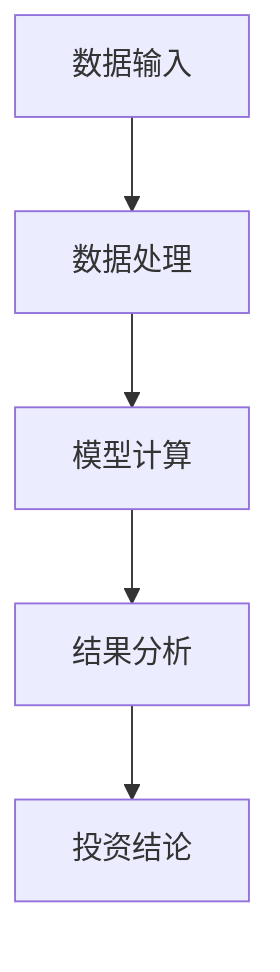

                 


# 巴菲特的企业价值评估：内在价值 vs 市场价格

## 关键词：巴菲特，价值投资，内在价值，市场价格，企业评估，现金流折现模型，投资策略

## 摘要： 
本文深入探讨了巴菲特的企业价值评估方法，重点分析了内在价值与市场价格之间的关系。通过介绍巴菲特的价值投资理念、内在价值的计算方法、市场价格的影响因素以及投资策略，本文为读者提供了系统性的分析框架，帮助投资者更好地理解如何通过内在价值评估来做出明智的投资决策。文章结合数学模型和实际案例，详细解析了巴菲特的投资逻辑，并提供了实用的投资策略和风险管理建议。

---

## 第1章 巴菲特投资理念的核心思想

### 1.1 巴菲特的背景与投资哲学

#### 1.1.1 巴菲特的生平简介
沃伦·巴菲特（Warren Buffett），生于1930年，是世界著名投资家、企业家和慈善家。他通过长期的价值投资策略，积累了巨额财富，并成为全球最受尊敬的投资大师之一。巴菲特的投资理念源于他的导师本杰明·格雷厄姆（Benjamin Graham），并在此基础上发展出了自己的价值投资体系。

#### 1.1.2 巴菲特的价值投资理念
巴菲特的价值投资理念强调购买低于其内在价值的股票，并长期持有。他认为市场先生（Mr. Market）是市场的化身，市场情绪的波动为理性投资者提供了低价买入和高价卖出的机会。巴菲特的投资策略注重企业的基本面分析，寻找那些具有强大竞争优势、良好管理团队和可持续盈利能力的企业。

#### 1.1.3 巴菲特投资理念的核心要素
- **安全边际**：买入价格低于内在价值，确保投资的安全性。
- **长期持有**：避免频繁交易，减少交易成本和情绪干扰。
- **竞争优势**：投资于具有持续竞争优势的企业。
- **管理层质量**：管理层的能力和诚信是企业成功的关键。

### 1.2 价值投资的定义与特点

#### 1.2.1 价值投资的定义
价值投资是一种投资策略，强调以低于公平价值的价格买入优质资产。其核心在于识别市场价格与内在价值之间的差异，并利用这种差异进行投资。

#### 1.2.2 价值投资的核心特点
- **基本面分析**：关注企业的财务状况、盈利能力、竞争优势和管理团队。
- **逆向思维**：在市场恐慌时买入，在市场狂热时卖出。
- **长期视角**：注重企业的长期价值，而非短期价格波动。
- **安全边际**：买入价格低于内在价值，确保投资的安全性。

#### 1.2.3 价值投资与短期投资的区别
- 价值投资注重长期价值，而短期投资关注短期价格波动。
- 价值投资强调基本面分析，而短期投资可能更多依赖市场情绪和技术分析。
- 价值投资者倾向于分散投资，而短期投资者可能集中押注某一趋势。

### 1.3 内在价值与市场价格的关系

#### 1.3.1 内在价值的定义
内在价值是指企业在未来现金流的现值，即企业未来产生的所有现金流按适当折现率计算的当前价值。内在价值是企业的真实价值，与市场情绪无关。

#### 1.3.2 市场价格的定义
市场价格是指市场上交易的资产当前的交易价格。市场价格受市场情绪、流动性、市场参与者的预期等多种因素影响。

#### 1.3.3 内在价值与市场价格的动态关系
内在价值是市场价格的客观基础，而市场价格是内在价值的市场反映。市场价格围绕内在价值波动，但长期来看，市场价格会回归内在价值。

---

## 第2章 巴菲特的企业价值评估方法

### 2.1 内在价值的计算方法

#### 2.1.1 现金流折现法（DCF模型）
现金流折现法是计算内在价值的核心方法。其基本思路是将企业未来产生的所有现金流按适当的折现率折算到当前的价值，即：

$$ Intrinsic\ Value = \sum_{t=1}^{n} \frac{CF_t}{(1+r)^t} + \frac{TV}{(1+r)^n} $$

其中：
- $CF_t$ 是第 $t$ 年的现金流
- $r$ 是折现率
- $TV$ 是终值（如果有）

#### 2.1.2 股权自由现金流模型
股权自由现金流模型是DCF模型的一种形式，主要用于评估企业的股权价值。其公式为：

$$ Equity\ Value = \sum_{t=1}^{n} \frac{FCF_t}{(1+r)^t} + \frac{TV}{(1+r)^n} $$

其中：
- $FCF_t$ 是第 $t$ 年的股权自由现金流
- $r$ 是股权资本成本

#### 2.1.3 企业价值公式
企业价值（Enterprise Value, EV）是企业整体价值的度量，包括股权和债务。计算公式为：

$$ EV = \sum_{t=1}^{n} \frac{CF_t}{(1+r)^t} + \frac{TV}{(1+r)^n} $$

其中：
- $CF_t$ 是企业自由现金流
- $r$ 是加权平均资本成本（WACC）

### 2.2 资产评估与负债分析

#### 2.2.1 资产评估的基本原则
资产评估需要考虑资产的使用价值、市场价值和清算价值。在企业价值评估中，通常采用市场价值进行评估。

#### 2.2.2 负债的分类与评估
负债可以分为流动负债和非流动负债。在企业价值评估中，负债的现值通常作为企业价值的一部分进行评估。

#### 2.2.3 企业资产与负债的平衡关系
企业价值是资产的现值减去负债的现值。因此，企业价值的计算需要考虑资产和负债的相互关系。

### 2.3 市场价格与市场情绪的影响

#### 2.3.1 市场价格波动的周期性
市场价格受市场情绪的影响，具有周期性波动。在市场繁荣时，市场价格可能高于内在价值；在市场恐慌时，市场价格可能低于内在价值。

#### 2.3.2 市场情绪对企业价值的影响
市场情绪会影响投资者的决策，从而影响市场价格。当市场情绪乐观时，投资者愿意为资产支付更高的价格；当市场情绪悲观时，投资者可能以更低的价格出售资产。

#### 2.3.3 市场价格与内在价值的偏离分析
市场价格与内在价值的偏离是投资机会的来源。当市场价格低于内在价值时，投资者可以买入资产；当市场价格高于内在价值时，投资者可以卖出资产。

---

## 第3章 巴菲特投资策略的系统分析

### 3.1 企业基本面分析

#### 3.1.1 财务报表分析方法
财务报表分析是企业基本面分析的核心内容。主要包括资产负债表、利润表和现金流量表的分析。

#### 3.1.2 资产负债表的核心指标
- **资产总额**：企业的全部资产。
- **负债总额**：企业的全部负债。
- **股东权益**：资产减去负债后的剩余部分。

#### 3.1.3 利润表与现金流量表的关键数据
- **营业收入**：企业的主要收入来源。
- **净利润**：企业利润的最终结果。
- **经营活动现金流**：企业经营活动产生的现金流。

### 3.2 企业竞争优势分析

#### 3.2.1 核心竞争力的定义
核心竞争力是指企业在市场上独特的竞争优势，包括技术、品牌、成本优势等。

#### 3.2.2 行业地位与竞争优势
行业地位决定了企业在市场中的位置。竞争优势越强，企业未来的盈利能力越高。

#### 3.2.3 可持续竞争优势的评估标准
- **市场地位**：企业在市场中的份额和影响力。
- **技术优势**：企业的技术水平和创新能力。
- **成本优势**：企业的生产成本和管理效率。

### 3.3 投资组合管理与风险控制

#### 3.3.1 投资组合的构建原则
- **分散投资**：降低投资风险。
- **长期持有**：减少交易成本和情绪干扰。
- **价值导向**：选择低于内在价值的资产。

#### 3.3.2 风险管理的核心要素
- **风险识别**：识别潜在的风险因素。
- **风险评估**：评估风险的影响程度。
- **风险控制**：制定风险管理策略。

#### 3.3.3 投资组合的动态调整策略
- **定期审查**：检查投资组合的表现。
- **动态调整**：根据市场变化和企业基本面调整投资组合。

---

## 第4章 巴菲特投资理念的数学模型与公式

### 4.1 现金流折现模型（DCF）

#### 4.1.1 DCF模型的基本公式
$$ PV = \sum_{t=1}^{n} \frac{CF_t}{(1+r)^t} + \frac{TV}{(1+r)^n} $$

#### 4.1.2 现金流折现法的步骤解析
1. 确定企业的未来现金流。
2. 确定适当的折现率。
3. 计算未来现金流的现值。
4. 加上终值的现值。
5. 求和得到企业价值。

#### 4.1.3 DCF模型的优缺点分析
- **优点**：能够准确反映企业未来现金流的现值。
- **缺点**：需要准确预测未来现金流和折现率。

### 4.2 内在价值评估公式

#### 4.2.1 内在价值的计算公式
$$ Intrinsic\ Value = \sum_{t=1}^{n} \frac{CF_t}{(1+r)^t} + \frac{TV}{(1+r)^n} $$

#### 4.2.2 内在价值与市场价格的关系
当市场价格低于内在价值时，资产具有投资价值；当市场价格高于内在价值时，资产被高估。

---

## 第5章 项目实战：巴菲特投资理念的应用

### 5.1 项目背景与目标
通过分析一家企业的财务数据和市场情况，评估其内在价值，并与市场价格进行比较，判断是否具有投资价值。

### 5.2 系统架构与功能设计

#### 5.2.1 系统功能模块
- **数据输入**：输入企业的财务数据和市场数据。
- **模型计算**：计算企业的内在价值和市场价格。
- **结果分析**：比较内在价值与市场价格，得出投资结论。

#### 5.2.2 系统架构图


### 5.3 环境安装与系统实现

#### 5.3.1 环境安装
- 安装Python和相关库（如Pandas、NumPy、Matplotlib）。
- 安装数据分析工具（如Excel、SQL）。

#### 5.3.2 核心实现代码
```python
import pandas as pd
import numpy as np

# 输入财务数据
CF_t = [100, 150, 200, 250, 300]  # 未来现金流
r = 0.08  # 折现率
n = 5  # 年数
TV = 1000  # 终值

# 计算现值
PV = 0
for t in range(n):
    PV += CF_t[t] / (1 + r)**t

PV += TV / (1 + r)**n

print("内在价值现值为：", PV)
```

#### 5.3.3 代码应用解读
上述代码计算了企业未来现金流的现值，并加上终值的现值，得到企业价值的现值。

### 5.4 实际案例分析

#### 5.4.1 案例背景
假设我们分析一家企业的未来现金流为100、150、200、250、300万元，折现率为8%，终值为1000万元。

#### 5.4.2 计算过程
$$ PV = \frac{100}{1.08} + \frac{150}{1.08^2} + \frac{200}{1.08^3} + \frac{250}{1.08^4} + \frac{300}{1.08^5} + \frac{1000}{1.08^5} $$

#### 5.4.3 结果分析
计算结果显示，企业内在价值的现值为X万元。如果市场价格低于X万元，则企业具有投资价值。

### 5.5 项目小结
通过实际案例分析，我们验证了巴菲特投资理念的有效性。内在价值的计算为投资者提供了科学的决策依据。

---

## 第6章 总结与展望

### 6.1 本章总结
本文系统地介绍了巴菲特的企业价值评估方法，包括内在价值的计算、市场价格的影响以及投资策略的制定。通过数学模型和实际案例分析，我们验证了巴菲特投资理念的科学性和实用性。

### 6.2 未来展望
未来的研究可以进一步探讨内在价值评估的其他方法，如相对估值法（PE、PB等指标）和情景分析法。同时，可以结合人工智能技术，提高企业价值评估的准确性和效率。

---

## 附录

### 附录A 术语表
- **内在价值**：企业的未来现金流的现值。
- **市场价格**：市场上交易的资产当前价格。
- **DCF模型**：现金流折现模型。
- **安全边际**：买入价格低于内在价值。

### 附录B 参考文献
1. 巴菲特，《巴菲特致股东的信》。
2. 格雷厄姆，《证券分析》。
3. 芒格，《Poor Charlie's Almanack》。

---

## 作者：AI天才研究院/AI Genius Institute & 禅与计算机程序设计艺术 /Zen And The Art of Computer Programming

---

本文通过系统性的分析，深入探讨了巴菲特的企业价值评估方法，结合数学模型和实际案例，为读者提供了全面的投资分析框架。

