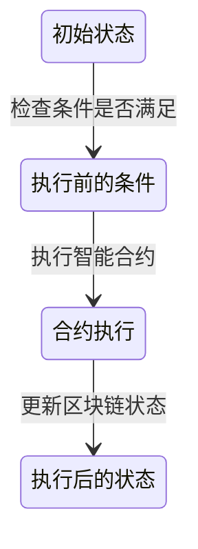
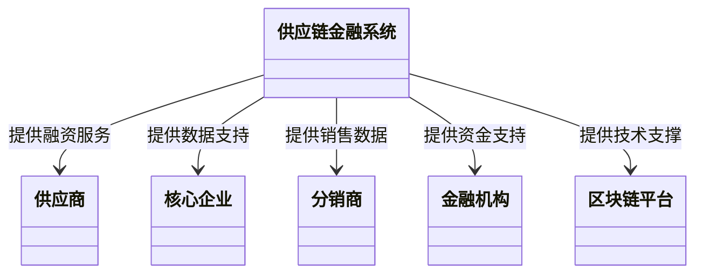
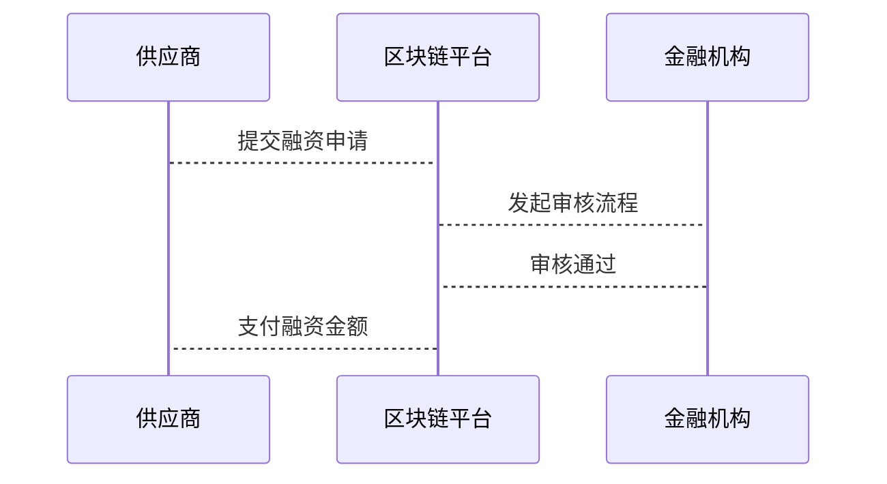

                 


# 巴菲特的供应链韧性分析：区块链技术在供应链金融中的应用

## 关键词：供应链韧性, 区块链技术, 供应链金融, 区块链算法, 供应链系统架构, 区块链应用

## 摘要：
本文深入分析了供应链金融中的关键问题，探讨了区块链技术如何提升供应链的韧性和效率。文章从供应链金融的基本概念出发，详细解析了区块链技术的核心算法、系统架构设计以及实际项目中的应用场景。通过案例分析，展示了区块链技术在供应链金融中的实际应用价值和未来发展方向。本文旨在为供应链金融领域的从业者提供理论支持和实践指导。

---

# 第1章: 供应链金融的基本概念

## 1.1 供应链金融的定义与特点
### 1.1.1 供应链金融的定义
供应链金融是指通过整合供应链上下游企业，为核心企业提供融资支持，从而优化供应链整体流动性和风险控制的金融活动。其核心目标是解决中小企业的融资难题，提升供应链的整体效率。

### 1.1.2 供应链金融的核心特点
- **嵌入式融资**：将融资服务嵌入到供应链的交易流程中，减少企业的额外操作成本。
- **数据驱动**：依赖于供应链中的交易数据和信息，进行信用评估和风险控制。
- **多方协同**：涉及核心企业、供应商、分销商、零售商以及金融机构等多方参与。

### 1.1.3 供应链金融的参与者与角色
- **核心企业**：供应链中的主导企业，通常为行业龙头企业。
- **供应商**：为核心企业提供原材料或服务的企业。
- **分销商/零售商**：供应链下游的销售渠道。
- **金融机构**：提供融资服务的银行或非银行金融机构。
- **技术平台**：提供区块链技术支持的第三方平台。

## 1.2 区块链技术的基本概念
### 1.2.1 区块链的定义与特点
区块链是一种分布式账本技术，通过去中心化、去信任化的方式记录和验证数据，具有不可篡改、可追溯和高透明度的特点。

### 1.2.2 区块链的核心技术原理
- **区块结构**：数据以区块形式存储，每个区块包含交易数据和时间戳。
- **链式结构**：区块通过哈希值链接，形成一条不可篡改的链条。
- **共识机制**：通过共识算法（如PoW、PoS）确保全网节点达成一致。
- **智能合约**：自动执行的代码，用于自动化交易和流程控制。

### 1.2.3 区块链的分类与应用场景
- **公有链**：完全去中心化的区块链，如比特币。
- **联盟链**：适用于特定机构之间的协作，如供应链金融。
- **私有链**：仅限于特定组织内部使用。

---

# 第2章: 供应链韧性分析的背景与方法

## 2.1 供应链韧性的定义与重要性
### 2.1.1 供应链韧性的定义
供应链韧性是指供应链在面对外部干扰（如市场波动、自然灾害、疫情等）时，能够快速响应、调整和恢复的能力。

### 2.1.2 供应链韧性的重要性
- **降低风险**：通过增强供应链的抗风险能力，减少因突发事件导致的损失。
- **提升效率**：通过优化供应链流程，提高整体运营效率。
- **增强信任**：通过透明化和可追溯性，增强供应链各参与方的信任。

## 2.2 供应链金融中的痛点与挑战
### 2.2.1 供应链金融的传统模式与问题
- **信息孤岛**：各参与方之间的信息不共享，导致数据重复和不一致。
- **信任缺失**：中小企业的信用评估困难，金融机构不愿提供融资。
- **效率低下**：传统模式中，融资流程复杂，审批时间长。

### 2.2.2 信息不对称与信任问题
- **信息不对称**：供应链中的信息分布不均，导致信任缺失。
- **数据篡改**：传统模式中，数据容易被篡改，导致信息不准确。
- **融资难**：中小企业缺乏足够的抵押品，难以获得融资支持。

### 2.2.3 传统供应链金融的效率与成本问题
- **高成本**：传统模式中，需要大量的人力和时间进行信息核对和审批。
- **低效率**：融资流程复杂，审批周期长，难以满足企业的实时需求。

## 2.3 区块链技术在供应链韧性分析中的作用
### 2.3.1 区块链如何增强供应链的透明度
- **数据共享**：区块链技术可以实现供应链各参与方的数据共享，减少信息孤岛。
- **可追溯性**：通过区块链技术，可以实现供应链的全程可追溯，增强信任。

### 2.3.2 区块链如何提高供应链的可追溯性
- **全链条记录**：区块链记录了供应链中的每一步交易，确保数据的真实性和完整性。
- **责任追溯**：在出现问题时，可以快速追溯到问题的源头，减少损失。

### 2.3.3 区块链如何优化供应链的效率
- **自动化流程**：通过智能合约，可以自动化处理供应链中的交易和融资流程。
- **减少中间环节**：区块链技术可以减少中间环节，降低融资成本和时间。

---

# 第3章: 区块链技术的核心算法与数学模型

## 3.1 区块链的核心算法
### 3.1.1 共识机制
共识机制是区块链技术的核心算法之一，确保所有节点达成一致。常见的共识机制包括：
- **工作量证明（PoW）**：通过计算哈希值来验证区块的有效性。
- **权益证明（PoS）**：通过持有代币的数量来决定验证权力。
- **拜占庭容错（BFT）**：适用于联盟链的共识机制。

### 3.1.2 智能合约
智能合约是区块链上的自动执行代码，用于实现供应链金融中的自动支付和流程控制。智能合约的实现基于区块链的可编程性。

### 3.1.3 加密算法
区块链中的加密算法用于确保数据的安全性和隐私性。常用的加密算法包括：
- **哈希函数**：如SHA-256，用于生成区块的唯一标识。
- **椭圆曲线加密（ECC）**：用于数字签名和身份验证。

---

## 3.2 区块链算法的数学模型
### 3.2.1 哈希函数
哈希函数是区块链技术中不可或缺的数学工具，用于将数据转换为固定长度的哈希值。数学模型如下：
$$ H(x) = \text{哈希函数} $$
其中，$x$ 是输入数据，$H(x)$ 是输出的哈希值。

### 3.2.2 智能合约
智能合约的执行逻辑可以通过状态机模型表示，如下图所示：


---

# 第4章: 系统分析与架构设计

## 4.1 问题场景介绍
供应链金融中的传统模式存在信息不对称、效率低下和信任缺失等问题。区块链技术可以提供一个去中心化、透明和可追溯的解决方案。

## 4.2 系统功能设计
供应链金融区块链系统的功能设计包括：
- **数据录入**：供应商录入采购订单和发票。
- **智能合约**：自动审核订单并触发支付。
- **融资申请**：供应商发起融资申请，系统自动评估信用。
- **资金划拨**：银行根据智能合约自动划拨资金。

---

## 4.3 系统架构设计
### 4.3.1 领域模型


### 4.3.2 系统架构


### 4.3.3 接口设计


---

# 第5章: 项目实战

## 5.1 环境安装
供应链金融区块链系统的环境安装包括：
1. 安装区块链平台（如Hyperledger Fabric）。
2. 安装智能合约开发环境（如Node.js）。
3. 安装数据库（如MySQL）。

## 5.2 核心代码实现
以下是一个简单的智能合约代码示例：
```javascript
// 供应链金融智能合约
contract SupplyChainFinance {
    // 记录订单信息
    Order[] orders;

    // 提交订单
    function submitOrder(uint orderID, string product, uint quantity) {
        orders.push(Order(orderID, product, quantity));
    }

    // 自动触发支付
    function triggerPayment(uint orderID) {
        Order memory order = orders[orderID];
        // 调用支付接口
        pay(order.supplier, order.totalAmount);
    }
}
```

## 5.3 代码解读与分析
上述代码展示了供应链金融智能合约的核心功能：
- `submitOrder`：供应商提交订单信息。
- `triggerPayment`：根据订单信息触发支付流程。

## 5.4 实际案例分析
以红酒供应链金融为例，区块链技术可以实现红酒的全程溯源和融资自动化。通过区块链平台，供应商可以快速获得融资支持，同时确保红酒的来源和质量。

---

# 第6章: 总结与展望

## 6.1 最佳实践
- **数据隐私保护**：在区块链系统中，需确保敏感数据的隐私性。
- **合规性**：遵守相关法律法规，确保区块链应用的合法性。
- **性能优化**：针对大规模供应链场景，优化区块链系统的性能。

## 6.2 小结
区块链技术为供应链金融带来了革命性的变化，通过提高透明度、增强信任和优化流程，显著提升了供应链的韧性。

## 6.3 注意事项
- **技术选型**：根据具体需求选择合适的区块链技术。
- **安全性**：确保区块链系统的安全性，防止攻击和数据泄露。
- **可扩展性**：设计可扩展的系统架构，应对未来的业务增长。

## 6.4 拓展阅读
- 《区块链技术入门与实战》
- 《供应链管理：原理与应用》
- 《智能合约开发指南》

---

# 作者：AI天才研究院 & 禅与计算机程序设计艺术

