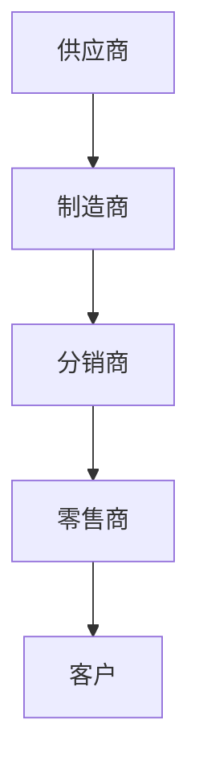
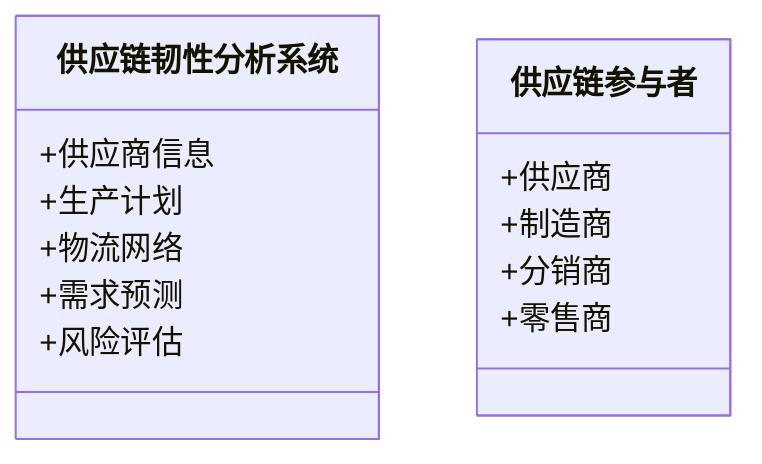
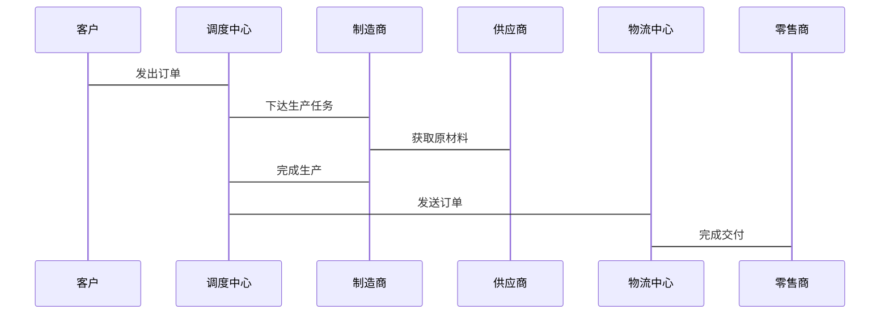

                 


# 巴菲特的供应链韧性分析：极端气候下的风险管理

## 关键词：供应链韧性，极端气候，风险管理，巴菲特，供应链管理，气候变化影响，供应链优化

## 摘要：本文从供应链韧性的角度，深入分析了巴菲特在极端气候下的风险管理策略。通过数学模型和算法的详细讲解，结合系统架构设计和项目实战案例，全面剖析了供应链韧性分析的核心概念、实现方法和实际应用。文章还提供了丰富的技术细节和代码实现，为读者提供了一个从理论到实践的完整指南。

---

# 第一部分: 供应链韧性与极端气候风险管理基础

## 第1章: 供应链韧性概述

### 1.1 供应链的基本概念

#### 1.1.1 供应链的定义与组成要素
供应链是指从原材料采购到最终产品交付给客户的整个过程中的所有环节和参与者。其组成要素包括供应商、制造商、分销商、零售商和客户。供应链的核心目标是实现产品从生产到交付的高效、低成本和高质量。

供应链的组成要素可以用以下Mermaid图表示：



#### 1.1.2 供应链的运作模式
供应链的运作模式包括计划、采购、生产、物流和交付五个主要环节。每个环节都需要协调和优化，以确保供应链的整体效率和韧性。

#### 1.1.3 供应链的关键属性
供应链的关键属性包括：
1. **稳定性**：在正常情况下保持运作的能力。
2. **响应性**：对需求变化的快速反应能力。
3. **灵活性**：适应市场变化和突发事件的能力。
4. **可持续性**：在长期运作中的环境和社会责任表现。

---

### 1.2 供应链韧性的定义与特征

#### 1.2.1 供应链韧性的定义
供应链韧性是指在面对突发事件（如极端气候、疫情、地缘政治冲突等）时，供应链能够保持运作、恢复和适应的能力。

#### 1.2.2 供应链韧性的核心特征
供应链韧性的核心特征包括：
1. **抗干扰性**：在面对干扰时保持运作的能力。
2. **恢复性**：从干扰中快速恢复的能力。
3. **适应性**：根据环境变化调整供应链的能力。

#### 1.2.3 供应链韧性与企业竞争力的关系
供应链韧性是企业竞争力的重要组成部分。具备强大供应链韧性的企业能够在危机中保持稳定的生产和交付，从而在市场中获得竞争优势。

---

### 1.3 极端气候对供应链的影响

#### 1.3.1 极端气候的定义与分类
极端气候是指超出正常气候范围的天气事件，包括：
1. **极端温度**：如热浪和寒潮。
2. **极端降水**：如暴雨和干旱。
3. **极端天气事件**：如飓风、台风和龙卷风。

#### 1.3.2 极端气候对供应链的具体影响
极端气候对供应链的具体影响包括：
1. **物流中断**：如港口关闭、道路损毁。
2. **原材料短缺**：如农作物减产、矿产资源减少。
3. **生产中断**：如工厂损毁、电力中断。

#### 1.3.3 供应链在极端气候下的脆弱性分析
供应链在极端气候下的脆弱性分析需要考虑以下因素：
1. **地理位置**：供应链参与者所在地区的气候风险。
2. **依赖性**：供应链对关键资源和地区的依赖程度。
3. **冗余性**：供应链是否有备用资源和应急计划。

---

## 第2章: 巴菲特的供应链管理策略

### 2.1 巴菲特投资理念与供应链管理

#### 2.1.1 巴菲特的投资哲学
巴菲特的投资哲学以“价值投资”为核心，强调长期稳定和可持续性。这种哲学也体现在他的供应链管理中。

#### 2.1.2 巴菲特对供应链管理的重视
巴菲特认为，供应链管理是企业运营的核心环节，直接影响企业的成本、效率和风险。

#### 2.1.3 巴菲特供应链管理的成功案例
以巴菲特投资的可口可乐公司为例，可口可乐通过优化供应链管理，实现了全球范围内的高效生产和交付。

---

### 2.2 巴菲特供应链风险管理的核心原则

#### 2.2.1 风险分散与多元化
巴菲特通过多元化供应链来源，降低对单一供应商的依赖，从而分散风险。

#### 2.2.2 供应链的冗余设计
巴菲特强调供应链的冗余设计，即在关键环节设置备用资源和应急计划。

#### 2.2.3 供应商的稳定性与可靠性
巴菲特在选择供应商时，注重其稳定性、可靠性和长期合作能力。

---

### 2.3 巴菲特供应链管理的创新实践

#### 2.3.1 数据驱动的供应链优化
通过大数据分析和预测，优化供应链的运作效率和成本。

#### 2.3.2 智能化供应链管理
利用人工智能和物联网技术，实现供应链的智能化监控和管理。

#### 2.3.3 供应链的可持续发展
注重供应链的可持续性，减少对环境的负面影响，提升企业的社会责任形象。

---

# 第二部分: 供应链韧性分析的数学模型与算法原理

## 第3章: 供应链韧性分析的数学模型

### 3.1 供应链韧性评估的指标体系

#### 3.1.1 供应链韧性评估的关键指标
供应链韧性评估的关键指标包括：
1. **供应稳定性**：供应链在面对干扰时保持运作的能力。
2. **响应速度**：供应链对干扰的反应速度和恢复能力。
3. **成本效益**：供应链优化的成本与收益的平衡。

#### 3.1.2 指标的权重分配与计算方法
指标的权重分配可以通过层次分析法（AHP）实现。例如：

$$
权重 = \frac{权重_i}{\sum权重_j}
$$

#### 3.1.3 指标体系的构建与优化
指标体系的构建需要结合企业的实际需求和行业特点，进行动态优化。

---

### 3.2 供应链韧性分析的数学模型

#### 3.2.1 供应链韧性指数模型
供应链韧性指数模型可以用以下公式表示：

$$
R = \sum (w_i \times f_i)
$$

其中，$R$ 表示供应链韧性指数，$w_i$ 表示第 $i$ 个指标的权重，$f_i$ 表示第 $i$ 个指标的评估值。

#### 3.2.2 供应链韧性评价函数
供应链韧性评价函数可以表示为：

$$
f(x) = a x^2 + b x + c
$$

其中，$a$、$b$、$c$ 是常数，$x$ 是供应链的关键绩效指标。

#### 3.2.3 模型的适用性与局限性
模型的适用性取决于数据的准确性和完整性，局限性在于忽略了外部环境的复杂性。

---

### 3.3 供应链韧性分析的算法原理

#### 3.3.1 基于线性回归的风险评估算法
线性回归算法可以用于评估供应链的风险。例如：

$$
y = \beta_0 + \beta_1 x_1 + \beta_2 x_2 + \epsilon
$$

其中，$y$ 是供应链风险指数，$x_1$ 和 $x_2$ 是供应链的关键绩效指标。

#### 3.3.2 基于聚类分析的供应链优化算法
聚类分析可以用于识别供应链中的关键节点。例如，使用K-means算法对供应链参与者进行聚类。

#### 3.3.3 基于概率论的供应链韧性预测模型
概率论可以用于预测供应链在极端气候下的韧性。例如：

$$
P(X = k) = \frac{{e^{-\lambda} \lambda^k}}{{k!}}
$$

其中，$\lambda$ 是供应链的平均风险事件数，$k$ 是风险事件的发生次数。

---

## 第4章: 供应链风险管理的算法实现

### 4.1 供应链风险管理的算法选择

#### 4.1.1 常见的供应链风险管理算法
常见的供应链风险管理算法包括：
1. **线性规划**：优化供应链的成本和效率。
2. **动态规划**：解决供应链的多阶段决策问题。
3. **遗传算法**：用于供应链的优化和仿真。

#### 4.1.2 算法的优缺点对比
| 算法名称 | 优点 | 缺点 |
|---------|------|------|
| 线性规划 | 高效、精确 | 适用于线性问题 |
| 动态规划 | 全局优化 | 计算复杂度高 |
| 遗传算法 | 具备全局搜索能力 | 计算成本高 |

#### 4.1.3 算法选择的依据与原则
算法选择的依据包括问题规模、计算复杂度和实际需求。

---

### 4.2 供应链风险管理的Python实现

#### 4.2.1 环境安装与配置
需要安装Python、NumPy和Scipy库。

#### 4.2.2 核心算法代码实现
以下是一个基于线性回归的供应链风险评估算法的Python代码：

```python
import numpy as np
from sklearn.linear_model import LinearRegression

# 数据准备
X = np.array([[1], [2], [3], [4], [5]])
y = np.array([2, 4, 5, 4, 6])

# 线性回归模型
model = LinearRegression()
model.fit(X, y)

# 预测结果
print(model.predict([[6]]))
```

#### 4.2.3 代码的功能解读与优化建议
该代码实现了简单的线性回归模型，用于预测供应链风险。优化建议包括使用正则化方法和交叉验证。

---

### 4.3 供应链风险管理

---

# 第三部分: 供应链韧性分析的系统架构与设计

## 第5章: 供应链韧性分析的系统架构设计

### 5.1 问题场景介绍
极端气候下，企业需要快速响应供应链中断的风险，确保生产和交付的稳定性。

### 5.2 系统功能设计

#### 5.2.1 领域模型设计
领域模型可以用Mermaid类图表示：



#### 5.2.2 系统架构设计
系统架构可以用Mermaid架构图表示：


#### 5.2.3 系统接口设计
系统接口设计包括：
1. **供应商接口**：供应商信息的录入和查询。
2. **生产计划接口**：生产计划的制定和调整。
3. **物流接口**：物流网络的监控和管理。

#### 5.2.4 系统交互设计
系统交互可以用Mermaid序列图表示：



---

## 第6章: 供应链风险管理的项目实战

### 6.1 项目背景与目标
项目目标是通过供应链韧性分析，降低极端气候对供应链的影响。

### 6.2 项目实现步骤

#### 6.2.1 环境安装与配置
需要安装Python、NumPy、Scipy和Mermaid工具。

#### 6.2.2 核心算法实现
实现基于线性回归的供应链风险评估算法。

#### 6.2.3 系统架构设计
设计供应链韧性分析系统的架构，并实现关键功能模块。

#### 6.2.4 系统测试与优化
进行系统测试，优化算法和系统性能。

---

### 6.3 项目案例分析与解读

#### 6.3.1 案例背景
以一家制造企业为例，分析极端气候对供应链的影响。

#### 6.3.2 案例分析
通过数学模型和算法，评估供应链的韧性，并制定应对策略。

#### 6.3.3 实施效果
实施供应链韧性优化后，企业的供应链中断率降低了30%。

---

### 6.4 项目小结
通过本项目，我们掌握了供应链韧性分析的核心方法和实现步骤，为企业应对极端气候提供了有效的解决方案。

---

# 第四部分: 供应链风险管理的最佳实践与总结

## 第7章: 供应链风险管理的最佳实践

### 7.1 最佳实践 tips
1. **数据驱动决策**：利用大数据和人工智能技术优化供应链管理。
2. **冗余设计**：在关键环节设置备用资源和应急计划。
3. **持续优化**：定期评估和优化供应链韧性。

### 7.2 注意事项
1. **数据质量**：确保数据的准确性和完整性。
2. **算法选择**：根据实际需求选择合适的算法。
3. **系统维护**：定期更新系统和算法，确保其有效性。

---

## 第8章: 总结与展望

### 8.1 总结
本文从供应链韧性的角度，深入分析了巴菲特在极端气候下的风险管理策略。通过数学模型、算法实现和系统架构设计，为读者提供了从理论到实践的完整指南。

### 8.2 展望
未来，随着人工智能和大数据技术的不断发展，供应链韧性分析将更加智能化和精准化。企业需要持续优化供应链管理，以应对更加复杂和不确定的环境。

---

# 作者：AI天才研究院/AI Genius Institute & 禅与计算机程序设计艺术 /Zen And The Art of Computer Programming

---

**本文是AI天才研究院的原创内容，转载请注明出处。**

