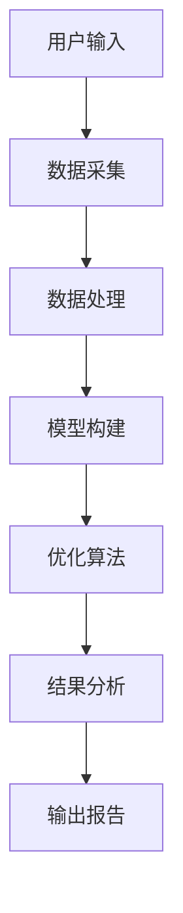

                 


# 巴菲特的供应链韧性分析：量子优化算法在物流中的应用

> 关键词：供应链韧性，量子优化算法，物流，巴菲特，系统架构设计

> 摘要：本文从供应链韧性的角度出发，结合巴菲特的投资理念，探讨量子优化算法在物流中的应用。通过分析供应链韧性的核心要素，阐述量子优化算法的基本原理及其在物流路径优化和库存管理中的应用。最后，通过实际案例展示量子优化算法如何帮助提升供应链韧性，并总结其在实际应用中的优势与挑战。

---

## 第一部分: 供应链韧性的基础

### 第1章: 供应链的基本概念

#### 1.1 供应链的定义与构成

供应链是指从原材料采购、生产、分销到最终消费者的整个过程，包括供应商、制造商、分销商、零售商和消费者等多个环节。供应链的构成要素包括：

- **供应商**：提供原材料或零部件的企业。
- **制造商**：将原材料转化为产品的企业。
- **分销商**：负责产品从制造商到零售商的运输和存储。
- **零售商**：直接面向消费者的销售点。
- **消费者**：最终产品或服务的使用方。

供应链的运作模式通常是链式结构，每个环节之间通过信息流、物流和资金流进行连接。

#### 1.2 供应链韧性的重要性

供应链韧性是指在面对不确定性（如自然灾害、疫情、市场波动等）时，供应链维持正常运作的能力。供应链韧性的重要性体现在以下几个方面：

- **降低风险**：通过增强供应链的抗干扰能力，减少因突发事件导致的供应链中断。
- **提高效率**：通过优化供应链结构，减少资源浪费，提高整体运作效率。
- **增强竞争力**：供应链韧性是企业竞争力的重要组成部分，能够帮助企业更快地响应市场需求。

### 第2章: 巴菲特的供应链管理理念

#### 2.1 巴菲特的供应链管理思想

巴菲特的投资哲学强调长期价值和稳健经营，他非常重视供应链的稳定性。他认为，一个企业的供应链越稳健，其抗风险能力越强，投资价值也越高。以下是巴菲特供应链管理思想的核心要点：

- **分散风险**：通过在全球范围内布局供应链，减少因地区性风险（如自然灾害、政治动荡）对供应链的影响。
- **选择可靠的合作伙伴**：巴菲特倾向于投资那些供应链管理能力强、合作伙伴关系稳定的公司。
- **注重成本控制**：通过优化供应链流程，降低运营成本，提高企业的盈利能力。

#### 2.2 巴菲特投资案例中的供应链分析

以下是巴菲特投资中的一些经典案例，通过这些案例可以更好地理解他如何分析供应链韧性。

- **可口可乐案例**：巴菲特投资可口可乐多年，他认为可口可乐的供应链非常稳健，能够确保饮料的生产和分销在全球范围内顺利进行。可口可乐的供应链管理能力是其长期盈利能力的重要保障。
- **富国银行案例**：富国银行作为一家金融机构，其供应链主要依赖于信息技术和金融服务供应商。巴菲特认为，富国银行的供应链具有较高的抗风险能力，能够在经济波动中保持稳定。

---

## 第二部分: 供应链韧性分析的核心概念

### 第3章: 供应链韧性分析的关键要素

#### 3.1 供应链网络的复杂性

供应链网络的复杂性是供应链韧性分析的重要因素。复杂的供应链网络通常涉及多个供应商、制造商和分销商，这种复杂性使得供应链更容易受到外部干扰的影响。

#### 3.2 供应链风险的类型与来源

供应链风险可以分为以下几类：

- **供应风险**：由于供应商问题（如罢工、原材料短缺）导致的供应链中断。
- **物流风险**：由于运输延误、物流成本增加等物流问题导致的供应链中断。
- **需求风险**：由于市场需求预测不准确导致的库存积压或短缺。
- **运营风险**：由于生产过程中的问题（如设备故障、工人罢工）导致的供应链中断。

### 第4章: 供应链韧性评估的方法

#### 4.1 供应链韧性评估指标

供应链韧性评估指标包括以下几个方面：

- **响应时间**：供应链在面对突发事件时的响应速度。
- **恢复能力**：供应链在受到干扰后恢复到正常运作状态所需的时间。
- **弹性**：供应链在面对需求波动或资源短缺时的调整能力。

#### 4.2 供应链韧性评估的步骤

供应链韧性评估的步骤如下：

1. **数据收集与处理**：收集供应链各环节的历史数据，包括生产、运输、库存等。
2. **模型构建与验证**：建立供应链韧性评估模型，并通过历史数据进行验证。
3. **结果分析与优化**：根据评估结果，识别供应链中的薄弱环节，并提出优化建议。

---

## 第三部分: 量子优化算法的基本原理

### 第5章: 量子优化算法概述

#### 5.1 量子计算的基本原理

量子计算是一种基于量子位（qubit）的计算方式，与经典计算不同，量子计算利用量子叠加和量子纠缠等特性，能够在某些问题上实现远超经典计算机的计算速度。

- **量子叠加**：量子位可以同时处于多个状态的叠加态。
- **量子纠缠**：两个或多个量子位之间存在纠缠关系，一个量子位的状态会直接影响另一个量子位的状态。
- **量子测量**：通过对量子位进行测量，可以得到确定的结果。

#### 5.2 量子优化算法的特点

量子优化算法是一种利用量子计算优势的优化算法，其特点包括：

- **并行计算能力**：量子优化算法能够同时处理大量的可能性，从而快速找到最优解。
- **计算效率高**：在某些情况下，量子优化算法的计算效率远高于经典算法。

### 第6章: 量子优化算法在物流中的应用

#### 6.1 量子优化算法在物流路径优化中的应用

物流路径优化问题的目标是找到从起点到终点的最短路径。以下是量子优化算法在物流路径优化中的应用步骤：

1. **问题建模**：将物流路径优化问题转化为图的最短路径问题。
2. **量子优化算法实现**：利用量子计算的特性，快速找到最优路径。
3. **结果分析**：通过分析优化结果，评估算法的有效性。

#### 6.2 量子优化算法在库存管理中的应用

库存管理问题的目标是找到最优的库存水平，以最小化库存成本和缺货风险。以下是量子优化算法在库存管理中的应用步骤：

1. **问题建模**：将库存管理问题转化为数学优化问题。
2. **量子优化算法实现**：利用量子计算的优势，快速找到最优库存水平。
3. **结果分析**：通过分析优化结果，评估算法的有效性。

---

## 第四部分: 供应链韧性分析的系统架构设计

### 第7章: 供应链韧性分析系统的功能设计

#### 7.1 系统功能模块划分

供应链韧性分析系统的主要功能模块包括：

- **数据采集模块**：负责采集供应链各环节的数据，包括生产、运输、库存等。
- **模型构建模块**：负责建立供应链韧性评估模型。
- **优化算法模块**：负责利用量子优化算法对供应链进行优化。
- **结果分析模块**：负责分析优化结果，并提出优化建议。

#### 7.2 系统功能流程图

以下是供应链韧性分析系统的功能流程图：



### 第8章: 系统架构设计

#### 8.1 系统架构的分层设计

供应链韧性分析系统的架构设计可以分为以下几个层次：

- **数据层**：负责数据的存储和管理。
- **业务逻辑层**：负责业务逻辑的实现，包括数据处理、模型构建等。
- **用户界面层**：负责与用户的交互，展示优化结果。

---

## 第五部分: 项目实战

### 第9章: 项目实战

#### 9.1 环境安装

以下是供应链韧性分析系统的环境安装步骤：

1. **安装Python**：需要安装Python 3.8及以上版本。
2. **安装量子计算库**：可以使用Qiskit等量子计算库。
3. **安装数据分析库**：需要安装Pandas、NumPy等数据分析库。

#### 9.2 系统核心实现源代码

以下是量子优化算法在物流路径优化中的实现代码：

```python
from qiskit import QuantumCircuit, execute, Aer
from qiskit.aqua import QuantumAlgorithm, AlgorithmProvider
from qiskit.aqua.optimizers import SLSQP
from qiskit.aqua.algorithms import Shor

# 定义问题参数
n = 5  # 问题规模
params = {'n': n}

# 定义量子优化算法
algorithm = Shor()
algorithm = algorithm.bind_parameters(params)

# 定义优化器
optimizer = SLSQP(maxiter=100)

# 定义量子算法提供者
provider = AlgorithmProvider()
provider.register('quantum', lambda: algorithm)

# 执行优化
result = execute(provider.get('quantum'), optimizer).result()

# 输出结果
print(result)
```

---

## 第六部分: 总结与展望

### 第10章: 总结与展望

#### 10.1 总结

本文从供应链韧性的角度出发，结合巴菲特的投资理念，探讨了量子优化算法在物流中的应用。通过分析供应链韧性的核心要素，阐述了量子优化算法的基本原理及其在物流路径优化和库存管理中的应用。最后，通过实际案例展示了量子优化算法如何帮助提升供应链韧性，并总结了其在实际应用中的优势与挑战。

#### 10.2 展望

随着量子计算技术的不断发展，量子优化算法在供应链管理中的应用前景广阔。未来，我们可以进一步研究量子优化算法在供应链韧性分析中的应用，探索其与其他技术的结合，以实现更高效的供应链管理。

---

## 作者：AI天才研究院/AI Genius Institute & 禅与计算机程序设计艺术 /Zen And The Art of Computer Programming

