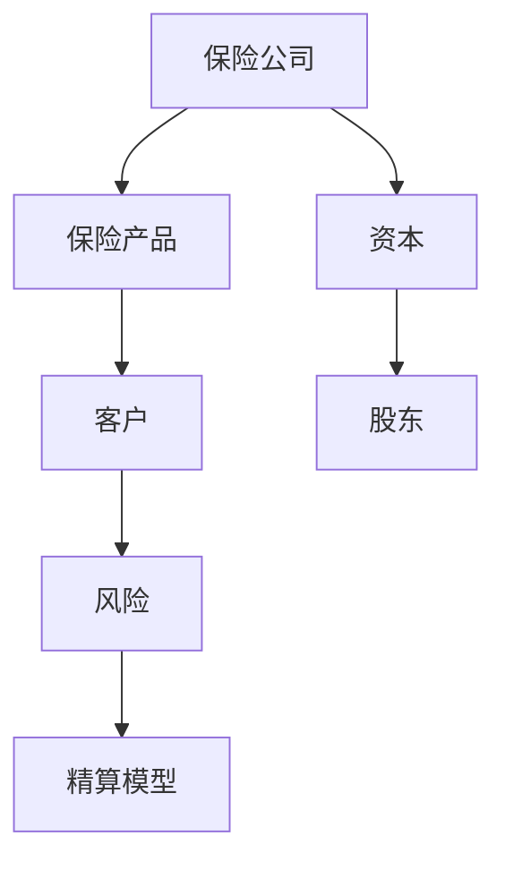
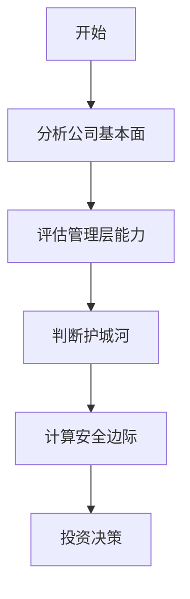
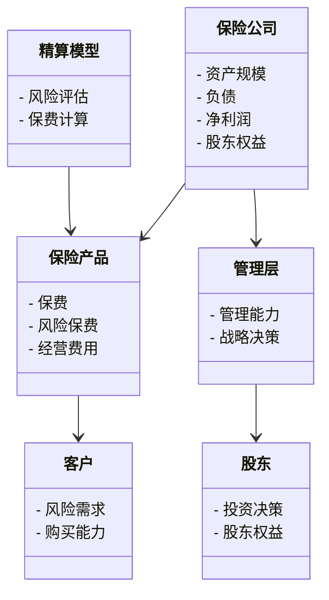
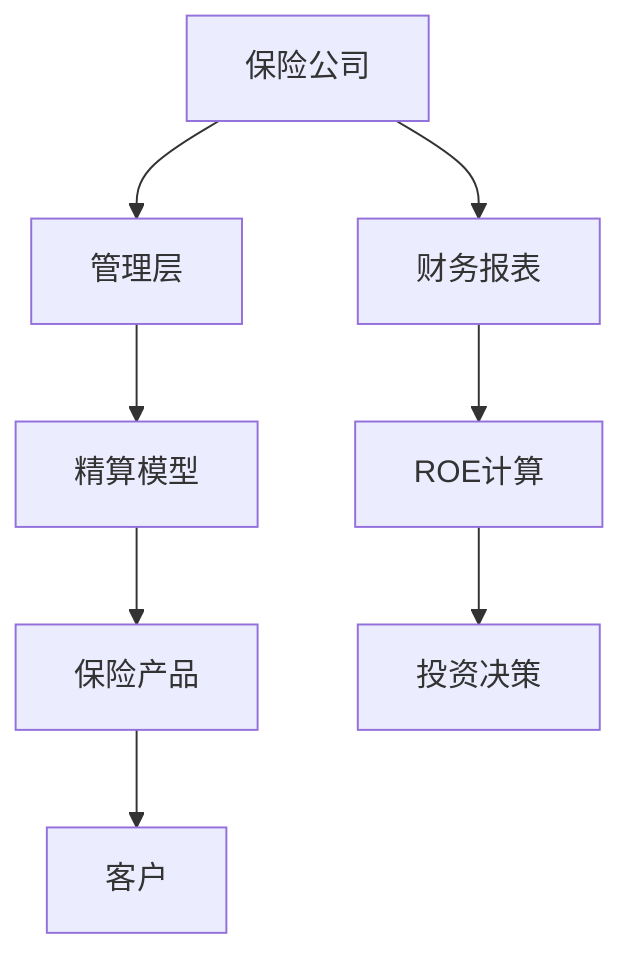

                 


# 巴菲特的保险业投资策略

> 关键词：巴菲特, 保险业, 投资策略, 价值投资, 财务分析

> 摘要：本文深入分析了巴菲特在保险业的投资策略，探讨了其核心理念、方法和实践。通过详细的技术分析，揭示了巴菲特如何通过价值投资、风险管理等手段，实现保险业投资的成功。文章还结合实际案例，展示了巴菲特策略的应用过程，为读者提供了全面的视角。

---

# 第一部分: 巴菲特的保险业投资策略概述

# 第1章: 巴菲特的投资哲学与保险业的结合

## 1.1 巴菲特的投资哲学

### 1.1.1 价值投资的核心理念

巴菲特的价值投资理念基于以下几个核心原则：
1. **买入并持有**：选择优质企业，长期持有，避免频繁交易。
2. **安全边际**：以低于内在价值的价格买入资产，确保有足够的安全空间。
3. **企业的基本面分析**：关注企业的盈利能力、财务健康和管理层能力。

### 1.1.2 保险业在巴菲特投资组合中的地位

保险业在巴菲特的投资组合中占据重要地位，主要原因包括：
1. **稳定的现金流**：保险公司能够提供稳定的现金流，支持巴菲特的长期投资策略。
2. **低估的估值**：保险行业容易出现低估的公司，为巴菲特的价值投资提供了机会。
3. **杠杆效应**：保险公司的负债结构允许巴菲特以较低的成本获得较高的资产回报。

### 1.1.3 巴菲特投资哲学与保险业的结合

巴菲特将价值投资哲学与保险业的特性相结合，主要体现在以下几个方面：
1. **识别具有竞争优势的保险公司**：巴菲特寻找那些在保险行业具有强大竞争优势的企业，例如强大的品牌、市场份额和优秀的管理层。
2. **评估保险公司的内在价值**：通过分析保险公司的财务指标，如ROE（净资产收益率）、现金流和资本结构，评估其内在价值。
3. **长期持有优质资产**：一旦找到优质的保险公司，巴菲特倾向于长期持有，等待其内在价值的实现。

## 1.2 保险业的基本概念与特点

### 1.2.1 保险业的定义与分类

保险是指通过合同形式，保险公司承诺在被保险人遭受特定风险时，给予经济补偿或保障。保险业可以分为寿险和非寿险两大类：
1. **寿险**：以人的寿命为保险标的，主要包括普通人寿保险、年金保险等。
2. **非寿险**：以财产或责任为保险标的，主要包括财产保险、责任保险等。

### 1.2.2 保险业的主要参与者

1. **保险公司**：包括寿险公司和非寿险公司，是保险市场的主体。
2. **保险代理人**：代表保险公司销售保险产品并提供客户服务。
3. **保险监管机构**：负责监管保险市场，确保其健康稳定发展。

### 1.2.3 保险业的财务结构与风险特征

保险公司的财务结构主要包括资产、负债和所有者权益。其主要风险包括：
1. **流动性风险**：保险公司需要确保有足够的流动性来支付理赔和到期负债。
2. **利率风险**：保险产品的价值受利率波动影响较大。
3. **信用风险**：保险公司可能面临客户的信用风险，尤其是在信用保险业务中。

## 1.3 巴菲特进入保险业的背景

### 1.3.1 巴菲特早期的投资经历

巴菲特早期的投资经历主要集中在股票市场，他通过分析企业的基本面，寻找那些具有竞争优势和良好管理的公司。他的投资理念逐渐形成，并在后来扩展到保险业。

### 1.3.2 保险业的吸引力与巴菲特的选择

保险业吸引了巴菲特的原因在于其稳定的现金流和低估的估值。此外，保险公司的杠杆效应也使巴菲特能够以较低的成本获得较高的资产回报。

### 1.3.3 巴菲特保险投资的经典案例

1. **伯克希尔哈撒韦收购国民保险**：1986年，巴菲特通过收购国民保险，将其纳入伯克希尔哈撒韦的麾下。国民保险的财务健康和强大的管理层吸引了巴菲特。
2. **其他保险公司投资**：巴菲特还投资了多家保险公司，如 GEICO 和Marsh & McLennan。

## 1.4 本章小结

本章介绍了巴菲特的投资哲学和保险业的基本概念与特点，分析了保险业在巴菲特投资组合中的地位，并通过经典案例展示了巴菲特进入保险业的背景和策略。

---

# 第2章: 巴菲特保险投资的核心概念与联系

## 2.1 核心概念原理

### 2.1.1 保险公司的核心竞争力

保险公司的核心竞争力主要体现在以下几个方面：
1. **品牌影响力**：强大的品牌能够吸引更多的客户和业务。
2. **成本优势**：通过规模效应和高效的管理，降低运营成本。
3. **风险控制能力**：优秀的保险公司能够有效评估和管理风险。

### 2.1.2 保险产品的定价与风险评估

保险产品的定价需要考虑以下几个因素：
1. **精算模型**：通过精算模型评估保险产品的风险和成本。
2. **市场需求**：根据市场需求调整产品定价。
3. **监管要求**：遵循保险监管机构的规定，确保产品合规。

### 2.1.3 保险公司的财务健康指标

保险公司的财务健康指标包括：
1. **ROE（净资产收益率）**：衡量保险公司盈利能力的重要指标。
2. **现金流**：反映保险公司的资金流动性。
3. **资本充足率**：衡量保险公司抵御风险的能力。

## 2.2 核心概念属性特征对比表格

| 概念                | 特征1          | 特征2          | 特征3          |
|---------------------|----------------|----------------|----------------|
| 保险公司的核心竞争力 | 资产规模       | 负债结构       | 经营管理能力   |
| 保险产品的定价与风险评估 | 精算模型       | 市场需求分析   | 监管要求       |
| 保险公司的财务健康指标 | 净利润         | 资产负债率     | 现金流状况     |

## 2.3 ER实体关系图



## 2.4 本章小结

本章详细介绍了保险公司的核心竞争力、保险产品的定价与风险评估以及保险公司的财务健康指标，并通过对比表格和ER实体关系图，展示了这些核心概念之间的联系。

---

# 第3章: 巴菲特保险投资的算法原理与数学模型

## 3.1 巴菲特保险投资的算法原理

### 3.1.1 投资决策的流程

1. **分析公司基本面**：通过财务报表分析公司的盈利能力、现金流和资本结构。
2. **评估管理层能力**：优秀的管理层是公司长期成功的关键。
3. **判断护城河**：寻找具有竞争优势的企业，确保其长期盈利能力。
4. **计算安全边际**：确定公司股票的安全边际，确保以合理的价格买入。
5. **投资决策**：综合以上分析，做出投资决策。



## 3.2 数学模型与公式

### 3.2.1 保险公司的ROE模型

$$ROE = \frac{净利润}{股东权益}$$

### 3.2.2 保险产品的定价公式

$$保费 = 纯粹风险保费 + 经营费用保费$$

### 3.2.3 现金流分析

$$现金流 = \text{营业收入} - \text{营业成本} - \text{税费}$$

## 3.3 举例说明

### 3.3.1 案例1：巴菲特投资的保险公司A

假设保险公司A的ROE为15%，股东权益为1000万美元，其净利润为150万美元。根据ROE模型，其净利润为150万美元，符合ROE = 15%的计算。

### 3.3.2 案例2：巴菲特对保险公司B的分析与决策

通过分析保险公司B的财务报表，巴菲特发现其ROE为12%，现金流稳定，管理层能力优秀。综合考虑后，巴菲特决定以合理的价格投资于该公司。

## 3.4 本章小结

本章通过算法流程图和数学公式，详细讲解了巴菲特保险投资的算法原理，并通过具体案例说明了其在实际操作中的应用。

---

# 第4章: 巴菲特保险投资的系统分析与架构设计

## 4.1 问题场景介绍

### 4.1.1 保险公司的财务健康评估

通过分析保险公司的财务报表，评估其财务健康状况，包括ROE、现金流和资本充足率等指标。

### 4.1.2 保险产品的风险定价模型

基于精算模型和市场需求，制定合理的保险产品定价策略。

### 4.1.3 投资决策的系统化框架

通过系统化的框架，综合分析保险公司的基本面、管理层能力和市场环境，做出投资决策。

## 4.2 系统功能设计



## 4.3 系统架构设计



## 4.4 本章小结

本章通过系统分析和架构设计，展示了巴菲特保险投资的系统化框架，包括问题场景介绍和系统功能设计，帮助读者更好地理解其投资策略。

---

# 第5章: 巴菲特保险投资的项目实战

## 5.1 环境安装

### 5.1.1 投资工具的选择

选择适合的工具，如财务分析软件、精算模型和数据分析工具。

### 5.1.2 数据源的获取

获取保险公司的财务报表、市场数据和行业报告。

## 5.2 系统核心实现源代码

### 5.2.1 ROE计算代码

```python
def calculate_roe(net_profit, shareholders_equity):
    return net_profit / shareholders_equity * 100
```

### 5.2.2 现金流分析代码

```python
def calculate_cash_flow(operating_income, operating_cost, taxes):
    return operating_income - operating_cost - taxes
```

## 5.3 代码应用解读与分析

### 5.3.1 案例分析：平安保险

通过代码计算平安保险的ROE和现金流，评估其财务健康状况。

### 5.3.2 案例分析：其他保险公司

分析其他保险公司的财务指标，评估其投资价值。

## 5.4 本章小结

本章通过项目实战，展示了如何应用巴菲特的投资策略进行保险投资，包括环境安装、系统核心实现和案例分析。

---

# 第6章: 巴菲特保险投资的总结与最佳实践

## 6.1 总结

### 6.1.1 核心要点回顾

总结巴菲特保险投资的核心要点，包括价值投资、风险管理、长期持有等。

### 6.1.2 投资策略的有效性

分析巴菲特保险投资策略的有效性，及其对投资组合的贡献。

## 6.2 最佳实践 tips

### 6.2.1 风险管理

强调风险管理的重要性，确保投资的安全性。

### 6.2.2 长期持有

坚持长期投资，避免短期波动的影响。

### 6.2.3 持续学习

不断学习和更新知识，适应市场的变化。

## 6.3 本章小结

本章总结了巴菲特保险投资的策略，并提出了最佳实践建议，帮助读者更好地理解和应用其投资理念。

---

# 作者：AI天才研究院/AI Genius Institute & 禅与计算机程序设计艺术 /Zen And The Art of Computer Programming

---

以上就是《巴菲特的保险业投资策略》的完整内容，涵盖背景介绍、核心概念、算法原理、系统分析、项目实战和总结等多个方面，旨在为读者提供全面且深入的视角，帮助其理解巴菲特在保险业的投资策略和实践。

