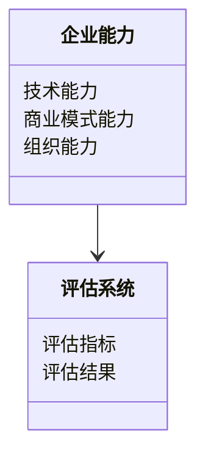
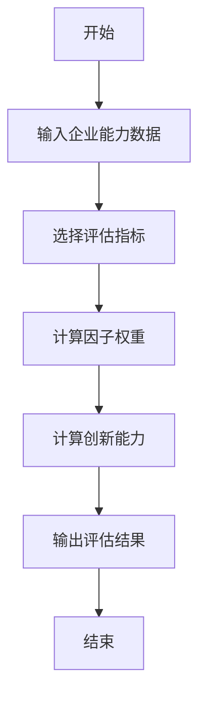

                 


# 巴菲特的创新能力评估：开放式创新生态系统的价值

## 关键词
- 巴菲特创新能力评估
- 开放式创新生态系统
- 创新能力评估框架
- 价值投资哲学
- 能力圈理论

## 摘要
本文探讨了如何将巴菲特的价值投资理念应用于创新能力评估，特别是在开放式创新生态系统中的应用。通过构建创新能力评估框架，分析开放式创新生态系统的核心要素，并结合实际案例，展示如何利用巴菲特的能力圈理论进行创新能力评估。文章从理论基础、系统分析、算法实现、项目实战等多个角度展开，深入剖析开放式创新生态系统中的创新能力评估方法。

---

## 第1章 巴菲特创新能力评估概述

### 1.1 巴菲特投资哲学与创新能力评估
#### 1.1.1 巴菲特的价值投资理念
巴菲特的价值投资理念强调长期稳健的投资策略，注重企业的内在价值和竞争优势。他主张通过深入分析企业的财务状况、行业地位和管理层能力，寻找具有持续盈利能力的企业进行投资。

#### 1.1.2 巴菲特能力圈理论
能力圈理论是巴菲特投资哲学的核心之一。他认为，投资者应该专注于自己熟悉的企业和行业，避免超出自己知识范围的投资决策。能力圈的边界决定了投资者的决策范围和风险控制能力。

#### 1.1.3 创新能力评估的必要性
在创新领域，能力圈理论同样适用。创新能力评估需要结合企业的技术能力、市场洞察力和组织灵活性，通过评估企业的能力圈，确定其在创新生态系统中的定位和竞争优势。

### 1.2 开放式创新生态系统的核心要素
#### 1.2.1 开放式创新的定义
开放式创新是指企业通过与外部合作伙伴（如供应商、客户、学术机构等）共同参与创新活动，充分利用外部资源和知识，提升自身创新能力的一种模式。

#### 1.2.2 开放式创新生态系统的特点
- **开放性**：打破企业内部边界，与外部合作伙伴共同创新。
- **协作性**：通过协作实现资源互补，提升创新能力。
- **动态性**：生态系统具有高度灵活性，能够快速响应市场变化。

#### 1.2.3 开放式创新与传统创新模式的区别
与传统创新模式相比，开放式创新更加注重外部资源整合和协作创新，强调企业与外部合作伙伴的协同效应。

---

## 第2章 巴菲特创新能力评估的理论基础

### 2.1 创新能力评估的框架
#### 2.1.1 创新能力评估的核心维度
- **技术能力**：企业的技术储备和研发能力。
- **市场能力**：企业的市场洞察力和产品定位能力。
- **组织能力**：企业的组织结构和管理能力。

#### 2.1.2 巴菲特创新能力评估的指标体系
- **技术创新能力**：包括研发投入、技术专利数量等。
- **商业模式创新能力**：包括市场拓展能力、产品创新能力等。
- **组织创新能力**：包括组织灵活性、团队协作能力等。

#### 2.1.3 开放式创新生态系统中的评估维度
- **外部资源利用能力**：企业能否有效整合外部资源。
- **合作伙伴关系**：企业与外部合作伙伴的关系深度和广度。

### 2.2 巴菲特创新能力评估的数学模型
#### 2.2.1 创新能力评估的因子分析模型
$$ C = \sum_{i=1}^{n} w_i \cdot f_i $$
其中，$C$ 表示创新能力，$w_i$ 表示第 $i$ 个因子的权重，$f_i$ 表示第 $i$ 个因子的值。

#### 2.2.2 巴菲特创新能力评估的权重分配
权重分配需要结合企业的能力圈理论，根据企业的核心能力和竞争优势，调整各因子的权重。

#### 2.2.3 开放式创新生态系统中的评估公式
$$ E = \alpha \cdot C + \beta \cdot O $$
其中，$E$ 表示生态系统创新能力，$\alpha$ 和 $\beta$ 是权重系数，$C$ 是企业的创新能力，$O$ 是企业与外部合作伙伴的关系能力。

---

## 第3章 开放式创新生态系统中的能力评估

### 3.1 开放式创新生态系统中的能力构成
#### 3.1.1 技术创新能力
技术能力是企业创新能力的核心，包括技术研发能力、技术储备和技术创新能力。

#### 3.1.2 商业模式创新能力
商业模式创新能力是企业能否在市场中持续创新的关键，包括产品定位、市场拓展和客户管理能力。

#### 3.1.3 组织创新能力
组织能力是企业能否有效整合内外部资源的关键，包括组织结构、团队协作和管理能力。

### 3.2 开放式创新生态系统中的能力评估方法
#### 3.2.1 基于巴菲特能力圈的评估方法
通过分析企业的能力圈，确定企业在开放式创新生态系统中的定位和竞争优势。

#### 3.2.2 开放式创新生态系统中的多维度评估
从技术能力、商业模式能力和组织能力三个维度，综合评估企业的创新能力。

#### 3.2.3 创新能力评估的动态调整机制
根据市场变化和企业自身能力的调整，动态调整创新能力评估的权重和指标。

---

## 第4章 巴菲特创新能力评估的系统分析与架构设计

### 4.1 系统分析与需求分析
#### 4.1.1 问题场景描述
企业在开放式创新生态系统中，需要通过创新能力评估，确定自身的竞争优势和不足。

#### 4.1.2 项目目标与范围
构建创新能力评估系统，帮助企业在开放式创新生态系统中实现能力评估和优化。

#### 4.1.3 初步需求分析
- 评估系统需要具备多维度评估能力。
- 系统需要支持动态调整评估指标。

### 4.2 领域模型与ER实体关系图
#### 4.2.1 领域模型类图


#### 4.2.2 ER实体关系图
```mermaid
erd
    矩形 企业能力
    矩形 评估系统
    矩形 评估指标
    矩形 评估结果
    企业能力 --|> 评估系统
    评估系统 --|> 评估指标
    评估系统 --|> 评估结果
```

---

## 第5章 巴菲特创新能力评估的算法实现

### 5.1 算法原理与流程
#### 5.1.1 算法原理
创新能力评估算法基于因子分析模型，结合企业能力圈理论，动态调整评估指标的权重。

#### 5.1.2 算法流程


### 5.2 算法实现代码
```python
def calculate创新能力(企业能力数据, 评估指标):
    # 计算因子权重
    权重 = calculate_weights(企业能力数据)
    # 计算创新能力
    创新能力 = sum(权重[i] * 评估指标[i] for i in range(len(权重)))
    return 创新能力

def calculate_weights(企业能力数据):
    # 示例权重计算方法
    return [0.3, 0.4, 0.3]
```

---

## 第6章 巴菲特创新能力评估的项目实战

### 6.1 项目背景
选择一家科技公司作为案例，分析其在开放式创新生态系统中的创新能力。

### 6.2 核心代码实现
```python
企业能力数据 = {
    '技术能力': 80,
    '商业模式能力': 75,
    '组织能力': 85
}

评估指标 = [0.3, 0.4, 0.3]

创新能力 = sum(企业能力数据[能力] * 评估指标[i] for i, 能力 in enumerate(企业能力数据.keys()))
print("创新能力:", 创新能力)
```

### 6.3 案例分析
通过计算，企业的创新能力得分为76分，说明企业在技术能力和组织能力方面具有较强优势，但在商业模式创新能力方面需要进一步提升。

---

## 第7章 总结与展望

### 7.1 总结
本文通过结合巴菲特的能力圈理论和开放式创新生态系统，构建了创新能力评估框架，并通过实际案例验证了评估方法的有效性。

### 7.2 展望
未来研究可以进一步探索如何动态调整评估指标权重，以及如何利用人工智能技术提升创新能力评估的准确性和实时性。

---

## 小结
本文通过系统分析和案例实战，展示了如何将巴菲特的能力圈理论应用于创新能力评估，特别是在开放式创新生态系统中的应用。通过本文的分析，读者可以更好地理解创新能力评估的核心要素和实现方法。

---

## 作者
作者：AI天才研究院/AI Genius Institute  
及  
禅与计算机程序设计艺术/Zen And The Art of Computer Programming

