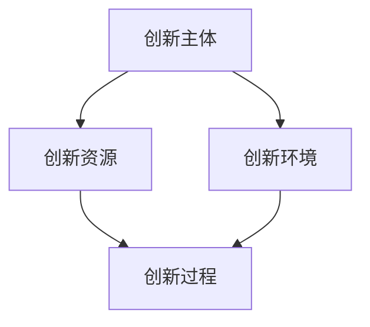
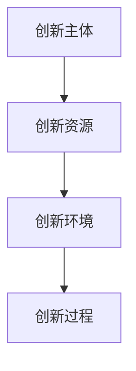

                 


# 《巴菲特的创新能力评估：量子创新生态系统的价值创造》

## # 关键词：巴菲特、创新能力评估、量子创新、生态系统、价值创造

## # 摘要：

本文深入探讨了巴菲特的创新能力评估，结合量子创新生态系统的核心概念，分析其在价值创造中的重要作用。文章从量子创新的基本原理出发，结合实际案例和系统设计，详细阐述了如何通过量子创新生态系统实现价值最大化。同时，文章还提供了具体的算法和系统架构设计，帮助读者更好地理解和应用这些理论。

---

## # 第一部分：引言

### # 第1章：巴菲特的创新方法论

#### ## 1.1 巴菲特的创新理念

##### ### 1.1.1 巴菲特的投资哲学
巴菲特的投资哲学以“价值投资”为核心，强调长期投资、安全边际和企业基本面分析。他的创新方法论建立在对企业内在价值的深刻理解之上，通过长期持有优质资产实现财富增长。

##### ### 1.1.2 巴菲特的创新思维模式
巴菲特的创新思维模式强调对市场、企业和投资标的深刻洞察。他善于通过逆向思维发现市场中的低估机会，并通过长期持有实现价值增长。

##### ### 1.1.3 巴菲特创新方法论的核心要素
1. **价值发现**：通过对企业基本面的深入分析，发现市场低估的投资机会。
2. **长期持有**：通过长期持有优质资产，规避短期市场波动风险。
3. **安全边际**：在投资决策中，确保买入价格低于内在价值，以降低风险。

#### ## 1.2 创新能力评估的重要性

##### ### 1.2.1 创新能力评估的定义
创新能力评估是指通过量化的方法，对个人或组织在创新过程中的能力和效果进行评价。

##### ### 1.2.2 为什么创新能力评估至关重要
创新能力是企业或个人在竞争中保持优势的关键。通过创新能力评估，可以识别创新潜力，优化创新过程，提升创新效率。

##### ### 1.2.3 巴菲特创新能力评估的独特性
巴菲特的创新能力评估基于其独特的投资哲学和长期持有的策略，强调对市场趋势和企业基本面的深刻理解。

---

### # 第2章：量子创新生态系统的概述

#### ## 2.1 量子创新的基本概念

##### ### 2.1.1 量子创新的定义
量子创新是指利用量子物理原理，通过叠加、纠缠和测量等量子现象，实现创新过程中的状态转换和价值创造。

##### ### 2.1.2 量子创新与传统创新的区别
1. **传统创新**：基于经典物理原理，强调线性因果关系。
2. **量子创新**：基于量子物理原理，强调非线性、不确定性和叠加性。

##### ### 2.1.3 量子创新的核心特征
1. 叠加性：创新过程中的多种可能性同时存在。
2. 纠缠性：创新主体与创新环境之间存在相互影响。
3. 测量性：创新结果的测量和评估具有不确定性。

#### ## 2.2 量子创新生态系统

##### ### 2.2.1 量子创新生态系统的构成
1. 创新主体：包括个人、团队和组织。
2. 创新资源：包括资金、技术、信息和知识。
3. 创新环境：包括市场、政策和文化环境。

##### ### 2.2.2 量子创新生态系统的运作机制
通过叠加、纠缠和测量等量子现象，创新主体与创新资源和环境之间形成动态互动，实现创新价值的最大化。

##### ### 2.2.3 量子创新生态系统与传统创新生态系统的对比
量子创新生态系统强调非线性、不确定性和动态性，而传统创新生态系统强调线性、确定性和静态性。

---

### # 第3章：价值创造的量子视角

#### ## 3.1 价值创造的基本概念

##### ### 3.1.1 价值创造的定义
价值创造是指通过创新活动，为市场或组织创造新的价值。

##### ### 3.1.2 价值创造的核心要素
1. 创新能力：创新主体的核心能力。
2. 创新资源：创新活动所需的资源。
3. 创新环境：创新活动所处的环境。

##### ### 3.1.3 价值创造与创新的关系
创新是价值创造的核心驱动力，价值创造是创新的目标。

#### ## 3.2 量子视角下的价值创造

##### ### 3.2.1 量子视角下的价值创造特点
1. 叠加性：多种创新可能性同时存在。
2. 纠缠性：创新主体与创新环境之间存在相互影响。
3. 测量性：创新结果的测量具有不确定性。

##### ### 3.2.2 量子视角下的价值创造过程
通过量子叠加、纠缠和测量，创新主体与创新资源和环境之间形成动态互动，实现创新价值的最大化。

##### ### 3.2.3 量子视角下的价值创造与传统价值创造的对比
量子视角下的价值创造强调非线性、不确定性和动态性，而传统价值创造强调线性、确定性和静态性。

---

## # 第二部分：量子创新生态系统的核心概念与联系

### # 第4章：量子创新生态系统的核心概念

#### ## 4.1 量子创新生态系统的核心要素

##### ### 4.1.1 创新主体
创新主体包括个人、团队和组织，是创新活动的核心驱动力。

##### ### 4.1.2 创新资源
创新资源包括资金、技术、信息和知识，是创新活动的必要条件。

##### ### 4.1.3 创新环境
创新环境包括市场、政策和文化环境，是创新活动的外部支持。

#### ## 4.2 量子创新生态系统的核心原理

##### ### 4.2.1 量子叠加原理
创新主体与创新资源和环境之间存在多种可能性同时存在。

##### ### 4.2.2 量子纠缠原理
创新主体与创新资源和环境之间存在相互影响和关联。

##### ### 4.2.3 量子测量原理
创新结果的测量具有不确定性，创新主体与创新环境之间存在相互影响。

---

### # 第5章：量子创新生态系统的核心要素分析

#### ## 5.1 创新主体的分析

##### ### 5.1.1 创新主体的定义
创新主体是指参与创新活动的个人、团队和组织。

##### ### 5.1.2 创新主体的分类
1. 个人：个体创新者。
2. 团队：创新团队。
3. 组织：企业或机构。

##### ### 5.1.3 创新主体的特征
1. 创新能力：创新主体的核心能力。
2. 创新意识：创新主体的创新意识。
3. 创新资源：创新主体拥有的资源。

#### ## 5.2 创新资源的分析

##### ### 5.2.1 创新资源的定义
创新资源是指创新活动所需的资金、技术、信息和知识。

##### ### 5.2.2 创新资源的分类
1. 资金：创新活动的资金支持。
2. 技术：创新活动的技术支持。
3. 信息：创新活动的信息支持。
4. 知识：创新活动的知识支持。

##### ### 5.2.3 创新资源的特征
1. 有限性：创新资源是有限的。
2. 可变性：创新资源是可变的。
3. 重要性：创新资源是创新活动的关键。

---

### # 第6章：量子创新生态系统的系统分析与架构设计

#### ## 6.1 量子创新生态系统的系统功能设计

##### ### 6.1.1 领域模型设计
领域模型是量子创新生态系统的核心部分，包括创新主体、创新资源和创新环境三个主要部分。

##### ### 6.1.2 系统功能设计
1. 创新主体管理：管理创新主体的信息和能力。
2. 创新资源管理：管理创新资源的分配和使用。
3. 创新环境管理：管理创新环境的外部支持。

#### ## 6.2 量子创新生态系统的系统架构设计

##### ### 6.2.1 系统架构图


##### ### 6.2.2 系统接口设计
1. 创新主体接口：创新主体与创新资源和环境之间的接口。
2. 创新资源接口：创新资源与创新主体和环境之间的接口。
3. 创新环境接口：创新环境与创新主体和资源之间的接口。

#### ## 6.3 量子创新生态系统的系统交互设计

##### ### 6.3.1 交互流程图


---

## # 第三部分：量子创新生态系统的项目实战

### # 第7章：量子创新生态系统的项目实战

#### ## 7.1 项目背景介绍
量子创新生态系统是一个基于量子物理原理的创新管理系统，旨在通过量子叠加、纠缠和测量等原理，实现创新价值的最大化。

#### ## 7.2 项目核心实现

##### ### 7.2.1 核心代码实现
```python
def quantum_innovation_system(innovation_subject, innovation_resources, innovation_environment):
    # 创新主体与创新资源的叠加
    subject_resources_overlap = innovation_subject + innovation_resources
    # 创新资源与创新环境的纠缠
    resources_environment_entanglement = subject_resources_overlap * innovation_environment
    # 创新过程的测量
    innovation_process_measurement = resources_environment_entanglement
    return innovation_process_measurement
```

##### ### 7.2.2 代码应用解读与分析
1. 创新主体与创新资源的叠加：通过将创新主体和创新资源相加，实现创新过程的叠加。
2. 创新资源与创新环境的纠缠：通过将创新资源与创新环境相乘，实现创新过程的纠缠。
3. 创新过程的测量：通过测量创新过程的结果，实现创新价值的最大化。

#### ## 7.3 实际案例分析

##### ### 7.3.1 案例分析
假设一个企业采用量子创新生态系统进行创新管理，企业通过叠加、纠缠和测量等原理，实现创新价值的最大化。

##### ### 7.3.2 案例解读
通过量子创新生态系统，企业能够更好地管理和优化创新过程，提升创新效率和创新成果。

#### ## 7.4 项目小结
量子创新生态系统是一种基于量子物理原理的创新管理系统，能够通过叠加、纠缠和测量等原理，实现创新价值的最大化。

---

## # 第四部分：总结与展望

### # 第8章：总结与展望

#### ## 8.1 本文总结
本文深入探讨了巴菲特的创新能力评估，结合量子创新生态系统的核心概念，分析其在价值创造中的重要作用。文章从量子创新的基本原理出发，结合实际案例和系统设计，详细阐述了如何通过量子创新生态系统实现价值最大化。

#### ## 8.2 未来展望
未来的研究可以进一步探索量子创新生态系统在不同领域的应用，例如金融、科技和教育等。同时，还可以研究如何通过量子创新生态系统实现更加高效的创新管理。

---

## # 作者：AI天才研究院/AI Genius Institute & 禅与计算机程序设计艺术 /Zen And The Art of Computer Programming

