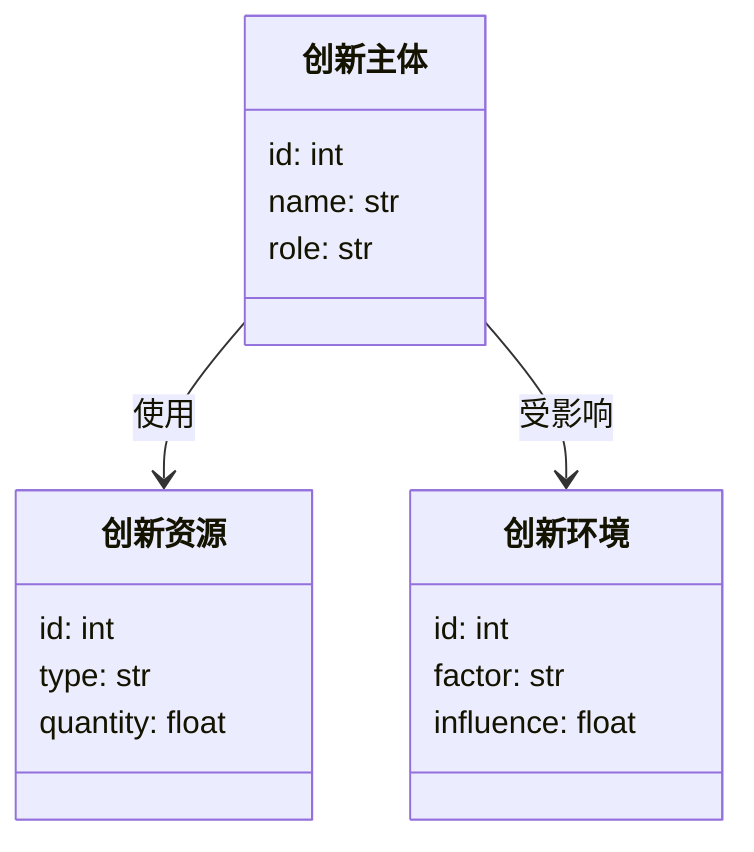

                 


# 巴菲特的创新能力评估：量子创新生态系统的价值网络分析

> 关键词：巴菲特, 创新能力评估, 量子创新, 价值网络分析, 系统架构设计

> 摘要：本文探讨了巴菲特的创新能力评估方法在量子创新生态系统中的应用，通过价值网络分析，构建了一个系统的评估框架，结合实际案例和代码实现，展示了如何在量子创新环境下进行创新能力评估。

---

## 第一部分: 巴菲特创新能力评估的背景与概述

### 第1章: 巴菲特创新能力评估的背景

#### 1.1 创新能力评估的定义与重要性

- **创新能力评估的定义**：通过量化方法评估个体或组织在创新方面的表现。
- **创新能力评估的重要性**：在竞争激烈的市场中，创新能力是企业成功的关键因素。
- **巴菲特的创新理念**：注重长期价值，而非短期收益。

#### 1.2 量子创新生态系统的基本概念

- **量子创新的定义**：基于量子技术的创新模式，具有颠覆性。
- **量子创新生态系统的特点**：跨学科、高效协作。
- **与传统创新的对比**：速度快、资源利用效率高。

#### 1.3 价值网络分析的理论基础

- **价值网络的定义**：企业与利益相关者之间的关系网络。
- **价值网络分析的方法**：通过网络分析工具，识别关键节点。
- **巴菲特投资理念与价值网络的关系**：关注企业长期价值，评估其在价值网络中的地位。

#### 1.4 巴菲特创新能力评估的核心框架

- **评估指标的选择**：包括创新成果、市场影响力、资源效率。
- **评估模型的构建**：结合定量和定性分析。
- **评估结果的应用**：指导投资决策和企业管理。

---

## 第二部分: 核心概念与理论基础

### 第2章: 量子创新生态系统的核心要素

- **创新主体的构成**：包括企业、研究机构、个人。
- **创新资源的整合**：资金、技术、人才。
- **创新环境的影响**：政策、市场、文化。

### 第3章: 价值网络分析的步骤与方法

- **网络节点的识别**：识别企业及其利益相关者。
- **关键路径的分析**：确定价值传递的关键路径。
- **网络价值的评估**：量化每个节点的价值贡献。

### 第4章: 巴菲特创新能力评估的框架设计

- **评估指标的选择**：创新成果、市场影响力、资源效率。
- **评估模型的构建**：结合定量和定性分析。
- **评估结果的应用**：指导投资决策和企业管理。

---

## 第三部分: 算法与数学模型

### 第5章: 量子创新生态系统中的算法设计

#### 5.1 量子创新评估算法

- **算法步骤**：
  1. 收集数据。
  2. 构建模型。
  3. 计算指标。
  4. 生成报告。

#### 5.2 算法实现的Python代码

```python
def quantum_innovation_assessment(data):
    # 数据预处理
    processed_data = preprocess(data)
    # 计算指标
    metrics = calculate_metrics(processed_data)
    return metrics

def calculate_metrics(data):
    # 创新指数计算
    innovation_index = 0.5 * data['创新成果'] + 0.3 * data['市场影响力'] + 0.2 * data['资源效率']
    return innovation_index
```

#### 5.3 数学模型推导

- **公式1**：创新指数 = 0.5 * 成果 + 0.3 * 影响力 + 0.2 * 效率。
- **公式2**：网络价值 = Σ（节点价值 * 关键路径权重）。

---

## 第四部分: 系统架构与设计

### 第6章: 量子创新生态系统中的系统架构设计

#### 6.1 领域模型设计



#### 6.2 系统架构设计


---

## 第五部分: 项目实战

### 第7章: 巴菲特创新能力评估的项目实战

#### 7.1 环境安装

```bash
pip install networkx matplotlib
```

#### 7.2 核心代码实现

```python
import networkx as nx
import matplotlib.pyplot as plt

def visualize_network(nodes, edges):
    G = nx.DiGraph()
    G.add_nodes_from(nodes)
    G.add_edges_from(edges)
    nx.draw(G, with_labels=True, edge_color='red', node_color='blue')
    plt.show()

nodes = ['巴菲特', '创新企业', '投资者', '市场']
edges = [('巴菲特', '创新企业'), ('创新企业', '投资者'), ('创新企业', '市场')]
visualize_network(nodes, edges)
```

#### 7.3 案例分析

- **案例选择**：选择一家科技公司，分析其在量子创新生态系统中的价值网络。
- **分析步骤**：数据收集、网络构建、指标计算。
- **结果解读**：识别关键节点，评估创新潜力。

---

## 第六部分: 总结与展望

### 第8章: 总结与展望

- **小结**：量子创新生态系统与价值网络分析的结合，为创新能力评估提供了新的视角。
- **注意事项**：数据质量、模型选择、实际应用中的挑战。
- **拓展阅读**：推荐相关书籍和文献，进一步深入研究。

---

作者：AI天才研究院/AI Genius Institute & 禅与计算机程序设计艺术 /Zen And The Art of Computer Programming

