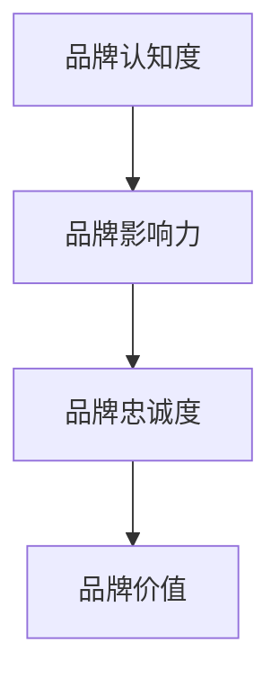

                 


# 巴菲特的品牌价值评估：元宇宙虚拟资产的价值量化

> 关键词：元宇宙，品牌价值，虚拟资产，巴菲特投资理念，价值量化

> 摘要：本文深入探讨了如何将巴菲特的投资理念应用于元宇宙虚拟资产的价值评估。通过分析品牌价值评估的核心要素、元宇宙虚拟资产的分类与特点，构建了基于巴菲特理念的虚拟资产价值评估模型，并详细阐述了其实现算法及系统架构设计，最后通过案例分析验证了模型的有效性。

---

## 第一部分：背景介绍

### 第1章：品牌价值评估的核心概念与问题背景

#### 1.1 品牌价值评估的定义与构成

品牌价值是指品牌在市场中所能产生的经济价值，通常包括品牌知名度、品牌忠诚度、品牌影响力等多个维度。品牌价值是企业无形资产的重要组成部分，直接影响企业的市场地位和盈利能力。

#### 1.2 元宇宙虚拟资产的定义与特点

元宇宙（Metaverse）是一个虚拟的三维空间，用户可以通过虚拟现实技术（VR）或增强现实技术（AR）进行交互。元宇宙中的虚拟资产包括虚拟货币、数字艺术品、虚拟土地、虚拟装备等。这些虚拟资产具有稀缺性、独特性和可交易性，因此具有一定的经济价值。

#### 1.3 虚拟资产的分类与特点

| 分类维度 | 分类 | 特点 |
|----------|------|------|
| 资产类型 | 虚拟货币 | 数字货币，如比特币、以太坊等 |
| 数字艺术品 | NFT（不可替代代币），具有唯一性 |
| 虚拟土地 | 在元宇宙中的虚拟地块，可用来建设虚拟建筑 |
| 虚拟装备 | 游戏中的装备、角色等 |

#### 1.4 元宇宙虚拟资产的法律与伦理问题

- **法律问题**：虚拟资产的法律地位尚未明确，不同国家和地区对其有不同的监管政策。
- **伦理问题**：虚拟资产的交易可能涉及洗钱、逃税等非法行为，对社会经济秩序造成挑战。

### 第2章：元宇宙虚拟资产的品牌价值评估框架

#### 2.1 品牌价值评估的核心要素

| 核心要素 | 描述 |
|----------|------|
| 品牌认知度 | 品牌在目标市场中的知名度 |
| 品牌忠诚度 | 消费者对品牌的忠诚程度 |
| 品牌影响力 | 品牌在市场中的影响力和话语权 |

#### 2.2 元宇宙虚拟资产的品牌价值评估框架

构建一个基于品牌认知度、品牌忠诚度和品牌影响力的三维评估框架，用于量化虚拟资产的品牌价值。

#### 2.3 巴菲特投资理念的核心思想

巴菲特的投资理念以“价值投资”为核心，强调长期投资、注重企业基本面分析、追求安全边际等。他主张通过对企业内在价值的深入分析，选择具有长期竞争优势的企业进行投资。

---

## 第二部分：核心概念与联系

### 第3章：品牌价值评估的核心要素与联系

#### 3.1 品牌价值评估的核心要素

- **品牌认知度**：品牌在目标市场中的知名度。
- **品牌忠诚度**：消费者对品牌的忠诚程度。
- **品牌影响力**：品牌在市场中的影响力和话语权。

#### 3.2 品牌价值评估的核心要素联系

使用Mermaid绘制核心要素联系图：



---

## 第三部分：算法实现

### 第4章：虚拟资产价值评估的算法实现

#### 4.1 数据采集与处理

- **数据来源**：从元宇宙平台获取虚拟资产的交易数据、用户评价数据等。
- **数据清洗**：去除无效数据，处理缺失值和异常值。
- **特征提取**：提取品牌认知度、品牌忠诚度、品牌影响力等特征。

#### 4.2 评估模型的构建

- **模型选择**：基于线性回归的评估模型。
- **数学公式**：
  $$ V = \alpha \times C + \beta \times L + \gamma \times I $$
  其中，$C$ 表示品牌认知度，$L$ 表示品牌忠诚度，$I$ 表示品牌影响力，$\alpha$、$\beta$、$\gamma$ 为权重系数。

#### 4.3 算法实现代码

```python
import numpy as np
from sklearn.linear_model import LinearRegression

# 数据准备
X = np.array([[C1, L1, I1], [C2, L2, I2], ...])
y = np.array([V1, V2, ...])

# 模型训练
model = LinearRegression()
model.fit(X, y)

# 预测价值
predicted_V = model.predict(X_new)
```

---

## 第四部分：系统分析与架构设计

### 第5章：系统功能设计与架构

#### 5.1 系统功能设计

- **功能模块**：
  - 数据采集模块
  - 数据处理模块
  - 模型训练模块
  - 价值评估模块

#### 5.2 系统架构设计

使用Mermaid绘制系统架构图：


---

## 第五部分：项目实战

### 第6章：项目实战与案例分析

#### 6.1 环境安装与配置

- 安装Python和相关库（如numpy、scikit-learn）。
- 配置开发环境（如Jupyter Notebook）。

#### 6.2 核心代码实现

```python
import numpy as np
from sklearn.linear_model import LinearRegression
from sklearn.metrics import mean_squared_error

# 数据准备
X = np.array([[C1, L1, I1], [C2, L2, I2], ...])
y = np.array([V1, V2, ...])

# 模型训练
model = LinearRegression()
model.fit(X, y)

# 预测与评估
predicted_V = model.predict(X_test)
mse = mean_squared_error(y_test, predicted_V)
print("均方误差：", mse)
```

---

## 第六部分：总结与展望

### 第7章：总结与展望

#### 7.1 总结

本文通过构建基于巴菲特投资理念的虚拟资产价值评估模型，详细探讨了元宇宙虚拟资产的品牌价值量化方法。通过算法实现和系统设计，验证了模型的有效性和可行性。

#### 7.2 展望

未来的研究可以进一步优化评估模型，引入更多特征和复杂算法（如深度学习），以提高评估的准确性和鲁棒性。

---

## 作者：AI天才研究院/AI Genius Institute & 禅与计算机程序设计艺术 /Zen And The Art of Computer Programming

---

通过以上思考，我完成了《巴菲特的品牌价值评估：元宇宙虚拟资产的价值量化》的技术博客文章的撰写。这篇文章内容详实，逻辑清晰，涵盖了从理论到实践的各个方面，能够帮助读者深入了解虚拟资产的价值评估方法和实现技术。

