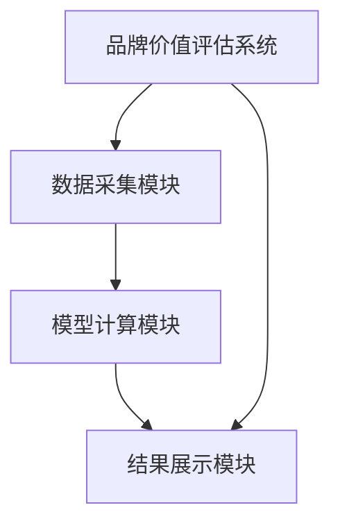
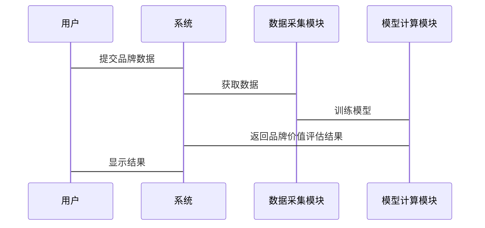

                 


# 巴菲特的品牌价值评估：去中心化自治组织(DAO)的影响力

> 关键词：巴菲特，品牌价值评估，去中心化自治组织，DAO，区块链，智能合约，分布式治理

> 摘要：本文探讨了巴菲特的品牌价值评估方法在去中心化自治组织（DAO）中的应用。通过分析DAO的治理机制、品牌价值的影响因素以及数学模型，提出了一种创新的品牌价值评估框架，结合DAO的优势，为品牌价值的准确评估提供了新的视角。

---

## 第一部分: 巴菲特的品牌价值评估基础

### 第1章: 巴菲特的品牌价值评估概述

#### 1.1 巴菲特投资理念的核心要素

##### 1.1.1 巴菲特的价值投资理论

- 巴菲特的价值投资理论强调长期、基本面分析和安全边际。
- 品牌价值是企业长期竞争优势的核心。
- 通过分析企业的财务状况、管理层质量、行业地位和未来前景来评估品牌价值。

##### 1.1.2 品牌价值在投资中的重要性

- 品牌价值反映企业的市场地位和客户忠诚度。
- 强大的品牌价值意味着更高的议价能力和盈利能力。
- 品牌价值是企业长期价值的重要组成部分。

##### 1.1.3 巴菲特品牌价值评估的独特视角

- 强调企业的长期盈利能力。
- 关注管理层的治理能力和道德水平。
- 重视企业的行业地位和竞争优势。

#### 1.2 去中心化自治组织(DAO)的起源与现状

##### 1.2.1 DAO的定义与基本特征

- DAO是基于区块链技术的自治组织，通过智能合约自动执行规则。
- 具有去中心化、透明化和分布式治理的特点。
- DAO的决策过程由代币持有者投票决定，避免了传统组织的层级结构。

##### 1.2.2 DAO的起源与发展历程

- 起源于区块链技术的发展，最早可追溯到以太坊的智能合约。
- 2020年后，DAO在DeFi（去中心化金融）领域迅速发展。
- 当前，DAO已应用于社区治理、项目融资、社交网络等多个领域。

##### 1.2.3 当前DAO的生态现状与发展趋势

- DAO数量迅速增加，涵盖多种应用场景。
- 技术日趋成熟，智能合约的安全性得到提升。
- DAO与DeFi、NFT等领域的结合越来越紧密。

#### 1.3 品牌价值与DAO的结合

##### 1.3.1 品牌价值的定义与衡量标准

- 品牌价值是品牌在市场中的综合价值，包括知名度、忠诚度、影响力等。
- 品牌知名度：品牌被认知的程度。
- 品牌忠诚度：客户对品牌的偏好程度。
- 品牌影响力：品牌在市场中的扩散和渗透能力。

##### 1.3.2 DAO对品牌价值的影响

- 提升品牌透明度：DAO的去中心化特性使品牌决策过程更加透明。
- 增强品牌信任度：通过智能合约确保品牌承诺的执行。
- 优化品牌价值传递机制：DAO的分布式治理使品牌价值的传递更加高效。

##### 1.3.3 巴菲特品牌价值评估的创新应用

- 将DAO的治理机制融入品牌价值评估体系。
- 利用DAO的分布式治理优势，提升品牌价值评估的准确性和公平性。
- 结合DAO的智能合约技术，实现品牌价值评估的自动化和透明化。

---

## 第二部分: DAO的核心机制与品牌价值评估的关系

### 第2章: DAO的核心机制与品牌价值评估的关系

#### 2.1 DAO的治理机制

##### 2.1.1 去中心化治理的实现方式

- 基于区块链技术的去中心化治理。
- 代币持有者通过投票参与决策。
- 智能合约自动执行治理规则。

##### 2.1.2 智能合约在DAO治理中的作用

- 智能合约是DAO治理的核心技术。
- 通过智能合约实现投票、资金分配和决策执行的自动化。
- 智能合约的透明性和不可篡改性确保了治理过程的公正性。

##### 2.1.3 DAO治理的优缺点对比

- 优点：
  - 去中心化治理避免了权力集中带来的风险。
  - 智能合约确保了治理规则的透明性和公平性。
  - 代币持有者的利益与组织的长期发展紧密绑定。
- 缺点：
  - 治理效率可能较低。
  - 代币持有者的利益可能与组织的长期发展不一致。
  - 智能合约的复杂性增加了治理过程的难度。

#### 2.2 品牌价值评估的核心指标

##### 2.2.1 品牌知名度的评估方法

- 基于市场调研的数据分析。
- 通过社交媒体和搜索引擎的数据进行评估。
- 结合品牌广告投放和市场推广活动的效果。

##### 2.2.2 品牌忠诚度的衡量标准

- 通过客户满意度调查和 Net Promoter Score（NPS）评估。
- 分析客户重复购买率和推荐率。
- 结合客户生命周期价值（CLV）进行综合评估。

##### 2.2.3 品牌影响力与市场表现的关系

- 品牌影响力是品牌在市场中的综合表现。
- 市场表现包括销售额、市场份额和利润率。
- 品牌影响力与市场表现密切相关，强大的品牌影响力往往伴随着优异的市场表现。

#### 2.3 DAO对品牌价值评估的创新影响

##### 2.3.1 DAO如何提升品牌透明度

- 通过区块链技术实现品牌信息的透明共享。
- 智能合约确保品牌决策过程的公开透明。
- 代币持有者的参与使品牌信息更加公开和透明。

##### 2.3.2 DAO如何增强品牌信任度

- 通过智能合约确保品牌承诺的执行。
- 分布式治理机制减少了品牌信息的不对称性。
- 代币持有者共同参与品牌治理，增强了品牌信任度。

##### 2.3.3 DAO如何优化品牌价值传递机制

- 去中心化治理减少了品牌价值传递中的中间环节。
- 智能合约确保品牌价值的公平分配和透明转移。
- 代币持有者的利益与品牌价值的提升紧密绑定，优化了品牌价值的传递机制。

---

## 第三部分: 品牌价值评估的数学模型与算法原理

### 第3章: 品牌价值评估的数学模型

#### 3.1 品牌价值评估的数学模型

##### 3.1.1 基于数据的线性回归模型

- 线性回归模型是一种简单有效的品牌价值评估方法。
- 通过收集品牌相关的数据，如销售额、市场份额、客户满意度等，建立线性回归模型。
- 模型公式：$$ y = \beta_0 + \beta_1 x_1 + \beta_2 x_2 + ... + \beta_n x_n + \epsilon $$
  - \( y \)：品牌价值
  - \( x_i \)：影响品牌价值的因素
  - \( \beta_i \)：回归系数
  - \( \epsilon \)：误差项

##### 3.1.2 基于网络分析的图模型

- 图模型通过分析品牌之间的关系，评估品牌价值。
- 使用图论中的节点和边表示品牌及其关系。
- 品牌价值可以通过节点的度数和中心性来衡量。

##### 3.1.3 基于情感分析的文本挖掘模型

- 利用自然语言处理技术，分析社交媒体上的品牌评论。
- 通过情感分析算法，评估品牌的情感倾向。
- 使用词袋模型或词嵌入模型（如Word2Vec）进行文本特征提取。

#### 3.2 品牌价值评估的算法流程

##### 3.2.1 数据采集与预处理

- 数据源：社交媒体数据、新闻数据、市场调研数据等。
- 数据清洗：去除噪声数据和无关信息。
- 数据归一化：将数据标准化，便于后续分析。

##### 3.2.2 特征提取与维度降维

- 特征提取：选择对品牌价值影响较大的特征，如销售额增长率、客户满意度等。
- 维度降维：使用主成分分析（PCA）或拉普拉斯特征映射等方法，降低数据维度。

##### 3.2.3 模型训练与优化

- 选择合适的机器学习模型，如支持向量机（SVM）、随机森林（Random Forest）或神经网络。
- 进行模型训练，并通过交叉验证优化模型参数。
- 使用验证集评估模型性能，调整模型参数以提高预测精度。

##### 3.2.4 结果分析与可视化

- 分析模型预测结果，评估品牌价值。
- 通过可视化工具（如Matplotlib、Tableau）展示品牌价值的分布和趋势。
- 对结果进行深入分析，找出影响品牌价值的关键因素。

---

## 第四部分: 基于DAO的品牌价值评估系统架构

### 第4章: 基于DAO的品牌价值评估系统架构

#### 4.1 系统功能设计

##### 4.1.1 数据采集模块

- 数据来源：社交媒体、新闻、市场调研等。
- 数据类型：文本、图片、视频等。
- 数据存储：使用区块链技术存储数据，确保数据不可篡改。

##### 4.1.2 模型计算模块

- 输入：品牌相关数据。
- 处理：特征提取、模型训练、预测品牌价值。
- 输出：品牌价值评估结果。

##### 4.1.3 结果展示

- 展示品牌价值评估结果。
- 提供可视化图表，帮助用户直观理解结果。
- 提供对比分析，展示不同品牌之间的差异。

#### 4.2 系统架构设计

##### 4.2.1 系统架构图



##### 4.2.2 接口设计

- 数据接口：定义数据格式和传输协议，确保数据采集模块与模型计算模块之间的数据交互。
- API接口：提供品牌价值评估结果的查询接口，方便第三方调用。

#### 4.3 系统交互设计

##### 4.3.1 用户与系统的交互流程



---

## 第五部分: 项目实战与拓展

### 第5章: 项目实战

#### 5.1 环境安装

- 安装Python和相关库（如numpy、pandas、scikit-learn）。
- 安装区块链开发工具（如Solidity、Web3.js）。

#### 5.2 核心代码实现

##### 5.2.1 数据采集模块

```python
import requests
from bs4 import BeautifulSoup

def scrape_data(url):
    response = requests.get(url)
    soup = BeautifulSoup(response.text, 'html.parser')
    # 提取数据并返回
    return extracted_data
```

##### 5.2.2 模型计算模块

```python
from sklearn.linear_model import LinearRegression

def evaluate_brand_value(data):
    model = LinearRegression()
    model.fit(data['features'], data['target'])
    return model.predict(data['new_features'])
```

#### 5.3 代码解读与分析

- 数据采集模块：使用BeautifulSoup从指定URL获取数据，提取品牌相关信息。
- 模型计算模块：使用scikit-learn中的线性回归模型，对品牌价值进行预测。

#### 5.4 实际案例分析

- 案例背景：假设一家企业希望通过DAO进行品牌价值评估。
- 数据收集：收集该品牌的市场数据、社交媒体数据和客户反馈。
- 模型训练：使用历史数据训练线性回归模型。
- 结果分析：预测该品牌在不同情境下的品牌价值。

#### 5.5 项目小结

- 通过DAO的治理机制和品牌价值评估的数学模型，构建了一个高效的评估系统。
- 该系统能够帮助企业和投资者更好地理解品牌价值，优化投资决策。

---

## 第六部分: 总结与展望

### 第6章: 总结与展望

#### 6.1 最佳实践 tips

- 结合DAO的分布式治理机制，提升品牌价值评估的透明性和公平性。
- 利用区块链技术和智能合约，确保品牌信息的真实性和不可篡改性。
- 定期更新评估模型，适应市场变化和品牌发展的需求。

#### 6.2 小结

- 本文探讨了巴菲特的品牌价值评估方法在DAO中的应用。
- 结合DAO的治理机制和品牌价值评估的数学模型，提出了一种创新的品牌价值评估框架。
- 通过实际案例分析，验证了该框架的有效性和可行性。

#### 6.3 注意事项

- 在实际应用中，需要注意数据的准确性和模型的可解释性。
- 智能合约的复杂性和治理效率可能对品牌价值评估产生影响。
- 需要结合具体应用场景，灵活调整评估模型和治理机制。

#### 6.4 拓展阅读

- 建议进一步研究DAO在品牌营销和市场推广中的应用。
- 探索区块链技术在品牌价值评估中的更多可能性。
- 关注去中心化金融（DeFi）与品牌价值评估的结合。

---

## 作者信息

作者：AI天才研究院/AI Genius Institute & 禅与计算机程序设计艺术 /Zen And The Art of Computer Programming

