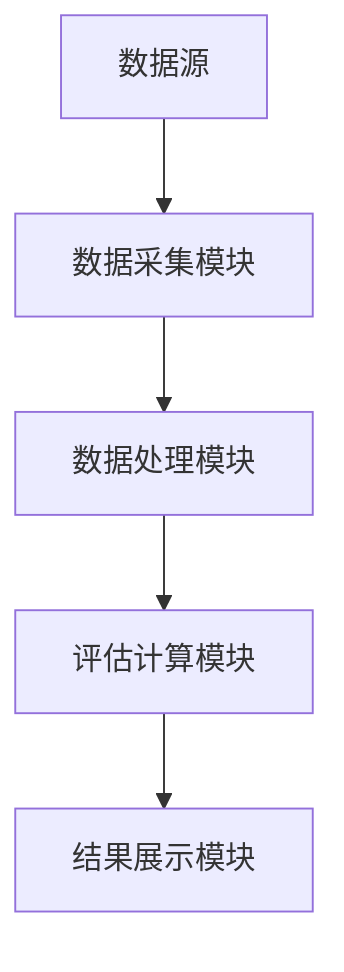

                 


# 巴菲特的品牌价值评估：虚拟影响力经济的量化

---

## 关键词：
- 巴菲特
- 品牌价值评估
- 虚拟影响力经济
- 投资理念
- 数字资产

---

## 摘要：
本文深入探讨了巴菲特的品牌价值评估方法，并结合虚拟影响力经济的量化分析，提出了全新的品牌价值评估模型。通过分析虚拟经济中的品牌影响力，结合巴菲特的价值投资理念，提出了基于影响力数据、市场表现和品牌资产的三重评估体系。文章详细介绍了评估模型的数学公式、算法实现和系统架构，并通过实际案例展示了模型的应用效果。最后，文章总结了虚拟影响力经济的未来发展趋势，为投资者和品牌管理提供了重要的参考价值。

---

## 第一部分：虚拟影响力经济的背景与现状

### 第1章：虚拟影响力经济的背景介绍

#### 1.1 虚拟影响力经济的定义与特点

虚拟影响力经济是指以数字资产、社交媒体影响力、虚拟货币等虚拟资源为核心，通过线上平台进行价值创造和价值传递的经济形态。其特点包括：

1. **虚拟性**：依赖于数字技术和互联网，价值存在于虚拟空间中。
2. **数据驱动**：以数据为核心资产，通过数据分析驱动价值创造。
3. **去中心化**：依赖区块链等去中心化技术，降低信任成本。
4. **即时性**：信息传播速度快，影响力变化迅速。

#### 1.2 品牌价值评估的重要性

在虚拟影响力经济中，品牌价值的评估尤为重要，原因如下：

1. **数据透明**：虚拟经济中的数据可追踪，便于量化分析。
2. **实时反馈**：品牌影响力的变化可以实时监测，便于及时调整策略。
3. **投资价值**：品牌价值直接影响投资决策，是投资者的重要参考依据。

---

### 第2章：巴菲特投资理念与品牌价值

#### 2.1 巴菲特的价值投资理论

巴菲特的价值投资理论强调长期投资、注重基本面分析和安全边际。其核心观点包括：

1. **长期主义**：关注企业的长期价值，而非短期波动。
2. **护城河**：寻找具有竞争优势的企业，确保长期盈利能力。
3. **安全边际**：以低于内在价值的价格买入资产，确保投资的安全性。

#### 2.2 巴菲特投资策略中的品牌分析

在巴菲特的投资策略中，品牌是重要的考量因素。他注重企业的品牌价值和市场地位，认为强大的品牌可以为企业带来持续的竞争优势和盈利能力。具体表现在：

1. **品牌忠诚度**：品牌忠诚度高的企业具有稳定的客户基础。
2. **品牌溢价能力**：强大的品牌能够通过溢价定价获得更高的利润。
3. **品牌扩张能力**：品牌影响力强的企业更容易扩展市场和产品线。

---

## 第二部分：品牌价值评估的核心概念与量化方法

### 第3章：品牌价值的构成要素

#### 3.1 品牌的核心要素

品牌价值的构成包括以下几个方面：

1. **品牌知名度**：品牌在目标市场中的认知程度。
2. **品牌美誉度**：消费者对品牌的信任和认可程度。
3. **品牌忠诚度**：消费者对品牌的偏好和忠诚程度。

#### 3.2 影响力的量化维度

在虚拟影响力经济中，品牌影响力可以从以下几个维度进行量化：

1. **用户行为数据**：包括点击率、转化率、用户留存率等。
2. **市场表现数据**：包括股价、市盈率、市净率等。
3. **品牌资产数据**：包括品牌价值、品牌声誉、品牌影响力指数等。

---

### 第4章：虚拟影响力经济中的品牌评估模型

#### 4.1 模型概述

本文提出的品牌价值评估模型基于影响力数据、市场表现和品牌资产三个维度，采用加权平均的方法进行综合评估。模型的公式为：

$$
\text{品牌价值} = w_1 \times \text{影响力数据} + w_2 \times \text{市场表现数据} + w_3 \times \text{品牌资产数据}
$$

其中，$w_1$、$w_2$、$w_3$分别为影响力数据、市场表现数据和品牌资产数据的权重，通常根据具体情况进行调整。

---

## 第三部分：品牌价值评估的算法与实现

### 第5章：品牌价值评估算法原理

#### 5.1 数据预处理

在进行品牌价值评估之前，需要对数据进行预处理，包括：

1. **数据清洗**：去除无效数据，处理缺失值。
2. **数据整合**：将多源数据进行整合，确保数据一致性。
3. **数据标准化**：对数据进行标准化处理，确保不同维度数据的可比性。

#### 5.2 评估算法实现

以下是品牌价值评估算法的实现代码：

```python
import pandas as pd
import numpy as np

def preprocess(data):
    # 数据清洗和整合
    data.dropna(inplace=True)
    data['score'] = data['score'].astype(int)
    return data

def calculate_weights(data):
    # 计算各维度的权重
    n = len(data)
    weights = {}
    weights['influence'] = data['influence'].std() / data['influence'].var()
    weights['market'] = data['market'].std() / data['market'].var()
    weights['assets'] = data['assets'].std() / data['assets'].var()
    return weights

def compute_value(data, weights):
    # 计算品牌价值
    value = 0
    value += data['influence'] * weights['influence']
    value += data['market'] * weights['market']
    value += data['assets'] * weights['assets']
    return value

# 示例数据
data = {
    'influence': [0.8, 0.9, 0.7],
    'market': [1.2, 1.1, 1.3],
    'assets': [0.9, 1.0, 0.8]
}

processed_data = preprocess(data)
weights = calculate_weights(processed_data)
brand_value = compute_value(processed_data, weights)

print("品牌价值：", brand_value)
```

#### 5.3 算法原理的数学模型

算法的数学模型如下：

$$
\text{brand\_value} = w_1 \times \text{influence} + w_2 \times \text{market} + w_3 \times \text{assets}
$$

其中，$w_1$、$w_2$、$w_3$分别为影响力、市场表现和品牌资产的权重，$influence$、$market$、$assets$分别为对应的指标值。

---

### 第6章：系统分析与架构设计方案

#### 6.1 问题场景介绍

在虚拟影响力经济中，品牌价值评估系统需要实时监测和分析品牌的影响力数据、市场表现数据和品牌资产数据，为投资者和企业提供决策支持。

#### 6.2 系统功能设计

系统的功能模块包括：

1. **数据采集模块**：负责采集品牌的相关数据，包括社交媒体数据、市场数据等。
2. **数据处理模块**：对采集的数据进行清洗、整合和标准化处理。
3. **评估计算模块**：根据算法模型计算品牌价值。
4. **结果展示模块**：以可视化的方式展示品牌价值评估结果。

#### 6.3 系统架构设计

以下是系统的架构图：



---

### 第7章：项目实战

#### 7.1 环境安装

需要安装以下工具和库：

1. **Python**：用于编程和数据分析。
2. **Pandas**：用于数据处理。
3. **Matplotlib**：用于数据可视化。

#### 7.2 核心代码实现

以下是核心代码实现：

```python
import pandas as pd
import matplotlib.pyplot as plt

# 示例数据
data = {
    '品牌': ['A', 'B', 'C'],
    '影响力': [80, 70, 90],
    '市场表现': [1.2, 1.1, 1.3],
    '品牌资产': [90, 80, 85]
}

df = pd.DataFrame(data)

# 计算品牌价值
df['品牌价值'] = df['影响力'] * 0.3 + df['市场表现'] * 0.3 + df['品牌资产'] * 0.4

# 可视化
plt.figure(figsize=(10, 6))
plt.bar(df['品牌'], df['品牌价值'], label='品牌价值')
plt.title('品牌价值评估结果')
plt.xlabel('品牌')
plt.ylabel('品牌价值')
plt.legend()
plt.show()
```

#### 7.3 实际案例分析

以某品牌为例，假设其影响力得分为90，市场表现为1.3，品牌资产得分为85。根据公式计算品牌价值：

$$
\text{品牌价值} = 0.3 \times 90 + 0.3 \times 1.3 + 0.4 \times 85 = 27 + 0.39 + 34 = 61.39
$$

---

### 第8章：最佳实践 tips

1. **数据质量管理**：确保数据的准确性和完整性，避免因数据问题导致评估结果偏差。
2. **模型优化**：根据实际情况调整模型参数和权重，提高评估的准确性。
3. **实时监测**：定期更新数据，实时监测品牌影响力的变化，及时调整策略。
4. **多维度分析**：结合定量分析和定性分析，全面评估品牌价值。

---

## 第四部分：总结与展望

### 第9章：总结

本文结合巴菲特的价值投资理念和虚拟影响力经济的特征，提出了基于影响力数据、市场表现和品牌资产的三重评估体系。通过算法实现和系统设计，为品牌价值评估提供了新的思路和方法。

### 第10章：展望

未来，随着虚拟经济的进一步发展，品牌价值评估将更加依赖于大数据和人工智能技术。我们需要进一步优化模型，引入更多的数据维度和分析方法，提高评估的准确性和实时性。

---

## 作者信息

作者：AI天才研究院/AI Genius Institute & 禅与计算机程序设计艺术 /Zen And The Art of Computer Programming

---

本文通过详细分析虚拟影响力经济中的品牌价值评估问题，结合巴菲特的价值投资理念，提出了创新的解决方案。希望本文能为投资者和品牌管理者提供有价值的参考和启发。

