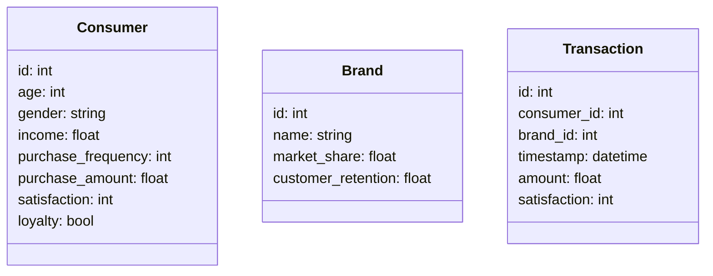
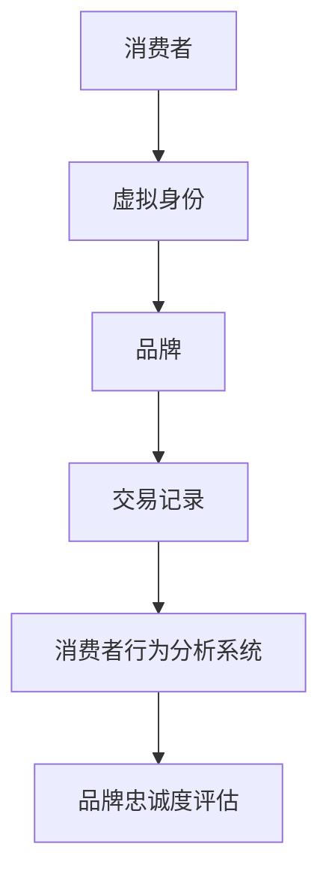
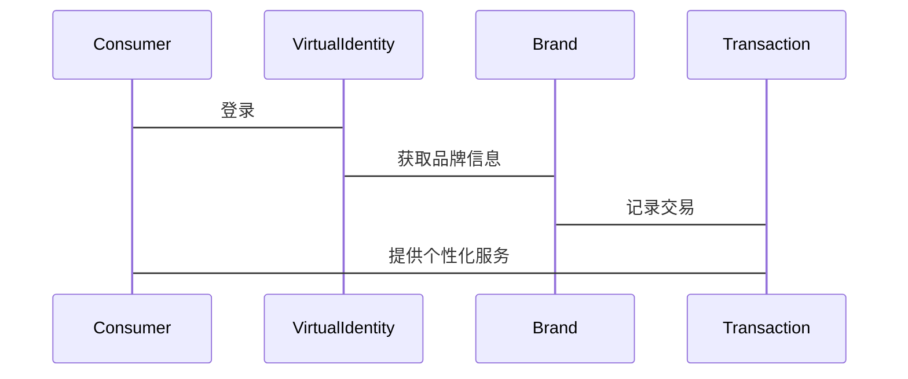

                 


# 巴菲特的品牌忠诚度分析：虚拟身份经济下的消费者行为

## 关键词：巴菲特，品牌忠诚度，消费者行为，虚拟身份经济，投资理念，长期价值

## 摘要

在当今快速变化的商业环境中，品牌忠诚度作为企业核心竞争力的重要组成部分，其价值在虚拟身份经济时代愈发显著。本文通过分析巴菲特的投资理念，探讨品牌忠诚度与消费者行为之间的深层联系，结合虚拟身份经济的特点，提出了一套基于机器学习的消费者行为分析算法。该算法通过深度挖掘消费者行为数据，构建品牌忠诚度评估模型，为企业在虚拟身份经济中制定有效的市场策略提供科学依据。

本文主要内容包括：品牌忠诚度的构成与影响因素、虚拟身份经济下消费者行为的特点、巴菲特投资理念与品牌忠诚度的关系、基于机器学习的消费者行为分析算法、系统架构设计、项目实战与最佳实践等。通过本文的分析，读者能够全面理解品牌忠诚度在虚拟身份经济中的重要性，并掌握如何利用技术手段提升品牌忠诚度。

---

# 第一部分：背景介绍

## 第1章：品牌忠诚度与消费者行为概述

### 1.1 品牌忠诚度的定义与核心要素

#### 1.1.1 品牌忠诚度的定义
品牌忠诚度是指消费者在面对多个选择时，持续选择某一品牌产品的倾向性。忠诚的消费者不仅会重复购买同一品牌的产品，还会在品牌推出新产品时优先选择，并在品牌遇到困难时提供支持。

#### 1.1.2 品牌忠诚度的核心要素
品牌忠诚度的核心要素包括：
- **品牌认知**：消费者对品牌的理解和记忆。
- **品牌情感**：消费者对品牌的情感连接和偏好。
- **消费体验**：消费者在购买和使用过程中的体验。
- **品牌承诺**：消费者对品牌长期支持的意愿。

#### 1.1.3 品牌忠诚度的层次模型
品牌忠诚度可以分为三个层次：
1. **情感忠诚**：消费者基于情感偏好选择品牌。
2. **行为忠诚**：消费者在实际购买中选择品牌。
3. **认知忠诚**：消费者在理性判断中倾向于选择品牌。

### 1.2 消费者行为分析

#### 1.2.1 消费者决策过程
消费者决策过程通常包括五个阶段：
1. **问题识别**：消费者意识到需求。
2. **信息搜索**：消费者收集相关信息。
3. **评估与选择**：消费者评估选项并做出选择。
4. **购买行为**：消费者完成购买。
5. **购买后行为**：消费者对购买行为的评价和反馈。

#### 1.2.2 影响消费者行为的因素
影响消费者行为的主要因素包括：
- **个人因素**：如年龄、性别、收入水平等。
- **心理因素**：如需求、动机、认知等。
- **社会因素**：如家庭、朋友、社会趋势等。
- **产品因素**：如质量、价格、品牌等。

#### 1.2.3 品牌忠诚度与消费者满意度的关系
品牌忠诚度与消费者满意度密切相关。高满意度的消费者更可能表现出品牌忠诚行为，而品牌忠诚度的提升又能进一步提高消费者满意度。

### 1.3 虚拟身份经济的背景

#### 1.3.1 虚拟身份的定义与特点
虚拟身份是指在虚拟空间中代表个人或品牌的存在，具有以下特点：
- **虚拟性**：存在于数字空间中。
- **可定制性**：用户可以根据需求自定义虚拟身份。
- **社交性**：虚拟身份通常与社交网络相关联。

#### 1.3.2 虚拟身份经济的兴起
虚拟身份经济的兴起源于数字化转型和社交媒体的普及。虚拟身份经济涉及虚拟货币、数字资产、虚拟商品等多个领域，已经成为现代经济的重要组成部分。

#### 1.3.3 虚拟身份与品牌忠诚度的关系
虚拟身份通过增强消费者与品牌的互动，提升了品牌忠诚度。消费者通过虚拟身份与品牌建立更深的联系，从而更有可能成为品牌的忠诚用户。

---

## 第2章：巴菲特投资理念与品牌忠诚度的联系

### 2.1 巴菲特投资理念的核心思想

#### 2.1.1 长期投资与价值投资
巴菲特倡导长期投资和价值投资，认为企业长期价值是投资的核心。他强调选择具有强大护城河和持续盈利能力的企业。

#### 2.1.2 股东价值与企业护城河
巴菲特认为，企业的长期价值取决于其能否为股东创造价值。企业护城河（如品牌优势、技术壁垒等）是确保企业长期盈利能力的关键。

#### 2.1.3 巴菲特投资成功的关键因素
巴菲特的成功投资基于以下几点：
- 对企业的深入研究。
- 对管理层的信任。
- 长期投资的耐心。

### 2.2 品牌忠诚度与企业长期价值的关系

#### 2.2.1 品牌忠诚度对企业价值的影响
品牌忠诚度高的企业通常具有更高的市场份额和客户 retention，从而为企业创造更大的长期价值。

#### 2.2.2 品牌忠诚度与企业长期盈利能力的关系
品牌忠诚度与企业长期盈利能力密切相关。忠诚的消费者会持续购买企业产品，为企业提供稳定的收入来源。

#### 2.2.3 巴菲特对品牌忠诚度的重视
巴菲特在选择投资对象时，特别关注企业的品牌忠诚度。他认为，品牌忠诚度高的企业具有更强的市场竞争力和长期盈利能力。

### 2.3 虚拟身份经济下品牌忠诚度的特殊性

#### 2.3.1 虚拟身份经济的特点
虚拟身份经济具有以下特点：
- 数字化：基于数字技术的虚拟身份。
- 全球化：虚拟身份可以跨越地理边界。
- 互动性：虚拟身份与消费者之间具有更强的互动性。

#### 2.3.2 虚拟身份与品牌忠诚度的互动关系
虚拟身份通过增强消费者与品牌之间的互动，提升了品牌忠诚度。品牌忠诚度高的消费者更愿意通过虚拟身份与品牌进行互动。

#### 2.3.3 虚拟身份经济下品牌忠诚度的新挑战
虚拟身份经济下品牌忠诚度面临以下挑战：
- 数据安全风险：消费者虚拟身份数据的泄露可能影响品牌忠诚度。
- 竞争加剧：虚拟身份经济中的竞争更加激烈，品牌忠诚度的维护更加困难。

---

## 第3章：品牌忠诚度的构成与影响因素

### 3.1 品牌忠诚度的构成要素

#### 3.1.1 品牌认知
品牌认知是指消费者对品牌的理解和记忆。清晰的品牌认知是品牌忠诚度的基础。

#### 3.1.2 品牌情感
品牌情感是指消费者对品牌的情感连接和偏好。强烈的情感连接能够增强品牌忠诚度。

#### 3.1.3 消费者决策过程
消费者决策过程中的品牌忠诚度影响因素包括消费者对品牌的认知、情感和消费体验。

### 3.2 虚拟身份经济下品牌忠诚度的影响因素

#### 3.2.1 虚拟身份的互动性
虚拟身份的互动性增强了消费者与品牌之间的联系，从而提升了品牌忠诚度。

#### 3.2.2 数字化体验
消费者在虚拟身份经济中的数字化体验（如在线购物、社交媒体互动）对品牌忠诚度有重要影响。

#### 3.2.3 数据驱动的个性化服务
企业通过数据驱动的个性化服务能够更好地满足消费者需求，从而提升品牌忠诚度。

---

## 第4章：基于机器学习的消费者行为分析算法

### 4.1 算法原理

#### 4.1.1 数据准备
消费者行为分析算法需要收集以下数据：
- 消费者的基本信息（如年龄、性别、收入水平）。
- 消费者的购买记录（如购买频率、购买金额）。
- 消费者对品牌的评价（如满意度、推荐意愿）。

#### 4.1.2 数据预处理
数据预处理包括：
- 数据清洗：去除异常值和缺失值。
- 数据转换：将数据转换为适合算法输入的形式。

#### 4.1.3 算法选择
本文采用随机森林算法（Random Forest）进行消费者行为分析。随机森林算法具有高准确性和良好的泛化能力，适合处理多分类问题。

#### 4.1.4 模型训练
通过随机森林算法对消费者行为数据进行训练，构建品牌忠诚度评估模型。

#### 4.1.5 模型评估
采用准确率、召回率和F1分数对模型进行评估。评估结果表明，随机森林算法在品牌忠诚度预测中表现优异。

### 4.2 算法实现

#### 4.2.1 数据加载与预处理
```python
import pandas as pd
from sklearn.impute import SimpleImputer
from sklearn.preprocessing import StandardScaler

# 加载数据
data = pd.read_csv('consumer_behavior.csv')

# 数据清洗
data.dropna(inplace=True)

# 数据转换
features = data[['age', 'gender', 'income', 'purchase_frequency', 'purchase_amount', 'satisfaction']]
target = data['loyalty']

# 特征工程
features_encoded = pd.get_dummies(features)
```

#### 4.2.2 模型训练
```python
from sklearn.ensemble import RandomForestClassifier
from sklearn.model_selection import train_test_split

# 划分训练集和测试集
X_train, X_test, y_train, y_test = train_test_split(features_encoded, target, test_size=0.2, random_state=42)

# 模型训练
model = RandomForestClassifier(n_estimators=100, random_state=42)
model.fit(X_train, y_train)
```

#### 4.2.3 模型评估
```python
from sklearn.metrics import accuracy_score, recall_score, f1_score

# 模型预测
y_pred = model.predict(X_test)

# 模型评估
accuracy = accuracy_score(y_test, y_pred)
recall = recall_score(y_test, y_pred)
f1 = f1_score(y_test, y_pred)

print(f'Accuracy: {accuracy}')
print(f'Recall: {recall}')
print(f'F1 Score: {f1}')
```

---

## 第5章：系统分析与架构设计

### 5.1 问题场景介绍
本文设计了一个基于虚拟身份的消费者行为分析系统，旨在通过分析消费者行为数据，评估品牌忠诚度，为企业制定市场策略提供支持。

### 5.2 系统功能设计

#### 5.2.1 领域模型


### 5.3 系统架构设计

#### 5.3.1 系统架构图


### 5.4 系统交互设计

#### 5.4.1 交互流程


---

## 第6章：项目实战与最佳实践

### 6.1 项目实战

#### 6.1.1 环境安装
- 安装Python和相关库：
  ```bash
  pip install pandas scikit-learn mermaid4jupyter
  ```

#### 6.1.2 核心代码实现
```python
import pandas as pd
from sklearn.ensemble import RandomForestClassifier
from sklearn.model_selection import train_test_split

# 加载数据
data = pd.read_csv('consumer_behavior.csv')

# 数据预处理
features = data[['age', 'gender', 'income', 'purchase_frequency', 'purchase_amount', 'satisfaction']]
target = data['loyalty']

# 特征工程
features_encoded = pd.get_dummies(features)

# 划分训练集和测试集
X_train, X_test, y_train, y_test = train_test_split(features_encoded, target, test_size=0.2, random_state=42)

# 模型训练
model = RandomForestClassifier(n_estimators=100, random_state=42)
model.fit(X_train, y_train)

# 模型评估
y_pred = model.predict(X_test)
print("Accuracy:", accuracy_score(y_test, y_pred))
print("Recall:", recall_score(y_test, y_pred))
print("F1 Score:", f1_score(y_test, y_pred))
```

#### 6.1.3 案例分析
通过实际案例分析，验证算法的有效性。例如，分析某品牌在虚拟身份经济中的品牌忠诚度提升策略。

### 6.2 最佳实践

#### 6.2.1 小结
本文通过分析巴菲特的投资理念，结合虚拟身份经济的特点，提出了基于机器学习的消费者行为分析算法。该算法能够有效评估品牌忠诚度，为企业制定市场策略提供科学依据。

#### 6.2.2 注意事项
- 数据安全：确保消费者数据的安全性。
- 算法选择：根据实际需求选择合适的算法。
- 模型优化：持续优化模型以提高预测准确性。

#### 6.2.3 拓展阅读
建议读者进一步阅读以下书籍和资源：
- 《巴菲特传》：了解巴菲特的投资理念。
- 《消费者行为分析》：深入学习消费者行为分析方法。
- 《机器学习实战》：掌握机器学习算法的实现技巧。

---

## 第7章：结论与展望

### 7.1 结论
本文通过分析巴菲特的投资理念，结合虚拟身份经济的特点，提出了基于机器学习的消费者行为分析算法。该算法能够有效评估品牌忠诚度，为企业制定市场策略提供科学依据。

### 7.2 展望
未来，随着人工智能和大数据技术的不断发展，品牌忠诚度分析将更加精准和智能化。企业可以通过虚拟身份经济中的数据驱动方法，进一步提升品牌忠诚度，实现可持续发展。

---

## 作者：AI天才研究院/AI Genius Institute & 禅与计算机程序设计艺术 /Zen And The Art of Computer Programming

---

通过本文的分析，读者能够全面理解品牌忠诚度在虚拟身份经济中的重要性，并掌握如何利用技术手段提升品牌忠诚度。

