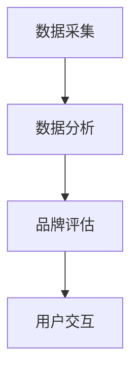
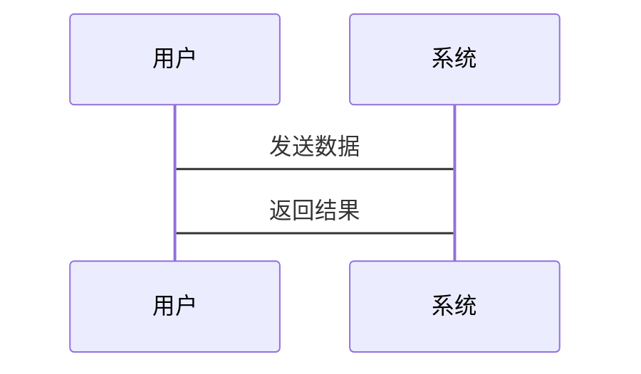

                 


# 巴菲特的品牌忠诚度在数字时代的重新定义

> 关键词：巴菲特，品牌忠诚度，数字时代，价值投资，消费者行为，系统架构

> 摘要：本文探讨了巴菲特的投资理念在数字时代下品牌忠诚度的演变。通过分析品牌忠诚度的核心概念、算法实现和系统架构设计，展示了如何利用现代技术重新定义品牌忠诚度，为企业品牌管理提供新的视角。

---

# 第1章 巴菲特的投资理念与品牌忠诚度

## 1.1 巴菲特的投资理念概述

### 1.1.1 巴菲特的投资核心思想

巴菲特的投资理念以长期主义为核心，强调选择具有持续竞争优势和良好治理的企业进行投资。他主张关注企业的内在价值，而非短期市场波动。这种理念在数字时代下，品牌忠诚度的重要性愈发凸显。

### 1.1.2 长期主义与价值投资的内涵

长期主义强调企业应关注长期发展，而非短期收益。价值投资则通过分析企业的财务状况、行业地位和管理层质量，寻找被市场低估的投资标的。这种投资策略在数字时代下，需要结合品牌忠诚度进行评估。

### 1.1.3 巴菲特投资理念的演变与现状

随着数字技术的发展，消费者行为发生变化，品牌忠诚度的定义和评估标准也需更新。巴菲特的投资理念在这一背景下，逐渐融入了更多的数字化和消费者行为分析因素。

## 1.2 品牌忠诚度的定义与特征

### 1.2.1 品牌忠诚度的定义

品牌忠诚度指消费者对特定品牌产品的偏好程度，表现为持续购买和推荐。在数字时代，品牌忠诚度不仅基于产品质量，还涉及用户体验、品牌互动等多个方面。

### 1.2.2 品牌忠诚度的分类与层次

品牌忠诚度可分为无品牌忠诚、低忠诚度、高忠诚度和品牌拥护者四个层次。不同层次的忠诚度对应不同的消费者行为和品牌互动方式。

### 1.2.3 品牌忠诚度与消费者行为的关系

品牌忠诚度影响消费者的购买决策，高忠诚度消费者更倾向于重复购买和推荐，从而为企业创造长期价值。在数字时代，消费者行为数据的收集和分析帮助企业更准确地评估品牌忠诚度。

## 1.3 数字时代对品牌忠诚度的影响

### 1.3.1 数字技术对企业品牌的影响

数字技术如大数据、人工智能和社交媒体的兴起，改变了消费者与品牌之间的互动方式。企业可以通过数据分析更精准地了解消费者需求，提升品牌忠诚度。

### 1.3.2 消费者行为的变化与品牌忠诚度的关系

数字时代下，消费者行为更加多样化，品牌忠诚度的评估需要考虑更多的维度，如用户体验、品牌互动频率等。

### 1.3.3 数字时代下品牌忠诚度的新特点

数字时代下的品牌忠诚度表现为数据驱动、个性化和互动性强的特点。企业需要通过数据分析和技术创新，不断提升品牌忠诚度。

## 1.4 巴菲特品牌忠诚度理论的现代意义

### 1.4.1 巴菲特品牌忠诚度理论的核心观点

巴菲特强调企业应具备持续竞争优势，品牌忠诚度是企业长期价值的重要组成部分。

### 1.4.2 理论在数字时代的适用性与挑战

数字技术的发展为品牌忠诚度的评估提供了新的工具和方法，但也带来了数据隐私和消费者行为预测的挑战。

### 1.4.3 理论对企业品牌管理的启示

企业应注重品牌忠诚度的培养，通过技术创新和数据分析，不断提升品牌忠诚度，为投资者创造长期价值。

## 1.5 本章小结

本章从巴菲特的投资理念出发，探讨了品牌忠诚度的定义、特征以及数字时代下的演变。品牌忠诚度在数字时代的重要性日益凸显，企业需通过数据驱动的方法提升品牌忠诚度，实现长期价值。

---

# 第2章 品牌忠诚度的核心概念分析

## 2.1 品牌忠诚度的属性特征对比

### 2.1.1 品牌忠诚度的维度分析

品牌忠诚度可以从消费者行为、情感投入、品牌认知等多个维度进行评估。

| 维度 | 描述 |
|------|------|
| 消费者行为 | 购买频率、购买金额、推荐意愿 |
| 情感投入 | 消费者对品牌的认同感和忠诚度 |
| 品牌认知 | 消费者对品牌的认知深度和广度 |

### 2.1.2 不同品牌忠诚度属性的对比表格

| 属性 | 高忠诚度 | 低忠诚度 |
|------|----------|----------|
| 购买频率 | 高 | 低 |
| 推荐意愿 | 高 | 低 |
| 情感投入 | 高 | 低 |

### 2.1.3 品牌忠诚度与客户生命周期的关系

品牌忠诚度与客户生命周期密切相关，高忠诚度客户通常处于成熟期，为企业创造更高的收益。

## 2.2 品牌忠诚度的ER实体关系图

```mermaid
erDiagram
    customer [客户] {
        id : int
        name : string
        email : string
        purchase_history : string
        recommendation_score : float
    }
    brand [品牌] {
        id : int
        name : string
        industry : string
        market_value : float
    }
    transaction [交易] {
        id : int
        customer_id : int
        brand_id : int
        date : string
        amount : float
    }
    relationship [关系] {
        id : int
        customer_id : int
        brand_id : int
        loyalty_score : float
        interaction_history : string
    }
    customer --> transaction : "进行"
    customer --> relationship : "建立"
    brand --> transaction : "涉及"
    brand --> relationship : "涉及"
```

## 2.3 品牌忠诚度的系统架构图


## 2.4 本章小结

本章通过对比分析，明确了品牌忠诚度的核心属性和评估维度。ER实体关系图和系统架构图为企业提供了数据管理和分析的框架，为后续的算法实现奠定了基础。

---

# 第3章 品牌忠诚度分析算法

## 3.1 基于协同过滤的推荐系统

### 3.1.1 协同过滤算法的原理

协同过滤基于相似用户的购买行为，推荐相似产品。其数学模型如下：

$$ sim(i, j) = \frac{\sum_{k} (r_{ik} - \bar{r_i})(r_{jk} - \bar{r_j})}{\sqrt{\sum_{k} (r_{ik} - \bar{r_i})^2} \sqrt{\sum_{k} (r_{jk} - \bar{r_j})^2}}} $$

其中，$sim(i,j)$ 表示用户i和j之间的相似度，$r_{ik}$和$r_{jk}$分别表示用户i和j对商品k的评分，$\bar{r_i}$和$\bar{r_j}$分别是用户i和j的平均评分。

### 3.1.2 基于用户的协同过滤算法

```python
def user_based_recommendation(data, user_id):
    # 计算用户之间的相似度
    user_similarity = {}
    for user in data:
        if user != user_id:
            similarity = calculate_similarity(data[user_id], data[user])
            user_similarity[user] = similarity
    # 根据相似度排序并推荐
    sorted_users = sorted(user_similarity.items(), key=lambda x: x[1], reverse=True)
    recommendations = []
    for user, _ in sorted_users:
        recommendations.extend(data[user].items())
    return recommendations
```

### 3.1.3 基于物品的协同过滤算法

```python
def item_based_recommendation(data, item_id):
    # 计算物品之间的相似度
    item_similarity = {}
    for item in data:
        if item != item_id:
            similarity = calculate_similarity(data[item_id], data[item])
            item_similarity[item] = similarity
    # 根据相似度排序并推荐
    sorted_items = sorted(item_similarity.items(), key=lambda x: x[1], reverse=True)
    recommendations = []
    for item, _ in sorted_items:
        recommendations.append(item)
    return recommendations
```

## 3.2 品牌忠诚度预测模型

### 3.2.1 模型的输入与输出

输入：消费者行为数据、品牌信息  
输出：品牌忠诚度预测值

### 3.2.2 模型的训练与优化

使用逻辑回归模型进行训练：

$$ P(y=1|x) = \frac{1}{1 + e^{-\beta x}} $$

其中，$\beta$为模型参数，通过梯度下降优化。

### 3.2.3 模型的评估与验证

使用AUC-ROC曲线评估模型性能。

## 3.3 算法实现与代码解读

### 3.3.1 环境安装与配置

```bash
pip install numpy pandas scikit-learn
```

### 3.3.2 核心代码实现

```python
from sklearn.metrics.pairwise import cosine_similarity

def calculate_similarity(item_vector, user_vector):
    return cosine_similarity(item_vector.reshape(1, -1), user_vector.reshape(1, -1))[0][0]

# 示例数据
data = {
    'user1': {'item1': 5, 'item2': 4},
    'user2': {'item1': 4, 'item3': 5},
    'user3': {'item2': 5, 'item3': 4}
}

recommendations = user_based_recommendation(data, 'user1')
print(recommendations)
```

### 3.3.3 代码的功能解读与分析

上述代码实现了基于用户的协同过滤推荐系统，通过计算用户之间的相似度，推荐相似用户喜欢的商品。这帮助企业了解消费者行为，提升品牌忠诚度。

## 3.4 本章小结

本章详细讲解了协同过滤算法和品牌忠诚度预测模型，通过代码实现展示了算法的应用。这些方法为企业在数字时代下评估和提升品牌忠诚度提供了技术支持。

---

# 第4章 品牌忠诚度分析系统设计

## 4.1 系统功能设计

### 4.1.1 系统的功能模块划分

- 数据采集模块
- 数据分析模块
- 品牌评估模块
- 用户交互模块

### 4.1.2 功能模块的详细描述

- 数据采集模块：收集消费者行为数据、品牌信息
- 数据分析模块：进行协同过滤推荐和忠诚度预测
- 品牌评估模块：生成品牌忠诚度报告
- 用户交互模块：提供数据可视化和用户反馈界面

### 4.1.3 功能模块之间的关系与交互



## 4.2 系统架构设计

### 4.2.1 系统的分层架构设计

- 数据层：存储原始数据
- 业务逻辑层：处理数据和业务逻辑
- 表现层：展示结果和用户交互

### 4.2.2 每层的实现方式与技术选型

- 数据层：使用数据库（MySQL）
- 业务逻辑层：使用Python和机器学习模型
- 表现层：使用Web框架（Django）

### 4.2.3 系统的可扩展性与可维护性分析

模块化设计和松耦合结构确保系统的可扩展性和可维护性。

## 4.3 系统接口设计

### 4.3.1 系统的输入接口设计

- API接口：接收消费者行为数据和品牌信息
- 数据格式：JSON

### 4.3.2 系统的输出接口设计

- API接口：返回品牌忠诚度预测结果
- 数据格式：JSON

### 4.3.3 接口的交互流程与数据格式



## 4.4 本章小结

本章设计了品牌忠诚度分析系统的功能模块、架构和接口，为企业提供了完整的系统解决方案。系统架构图和序列图展示了系统的结构和交互流程，确保系统的高效运行和良好扩展性。

---

# 第5章 品牌忠诚度分析系统实现

## 5.1 环境安装与配置

```bash
pip install numpy pandas scikit-learn flask
```

## 5.2 系统核心实现源代码

### 5.2.1 数据采集模块

```python
import requests

def fetch_data(api_url):
    response = requests.get(api_url)
    return response.json()
```

### 5.2.2 数据分析模块

```python
from sklearn.linear_model import LogisticRegression

def train_model(X, y):
    model = LogisticRegression()
    model.fit(X, y)
    return model
```

### 5.2.3 品牌评估模块

```python
def generate_report(model, data):
    predictions = model.predict(data)
    report = {'brand Loyalty': predictions}
    return report
```

### 5.2.4 用户交互模块

```python
from flask import Flask

app = Flask(__name__)

@app.route('/')
def home():
    return "Brand Loyalty Analysis System"
```

## 5.3 代码应用解读与分析

上述代码实现了品牌忠诚度分析系统的各个模块，包括数据采集、模型训练和结果展示。通过Flask框架实现了Web界面，方便用户交互。

## 5.4 实际案例分析

以某电商平台为例，分析品牌忠诚度，预测未来购买行为，优化营销策略。

## 5.5 项目小结

本章通过项目实战，展示了品牌忠诚度分析系统的实现过程。从环境配置到代码实现，再到案例分析，为企业提供了可操作的指导。

---

# 第6章 总结与展望

## 6.1 总结

本文探讨了巴菲特品牌忠诚度理论在数字时代的演变，通过算法实现和系统设计展示了如何利用现代技术重新定义品牌忠诚度。系统架构和项目实战为企业提供了实践指导。

## 6.2 展望

未来，随着人工智能和大数据技术的发展，品牌忠诚度的评估和管理将更加精准和个性化。企业需持续关注技术进步，优化品牌忠诚度策略，以实现长期价值。

---

# 附录

## A. 参考文献

- 巴菲特投资理念相关书籍
- 数据分析和机器学习相关文献
- 系统架构设计参考资料

## B. 拓展阅读

- 数字营销策略
- 人工智能在品牌管理中的应用
- 消费者行为分析方法

---

作者：AI天才研究院/AI Genius Institute & 禅与计算机程序设计艺术 /Zen And The Art of Computer Programming

