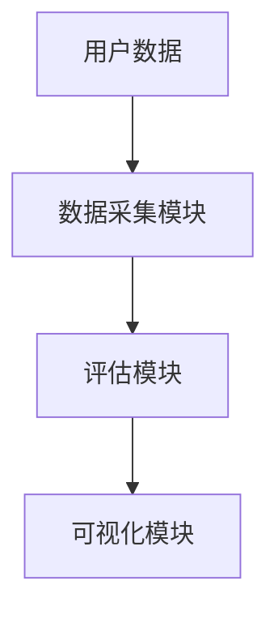

                 


# 巴菲特的品牌溢价理论：元宇宙原生品牌的价值重估

---

## 关键词：巴菲特，品牌溢价，元宇宙，原生品牌，价值重估

---

## 摘要：  
本文基于巴菲特的品牌溢价理论，深入探讨元宇宙原生品牌的独特价值评估方法。通过分析元宇宙的经济体系、品牌特性以及用户行为，结合数学模型和系统架构，提出一套适用于元宇宙环境的品牌溢价评估框架，并通过具体案例展示其应用价值。本文旨在为品牌持有者、投资者和元宇宙生态参与者提供理论支持和实践指导。

---

## 第一部分：背景介绍

### 第1章：品牌溢价的基本概念

#### 1.1 品牌溢价的定义与内涵  
品牌溢价是指消费者对某一品牌商品或服务的支付意愿高于同类产品的差额。它反映了品牌在市场中的附加价值，主要由品牌知名度、美誉度、用户忠诚度等因素驱动。  

#### 1.2 品牌溢价的影响因素  
- **品牌知名度**：品牌被更多人认知，溢价能力越强。  
- **品牌忠诚度**：高忠诚度用户愿意为品牌支付额外费用。  
- **品牌形象**：品牌形象与目标用户心理需求的契合程度直接影响溢价能力。  

#### 1.3 品牌溢价的计算方法  
品牌溢价可以通过以下公式计算：  
$$ \text{品牌溢价} = \text{品牌商品价格} - \text{同类商品价格} $$  

---

### 第2章：元宇宙的基本概念与技术基础

#### 2.1 元宇宙的定义与特点  
元宇宙是一个虚拟的、去中心化的数字世界，用户可以通过虚拟现实技术以数字化身的形式参与其中。元宇宙的经济体系基于区块链技术，支持虚拟资产的交易与流转。  

#### 2.2 元宇宙的经济体系  
元宇宙中的经济活动包括虚拟货币交易、数字资产所有权转让、虚拟服务付费等。其经济体系类似于现实世界，但具有更强的去中心化特征。  

#### 2.3 元宇宙中的品牌存在形式  
- **数字品牌**：完全基于虚拟世界构建的品牌。  
- **虚拟资产**：品牌相关的数字资产，如虚拟商品、虚拟土地等。  
- **用户生成内容（UGC）**：用户在元宇宙中自发生成的内容对品牌价值的贡献。  

---

## 第二部分：元宇宙原生品牌的特性与价值评估

### 第3章：元宇宙原生品牌的定义与特征

#### 3.1 元宇宙原生品牌的定义  
元宇宙原生品牌是指在元宇宙环境中从零开始构建的品牌，其核心价值来源于用户的参与、互动和社区建设。  

#### 3.2 元宇宙原生品牌的特征  
- **虚拟性**：完全存在于虚拟空间中。  
- **互动性**：通过用户参与构建品牌价值。  
- **社区属性**：依赖用户社区的凝聚力。  

---

### 第4章：元宇宙原生品牌的形成机制

#### 4.1 原生品牌的形成过程  
- **初创阶段**：品牌通过虚拟活动吸引初始用户。  
- **成长阶段**：通过用户互动提升品牌知名度和忠诚度。  
- **成熟阶段**：品牌在元宇宙中建立稳定的市场地位。  

#### 4.2 原生品牌形成的关键因素  
- **用户参与度**：用户主动参与品牌建设的程度。  
- **社区建设**：通过社区活动增强用户粘性。  

---

## 第三部分：元宇宙品牌溢价的理论模型

### 第5章：基于巴菲特理论的元宇宙品牌溢价模型

#### 5.1 模型构建  
结合巴菲特的品牌溢价理论，提出适用于元宇宙环境的品牌溢价评估模型：  

$$ \text{元宇宙品牌溢价} = \text{品牌知名度} \times \text{用户忠诚度} \times \text{社区活跃度} $$  

#### 5.2 模型验证  
通过实际案例验证模型的有效性。例如，Decentraland中一个虚拟服装品牌的溢价评估。  

---

## 第四部分：系统架构与实现

### 第6章：元宇宙品牌溢价评估系统架构

#### 6.1 系统功能设计  
- **数据采集模块**：收集品牌相关数据。  
- **评估模块**：基于模型计算品牌溢价。  
- **可视化模块**：展示评估结果。  

#### 6.2 系统架构设计  
使用 Mermaid 绘制系统架构图：  



---

### 第7章：项目实战

#### 7.1 环境配置  
- 安装 Python 和相关库（如 NumPy、Matplotlib）。  

#### 7.2 核心代码实现  
```python
import numpy as np
import matplotlib.pyplot as plt

# 示例数据
brand_footprint = np.array([0.2, 0.3, 0.4, 0.5, 0.6])
user_engagement = np.array([0.6, 0.5, 0.7, 0.8, 0.9])

# 计算品牌溢价
brand_premium = brand_footprint * user_engagement
plt.plot(brand_footprint, brand_premium, 'b-')
plt.xlabel('品牌足迹')
plt.ylabel('品牌溢价')
plt.title('元宇宙品牌溢价评估')
plt.show()
```

#### 7.3 案例分析  
以 Decentraland 中的一个虚拟品牌为例，分析其溢价能力，并提出改进建议。  

---

## 第五部分：总结与展望

### 第8章：总结

#### 8.1 核心观点回顾  
- 元宇宙中的品牌溢价受用户参与度和社区活跃度的影响。  
- 基于巴菲特理论的模型可有效评估元宇宙原生品牌的溢价能力。  

#### 8.2 未来展望  
随着元宇宙技术的成熟，品牌溢价评估将更加依赖数据驱动的方法。  

---

## 参考文献  
- 巴菲特定律相关文献  
- 元宇宙技术与经济相关研究  

---

## 作者：AI天才研究院 & 禅与计算机程序设计艺术  

---

通过以上结构，本文系统地探讨了巴菲特的品牌溢价理论在元宇宙环境中的应用，为品牌价值评估提供了新的视角和方法。

