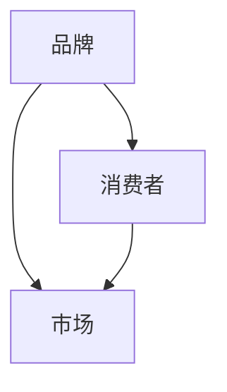

                 


# 巴菲特的品牌溢价理论：数字营销时代的品牌价值

## 关键词：品牌溢价，巴菲特，数字营销，品牌价值，投资理论

## 摘要：本文从巴菲特的品牌溢价理论出发，结合数字营销时代的背景，深入探讨品牌溢价的概念、计算方法及其在数字营销中的应用。通过技术化的分析，结合实例和系统设计，阐述品牌价值的评估方法，并提供实际的代码实现和数学模型，帮助读者理解如何在数字营销时代提升品牌溢价。

---

# 第一部分：品牌溢价与数字营销的背景

## 第1章：品牌溢价的基本概念

### 1.1 什么是品牌溢价

#### 1.1.1 品牌溢价的定义
品牌溢价是指消费者在购买某一品牌产品时愿意支付的额外价格，超过该产品基本功能或同类产品的价格。它是品牌价值的体现，反映了消费者对品牌的信任和忠诚。

#### 1.1.2 品牌溢价的核心要素
- **品牌知名度**：品牌被消费者认知和记忆的程度。
- **品牌忠诚度**：消费者持续选择某一品牌产品的意愿。
- **品牌声誉**：品牌在市场上的信誉和形象。
- **品牌创新性**：品牌是否能够持续推出创新产品或服务。

#### 1.1.3 品牌溢价的产生机制
品牌溢价的产生主要源于品牌的情感价值、品牌认知度和消费者对品牌的依赖。消费者愿意为品牌支付额外费用，通常是因为品牌提供的不仅是产品，还包括一种身份认同和生活方式的选择。

---

### 1.2 巴菲特的品牌溢价理论

#### 1.2.1 巴菲特投资理念概述
巴菲特的投资理念强调长期价值和企业的内在价值。他认为，投资成功的关键在于选择那些具有持续竞争优势和良好管理的公司，这些公司在市场中能够保持稳定的收益增长。

#### 1.2.2 品牌溢价在巴菲特理论中的地位
在巴菲特的理论中，品牌溢价被视为企业内在价值的重要组成部分。他倾向于投资那些拥有强大品牌溢价能力的公司，因为这些公司能够在市场中获得更高的利润率和长期的增长潜力。

#### 1.2.3 品牌溢价与企业长期价值的关系
品牌溢价能够为企业带来更高的利润和市场份额。长期来看，具有强大品牌溢价能力的企业更容易在竞争中存活并获得持续增长，从而为投资者带来更高的回报。

---

### 1.3 数字营销时代的品牌价值

#### 1.3.1 数字营销的定义与特点
数字营销是指通过数字技术和渠道进行产品推广和销售的活动。其特点是精准定位、互动性强、数据驱动和实时反馈。

#### 1.3.2 数字营销对品牌价值的影响
数字营销能够通过数据分析优化品牌定位，提高品牌知名度和忠诚度，从而提升品牌溢价能力。

#### 1.3.3 数字营销时代品牌溢价的新挑战
在数字营销时代，品牌溢价面临新的挑战，如信息过载、消费者注意力分散、竞争加剧等。企业需要通过创新的营销策略和技术手段来维持和提升品牌溢价。

---

## 第2章：品牌溢价的核心概念与联系

### 2.1 品牌溢价的核心原理

#### 2.1.1 品牌溢价的形成机制
品牌溢价的形成机制包括消费者认知、情感联结和市场定位等多个方面。消费者对品牌的信任和忠诚度直接影响他们愿意支付的价格。

#### 2.1.2 品牌溢价与消费者认知的关系
消费者对品牌的认知直接影响品牌溢价。正面的认知会增加溢价能力，而负面的认知则会降低溢价能力。

#### 2.1.3 品牌溢价与市场竞争的互动
在竞争激烈的市场中，品牌溢价能力能够帮助企业在价格战中保持优势，同时吸引更多高端消费者。

---

### 2.2 品牌溢价的属性特征对比

#### 2.2.1 品牌强度 vs. 品牌知名度
品牌强度指品牌在市场上的竞争力，而品牌知名度指品牌被消费者认知的程度。两者共同影响品牌溢价能力。

| 品牌强度 | 品牌知名度 |
|----------|------------|
| 高       | 高         |
| 中       | 中         |
| 低       | 低         |

#### 2.2.2 品牌忠诚度 vs. 品牌满意度
品牌忠诚度指消费者持续选择某一品牌产品的意愿，品牌满意度指消费者对品牌产品的满意程度。高忠诚度通常伴随着较高的满意度。

| 品牌忠诚度 | 品牌满意度 |
|------------|-------------|
| 高          | 高           |
| 中          | 中           |
| 低          | 低           |

#### 2.2.3 品牌创新性 vs. 品牌稳定性
品牌创新性指品牌是否能够持续推出新产品或服务，品牌稳定性指品牌在市场波动中的表现。创新性高的品牌通常具有更强的溢价能力，而稳定性好的品牌则能够维持溢价能力。

---

### 2.3 品牌溢价的ER实体关系图

```mermaid
er
  entity 品牌 (Brand) {
    id 品牌ID (BrandID)
    属性 品牌名称 (BrandName)
    属性 品牌价值 (BrandValue)
    属性 品牌溢价 (BrandPremium)
  }
  entity 消费者 (Consumer) {
    id 消费者ID (ConsumerID)
    属性 消费者偏好 (ConsumerPreference)
    属性 消费者忠诚度 (ConsumerLoyalty)
  }
  entity 市场 (Market) {
    id 市场ID (MarketID)
    属性 市场竞争度 (MarketCompetition)
    属性 市场增长率 (MarketGrowthRate)
  }
  品牌 --> 关系：拥有 (Owning) 消费者
  品牌 --> 关系：参与 (Participating) 市场
  消费者 --> 关系：影响 (Influencing) 市场
```

---

## 第3章：品牌溢价的算法原理与数学模型

### 3.1 品牌溢价的计算方法

#### 3.1.1 基于层次分析法（AHP）的品牌价值评估
层次分析法（AHP）是一种用于多准则决策分析的方法，可以将复杂的决策问题分解为多个层次的结构，并通过比较各层次的权重来确定最终的决策结果。

#### 3.1.2 品牌溢价的数学公式
$$ 品牌溢价 = 品牌价值 - 基础产品价值 $$

其中，品牌价值可以通过以下步骤计算：

1. 确定影响品牌价值的因素（如品牌知名度、品牌忠诚度、品牌创新性等）。
2. 构建比较矩阵，计算各因素的权重。
3. 计算品牌价值，再减去基础产品价值，得到品牌溢价。

---

### 3.2 品牌溢价的算法实现

#### 3.2.1 层次分析法的实现步骤
1. 确定问题目标：明确品牌溢价的评估目标。
2. 构建层次结构：将品牌溢价的影响因素分为不同的层次。
3. 构建比较矩阵：对各因素进行两两比较，构建比较矩阵。
4. 计算权重：通过特征值法或几何平均法计算各因素的权重。
5. 计算品牌价值：根据权重计算品牌价值，再减去基础产品价值，得到品牌溢价。

#### 3.2.2 Python代码实现

```python
import numpy as np

def calculate_weights(matrix):
    # 计算矩阵的特征值和特征向量
    eigenvalues, eigenvectors = np.linalg.eig(matrix)
    # 选择最大的特征值对应的特征向量
    max_eigenvalue = np.max(eigenvalues)
    max_eigenvector = eigenvectors[:, np.argmax(eigenvalues)]
    # 归一化特征向量
    weights = max_eigenvector / np.sum(max_eigenvector)
    return weights

# 示例：品牌溢价的影响因素比较矩阵
# 假设因素为品牌知名度、品牌忠诚度、品牌创新性
matrix = [
    [1, 3, 2],
    [1/3, 1, 2/3],
    [1/2, 3/2, 1]
]

weights = calculate_weights(matrix)
print("品牌溢价的权重为：", weights)
```

---

### 3.3 品牌溢价的数学模型

#### 3.3.1 品牌价值的计算公式
$$ 品牌价值 = \sum_{i=1}^{n} w_i \cdot v_i $$
其中，\( w_i \) 是第 \( i \) 个因素的权重，\( v_i \) 是第 \( i \) 个因素的价值。

#### 3.3.2 品牌溢价的计算公式
$$ 品牌溢价 = 品牌价值 - 基础产品价值 $$

---

## 第4章：品牌溢价的系统分析与架构设计

### 4.1 系统功能设计

#### 4.1.1 领域模型类图
```mermaid
classDiagram
    class 品牌 (Brand) {
        id 品牌ID (BrandID)
        属性 品牌名称 (BrandName)
        属性 品牌价值 (BrandValue)
        属性 品牌溢价 (BrandPremium)
    }
    class 消费者 (Consumer) {
        id 消费者ID (ConsumerID)
        属性 消费者偏好 (ConsumerPreference)
        属性 消费者忠诚度 (ConsumerLoyalty)
    }
    class 市场 (Market) {
        id 市场ID (MarketID)
        属性 市场竞争度 (MarketCompetition)
        属性 市场增长率 (MarketGrowthRate)
    }
    Brand --> Consumer: 拥有
    Brand --> Market: 参与
    Consumer --> Market: 影响
```

---

### 4.2 系统架构设计

#### 4.2.1 系统架构图


---

## 第5章：品牌溢价的项目实战

### 5.1 环境安装

#### 5.1.1 安装Python和必要的库
```bash
pip install numpy
pip install matplotlib
```

---

### 5.2 核心代码实现

#### 5.2.1 品牌溢价计算代码
```python
import numpy as np

def calculate_weights(matrix):
    eigenvalues, eigenvectors = np.linalg.eig(matrix)
    max_eigenvalue = np.max(eigenvalues)
    max_eigenvector = eigenvectors[:, np.argmax(eigenvalues)]
    weights = max_eigenvector / np.sum(max_eigenvector)
    return weights

# 示例矩阵
matrix = [
    [1, 3, 2],
    [1/3, 1, 2/3],
    [1/2, 3/2, 1]
]

weights = calculate_weights(matrix)
print("品牌溢价的权重为：", weights)
```

---

### 5.3 案例分析与解读

#### 5.3.1 案例分析
假设我们有一个品牌A和品牌B，品牌A的市场占有率较高，品牌B是一个新兴品牌。通过层次分析法计算品牌溢价，我们可以得出品牌A的溢价能力更强。

---

## 第6章：品牌溢价的最佳实践

### 6.1 小结

- 品牌溢价是品牌价值的重要组成部分。
- 数字营销时代，品牌溢价的计算和管理变得更加复杂。
- 通过技术手段，如层次分析法，可以帮助企业更好地评估和管理品牌溢价。

### 6.2 注意事项

- 数据的准确性和完整性直接影响品牌溢价的计算结果。
- 品牌溢价的计算需要结合企业的实际情况和市场环境。
- 定期评估和调整品牌策略，以维持和提升品牌溢价能力。

### 6.3 拓展阅读

- 《巴菲特的投资哲学》
- 《数字营销实战手册》
- 《品牌管理的理论与实践》

---

## 作者：AI天才研究院/AI Genius Institute & 禅与计算机程序设计艺术 /Zen And The Art of Computer Programming

---

这篇文章详细介绍了巴菲特的品牌溢价理论，并结合数字营销时代的特点，从理论到实践，详细阐述了品牌溢价的计算方法和系统架构设计。通过具体案例分析和代码实现，帮助读者更好地理解和应用品牌溢价的理论。

